# Technical Specification

# 1. Introduction

## 1.1 EXECUTIVE SUMMARY

### 1.1.1 Project Overview

The repository under examination identifies itself as **Artifact10**, a designation derived from the single H1 Markdown heading present in the repository's sole file, `README.md`. At the time this Technical Specification is being authored, the repository exists in a **pre-implementation state**: it contains exclusively a project name marker without accompanying source code, configuration artifacts, dependency manifests, or descriptive documentation.

This Introduction section is composed under a strictly evidence-based methodology. All statements are grounded in observable repository contents. Where the section prompt solicits information that cannot be substantiated by the repository's current state, this document transparently indicates the absence of such information rather than inferring, assuming, or fabricating content.

#### Repository State Snapshot

| Attribute | Observed Value |
|-----------|----------------|
| Project Identifier | Artifact10 |
| Total Files Present | 1 (`README.md`) |
| Subdirectories | 0 |
| Total Repository Content | A single H1 Markdown heading |

### 1.1.2 Core Business Problem

The repository contains no documentation, source code, or supplementary materials that describe a business problem, target domain, market gap, or user need. Consequently, **the core business problem Artifact10 is intended to address is not specified within the repository's current contents**. Authoritative population of this subsection requires direct stakeholder input or expanded repository contents in subsequent revisions of this Technical Specification.

### 1.1.3 Key Stakeholders and Users

No stakeholder roles, user personas, organizational sponsors, or audience definitions are documented within the repository. The standard stakeholder categories that would be expected in a complete Technical Specification remain unidentified:

| Stakeholder Category | Status in Repository |
|---------------------|---------------------|
| Business Sponsors / Product Owners | Not specified |
| End Users / Customer Personas | Not specified |
| Technical Operators / SREs | Not specified |
| Integration Partners / External Consumers | Not specified |

### 1.1.4 Expected Business Impact and Value Proposition

The repository contains no statement of business value, return-on-investment expectations, productivity metrics, qualitative impact assertions, or strategic alignment narratives. The value proposition for Artifact10 is presently undocumented and must be defined through project initiation discussions or repository augmentation before this subsection can be populated authoritatively.

---

## 1.2 SYSTEM OVERVIEW

### 1.2.1 Project Context

#### Business Context and Market Positioning

No business context, target market, competitive positioning, industry vertical, or domain segmentation information is present in the repository. The "Artifact10" identifier alone provides no semantic signal regarding the system's intended market segment, customer base, or commercial purpose.

#### Current System Limitations

The repository contains no reference to a predecessor system, legacy platform, or existing solution being upgraded or replaced. Whether Artifact10 represents a **greenfield initiative**, a **rewrite of an existing system**, or a **net-new module within a larger landscape** cannot be determined from the available evidence.

#### Integration with Existing Enterprise Landscape

No integration touchpoints, third-party service references, API contracts, message broker configurations, or enterprise system dependencies are documented. The repository contains no manifests, schemas, environment files, or descriptive documentation that would indicate planned integrations with surrounding systems.

### 1.2.2 High-Level Description

#### Primary System Capabilities

The repository's absence of source code, interface definitions, schemas, or descriptive documentation means no system capabilities can be enumerated based on evidence. The following capability dimensions, customary for a complete Technical Specification, are presently undocumented:

| Capability Dimension | Documented in Repository |
|---------------------|--------------------------|
| User-Facing Features | None present |
| Administrative / Operational Functions | None present |
| Background / Asynchronous Processing | None present |
| Reporting and Analytics | None present |
| Data Exchange and Interface Surfaces | None present |

#### Major System Components

No architectural components, modules, services, layers, or bounded contexts are defined in the repository. There is no folder hierarchy, no dependency manifest, no infrastructure-as-code definition, and no design documentation from which components could be inferred.

#### Core Technical Approach

No programming language, framework, runtime environment, persistence technology, or deployment platform is indicated by the repository's contents. The categorical absence of standard technology-defining artifacts confirms this state:

| Artifact Category | Representative File Types | Present in Repository? |
|------------------|---------------------------|------------------------|
| Package / Dependency Manifests | `package.json`, `requirements.txt`, `pom.xml`, `go.mod`, `Cargo.toml` | No |
| Build and Container Definitions | `Makefile`, `Dockerfile`, `build.gradle` | No |
| Source Files | `.js`, `.ts`, `.py`, `.java`, `.go`, `.rs` | No |
| Configuration Files | `.env`, `.yaml`, `.toml`, `.ini`, `.json` | No |

#### Repository Structure Visualization

The following diagram represents the complete, exhaustively examined state of the Artifact10 repository at the time of this specification:

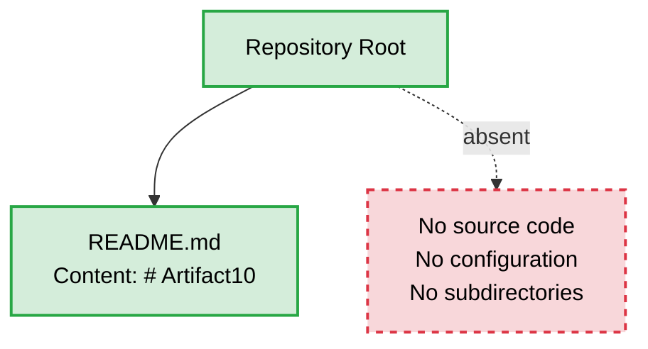

### 1.2.3 Success Criteria

#### Measurable Objectives

No quantitative or qualitative project objectives are documented within the repository. No goal statements, target outcomes, or acceptance thresholds appear in any file.

#### Critical Success Factors

No critical success factors have been articulated in the repository's current contents. Considerations such as user adoption levels, technical feasibility milestones, or organizational readiness conditions remain undefined.

#### Key Performance Indicators (KPIs)

No KPIs, service-level agreements (SLAs), service-level objectives (SLOs), or performance targets are specified.

| Success Criterion Type | Status |
|-----------------------|--------|
| Functional Acceptance Criteria | Not specified |
| Performance and Latency Targets | Not specified |
| Reliability and Availability Goals | Not specified |
| User Adoption and Engagement Metrics | Not specified |

---

## 1.3 SCOPE

### 1.3.1 In-Scope Elements

#### Core Features and Functionalities

The repository's current state does not enumerate any features, workflows, or technical requirements. Each in-scope dimension requested by the section prompt is presently unpopulated by evidence:

| Feature Category | Repository Evidence |
|-----------------|---------------------|
| Must-Have Capabilities | Not enumerated |
| Primary User Workflows | Not described |
| Essential Integrations | Not identified |
| Key Technical Requirements | Not stated |

Authoritative scoping requires definitional input from project sponsors, product owners, and the development team. This subsection will be revised once such inputs are provided or once the repository is augmented with sufficient design or implementation artifacts.

#### Implementation Boundaries

No system boundaries, user-group coverage, geographic limits, or data-domain inclusions are defined in the repository:

| Boundary Dimension | Documented in Repository? |
|-------------------|---------------------------|
| System Boundaries (services, modules, surfaces) | No |
| User Groups Covered | No |
| Geographic / Market Coverage | No |
| Data Domains Included | No |

### 1.3.2 Out-of-Scope Elements

Because no in-scope features have been formally documented, a corresponding out-of-scope catalogue **cannot be derived through inference**. Establishing exclusions presupposes a defined inclusion baseline that does not yet exist in the repository.

The following categories will require explicit enumeration once the in-scope baseline is established:

| Exclusion Category | Current Status |
|-------------------|----------------|
| Features Deferred to Future Phases | None documented |
| Integration Points Outside the Primary System | None identified |
| Unsupported Use Cases | None specified |
| Adjacent System Responsibilities | Undefined |

### 1.3.3 Scope Determination Path Forward

To produce a complete and authoritative Scope statement in subsequent revisions of this Technical Specification, the following inputs are required:

| Required Input | Authoritative Source |
|---------------|---------------------|
| Business Case and Problem Statement | Project Sponsor |
| Functional and Non-Functional Requirements | Product Owner / Business Analyst |
| Architectural and Technology Decisions | Solution Architect |
| Stakeholder Register and User Personas | Project Manager |
| Source Code, Schemas, or Design Artifacts | Development Team |

---

## 1.4 DOCUMENTATION INTEGRITY STATEMENT

### 1.4.1 Evidence-Based Authoring

This Introduction has been deliberately constrained to statements that are directly supportable by the repository's observable contents. Where standard Technical Specification subsections cannot be populated due to absent evidence, this absence is explicitly stated rather than filled with speculative content. This approach preserves the integrity of the Technical Specification as a faithful reflection of the system as it exists today.

### 1.4.2 Specification Evolution

As the Artifact10 repository evolves to include source code, configuration artifacts, design documents, and supporting materials, this Introduction section is expected to be revised. Each revision should replace the "Not specified" annotations with documented business context, system capabilities, success criteria, and scope boundaries grounded in newly added repository artifacts.

### 1.4.3 Cross-Section Coordination

Subsequent sections of this Technical Specification will face the same evidentiary constraints documented here. Readers of this Introduction should expect parallel transparency in downstream sections regarding what can and cannot be authoritatively documented from the repository's current minimal state.

---

## 1.5 REFERENCES

### 1.5.1 Files Examined

- `README.md` — The repository's sole file. Contains a single H1 Markdown heading (`# Artifact10`). Serves as the **only evidentiary basis** for the project identifier used throughout this Introduction. No other content, prose, metadata, or structural information is present in the file.

### 1.5.2 Folders Explored

- `/` (repository root, depth 0) — Contains exactly one child file (`README.md`) and zero subdirectories. Exhaustively examined; the absence of nested structure is a property of the repository itself, not a limitation of the analysis.

### 1.5.3 Search Activities Performed

| Search Activity | Outcome |
|----------------|---------|
| Root folder enumeration | Single file identified (`README.md`) |
| README full-content read | Confirmed single-line content (`# Artifact10`) |
| Semantic search for source code modules | No results |
| Semantic search for configuration manifests | No results |
| Semantic search for README/project description content | No results |
| `.blitzyignore` presence check | None found; no path restrictions in effect |

### 1.5.4 Coverage Confidence

**100% of repository contents examined.** The repository's minimal size enabled exhaustive review. No areas remain unexplored, and no portion of the repository has been omitted from the evidence base supporting this Introduction.

# 2. Product Requirements

## 2.1 SECTION AUTHORING METHODOLOGY

### 2.1.1 Evidence-Based Constraint

This Product Requirements section is authored under the same evidence-based discipline established in Section 1.4 (Documentation Integrity Statement). The Artifact10 repository—comprising a single `README.md` file whose entire content is the H1 heading `# Artifact10`—does not contain any artifact from which features, requirements, acceptance criteria, dependencies, or implementation considerations can be derived. In accordance with the documentation integrity mandate, this section transparently reports the absence of such evidence rather than fabricating speculative features, identifiers, or relationships to satisfy the requested format.

### 2.1.2 Structural Preservation Approach

While no feature content can be authoritatively documented, the structural schema requested by the section prompt is preserved throughout this section as a forward-compatible scaffold. Placeholder tables retain the column structure, identifier conventions (F-XXX, F-XXX-RQ-YYY), and categorical taxonomy intended for future population. Each placeholder is explicitly marked as "Not specified," "None documented," or "Not derivable" to communicate that the schema is intentionally vacant pending requirements definition activities (see Section 2.7).

### 2.1.3 Relationship to Section 1.4 Documentation Integrity Statement

Per Section 1.4.3 (Cross-Section Coordination), readers are advised to expect parallel transparency in downstream sections regarding what can and cannot be authoritatively documented from the repository's current minimal state. This Product Requirements section operationalizes that commitment by:

| Integrity Principle | Implementation in Section 2 |
|---------------------|----------------------------|
| No fabricated content | No feature IDs, requirement IDs, or relationships are invented |
| Explicit absence statements | Each subsection declares the absence of derivable evidence |
| Schema preservation | Placeholder tables retain requested structure for future revisions |
| Authoritative source identification | Section 2.7 lists required inputs and their owners |

---

## 2.2 FEATURE CATALOG

### 2.2.1 Feature Enumeration Status

**No features are documented in the Artifact10 repository.** The repository contains no source code, no design documents, no user stories, no specification artifacts, and no descriptive prose from which features could be enumerated. Consequently, no feature can be assigned a Unique ID under the requested `F-XXX` format, and no feature metadata, description, or dependency information can be populated authoritatively.

This finding is consistent with Section 1.2.2 (High-Level Description), which established that no system capabilities can be enumerated based on evidence, and Section 1.3.1 (In-Scope Elements), which confirmed that Must-Have Capabilities, Primary User Workflows, Essential Integrations, and Key Technical Requirements are not enumerated.

### 2.2.2 Feature Catalog Placeholder Schema

The following table preserves the intended Feature Metadata schema. All entries are explicitly marked as unpopulated to denote that no actual feature is being represented:

| Feature ID | Feature Name | Category | Priority / Status |
|------------|--------------|----------|-------------------|
| Not specified | Not specified | Not specified | Not specified |

#### Feature ID Convention (Reserved for Future Use)

| Schema Element | Intended Format | Current Population |
|----------------|-----------------|-------------------|
| Feature Identifier | `F-XXX` (zero-padded sequential integer) | No identifiers assigned |
| Feature Name | Concise human-readable label | No names assigned |
| Feature Category | Functional grouping (e.g., Authentication, Reporting) | No categories defined |
| Priority Level | Critical / High / Medium / Low | No priorities assessed |
| Status | Proposed / Approved / In Development / Completed | No statuses recorded |

### 2.2.3 Feature Description Dimensions Undocumented

The following description dimensions, customary for a complete Feature Catalog, are not derivable from the repository:

| Description Dimension | Repository Evidence |
|----------------------|---------------------|
| Feature Overview | None present |
| Business Value Statement | None present |
| User Benefits Articulation | None present |
| Technical Context | None present |

The absence of business value and user benefits articulation is consistent with Section 1.1.4 (Expected Business Impact and Value Proposition), which established that no value proposition is documented.

### 2.2.4 Feature Dependency Dimensions Undocumented

With zero features documented, no feature-level dependencies can be cataloged. The following dependency dimensions remain unpopulated:

| Dependency Dimension | Status |
|---------------------|--------|
| Prerequisite Features | Not derivable (no features defined) |
| System Dependencies | Not derivable (no system components defined) |
| External Dependencies | Not derivable (no manifests present) |
| Integration Requirements | Not derivable (no integration touchpoints documented) |

This finding aligns with Section 1.2.1 (Project Context), which confirmed that no integration touchpoints, third-party service references, API contracts, message broker configurations, or enterprise system dependencies are documented.

---

## 2.3 FUNCTIONAL REQUIREMENTS TABLE

### 2.3.1 Requirements Enumeration Status

**No functional requirements are documented in the Artifact10 repository.** Because no features exist (see Section 2.2.1), no associated functional requirements can be enumerated. Consequently, no requirement can be assigned a Unique ID under the requested `F-XXX-RQ-YYY` format, and no requirement details, technical specifications, or validation rules can be populated authoritatively.

### 2.3.2 Requirements Table Placeholder Schema

The following table preserves the intended Functional Requirements schema. All entries are explicitly marked as unpopulated:

| Requirement ID | Description | Acceptance Criteria | Priority / Complexity |
|----------------|-------------|---------------------|----------------------|
| Not specified | Not specified | Not specified | Not specified |

#### Requirement ID Convention (Reserved for Future Use)

| Schema Element | Intended Format | Current Population |
|----------------|-----------------|-------------------|
| Requirement Identifier | `F-XXX-RQ-YYY` (linked to parent feature) | No identifiers assigned |
| Description | Imperative statement of system behavior | No descriptions written |
| Acceptance Criteria | Testable, objective verification conditions | No criteria defined |
| Priority | Must-Have / Should-Have / Could-Have | No priorities assessed |
| Complexity | High / Medium / Low | No complexity ratings recorded |

### 2.3.3 Technical Specification Dimensions Undocumented

The following technical specification dimensions, customary for each functional requirement, remain unpopulated due to absence of evidence:

| Technical Specification Dimension | Repository Evidence |
|----------------------------------|---------------------|
| Input Parameters | None defined |
| Output / Response Contracts | None defined |
| Performance Criteria | None stated |
| Data Requirements | None specified |

This finding is consistent with Section 1.2.3 (Success Criteria), which confirmed that Performance and Latency Targets and Reliability and Availability Goals are not specified.

### 2.3.4 Validation Rule Dimensions Undocumented

The following validation rule dimensions remain unpopulated:

| Validation Dimension | Repository Evidence |
|---------------------|---------------------|
| Business Rules | None documented |
| Data Validation Rules | None documented |
| Security Requirements | None documented |
| Compliance Requirements | None documented |

---

## 2.4 FEATURE RELATIONSHIPS

### 2.4.1 Relationship Mapping Status

**No feature relationships can be documented.** Feature relationships presuppose the existence of two or more discrete features between which dependencies, integrations, or shared components could be identified. Because Section 2.2.1 has established that zero features exist in the repository, the relationship-mapping prerequisites are not met.

### 2.4.2 Dependency Map

A feature dependency map cannot be rendered. The conceptual state of the relationship space is represented in the diagram below:

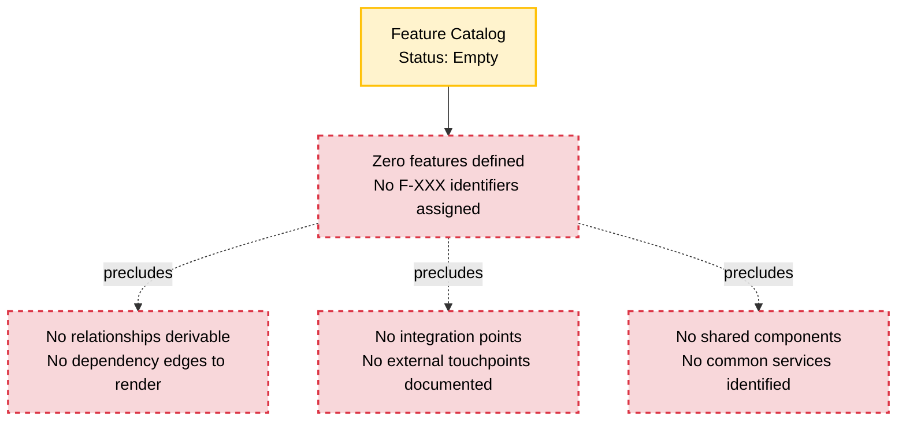

### 2.4.3 Integration Points Status

No integration points are documented. The following integration dimensions, customary for a system specification, remain unpopulated:

| Integration Dimension | Repository Evidence |
|----------------------|---------------------|
| Internal Service-to-Service Integrations | None documented |
| External Third-Party Integrations | None documented |
| API Contracts and Interface Specifications | None documented |
| Message Broker / Event Bus Topology | None documented |

### 2.4.4 Shared Components and Common Services Status

No shared components or common services are documented. With no source tree, dependency manifest, or architectural diagram present, the following dimensions are not derivable:

| Shared Resource Dimension | Repository Evidence |
|--------------------------|---------------------|
| Shared Libraries / Modules | None present |
| Common Services (Authentication, Logging, etc.) | None defined |
| Cross-Cutting Concerns | None articulated |
| Reusable Utility Components | None present |

---

## 2.5 IMPLEMENTATION CONSIDERATIONS

### 2.5.1 Implementation Status

**No implementation considerations can be authoritatively documented.** Implementation considerations presuppose the existence of an implementation artifact—source code, architectural design, technology selection, or at minimum a defined target environment. The Artifact10 repository contains no such artifacts, as exhaustively established in Section 1.2.2 (Core Technical Approach) and Section 1.5.4 (Coverage Confidence).

### 2.5.2 Technical Constraints Status

No technical constraints are documented. The following constraint dimensions, customary for an Implementation Considerations subsection, remain unpopulated:

| Constraint Dimension | Repository Evidence |
|---------------------|---------------------|
| Language / Runtime Constraints | Not specified (no source files present) |
| Framework / Library Constraints | Not specified (no manifests present) |
| Platform / Deployment Constraints | Not specified (no IaC or container definitions present) |
| Data Persistence Constraints | Not specified (no schema artifacts present) |

### 2.5.3 Performance and Scalability Considerations

No performance requirements or scalability targets are documented. The following dimensions remain unpopulated:

| Performance / Scalability Dimension | Repository Evidence |
|------------------------------------|---------------------|
| Throughput Targets | Not specified |
| Latency / Response-Time Targets | Not specified |
| Concurrency Expectations | Not specified |
| Horizontal / Vertical Scaling Strategy | Not specified |

This finding is consistent with Section 1.2.3, which established that no KPIs, SLAs, or SLOs are specified.

### 2.5.4 Security Implications Status

No security requirements, threat models, or compliance frameworks are documented. The following security dimensions remain unpopulated:

| Security Dimension | Repository Evidence |
|--------------------|---------------------|
| Authentication / Authorization Model | Not specified |
| Data Protection (encryption, masking) | Not specified |
| Threat Model and Risk Assessment | Not specified |
| Regulatory Compliance Scope | Not specified |

### 2.5.5 Maintenance Requirements Status

No maintenance requirements are documented. The following dimensions remain unpopulated:

| Maintenance Dimension | Repository Evidence |
|----------------------|---------------------|
| Patching and Upgrade Strategy | Not specified |
| Observability and Monitoring Requirements | Not specified |
| Backup and Disaster Recovery Expectations | Not specified |
| Operational Runbooks and Procedures | Not specified |

---

## 2.6 TRACEABILITY MATRIX

### 2.6.1 Traceability Status

A traceability matrix typically links feature identifiers to requirement identifiers, to acceptance test identifiers, and to source code modules. With zero features defined (Section 2.2.1), zero requirements defined (Section 2.3.1), zero relationships derivable (Section 2.4.1), and zero implementation artifacts (Section 2.5.1), no traceability links can be established.

### 2.6.2 Placeholder Traceability Matrix

The following table preserves the intended traceability schema:

| Feature ID | Requirement ID | Acceptance Test | Source Module |
|------------|----------------|-----------------|---------------|
| Not specified | Not specified | Not specified | Not specified |

### 2.6.3 Cross-Reference Map to Section 1

The following cross-references establish the evidentiary basis for each absence statement in Section 2:

| Section 2 Subsection | Cross-Referenced Section 1 Source |
|---------------------|----------------------------------|
| 2.2.1 Feature Enumeration Status | Section 1.2.2 (No capabilities); Section 1.3.1 (No features enumerated) |
| 2.2.3 Feature Description Dimensions | Section 1.1.4 (No value proposition) |
| 2.2.4 Feature Dependency Dimensions | Section 1.2.1 (No integration touchpoints) |
| 2.3.3 Technical Specification Dimensions | Section 1.2.3 (No KPIs / SLAs) |
| 2.5.2 Technical Constraints | Section 1.2.2 (No technology selection) |
| 2.5.3 Performance and Scalability | Section 1.2.3 (No performance targets) |
| 2.1.3 Documentation Integrity Linkage | Section 1.4 (Documentation Integrity Statement) |
| 2.8 References | Section 1.5 (References) |

---

## 2.7 PATH FORWARD FOR REQUIREMENTS DEFINITION

### 2.7.1 Required Inputs and Authoritative Sources

To populate this Product Requirements section authoritatively in subsequent revisions, the following inputs are required. This subsection mirrors the pattern established in Section 1.3.3 (Scope Determination Path Forward):

| Required Input | Authoritative Source |
|---------------|---------------------|
| Feature definitions and business rationale | Product Owner |
| User stories and acceptance criteria | Business Analyst / Product Owner |
| Functional requirement specifications | Business Analyst |
| Non-functional requirements (performance, security, compliance) | Solution Architect |
| Implementation details, technology stack, and constraints | Development Team |
| External integration touchpoints and dependencies | Solution Architect / Integration Lead |
| Test acceptance criteria and validation rules | Quality Assurance Lead |
| Operational maintenance expectations | Site Reliability / Operations Lead |

### 2.7.2 Specification Evolution Process

Per Section 1.4.2 (Specification Evolution), this Product Requirements section is expected to be revised as the Artifact10 repository evolves. The recommended evolution sequence is:

#### Phase 1: Feature Identification

Upon receipt of business case documentation and product owner input, the Feature Catalog (Section 2.2) should be populated with discrete features assigned sequential `F-XXX` identifiers. Each feature should be accompanied by metadata (Category, Priority, Status) and description fields (Overview, Business Value, User Benefits, Technical Context).

#### Phase 2: Requirements Decomposition

For each cataloged feature, the Functional Requirements Table (Section 2.3) should be populated with requirements assigned `F-XXX-RQ-YYY` identifiers traceable to the parent feature. Each requirement should include testable acceptance criteria, priority, complexity, and technical specifications.

#### Phase 3: Relationship and Dependency Mapping

Once two or more features are defined, the Feature Relationships subsection (Section 2.4) should be populated with the dependency map, integration points, shared components, and common services derivable from the design.

#### Phase 4: Implementation Consideration Articulation

As architectural decisions are made and source code is introduced, the Implementation Considerations subsection (Section 2.5) should be populated with technical constraints, performance requirements, scalability strategy, security implications, and maintenance requirements.

#### Phase 5: Traceability Matrix Population

As acceptance tests and source modules are introduced, the Traceability Matrix (Section 2.6) should be populated to establish end-to-end traceability from feature, through requirement, to verification artifact and implementing source module.

### 2.7.3 Assumptions and Constraints

The following assumptions and constraints govern this section's current state:

| Assumption / Constraint | Description |
|-------------------------|-------------|
| Repository State Assumption | The repository is assumed to be in a pre-implementation state as documented in Section 1.1.1, not an obscured or partially synchronized state |
| Evidence Boundary Constraint | This section is constrained to evidence observable in the repository at the time of authoring; external knowledge, organizational context, and project artifacts outside the repository are not incorporated |
| Schema Forward-Compatibility Assumption | The placeholder schemas presented in this section assume the standard Product Requirements format requested by the section prompt remains applicable to Artifact10's eventual domain |
| Identifier Convention Constraint | The `F-XXX` and `F-XXX-RQ-YYY` identifier conventions are reserved but not yet allocated; first allocations should begin at `F-001` and `F-001-RQ-001` respectively |

### 2.7.4 Version Tracking Reservation

A requirements version tracking table is reserved for future use to record amendments as features and requirements are introduced:

| Version | Date | Section Amended | Change Summary |
|---------|------|-----------------|----------------|
| Not specified | Not specified | Not specified | Initial empty-state authoring |

---

## 2.8 REFERENCES

### 2.8.1 Files Examined

- `README.md` — The repository's sole file. Contains only the H1 Markdown heading `# Artifact10`. Confirmed via exhaustive examination to contain no feature definitions, no user stories, no acceptance criteria, no requirements artifacts, and no descriptive prose. This finding is the principal evidentiary basis for every absence statement in this Product Requirements section.

### 2.8.2 Folders Explored

- `/` (repository root, depth 0) — Contains exactly one child file (`README.md`) and zero subdirectories. The absence of any folder hierarchy (e.g., `docs/`, `src/`, `requirements/`, `specs/`) is a property of the repository itself and confirms the unavailability of supporting documentation from which requirements could be sourced.

### 2.8.3 Search Activities Performed

| Search Activity | Outcome |
|----------------|---------|
| Semantic search: "product features requirements specifications functional capabilities" | No results |
| Semantic search: "application modules services components source code" | No results |
| Semantic search: "configuration package manifest dependencies" | No results |
| Semantic search: "user interface API endpoint business logic" | No results |
| `.blitzyignore` presence check | None found; no path restrictions in effect |

### 2.8.4 Technical Specification Cross-References

| Referenced Section | Relevance to Section 2 |
|--------------------|------------------------|
| Section 1.1 (Executive Summary) | Establishes Artifact10 identifier and pre-implementation state |
| Section 1.2 (System Overview) | Confirms absence of system capabilities, components, and technical approach |
| Section 1.3 (Scope) | Confirms no features, workflows, or technical requirements are enumerated |
| Section 1.4 (Documentation Integrity Statement) | Mandates evidence-based authoring discipline applied throughout Section 2 |
| Section 1.5 (References) | Confirms 100% repository content examination supporting absence findings |

### 2.8.5 Coverage Confidence

**100% of repository contents examined for requirements-relevant artifacts.** The repository's minimal size enabled exhaustive review. No source files, design documents, configuration artifacts, or descriptive documentation exist from which features or requirements could be derived. This section will be revised when authoritative inputs (Section 2.7.1) are supplied or when the repository is augmented with requirements-bearing artifacts.

---

# 3. Technology Stack

This Technology Stack section is authored under the same evidence-based authoring discipline established by Section 1.4 (Documentation Integrity Statement) and operationalized throughout Section 2. As confirmed in Section 1.2.2 (Core Technical Approach) and Section 2.5.2 (Technical Constraints Status), **the Artifact10 repository contains no technology-defining artifacts**: no source files, no package or dependency manifests, no build or container definitions, and no configuration files. Consequently, **no technology stack decisions can be authoritatively documented as evidence-derived selections** at the time of this specification.

Per Section 1.4.3 (Cross-Section Coordination), this section preserves the standard Technology Stack subsection schema as a forward-compatible scaffold while reporting absence transparently. Each subsection below presents:

1. **Current Repository Evidence** — what the repository observably contains for the given technology dimension (uniformly: nothing).
2. **Placeholder Schema for Future Population** — the structural template that will be populated when authoritative inputs arrive.
3. **Default Stack Forward-Looking Candidates** — non-evidentiary candidate technologies provided as project-level guidance, explicitly subject to validation, ratification, or replacement by the Development Team and Solution Architect (per Section 2.7.1).

The Default Technology Stack referenced throughout this section is recorded as **forward-looking guidance**, not as a confirmed selection. No version numbers can be specified for any candidate because no dependency manifests, lock files, or build definitions exist in the repository against which versions could be pinned.

---

## 3.1 PROGRAMMING LANGUAGES

### 3.1.1 Current Repository Evidence

No programming language is in use within the Artifact10 repository. Section 1.2.2 (Core Technical Approach) explicitly enumerates that representative source file extensions — `.js`, `.ts`, `.py`, `.java`, `.go`, `.rs` — are all absent from the repository. The repository's sole file, `README.md`, contains only a Markdown H1 heading and provides no language indicator (no syntax samples, no shebang lines, no language tag in code fences).

| Platform / Component | Selected Language | Version | Selection Rationale | Evidence Source |
|----------------------|-------------------|---------|---------------------|-----------------|
| Backend services | Not specified | Not specified | Not specified | No source files present |
| Web frontend | Not specified | Not specified | Not specified | No source files present |
| Mobile / cross-platform | Not specified | Not specified | Not specified | No source files present |
| Native iOS | Not specified | Not specified | Not specified | No source files present |
| Native Android | Not specified | Not specified | Not specified | No source files present |
| Native macOS | Not specified | Not specified | Not specified | No source files present |
| Desktop | Not specified | Not specified | Not specified | No source files present |
| Infrastructure scripts | Not specified | Not specified | Not specified | No source files present |

### 3.1.2 Selection Criteria Status

No language selection criteria have been articulated in the repository. Customary criteria — runtime performance characteristics, ecosystem maturity, team familiarity, target platform constraints, regulatory compliance posture, and interoperability requirements — remain undocumented. Selection criteria are an explicit input gap, attributed to the **Development Team** as the authoritative source per Section 2.7.1.

### 3.1.3 Constraints and Dependencies Status

No language-level constraints or dependencies are documented. Section 2.5.2 (Technical Constraints Status) already records "Language / Runtime Constraints: Not specified (no source files present)." No minimum runtime versions, no LTS commitments, no polyglot interoperability requirements, and no excluded languages have been articulated.

### 3.1.4 Default Stack Forward-Looking Candidates

The following candidate language assignments are provided as project-level forward-looking guidance and are explicitly **non-evidentiary**. They are subject to ratification or replacement by the Development Team and Solution Architect when Artifact10 transitions from its pre-implementation state.

| Platform / Component | Candidate Language | Status | Validation Required |
|----------------------|-------------------|--------|---------------------|
| Backend services | Python | Forward-looking candidate | Yes — Development Team |
| Web frontend | TypeScript | Forward-looking candidate | Yes — Development Team |
| Mobile / cross-platform | TypeScript (React-Native) | Forward-looking candidate | Yes — Development Team |
| Native iOS | Swift | Forward-looking candidate | Yes — Development Team |
| Native Android | Kotlin | Forward-looking candidate | Yes — Development Team |
| Native macOS | Objective-C | Forward-looking candidate | Yes — Development Team |
| Desktop | JavaScript / TypeScript (ElectronJS) | Forward-looking candidate | Yes — Development Team |

No version pinning is possible. When the Development Team supplies authoritative selections, this table will be revised per Section 1.4.2 (Specification Evolution) to capture confirmed languages with their minimum and target version commitments.

---

## 3.2 FRAMEWORKS & LIBRARIES

### 3.2.1 Current Repository Evidence

No frameworks or libraries are in use within the Artifact10 repository. Section 1.2.2 (Core Technical Approach) enumerates that representative package and dependency manifest file types — `package.json`, `requirements.txt`, `pom.xml`, `go.mod`, `Cargo.toml` — are all absent. With no manifests present, no framework version, no transitive dependency tree, and no library compatibility matrix can be derived.

### 3.2.2 Placeholder Schema for Future Population

The following placeholder schema preserves the standard Frameworks & Libraries documentation format requested by the section prompt. It will be populated when the Development Team contributes manifest artifacts and authoritative selections per Section 2.7.1.

| Framework / Library | Category | Version | Compatibility Requirements | Justification | Evidence Source |
|---------------------|----------|---------|----------------------------|---------------|-----------------|
| Not specified | Not specified | Not specified | Not specified | Not specified | No manifests present |

### 3.2.3 Core Frameworks Status

No core application framework has been selected. Customary framework-selection considerations — request-handling model (synchronous vs. asynchronous), templating, ORM coupling, middleware ecosystem, opinionation level, and long-term support cadence — remain undocumented. Section 2.5.2 already records "Framework / Library Constraints: Not specified (no manifests present)."

### 3.2.4 Supporting Libraries Status

No supporting libraries are enumerated. The repository contains no import statements, no module references, no dependency declarations, and no library-specific configuration files from which supporting libraries could be inferred.

### 3.2.5 Compatibility Requirements Status

No framework or library compatibility requirements are documented. Considerations including target runtime version compatibility, peer-dependency version ranges, cross-framework interoperability constraints, and forbidden-version registries (e.g., libraries with known CVEs to be excluded) remain unpopulated. These will be defined as part of the Non-Functional Requirements input attributed to the **Solution Architect** in Section 2.7.1.

### 3.2.6 Default Stack Forward-Looking Candidates

The following candidate frameworks and libraries are provided as forward-looking guidance, explicitly **non-evidentiary**. Each is subject to validation by the Development Team and Solution Architect.

| Framework / Library | Proposed Role | Status | Validation Required |
|---------------------|---------------|--------|---------------------|
| Flask | Backend web framework (Python) | Forward-looking candidate | Yes — Development Team |
| React | Web UI framework (TypeScript) | Forward-looking candidate | Yes — Development Team |
| TailwindCSS | CSS framework | Forward-looking candidate | Yes — Development Team |
| React-Native | Mobile / cross-platform UI framework | Forward-looking candidate | Yes — Development Team |
| Langchain | AI / LLM orchestration framework | Forward-looking candidate | Yes — Development Team |
| ElectronJS | Desktop application shell | Forward-looking candidate | Yes — Development Team |

Version numbers, transitive dependency graphs, and compatibility matrices cannot be specified because no manifest artifacts exist. When manifests are introduced, this table will be supplanted by an evidence-derived enumeration drawn directly from those manifests.

---

## 3.3 OPEN SOURCE DEPENDENCIES

### 3.3.1 Current Repository Evidence

No open source dependencies, third-party libraries, package registry references, or version-locked dependency specifications exist within the Artifact10 repository. This finding is a direct consequence of Section 1.2.2's enumeration: with no `package.json`, `requirements.txt`, `pom.xml`, `go.mod`, `Cargo.toml`, or any other manifest format present, there is no artifact from which to enumerate third-party packages.

### 3.3.2 Placeholder Schema for Future Population

The following placeholder schema is reserved for future population once dependency manifests are introduced. The schema follows the conventional fields requested by the section prompt — package, registry, version, license, and purpose.

| Package Name | Registry | Version (Pinned) | License | Purpose | Evidence Source |
|--------------|----------|------------------|---------|---------|-----------------|
| Not specified | Not specified | Not specified | Not specified | Not specified | No manifests present |

### 3.3.3 Package Registry Strategy Status

No package registry strategy is documented. Considerations including primary registry selection (e.g., npm, PyPI, Maven Central, crates.io), private/mirrored registry usage, registry authentication configuration, vendoring policy, and software bill-of-materials (SBOM) generation strategy are all unpopulated. These decisions will require input from the **Development Team** and the **Solution Architect** per Section 2.7.1.

### 3.3.4 Dependency Governance Status

No dependency governance policies are documented. Considerations including license-allowlist policy, vulnerability scanning cadence (e.g., Dependabot, Snyk), pinning strategy (exact versions vs. semver ranges), update cadence, and supply-chain security controls remain undocumented. These governance dimensions correspond to the security and compliance considerations Section 2.5.4 already reports as "Not specified."

### 3.3.5 Transitive Dependency Risk Status

With zero direct dependencies declared, no transitive dependency graph exists. Once dependency manifests are introduced, a transitive analysis will be required to identify deeply nested packages, version conflicts, and known-vulnerable artifacts. This analysis is reserved for future revisions.

---

## 3.4 THIRD-PARTY SERVICES

### 3.4.1 Current Repository Evidence

No third-party services, external APIs, SaaS integrations, authentication providers, monitoring platforms, or cloud-managed services are referenced within the Artifact10 repository. Section 1.2.1 (Project Context — Integration with Existing Enterprise Landscape) explicitly establishes: *"No integration touchpoints, third-party service references, API contracts, message broker configurations, or enterprise system dependencies are documented."* This finding governs Section 3.4 in its entirety.

### 3.4.2 Placeholder Schema for Future Population

| Service Category | Provider | Integration Method | Authentication Mechanism | SLA Commitment | Evidence Source |
|------------------|----------|--------------------|--------------------------|----------------|-----------------|
| External APIs | Not specified | Not specified | Not specified | Not specified | No service references present |
| Authentication services | Not specified | Not specified | Not specified | Not specified | No service references present |
| Monitoring tools | Not specified | Not specified | Not specified | Not specified | No service references present |
| Cloud services | Not specified | Not specified | Not specified | Not specified | No service references present |
| Messaging / event services | Not specified | Not specified | Not specified | Not specified | No service references present |
| Email / notification services | Not specified | Not specified | Not specified | Not specified | No service references present |
| Payment / billing services | Not specified | Not specified | Not specified | Not specified | No service references present |

### 3.4.3 External API Integration Status

No external API integrations are documented. No API client configuration, no endpoint catalog, no contract definitions (OpenAPI/Swagger, gRPC `.proto`, GraphQL schemas, AsyncAPI), and no API key/secret management approach are present. Per Section 2.7.1, external integration touchpoints are attributed to the **Solution Architect / Integration Lead** as the authoritative source.

### 3.4.4 Authentication Service Status

No authentication or identity-provider integration is documented. The security implications enumerated in Section 2.5.4 (Authentication / Authorization Model: Not specified) preclude authoritative documentation of identity provider, federation protocol (OAuth 2.0, OIDC, SAML), session management strategy, or multi-factor enforcement.

### 3.4.5 Monitoring and Observability Service Status

No monitoring, logging, tracing, or alerting service integration is documented. Section 2.5.5 (Maintenance Requirements Status) already records "Observability and Monitoring Requirements: Not specified." The selection of telemetry sinks (e.g., APM platforms, log aggregators, distributed tracing backends, metrics platforms) is reserved for future revisions.

### 3.4.6 Cloud Services Status

No cloud platform usage is documented. No region selection, no managed-service catalog, no identity and access management posture, and no networking topology decisions are present in the repository. Platform / deployment constraints are recorded as "Not specified" in Section 2.5.2.

### 3.4.7 Default Stack Forward-Looking Candidates

| Service Category | Candidate Provider | Status | Validation Required |
|------------------|--------------------|--------|---------------------|
| Cloud platform | AWS | Forward-looking candidate | Yes — Solution Architect |
| Authentication | Auth0 | Forward-looking candidate | Yes — Solution Architect |
| Monitoring | Not specified | — | Yes — Site Reliability / Operations Lead |
| External APIs | Not specified | — | Yes — Integration Lead |

These candidates carry no version, region, tier, or SLA commitments and shall not be construed as procured or provisioned services.

---

## 3.5 DATABASES & STORAGE

### 3.5.1 Current Repository Evidence

No database systems, persistence layers, schema definitions, storage volumes, caching tiers, or object-storage configurations are referenced within the Artifact10 repository. Section 2.5.2 (Technical Constraints Status) explicitly records: *"Data Persistence Constraints: Not specified (no schema artifacts present)."* No `*.sql`, `*.prisma`, `*.dbml`, `migrations/`, `schemas/`, or ORM model files exist.

### 3.5.2 Placeholder Schema for Future Population

| Storage Tier | Technology | Version | Purpose | Persistence Strategy | Evidence Source |
|--------------|-----------|---------|---------|----------------------|-----------------|
| Primary database | Not specified | Not specified | Not specified | Not specified | No schema artifacts present |
| Secondary database | Not specified | Not specified | Not specified | Not specified | No schema artifacts present |
| Cache tier | Not specified | Not specified | Not specified | Not specified | No schema artifacts present |
| Object / blob storage | Not specified | Not specified | Not specified | Not specified | No schema artifacts present |
| Search index | Not specified | Not specified | Not specified | Not specified | No schema artifacts present |
| Message / event store | Not specified | Not specified | Not specified | Not specified | No schema artifacts present |

### 3.5.3 Data Persistence Strategy Status

No data persistence strategy is documented. Considerations including transactional consistency model (ACID vs. BASE), partitioning/sharding approach, replication topology, durability guarantees, backup cadence, and retention policy are all unpopulated. Section 2.5.5 ("Backup and Disaster Recovery Expectations: Not specified") confirms the absence of recoverability commitments.

### 3.5.4 Caching Strategy Status

No caching strategy is documented. No in-process cache, distributed cache, CDN edge cache, or HTTP cache-control posture is described. Cache selection criteria — eviction policy, consistency model with primary store, multi-tier coordination — are reserved for future revisions.

### 3.5.5 Storage Services Status

No object storage, file storage, or archival storage decisions are documented. Considerations such as encryption-at-rest configuration, lifecycle rules, cross-region replication, and access-control policies remain unpopulated. These are subject to the data-protection dimension Section 2.5.4 reports as "Not specified."

### 3.5.6 Default Stack Forward-Looking Candidates

| Storage Tier | Candidate Technology | Status | Validation Required |
|--------------|---------------------|--------|---------------------|
| Primary database | MongoDB | Forward-looking candidate | Yes — Solution Architect / Development Team |
| Cache tier | Not specified | — | Yes — Solution Architect |
| Object storage | Not specified (likely AWS S3 if AWS cloud is ratified) | — | Yes — Solution Architect |
| Search index | Not specified | — | Yes — Solution Architect |

The MongoDB candidate carries no version, deployment topology (self-hosted vs. Atlas), schema design, or operational tier commitment. Selection of a document-oriented store such as MongoDB also implies data-modeling implications (denormalization, embedded vs. referenced documents, index strategy) that cannot be evaluated absent the data-domain definitions reserved by Section 2.2 (Feature Catalog).

---

## 3.6 DEVELOPMENT & DEPLOYMENT

### 3.6.1 Current Repository Evidence

No development tooling, build system, containerization assets, infrastructure-as-code definitions, or CI/CD pipeline configurations exist within the Artifact10 repository. Section 1.2.2 (Core Technical Approach) enumerates the categorically absent artifact types relevant to this subsection: `Makefile`, `Dockerfile`, `build.gradle`, and configuration files (`.env`, `.yaml`, `.toml`, `.ini`, `.json`). No `.github/workflows/`, `Jenkinsfile`, `.gitlab-ci.yml`, `azure-pipelines.yml`, `terraform/`, `helm/`, or `k8s/` directory exists.

### 3.6.2 Placeholder Schema for Future Population

| Capability | Selected Tool | Version | Purpose | Evidence Source |
|------------|--------------|---------|---------|-----------------|
| Local development environment | Not specified | Not specified | Not specified | No configuration present |
| Build system | Not specified | Not specified | Not specified | No build definitions present |
| Containerization | Not specified | Not specified | Not specified | No container files present |
| Container orchestration | Not specified | Not specified | Not specified | No orchestration manifests present |
| Infrastructure as Code | Not specified | Not specified | Not specified | No IaC files present |
| CI / CD pipeline | Not specified | Not specified | Not specified | No pipeline definitions present |
| Artifact registry | Not specified | Not specified | Not specified | No registry references present |
| Code quality / linting | Not specified | Not specified | Not specified | No linter configuration present |
| Test framework | Not specified | Not specified | Not specified | No test framework artifacts present |

### 3.6.3 Development Tools Status

No development-environment tooling is documented. Editor configurations (e.g., `.editorconfig`, `.vscode/`), pre-commit hooks (e.g., `.pre-commit-config.yaml`, `husky/`), local environment management (e.g., `asdf`, `nvm`, `pyenv`, `direnv`), and developer onboarding scripts are all absent. The repository does not yet provide the artifacts necessary to establish a reproducible local development workflow.

### 3.6.4 Build System Status

No build system is configured. No build descriptors (`Makefile`, `pyproject.toml`, `setup.py`, `package.json` `scripts`, `build.gradle`, `pom.xml`, `Cargo.toml`, `go.mod`) are present. Build-time properties — compile targets, artifact format, optimization levels, source-map generation, tree-shaking strategy — cannot be specified.

### 3.6.5 Containerization Status

No containerization is configured. No `Dockerfile`, `.dockerignore`, `docker-compose.yml`, or container base-image references exist. Containerization decisions — base image selection, multi-stage build strategy, image-size optimization, non-root user enforcement, image-signing approach — are reserved for future revisions.

### 3.6.6 CI / CD Requirements Status

No CI/CD pipeline is configured. No `.github/workflows/`, GitHub Actions workflow YAML, status-check definitions, branch protection requirements, deployment-promotion gates, or release-tagging conventions are present. CI/CD strategy decisions — trigger model (push, PR, schedule, manual), runner topology (hosted vs. self-hosted), secret management approach, environment promotion sequence — remain undefined.

### 3.6.7 Default Stack Forward-Looking Candidates

| Capability | Candidate Tool | Status | Validation Required |
|------------|---------------|--------|---------------------|
| Containerization | Docker | Forward-looking candidate | Yes — Development Team / Solution Architect |
| Infrastructure as Code | Terraform | Forward-looking candidate | Yes — Solution Architect |
| CI / CD | GitHub Actions | Forward-looking candidate | Yes — Development Team |
| Cloud platform target | AWS (see Section 3.4.7) | Forward-looking candidate | Yes — Solution Architect |

No image tags, Terraform provider versions, GitHub Actions runner specifications, or pinned workflow versions can be documented. When the Development Team supplies authoritative CI/CD definitions, this subsection will be populated with concrete pipeline topology and pinned tool versions.

---

## 3.7 TECHNOLOGY STACK STATUS SUMMARY

### 3.7.1 Visualization of Technology Stack Evidence State

The following diagram mirrors the visualization pattern established in Section 1.2.2 (Repository Structure Visualization). It depicts the relationship between the technology stack decisions reserved by this section, the absent repository evidence categories that would normally constrain those decisions, and the authoritative input sources designated by Section 2.7.1 to populate them.

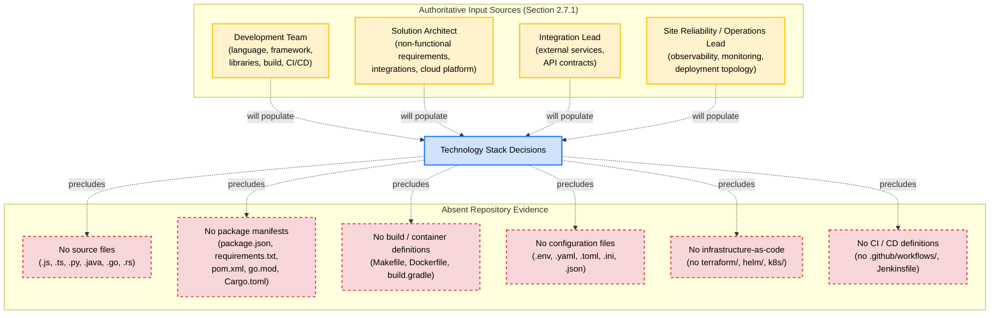

### 3.7.2 Cross-Section Consistency Verification

The absence findings reported throughout Section 3 are consistent with — and traceable to — the following previously authored sections of this Technical Specification:

| Section 3 Subsection | Cross-Referenced Section | Established Finding |
|----------------------|--------------------------|---------------------|
| 3.1 Programming Languages | Section 1.2.2 (Core Technical Approach) | No source files of any language are present |
| 3.1 Programming Languages | Section 2.5.2 (Technical Constraints Status) | "Language / Runtime Constraints: Not specified" |
| 3.2 Frameworks & Libraries | Section 1.2.2 (Core Technical Approach) | No package or dependency manifests are present |
| 3.2 Frameworks & Libraries | Section 2.5.2 (Technical Constraints Status) | "Framework / Library Constraints: Not specified" |
| 3.3 Open Source Dependencies | Section 1.2.2 (Core Technical Approach) | No manifests exist from which to enumerate packages |
| 3.4 Third-Party Services | Section 1.2.1 (Integration with Existing Enterprise Landscape) | "No integration touchpoints, third-party service references, API contracts… are documented" |
| 3.4 Third-Party Services | Section 2.5.4 (Security Implications Status) | "Authentication / Authorization Model: Not specified" |
| 3.5 Databases & Storage | Section 2.5.2 (Technical Constraints Status) | "Data Persistence Constraints: Not specified (no schema artifacts present)" |
| 3.5 Databases & Storage | Section 2.5.5 (Maintenance Requirements Status) | "Backup and Disaster Recovery Expectations: Not specified" |
| 3.6 Development & Deployment | Section 1.2.2 (Core Technical Approach) | No build/container definitions or configuration files are present |
| 3.6 Development & Deployment | Section 2.5.2 (Technical Constraints Status) | "Platform / Deployment Constraints: Not specified (no IaC or container definitions present)" |

### 3.7.3 Security Implications of Forward-Looking Candidates

While no technology selections are evidence-derived, the section prompt requires consideration of security implications. The Default Stack candidates raise the following representative security dimensions for future Solution Architect review, none of which can be authoritatively addressed at this time:

| Candidate | Representative Security Considerations to Be Resolved |
|-----------|--------------------------------------------------------|
| Auth0 (authentication) | Tenant isolation model, token lifetime policy, MFA enforcement, social identity provider scope, audit log retention |
| MongoDB (database) | Encryption-at-rest configuration, network isolation, role-based access control granularity, audit logging, backup encryption |
| AWS (cloud platform) | Account topology, IAM least-privilege baseline, VPC segmentation, KMS key management, GuardDuty/Security Hub enablement |
| Docker (containerization) | Base image provenance, image signing, vulnerability scanning cadence, non-root execution, secrets injection mechanism |
| Terraform (IaC) | State file encryption and access control, drift detection, policy-as-code enforcement (e.g., OPA/Sentinel), credential handling |
| GitHub Actions (CI/CD) | Secrets scope, OIDC federation for cloud auth, workflow permission minimization, third-party action pinning by SHA |
| Langchain (AI framework) | Prompt injection mitigation, output sanitization, model provider data-handling agreements, sensitive-data redaction |

These considerations are reserved for the **Solution Architect** input attributed to Section 2.7.1 ("Non-functional requirements: performance, security, compliance"). They do not constitute an endorsement of the candidate technologies.

---

## 3.8 PATH FORWARD FOR TECHNOLOGY STACK DEFINITION

### 3.8.1 Required Inputs and Authoritative Sources

Authoritative population of Section 3 requires the following inputs, mapped to their authoritative sources per Section 2.7.1. This subsection mirrors the pattern established in Section 1.3.3 (Scope Determination Path Forward) and Section 2.7.1 (Required Inputs and Authoritative Sources).

| Required Input for Technology Stack | Authoritative Source | Section 3 Subsection Populated |
|--------------------------------------|----------------------|--------------------------------|
| Programming language selection per component | Development Team | 3.1 |
| Language version commitments and runtime targets | Development Team | 3.1 |
| Framework selection and supporting library inventory | Development Team | 3.2 |
| Compatibility matrix and peer-dependency rules | Development Team / Solution Architect | 3.2 |
| Dependency manifests (package, version, registry, license) | Development Team | 3.3 |
| Dependency governance policy (scanning, allowlist) | Solution Architect | 3.3 |
| External API integration catalog | Solution Architect / Integration Lead | 3.4 |
| Authentication / identity provider selection | Solution Architect | 3.4 |
| Monitoring and observability service selection | Site Reliability / Operations Lead | 3.4 |
| Cloud platform and managed-service catalog | Solution Architect | 3.4 |
| Primary and secondary database selection | Solution Architect / Development Team | 3.5 |
| Caching tier and storage service selection | Solution Architect | 3.5 |
| Local development tooling baseline | Development Team | 3.6 |
| Build system and artifact definition | Development Team | 3.6 |
| Containerization strategy and base-image policy | Development Team / Solution Architect | 3.6 |
| Infrastructure-as-Code framework and module library | Solution Architect | 3.6 |
| CI / CD pipeline topology and promotion model | Development Team | 3.6 |
| Security baseline for technology choices | Solution Architect | 3.7.3 |

### 3.8.2 Technology Stack Definition Sequence

Per the specification evolution pattern established in Section 2.7.2, the following sequence is recommended for populating Section 3 once authoritative inputs become available:

#### Phase 1: Language and Platform Ratification

The Development Team and Solution Architect, in coordination, ratify or replace the candidate languages and platforms enumerated in Sections 3.1.4 and 3.4.7. Outputs of this phase include: confirmed language per component, target runtime versions, and confirmed cloud platform.

#### Phase 2: Framework and Library Selection

With languages ratified, the Development Team selects core frameworks and supporting libraries. Manifest artifacts (e.g., `package.json`, `requirements.txt`, `pom.xml`) are introduced into the repository, enabling evidence-derived population of Sections 3.2 and 3.3 — including pinned versions, registries, licenses, and transitive dependency graphs.

#### Phase 3: Persistence and Storage Selection

The Solution Architect, in coordination with the Development Team, selects the primary database, cache tier, object storage, and any auxiliary stores. Schema artifacts (e.g., migrations, ORM models, schema definitions) are introduced, enabling evidence-derived population of Section 3.5.

#### Phase 4: Third-Party Service Integration Catalog

The Integration Lead and Solution Architect compile the external API and SaaS catalog, including authentication provider, monitoring stack, and any payment, email, or messaging providers. Configuration artifacts (e.g., environment templates, API client modules) are introduced, enabling evidence-derived population of Section 3.4.

#### Phase 5: Build, Container, and CI / CD Definition

The Development Team introduces build definitions, containerization assets, and CI/CD pipeline files (e.g., `Dockerfile`, `.github/workflows/`, `terraform/`). These enable evidence-derived population of Section 3.6, including pinned tool versions, workflow topology, and deployment-promotion gates.

#### Phase 6: Security Baseline Codification

The Solution Architect codifies the security baseline for the ratified stack (Section 3.7.3 dimensions), aligning with the non-functional requirements input attributed to that role in Section 2.7.1.

### 3.8.3 Assumptions and Constraints

The following assumptions and constraints govern Section 3's current state, consistent with the pattern established in Section 2.7.3.

| Assumption / Constraint | Description |
|-------------------------|-------------|
| Repository State Assumption | The repository is assumed to be in a pre-implementation state per Section 1.1, not a partially synchronized or obscured state. |
| Evidence Boundary Constraint | Section 3 is constrained to evidence observable in the repository at authoring time; the Default Technology Stack supplied in the section prompt is not treated as ratified evidence. |
| Default Stack Non-Endorsement | Inclusion of Default Stack candidates as forward-looking guidance does not constitute endorsement, procurement, or architectural commitment. Each candidate is subject to ratification or replacement by the named authoritative sources. |
| Version Pinning Deferral | Version numbers cannot be specified for any technology because no dependency manifests, lock files, or build definitions exist. Versioning is reserved for revisions following Phase 2 of Section 3.8.2. |
| Cross-Component Compatibility Deferral | Compatibility matrices between candidate technologies (e.g., MongoDB driver compatibility with the ratified Python version) cannot be evaluated until languages and frameworks are jointly ratified. |
| Cost and Licensing Deferral | Cost models, licensing posture (open source vs. proprietary), and license-allowlist compliance reviews are deferred until candidate selections are ratified. |

### 3.8.4 Version Tracking Reservation

A technology stack version tracking table is reserved for future use to record amendments as technology selections are ratified. This mirrors the version tracking pattern established in Section 2.7.4.

| Version | Date | Subsection Amended | Change Summary |
|---------|------|---------------------|----------------|
| Not specified | Not specified | Not specified | Initial empty-state authoring; placeholder schemas established |

Subsequent revisions are expected to record, at minimum: language ratification, framework selection, dependency manifest introduction, schema introduction, service catalog finalization, and CI/CD pipeline introduction.

---

## 3.9 REFERENCES

### 3.9.1 Files Examined

- `README.md` — The repository's sole file (12 bytes). Contains only the H1 Markdown heading `# Artifact10`. Confirmed via direct read that no technology indicators (no file-extension references, no library names, no framework mentions, no runtime hints, no deployment references) exist in the content. Serves as the only evidentiary basis for all absence findings in Section 3.

### 3.9.2 Folders Explored

- `/` (repository root, depth 0) — Contains exactly one child file (`README.md`) and zero project subdirectories. The absence of any folder hierarchy commonly associated with technology stack artifacts (e.g., `src/`, `lib/`, `vendor/`, `node_modules/`, `target/`, `build/`, `dist/`, `infra/`, `terraform/`, `helm/`, `k8s/`, `.github/`, `docker/`) is a property of the repository itself and confirms the unavailability of technology-defining artifacts.

### 3.9.3 Search Activities Performed

| Search Activity | Outcome |
|----------------|---------|
| Root folder enumeration for technology artifacts | Only `README.md` identified |
| Semantic search: "package manifest configuration build script dependency" | No results |
| Semantic search: "source code application modules services" | No results |
| File-extension scan for `.js`, `.ts`, `.py`, `.java`, `.go`, `.rs` | No matches |
| File-name scan for `package.json`, `requirements.txt`, `pom.xml`, `go.mod`, `Cargo.toml` | No matches |
| File-name scan for `Dockerfile`, `Makefile`, `docker-compose.yml`, `build.gradle` | No matches |
| Directory scan for `.github/workflows/`, `terraform/`, `helm/`, `k8s/`, `infra/` | No matches |
| `.blitzyignore` presence check | None found; no path restrictions in effect |

### 3.9.4 Technical Specification Cross-References

| Referenced Section | Relevance to Section 3 |
|--------------------|------------------------|
| Section 1.1 (Executive Summary) | Establishes Artifact10 identifier and pre-implementation state, foundational to all Section 3 absence findings |
| Section 1.2.1 (Project Context) | Establishes the absence of integration touchpoints and third-party service references, governing Section 3.4 |
| Section 1.2.2 (Core Technical Approach) | Enumerates the categorically absent technology-defining artifact types (manifests, build files, source files, configs); foundational to Sections 3.1, 3.2, 3.3, and 3.6 |
| Section 1.4 (Documentation Integrity Statement) | Mandates the evidence-based authoring discipline applied throughout Section 3 |
| Section 1.5 (References) | Template for Section 3.9's structure and confirms 100% repository content examination |
| Section 2.1 (Section Authoring Methodology) | Establishes the placeholder schema preservation pattern adopted by Sections 3.1.2, 3.2.2, 3.3.2, 3.4.2, 3.5.2, and 3.6.2 |
| Section 2.5.2 (Technical Constraints Status) | Directly establishes language, framework, platform, and persistence constraints as "Not specified"; foundational to Sections 3.1, 3.2, 3.5, and 3.6 |
| Section 2.5.4 (Security Implications Status) | Establishes the authentication/authorization model as "Not specified", governing Sections 3.4.4 and 3.7.3 |
| Section 2.5.5 (Maintenance Requirements Status) | Establishes observability and disaster-recovery as "Not specified", governing Sections 3.4.5 and 3.5.3 |
| Section 2.7.1 (Required Inputs and Authoritative Sources) | Establishes the Development Team and Solution Architect as authoritative sources for technology decisions; foundational to Sections 3.8.1 and 3.8.2 |
| Section 2.7.2 (Specification Evolution Process) | Template for the phased technology selection sequence in Section 3.8.2 |
| Section 2.7.4 (Version Tracking Reservation) | Template for the version tracking table reserved in Section 3.8.4 |
| Section 2.8 (References) | Template for Section 3.9's References subsection structure |

### 3.9.5 Coverage Confidence

**100% of repository contents examined for technology-stack-relevant artifacts.** The repository's minimal size (one file, 12 bytes) enabled exhaustive review through multiple independent verification methods. No source files, manifests, build definitions, container files, infrastructure-as-code definitions, configuration files, or CI/CD pipeline assets exist from which technology selections could be derived. Section 3 will be revised when authoritative inputs (per Section 3.8.1) are supplied or when the repository is augmented with technology-stack-bearing artifacts, per the Specification Evolution discipline of Section 1.4.2.

---

# 4. Process Flowchart

## 4.1 SECTION AUTHORING METHODOLOGY

### 4.1.1 Evidence-Based Constraint

This Process Flowchart section is authored under the same evidence-based discipline established in Section 1.4 (Documentation Integrity Statement) and operationalized throughout Sections 2 and 3. The Artifact10 repository — comprising a single `README.md` file whose entire content is the H1 Markdown heading `# Artifact10` — does not contain any artifact from which business processes, user journeys, system interactions, decision logic, integration sequences, state machines, or error handling flows can be derived.

**No process flows, workflows, state machines, integration sequences, or error handling paths are documented in the Artifact10 repository.** In accordance with the documentation integrity mandate, this section transparently reports the absence of such evidence rather than fabricating speculative flowcharts, decision diamonds, swim lanes, or sequence diagrams to satisfy the requested format. This finding is consistent with — and directly traceable to — Section 1.2.2 (no system capabilities, no major system components, no core technical approach derivable), Section 2.2.1 (zero features documented), Section 2.3.1 (zero functional requirements), Section 2.4.1 (no feature relationships derivable), Section 2.5.1 (no implementation considerations authoritatively documentable), and Section 3 in its entirety (no technology stack from which to flow data, events, or state).

### 4.1.2 Structural Preservation Approach

While no flowchart content can be authoritatively documented, the structural schema requested by the section prompt is preserved throughout this section as a forward-compatible scaffold. Placeholder tables retain the column structure intended for future population (workflow inventory, decision-point register, validation-rule register, state-transition register, error-recovery register). Each placeholder is explicitly marked as "Not specified," "None documented," "Not derivable," or "Not applicable (pre-implementation)" to communicate that the schema is intentionally vacant pending the requirements-definition and architecture-definition activities described in Sections 2.7 and 3.8.

The Mermaid diagrams required by the section prompt — high-level system workflow, detailed process flows, error handling flowcharts, integration sequence diagrams, and state transition diagrams — are rendered as **empty-state visualizations** that depict the absence of derivable content. These diagrams mirror the visualization patterns established in Section 1.2.2 (Repository Structure Visualization), Section 2.4.2 (Empty Dependency Map), and Section 3.7.1 (Technology Stack Status Visualization). They do not fabricate fictional actors, systems, events, or states.

### 4.1.3 Relationship to Section 1.4 Documentation Integrity Statement

Per Section 1.4.3 (Cross-Section Coordination), readers are advised to expect parallel transparency in downstream sections regarding what can and cannot be authoritatively documented from the repository's current minimal state. This Process Flowchart section operationalizes that commitment by:

| Integrity Principle | Implementation in Section 4 |
|---------------------|-----------------------------|
| No fabricated content | No workflows, decision points, actors, or state machines are invented |
| Explicit absence statements | Each subsection declares the absence of derivable evidence |
| Schema preservation | Placeholder registers retain the requested structure for future revisions |
| Authoritative source identification | Section 4.7 lists required inputs and their owners |
| Visualization of absence | All Mermaid diagrams render the empty state with explicit "absent" / "precludes" / "will populate" semantics |

---

## 4.2 SYSTEM WORKFLOWS STATUS

### 4.2.1 Core Business Processes Status

**No core business processes are documented in the Artifact10 repository.** Business process documentation presupposes the existence of business capabilities, user personas, system functions, and decision logic — none of which are derivable from a 12-byte `README.md` containing only the H1 heading `# Artifact10`. The following dimensions, customary for a complete Core Business Processes subsection, remain unpopulated:

| Core Process Dimension | Repository Evidence | Cross-Reference |
|------------------------|---------------------|-----------------|
| End-to-End User Journeys | None documented | Section 1.1.3 (no stakeholders identified), Section 2.2.1 (zero features) |
| System Interactions | None documented | Section 1.2.2 (no major system components) |
| Decision Points | None documented | Section 2.3.4 (no business rules documented) |
| Error Handling Paths | None documented | Section 2.5.1 (no implementation considerations) |
| Process Triggers and Termini | None documented | Section 1.2.2 (no user-facing features, no background processing) |
| User Touchpoints | None documented | Section 1.1.3 (no user persona identification) |
| System Boundaries | None documented | Section 1.3.1 (no implementation boundaries documented) |

### 4.2.2 Integration Workflows Status

**No integration workflows are documented in the Artifact10 repository.** This finding is consistent with — and directly inherits from — Section 2.4.3 (Integration Points Status), which established that no internal service-to-service integrations, external third-party integrations, API contracts, or message broker / event bus topologies are documented, and Section 3.4.1, which established that no third-party services, external APIs, SaaS integrations, authentication providers, monitoring platforms, or cloud-managed services are referenced. The following dimensions remain unpopulated:

| Integration Workflow Dimension | Repository Evidence | Cross-Reference |
|--------------------------------|---------------------|-----------------|
| Data Flow Between Systems | None documented | Section 1.2.1 (Integration with Existing Enterprise Landscape) |
| API Interactions | None documented | Section 2.4.3, Section 3.4.3 |
| Event Processing Flows | None documented | Section 2.4.3 (no message broker / event bus topology) |
| Batch Processing Sequences | None documented | Section 1.2.2 (no background / asynchronous processing) |
| External Service Invocations | None documented | Section 3.4.1 (no external APIs) |
| Webhook / Callback Patterns | None documented | Section 3.4.3 (no contract definitions) |
| Streaming / Real-Time Pipelines | None documented | Section 3.4.1 (no messaging / event services) |

### 4.2.3 Workflow Catalog Placeholder Schema

The following table preserves the intended Workflow Inventory schema. All entries are explicitly marked as unpopulated to denote that no actual workflow is being represented:

| Workflow ID | Workflow Name | Triggering Event | Actor(s) / System(s) | SLA / Timing Constraint | Linked Feature ID |
|-------------|---------------|------------------|----------------------|-------------------------|---------------------|
| Not specified | Not specified | Not specified | Not specified | Not specified | Not specified (per Section 2.2.1) |

#### Workflow Identifier Convention (Reserved for Future Use)

| Schema Element | Intended Format | Current Population |
|----------------|-----------------|---------------------|
| Workflow Identifier | `WF-XXX` (zero-padded sequential integer) | No identifiers assigned |
| Workflow Name | Concise human-readable label | No names assigned |
| Workflow Category | Functional grouping (e.g., Onboarding, Transaction, Reporting) | No categories defined |
| Triggering Event | User action / scheduled / event-driven / API-invoked | None defined |
| Linked Feature | Cross-reference to `F-XXX` Feature ID (Section 2.2) | None — no features defined |
| SLA Class | Real-time / Near-real-time / Batch / Best-effort | None assessed |

---

## 4.3 FLOWCHART REQUIREMENTS STATUS

### 4.3.1 Process Flow Element Status

**No process flow elements are documented in the Artifact10 repository.** The section prompt enumerates eight required flowchart elements; each is unpopulated as follows:

| Required Flowchart Element | Evidentiary Status | Source Cross-Reference |
|---------------------------|---------------------|------------------------|
| Start and End Points | Not derivable; no workflows defined | Section 2.2.1 |
| Process Steps | Not derivable; no process definitions exist | Section 2.3.1 |
| Decision Diamonds | Not derivable; no conditional logic defined | Section 2.3.4 |
| System Boundaries | Not derivable; no system components documented | Section 1.2.2, Section 1.3.1 |
| User Touchpoints | Not derivable; no user personas or interaction surfaces | Section 1.1.3 |
| Error States and Recovery Paths | Not derivable; no error handling model | Section 2.5.1 |
| Timing and SLA Considerations | Not derivable; no KPIs, SLAs, or SLOs specified | Section 1.2.3, Section 2.5.3 |
| Swim Lanes (Actor / System Partitions) | Not derivable; no actors or systems defined | Section 1.2.2, Section 1.1.3 |

### 4.3.2 Validation Rules Status

**No validation rules are documented in the Artifact10 repository.** Validation rules presuppose the existence of data entities, input boundaries, authorization roles, and regulatory scope — none of which are derivable from the current repository state. The following dimensions remain unpopulated:

| Validation Rule Dimension | Repository Evidence | Cross-Reference |
|--------------------------|---------------------|-----------------|
| Business Rules at Each Step | None documented | Section 2.3.4 (no business rules documented) |
| Data Validation Requirements | None documented | Section 2.3.4 (no data validation requirements) |
| Authorization Checkpoints | None documented | Section 2.5.4 (Authentication / Authorization Model: Not specified), Section 3.4.4 |
| Regulatory Compliance Checks | None documented | Section 2.5.4 (Regulatory Compliance Scope: Not specified) |
| Input Sanitization Policies | None documented | Section 2.5.4 (Data Protection: Not specified) |
| Idempotency Guarantees | None documented | Section 2.5.1 (no implementation considerations) |
| Rate-Limiting and Throttling Rules | None documented | Section 2.5.3 (no throughput targets specified) |

#### Validation Rule Register Placeholder Schema

| Rule ID | Rule Type | Applied At Step | Validation Logic | Failure Behavior |
|---------|-----------|-----------------|------------------|------------------|
| Not specified | Not specified | Not specified | Not specified | Not specified |

---

## 4.4 TECHNICAL IMPLEMENTATION STATUS

### 4.4.1 State Management Status

**No state management strategy is documented in the Artifact10 repository.** State management presupposes the existence of domain entities, lifecycle stages, persistence infrastructure, and transactional semantics — none of which are documented. This finding inherits directly from Section 2.5.1 (no implementation considerations), Section 3.5.1 (no databases or persistence layers), and Section 3.5.3 (no data persistence strategy documented). The following dimensions remain unpopulated:

| State Management Dimension | Repository Evidence | Cross-Reference |
|---------------------------|---------------------|-----------------|
| State Transitions | None documented | Section 2.5.1 (no state machine defined) |
| Data Persistence Points | None documented | Section 2.5.2 (Data Persistence Constraints: Not specified), Section 3.5.1 |
| Caching Requirements | None documented | Section 3.5.4 (no caching strategy documented) |
| Transaction Boundaries | None documented | Section 3.5.3 (no transactional consistency model) |
| Optimistic / Pessimistic Locking Strategy | None documented | Section 3.5.3 (no concurrency model) |
| Event Sourcing / CQRS Posture | None documented | Section 2.4.3 (no event bus topology) |
| Saga / Distributed Transaction Pattern | None documented | Section 2.4.3 (no integration touchpoints) |

#### State Transition Register Placeholder Schema

| Entity | Current State | Trigger Event | Guard Condition | Action on Transition | Target State |
|--------|---------------|---------------|------------------|----------------------|--------------|
| Not specified | Not specified | Not specified | Not specified | Not specified | Not specified |

### 4.4.2 Error Handling Status

**No error handling model is documented in the Artifact10 repository.** Error handling presupposes the existence of an implementation, a runtime environment, an exception taxonomy, and observability infrastructure — none of which are documented. This finding inherits from Section 2.5.5 (no observability or monitoring requirements specified), Section 3.4.5 (no monitoring / observability service integration documented), and Section 3.4.1 (no third-party service catalog). The following dimensions remain unpopulated:

| Error Handling Dimension | Repository Evidence | Cross-Reference |
|--------------------------|---------------------|-----------------|
| Retry Mechanisms | None documented | Section 2.5.1 (no implementation considerations) |
| Fallback Processes | None documented | Section 2.5.1 (no degraded-mode behavior defined) |
| Error Notification Flows | None documented | Section 3.4.5 (no observability stack), Section 2.5.5 |
| Recovery Procedures | None documented | Section 2.5.5 (Backup and Disaster Recovery Expectations: Not specified) |
| Circuit-Breaker Patterns | None documented | Section 2.4.3 (no integration touchpoints) |
| Dead-Letter Queue Strategy | None documented | Section 2.4.3 (no message broker topology) |
| Exception Taxonomy | None documented | Section 2.5.1 (no domain model) |
| Logging and Tracing Posture | None documented | Section 3.4.5 (no telemetry sinks documented) |

#### Error Handling Register Placeholder Schema

| Error Class | Originating Step | Retry Policy | Fallback Action | Notification Channel | Recovery Procedure |
|-------------|------------------|--------------|------------------|----------------------|---------------------|
| Not specified | Not specified | Not specified | Not specified | Not specified | Not specified |

---

## 4.5 REQUIRED DIAGRAMS — EMPTY-STATE VISUALIZATIONS

The section prompt requires five Mermaid diagrams: a high-level system workflow, detailed process flows for each core feature, error handling flowcharts, integration sequence diagrams, and state transition diagrams. Because no workflow, feature, error handling model, integration, or state machine exists in the repository, each required diagram is rendered as an empty-state visualization. These diagrams adopt the class definitions and edge-label conventions established in Section 1.2.2, Section 2.4.2, and Section 3.7.1: `present` (green) for confirmed artifacts, `absent` (red dashed) for unpopulated dimensions, `pending` (yellow) for forward-looking input sources, and `decision` (blue) for elements reserved for future ratification. Edge labels use `-.absent.->`, `-.precludes.->`, and `-.will populate.->` semantics.

### 4.5.1 High-Level System Workflow (Empty State)

The requested high-level system workflow diagram cannot be populated because no workflow elements (triggers, steps, decisions, terminal events, SLA constraints) are derivable from the repository. The empty-state visualization below depicts this absence:

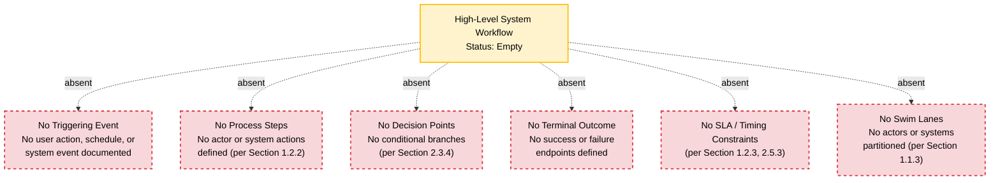

### 4.5.2 Detailed Process Flows for Each Core Feature (Empty State)

The section prompt requests one detailed process flow per core feature. Because Section 2.2.1 established that zero features are documented (no `F-XXX` identifiers are assigned), no per-feature process flows can be rendered. The empty-state visualization below depicts this absence:

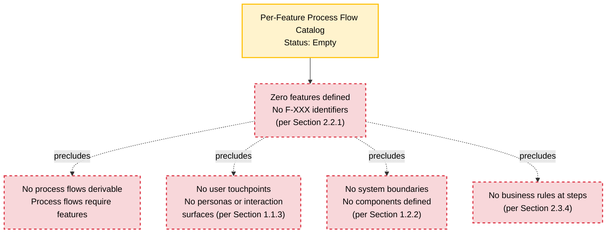

### 4.5.3 Error Handling Flowchart (Empty State)

The requested error handling flowchart cannot be populated because no exception taxonomy, retry policy, fallback strategy, notification channel, or recovery procedure is documented. The empty-state visualization below depicts this absence:

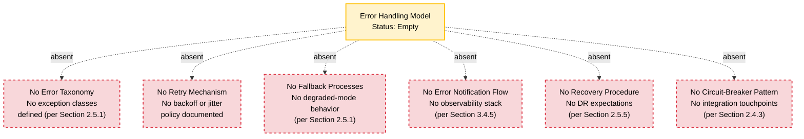

### 4.5.4 Integration Sequence Diagram (Empty State)

The requested integration sequence diagram cannot be populated because no participating actors, systems, message exchanges, API contracts, or event payloads are documented. Per Mermaid conventions, sequence diagrams require at minimum two participants and one message exchange; neither is derivable. The empty-state visualization below depicts this absence using a flowchart representation, consistent with the Section 2.4.2 pattern:

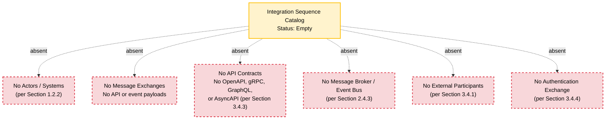

### 4.5.5 State Transition Diagram (Empty State)

The requested state transition diagram cannot be populated because no domain entities, lifecycle states, transition events, guard conditions, or persistence layer are documented. The empty-state visualization below depicts this absence:

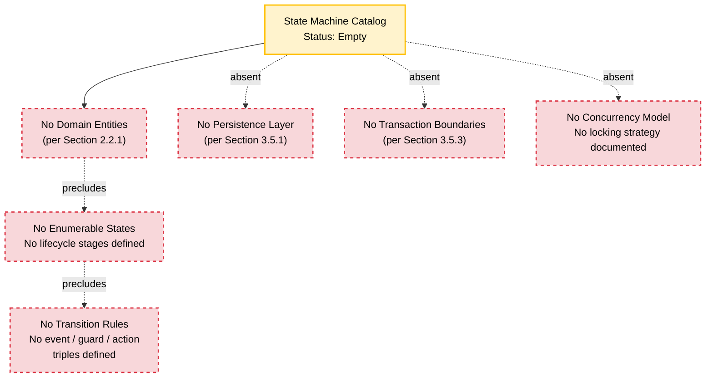

### 4.5.6 Consolidated Process Flow Status Visualization

The following consolidated diagram mirrors the visualization pattern established in Section 3.7.1 (Technology Stack Status Visualization). It depicts the relationship between the process flow definitions reserved by this section, the absent repository evidence categories that would normally constrain those definitions, and the authoritative input sources designated by Section 4.7.1 to populate them.

```mermaid
graph TD
    ProcessFlow["Process Flow Definitions"]

    subgraph EvidenceState["Absent Repository Evidence"]
        NoFeatures["No features defined<br/>(per Section 2.2.1)"]
        NoWorkflows["No workflow descriptions<br/>(per Section 1.3.1)"]
        NoStates["No state machines<br/>(per Section 2.5.1)"]
        NoIntegrations["No integration touchpoints<br/>(per Section 2.4.3, 3.4.1)"]
        NoPersistence["No persistence model<br/>(per Section 3.5.1)"]
        NoErrors["No error handling model<br/>(per Section 2.5)"]
        NoSLA["No SLA / timing constraints<br/>(per Section 1.2.3, 2.5.3)"]
        NoAuthZ["No authorization model<br/>(per Section 2.5.4, 3.4.4)"]
    end

    subgraph InputSources["Authoritative Input Sources (Section 4.7.1)"]
        ProdOwner["Product Owner<br/>(user journeys,<br/>feature workflows)"]
        BizAnalyst["Business Analyst<br/>(decision points,<br/>validation rules)"]
        SolArch["Solution Architect<br/>(system interactions,<br/>state machines)"]
        IntLead["Integration Lead<br/>(API sequences,<br/>event topology)"]
        DevTeam["Development Team<br/>(transaction boundaries,<br/>retry mechanisms)"]
        QALead["QA Lead<br/>(acceptance criteria,<br/>validation rules)"]
        SRE["SRE / Operations Lead<br/>(recovery procedures,<br/>SLA constraints)"]
        Compliance["Compliance Officer<br/>(regulatory checks)"]
    end

    ProcessFlow -.precludes.-> NoFeatures
    ProcessFlow -.precludes.-> NoWorkflows
    ProcessFlow -.precludes.-> NoStates
    ProcessFlow -.precludes.-> NoIntegrations
    ProcessFlow -.precludes.-> NoPersistence
    ProcessFlow -.precludes.-> NoErrors
    ProcessFlow -.precludes.-> NoSLA
    ProcessFlow -.precludes.-> NoAuthZ

    ProdOwner -.will populate.-> ProcessFlow
    BizAnalyst -.will populate.-> ProcessFlow
    SolArch -.will populate.-> ProcessFlow
    IntLead -.will populate.-> ProcessFlow
    DevTeam -.will populate.-> ProcessFlow
    QALead -.will populate.-> ProcessFlow
    SRE -.will populate.-> ProcessFlow
    Compliance -.will populate.-> ProcessFlow

    classDef decision fill:#cfe2ff,stroke:#0d6efd,stroke-width:2px,color:#000
    classDef absent fill:#f8d7da,stroke:#dc3545,stroke-width:2px,stroke-dasharray: 5 5,color:#000
    classDef pending fill:#fff3cd,stroke:#ffc107,stroke-width:2px,color:#000

    class ProcessFlow decision
    class NoFeatures,NoWorkflows,NoStates,NoIntegrations,NoPersistence,NoErrors,NoSLA,NoAuthZ absent
    class ProdOwner,BizAnalyst,SolArch,IntLead,DevTeam,QALead,SRE,Compliance pending
```

---

## 4.6 CROSS-SECTION CONSISTENCY VERIFICATION

The absence findings reported throughout Section 4 are consistent with — and directly traceable to — the following previously authored sections of this Technical Specification. This subsection mirrors the cross-section verification pattern established in Section 3.7.2.

| Section 4 Subsection | Cross-Referenced Section | Established Finding |
|----------------------|--------------------------|---------------------|
| 4.2.1 Core Business Processes Status | Section 1.1.3 (Executive Summary — Stakeholders) | No stakeholders identified |
| 4.2.1 Core Business Processes Status | Section 1.2.2 (High-Level Description) | No system capabilities, no major system components |
| 4.2.1 Core Business Processes Status | Section 2.2.1 (Feature Enumeration Status) | Zero features documented |
| 4.2.2 Integration Workflows Status | Section 1.2.1 (Integration with Existing Enterprise Landscape) | No integration touchpoints documented |
| 4.2.2 Integration Workflows Status | Section 2.4.3 (Integration Points Status) | No internal or external integrations documented |
| 4.2.2 Integration Workflows Status | Section 3.4.1 (Third-Party Services — Current Repository Evidence) | No external APIs, SaaS, or cloud services |
| 4.3.1 Process Flow Element Status | Section 1.3.1 (In-Scope Elements) | No workflows or implementation boundaries documented |
| 4.3.1 Process Flow Element Status | Section 2.3.1 (Functional Requirements Status) | Zero functional requirements documented |
| 4.3.2 Validation Rules Status | Section 2.3.4 (Business Rules Status) | No business rules or data validation requirements |
| 4.3.2 Validation Rules Status | Section 2.5.4 (Security Implications Status) | Authentication / Authorization Model: Not specified; Regulatory Compliance Scope: Not specified |
| 4.4.1 State Management Status | Section 2.5.1 (Implementation Status) | No implementation considerations authoritatively documentable |
| 4.4.1 State Management Status | Section 2.5.2 (Technical Constraints Status) | Data Persistence Constraints: Not specified |
| 4.4.1 State Management Status | Section 3.5.1 (Databases & Storage — Current Repository Evidence) | No database, persistence layer, or schema |
| 4.4.1 State Management Status | Section 3.5.3 (Data Persistence Strategy Status) | No transactional consistency model documented |
| 4.4.1 State Management Status | Section 3.5.4 (Caching Strategy Status) | No caching strategy documented |
| 4.4.2 Error Handling Status | Section 2.5.5 (Maintenance Requirements Status) | Observability and Backup/DR Expectations: Not specified |
| 4.4.2 Error Handling Status | Section 3.4.5 (Monitoring and Observability Service Status) | No monitoring, logging, tracing, or alerting service |
| 4.5 Required Diagrams | Section 1.2.2 (Repository Structure Visualization) | Source pattern for empty-state Mermaid diagrams |
| 4.5 Required Diagrams | Section 2.4.2 (Dependency Map) | Source pattern for `precludes` edge-label semantics |
| 4.5 Required Diagrams | Section 3.7.1 (Technology Stack Status Visualization) | Source pattern for subgraph-based status visualization |
| 4.7 Path Forward | Section 2.7 (Path Forward for Requirements Definition) | Source pattern for authoritative input source mapping |
| 4.7 Path Forward | Section 3.8 (Path Forward for Technology Stack Definition) | Source pattern for phased evolution sequence |

---

## 4.7 PATH FORWARD FOR PROCESS FLOWCHART DEFINITION

### 4.7.1 Required Inputs and Authoritative Sources

To populate this Process Flowchart section authoritatively in subsequent revisions, the following inputs are required. This subsection mirrors the pattern established in Section 2.7.1 (Required Inputs and Authoritative Sources) and Section 3.8.1.

| Required Input | Authoritative Source | Section 4 Subsection Populated |
|---------------|----------------------|--------------------------------|
| Feature workflows and end-to-end user journeys | Product Owner / Business Analyst | 4.2.1, 4.5.1, 4.5.2 |
| Decision points and business rules | Business Analyst | 4.2.1, 4.3.2 |
| System interaction sequences and component topology | Solution Architect | 4.2.1, 4.5.1 |
| Integration touchpoints and API contracts | Solution Architect / Integration Lead | 4.2.2, 4.5.4 |
| Event topology and batch processing sequences | Solution Architect / Integration Lead | 4.2.2, 4.5.4 |
| Data validation requirements | Business Analyst / Solution Architect | 4.3.2 |
| Authorization checkpoints and access-control logic | Solution Architect / Security Lead | 4.3.2 |
| Regulatory compliance checks | Compliance Officer / Solution Architect | 4.3.2 |
| State machines and entity lifecycle definitions | Solution Architect / Development Team | 4.4.1, 4.5.5 |
| Persistence points and transaction boundaries | Solution Architect / Development Team | 4.4.1 |
| Caching strategy and consistency model | Solution Architect | 4.4.1 |
| Retry mechanisms and backoff policies | Development Team / SRE Lead | 4.4.2, 4.5.3 |
| Fallback processes and degraded-mode behavior | Development Team / SRE Lead | 4.4.2, 4.5.3 |
| Error notification flows and observability sinks | SRE / Operations Lead | 4.4.2, 4.5.3 |
| Recovery procedures and runbooks | Site Reliability / Operations Lead | 4.4.2 |
| SLA / SLO / timing constraints | Solution Architect / SRE Lead | 4.3.1, 4.5.1 |
| Test acceptance criteria for workflow validation | Quality Assurance Lead | 4.3.2 |

### 4.7.2 Process Flow Definition Sequence

Per the specification evolution pattern established in Section 2.7.2 and Section 3.8.2, the following phased sequence is recommended for populating Section 4 once authoritative inputs become available:

#### Phase 1: Feature and User Journey Identification

Upon population of the Feature Catalog (Section 2.2) with discrete features assigned `F-XXX` identifiers, the Product Owner and Business Analyst define end-to-end user journeys per feature. Outputs of this phase include: journey narratives, identified actor personas, and triggering events for each workflow. These outputs enable evidence-derived population of Sections 4.2.1 and 4.5.2.

#### Phase 2: Workflow Decomposition

For each cataloged user journey, the Business Analyst decomposes the journey into discrete process steps, decision points, and terminal outcomes. Each decision point is annotated with the business rule governing its branching logic, and each step is annotated with input/output data contracts. These outputs enable evidence-derived population of Sections 4.2.3, 4.3.1, and 4.3.2.

#### Phase 3: State Machine and Data Flow Modeling

The Solution Architect, in coordination with the Development Team, defines the domain entities, their lifecycle states, and the events / guards / actions governing state transitions. Persistence points are mapped to the database technologies ratified per Section 3.5. Transaction boundaries are defined relative to the consistency model selected per Section 3.5.3. These outputs enable evidence-derived population of Sections 4.4.1 and 4.5.5.

#### Phase 4: Integration Sequence Definition

The Integration Lead and Solution Architect compile the catalog of integration sequences, including the participants (internal services, external SaaS, message brokers), the message exchanges, the API contracts (OpenAPI, gRPC, GraphQL, AsyncAPI), and the timing/ordering guarantees. API contracts and authentication exchanges are aligned with selections ratified per Section 3.4. These outputs enable evidence-derived population of Sections 4.2.2 and 4.5.4.

#### Phase 5: Error Handling and Recovery Flow Specification

The Development Team, in coordination with the SRE Lead, defines the exception taxonomy, retry policies (max attempts, backoff curve, jitter, idempotency keys), fallback strategies (degraded-mode behavior, circuit-breaker thresholds), notification channels, and recovery procedures. Observability sinks are aligned with selections ratified per Section 3.4.5. These outputs enable evidence-derived population of Sections 4.4.2 and 4.5.3.

#### Phase 6: SLA and Timing Constraint Specification

The Solution Architect and SRE Lead specify per-workflow SLA classes (real-time, near-real-time, batch, best-effort), latency budgets, throughput targets, and availability commitments. These constraints are propagated to each workflow step and each integration sequence. These outputs enable evidence-derived population of Section 4.3.1 and the timing annotations within Section 4.5 diagrams.

#### Phase 7: Validation, Authorization, and Compliance Overlay

The Business Analyst, Solution Architect, Compliance Officer, and QA Lead overlay validation rules, authorization checkpoints, and regulatory compliance checks onto each workflow step. The validation-rule register and authorization-checkpoint register (Section 4.3.2) are populated, and traceability is established back to the functional requirements register (Section 2.3).

### 4.7.3 Assumptions and Constraints

The following assumptions and constraints govern Section 4's current state, consistent with the pattern established in Section 2.7.3 and Section 3.8.3.

| Assumption / Constraint | Description |
|-------------------------|-------------|
| Repository State Assumption | The repository is assumed to be in a pre-implementation state per Section 1.1, not a partially synchronized or obscured state. |
| Evidence Boundary Constraint | Section 4 is constrained to evidence observable in the repository at authoring time; no external knowledge of domain workflows, decision logic, or integration patterns is incorporated. |
| Schema Forward-Compatibility Assumption | The placeholder registers (Workflow Inventory, Validation Rule Register, State Transition Register, Error Handling Register) assume the structural schemas requested by the section prompt remain applicable to Artifact10's eventual domain. |
| Identifier Convention Reservation | The `WF-XXX` identifier convention introduced in Section 4.2.3 is reserved but not yet allocated; first allocations should begin at `WF-001` and be cross-referenced to `F-XXX` Feature IDs once those are assigned per Section 2.7.2. |
| Dependency on Upstream Section Population | Section 4 cannot be authoritatively populated until Sections 2.2 (Feature Catalog), 2.3 (Functional Requirements), 2.4 (Feature Relationships), 2.5 (Implementation Considerations), 3.4 (Third-Party Services), and 3.5 (Databases & Storage) are populated. |
| Diagram Empty-State Discipline | All Mermaid diagrams in Section 4.5 are rendered as empty-state visualizations and do not represent fabricated workflows. Any future replacement of these diagrams with content-bearing diagrams must be traceable to the authoritative input sources designated in Section 4.7.1. |

### 4.7.4 Version Tracking Reservation

A process flowchart version tracking table is reserved for future use to record amendments as workflows, state machines, integration sequences, and error handling models are introduced. This mirrors the version tracking pattern established in Section 2.7.4 and Section 3.8.4.

| Version | Date | Subsection Amended | Change Summary |
|---------|------|---------------------|----------------|
| Not specified | Not specified | Not specified | Initial empty-state authoring; placeholder schemas and empty-state Mermaid diagrams established |

Subsequent revisions are expected to record, at minimum: feature workflow identification, workflow decomposition, state machine modeling, integration sequence definition, error handling specification, SLA constraint specification, and validation/authorization/compliance overlay.

---

## 4.8 REFERENCES

### 4.8.1 Files Examined

- `README.md` — The repository's sole file (12 bytes). Contains only the H1 Markdown heading `# Artifact10`. Confirmed via direct read that no workflow descriptions, process narratives, sequence diagrams, state machine specifications, integration touchpoints, business rules, decision logic, error handling references, SLA commitments, or compliance scope statements exist in the content. Serves as the sole evidentiary basis for all absence findings in Section 4.

### 4.8.2 Folders Explored

- `/` (repository root, depth 0) — Contains exactly one child file (`README.md`) and zero project subdirectories. The absence of any folder hierarchy commonly associated with process flow artifacts (e.g., `workflows/`, `flows/`, `processes/`, `diagrams/`, `bpmn/`, `state-machines/`, `sequences/`, `api/`, `events/`, `integrations/`, `docs/architecture/`, `runbooks/`) is a property of the repository itself and confirms the unavailability of workflow-defining artifacts.

### 4.8.3 Search Activities Performed

| Search Activity | Outcome |
|----------------|---------|
| Root folder enumeration for workflow artifacts | Only `README.md` identified |
| Semantic search: "workflow process flow diagram business logic" | No results |
| Semantic search: "state machine state transition event handler" | No results |
| Semantic search: "user interface endpoint API controller" | No results |
| Semantic search: "authentication authorization session management" | No results |
| Semantic search: "database schema migration data model" | No results |
| Semantic search: "configuration environment variables settings" | No results |
| Semantic search: "error handling retry mechanism exception" | No results |
| Folder search: "source code application services modules" | No results |
| File-name scan for `*.bpmn`, `*.drawio`, `*.puml`, `*.mmd`, `*.dot` | No matches |
| Directory scan for `workflows/`, `flows/`, `processes/`, `diagrams/`, `sequences/`, `runbooks/` | No matches |
| `.blitzyignore` presence check | None found; no path restrictions in effect |

### 4.8.4 Technical Specification Cross-References

| Referenced Section | Relevance to Section 4 |
|--------------------|------------------------|
| Section 1.1 (Executive Summary) | Establishes Artifact10 identifier and pre-implementation state; foundational to all Section 4 absence findings |
| Section 1.2.1 (Project Context) | Establishes the absence of integration touchpoints, third-party service references, API contracts, and message broker configurations; foundational to Section 4.2.2 |
| Section 1.2.2 (High-Level Description) | Establishes the absence of system capabilities, major system components, and core technical approach; foundational to Sections 4.2.1 and 4.3.1; provides the Repository Structure Visualization Mermaid pattern adopted in Section 4.5 |
| Section 1.2.3 (Success Criteria) | Establishes the absence of KPIs, SLAs, and SLOs; foundational to Section 4.3.1 (Timing and SLA Considerations) |
| Section 1.3.1 (In-Scope Elements) | Establishes the absence of must-have capabilities, primary user workflows, essential integrations, and key technical requirements; foundational to Sections 4.2.1 and 4.3.1 |
| Section 1.4 (Documentation Integrity Statement) | Mandates the evidence-based authoring discipline applied throughout Section 4 |
| Section 2.1 (Section Authoring Methodology) | Establishes the schema-preservation and placeholder approach adopted by Sections 4.2.3, 4.3.2, 4.4.1, and 4.4.2 |
| Section 2.2.1 (Feature Enumeration Status) | Establishes zero features documented; foundational to Sections 4.2.1 and 4.5.2 |
| Section 2.3.1 (Functional Requirements Status) | Establishes zero functional requirements; foundational to Section 4.3.1 |
| Section 2.3.4 (Business Rules Status) | Establishes no business rules or data validation requirements; foundational to Section 4.3.2 |
| Section 2.4.2 (Dependency Map) | Provides the empty-state Mermaid diagram pattern adopted in Section 4.5; introduces the `precludes` edge-label semantic |
| Section 2.4.3 (Integration Points Status) | Establishes no internal or external integrations documented; foundational to Sections 4.2.2 and 4.5.4 |
| Section 2.5.1 (Implementation Status) | Establishes no implementation considerations authoritatively documentable; foundational to Section 4.4 |
| Section 2.5.2 (Technical Constraints Status) | Establishes "Data Persistence Constraints: Not specified"; foundational to Section 4.4.1 |
| Section 2.5.3 (Performance and Scalability Considerations) | Establishes no throughput, latency, or concurrency targets; foundational to Section 4.3.1 |
| Section 2.5.4 (Security Implications Status) | Establishes no authentication / authorization model and no regulatory compliance scope; foundational to Section 4.3.2 |
| Section 2.5.5 (Maintenance Requirements Status) | Establishes no observability, monitoring, or backup/DR expectations; foundational to Section 4.4.2 |
| Section 2.7 (Path Forward for Requirements Definition) | Provides the template for Section 4.7's path forward subsection, including authoritative source mapping (Section 2.7.1), phased evolution sequence (Section 2.7.2), assumptions and constraints (Section 2.7.3), and version tracking reservation (Section 2.7.4) |
| Section 3.4.1 (Third-Party Services — Current Repository Evidence) | Establishes no external APIs, SaaS integrations, authentication providers, monitoring platforms, or cloud-managed services; foundational to Sections 4.2.2 and 4.5.4 |
| Section 3.4.3 (External API Integration Status) | Establishes no API client configuration, no endpoint catalog, no contract definitions; foundational to Section 4.5.4 |
| Section 3.4.4 (Authentication Service Status) | Establishes no authentication or identity-provider integration; foundational to Section 4.3.2 (Authorization Checkpoints) |
| Section 3.4.5 (Monitoring and Observability Service Status) | Establishes no monitoring, logging, tracing, or alerting service integration; foundational to Section 4.4.2 |
| Section 3.5.1 (Databases & Storage — Current Repository Evidence) | Establishes no database, persistence layer, schema definitions, or storage configurations; foundational to Section 4.4.1 |
| Section 3.5.3 (Data Persistence Strategy Status) | Establishes no transactional consistency model, partitioning, replication, or backup cadence; foundational to Section 4.4.1 |
| Section 3.5.4 (Caching Strategy Status) | Establishes no caching strategy; foundational to Section 4.4.1 |
| Section 3.7.1 (Technology Stack Status Visualization) | Provides the sophisticated subgraph-based Mermaid visualization pattern adopted in Section 4.5.6; introduces the `precludes` / `will populate` edge-label dual semantic and the `decision` / `absent` / `pending` class definitions |
| Section 3.8 (Path Forward for Technology Stack Definition) | Provides the phased evolution sequence template adopted in Section 4.7.2 |
| Section 3.9 (References) | Provides the detailed References subsection template adopted in Section 4.8, including the Files Examined, Folders Explored, Search Activities Performed, Cross-References, and Coverage Confidence structure |

### 4.8.5 Coverage Confidence

**100% of repository contents examined for process-flow-relevant artifacts.** The repository's minimal size (one file, 12 bytes) enabled exhaustive review through multiple independent verification methods. No workflow descriptions, sequence diagrams, state machine specifications, business rules, decision logic, integration touchpoints, API contracts, error handling references, observability configurations, or SLA commitments exist from which process flows could be derived. The single `README.md` file's content (`# Artifact10`) was directly read and contains no semantic content beyond the repository name itself.

Section 4 will be revised when authoritative inputs (per Section 4.7.1) are supplied or when the repository is augmented with process-flow-bearing artifacts — including but not limited to: feature specifications, user journey narratives, API contracts, schema definitions, state machine specifications, sequence diagrams (BPMN, PlantUML, Mermaid, draw.io), error handling code, observability configurations, or operational runbooks — per the Specification Evolution discipline of Section 1.4.2.

---

# 5. System Architecture

## 5.1 SECTION AUTHORING METHODOLOGY

### 5.1.1 Evidence-Based Constraint

This section is authored under the same evidence-based discipline established by Section 1.4 (Documentation Integrity Statement) and operationalized throughout Sections 2, 3, and 4. The Artifact10 repository is in a **pre-implementation state**: it contains a single file (`README.md`, 12 bytes) whose entire substantive content is the H1 Markdown heading `# Artifact10`. Per Section 1.2.2, no source files, package manifests, build definitions, configuration files, infrastructure-as-code, CI/CD definitions, or architectural diagrams are present. Per Section 2.4.1, no feature relationships exist because zero features are defined (Section 2.2.1). Per Section 4.4, no state management strategy or error handling model is documented.

Consequently, **no architectural components, services, layers, communication patterns, data flows, integrations, or technical decisions are derivable from repository evidence.** This section therefore performs four operations:

1. Transparently reports the absence of each architectural dimension requested by the section prompt and traces that absence to its established source section.
2. Preserves the structural schemas requested by the section prompt with `Not specified` markers, so that future revisions can populate them in place.
3. Catalogs the **Default Stack forward-looking candidates** introduced in Sections 3.1.4, 3.2.6, 3.4.7, 3.5.6, and 3.6.7 as **non-evidentiary** inputs that are subject to ratification or replacement by the Solution Architect.
4. Establishes a Path Forward (authoritative input sources, phased evolution sequence, assumptions and constraints, version tracking) following the patterns of Sections 2.7, 3.8, and 4.7.

### 5.1.2 Identifier Convention Reservations

The following identifier conventions are introduced in this section and **reserved but not allocated**, following the precedent of `F-XXX` (Features, Section 2.2), `F-XXX-RQ-YYY` (Functional Requirements, Section 2.3), and `WF-XXX` (Workflows, Section 4.2.3).

| Identifier Convention | Domain | First Allocation |
|----------------------|--------|------------------|
| `C-XXX` | Architectural Components | Reserved; first allocation `C-001` |
| `ADR-XXX` | Architecture Decision Records | Reserved; first allocation `ADR-001` |
| `INT-XXX` | External Integration Points | Reserved; first allocation `INT-001` |

### 5.1.3 Mermaid Visualization Conventions

All Mermaid diagrams in this section adopt the class definitions and edge-label conventions established in Sections 1.2.2, 2.4.2, 3.7.1, and 4.5:

- `present` (green) — confirmed artifacts (e.g., `README.md`)
- `absent` (red dashed) — unpopulated architectural dimensions
- `pending` (yellow) — forward-looking input sources
- `decision` (blue) — elements reserved for future ratification
- `root` (yellow) — diagram root nodes anchoring empty-state visualizations

Edge-label semantics:

- `-.absent.->` — direct absence relationship
- `-.precludes.->` — absence of one dimension prevents derivation of another
- `-.will populate.->` — authoritative input source will eventually populate the decision

---

## 5.2 HIGH-LEVEL ARCHITECTURE

### 5.2.1 System Overview

#### Overall System Architecture Style and Rationale

**No architecture style is documented in the Artifact10 repository.** Architecture styles — whether monolithic, layered, microservices, event-driven, service-oriented, serverless, hexagonal, or pipe-and-filter — are evidenced by the topology of source code, deployment artifacts, communication contracts, and infrastructure definitions. Per Section 1.2.2 (Core Technical Approach), none of the artifact categories that would indicate an architecture style (package manifests, build/container definitions, source files, configuration files) are present in the repository. Per Section 3.7.1, this categorical absence precludes derivation of any architecture style decision.

Consequently, no rationale for an architecture style can be authoritatively documented at this time. The selection of an architecture style is reserved for the **Solution Architect** per the authoritative input mapping established in Sections 2.7.1 and 3.8.1.

#### Key Architectural Principles and Patterns

**No architectural principles or patterns are documented.** Architectural principles (e.g., separation of concerns, single responsibility, twelve-factor methodology, domain-driven design, CQRS, event sourcing, hexagonal architecture, clean architecture) and the patterns that operationalize them require an extant codebase or design specification to be verifiably claimed. Per Section 2.5.1 (Implementation Status), no implementation considerations are documented; per Section 2.5.2, no language, runtime, framework, or platform constraints are specified.

The articulation of architectural principles and patterns is reserved for the **Solution Architect** and the **Development Team**.

#### System Boundaries and Major Interfaces

**No system boundaries or major interfaces are documented.** Per Section 1.2.1 (Integration with Existing Enterprise Landscape), no integration touchpoints, third-party service references, API contracts, message broker configurations, or enterprise system dependencies are documented. Per Section 1.3.1 (In-Scope Elements), no system boundaries are documented. Per Section 2.4.3, no internal or external integration points are defined.

The system-boundary definition and interface catalog are reserved for the **Solution Architect** and the **Integration Lead**.

### 5.2.2 Core Components

#### Core Components Inventory (Placeholder Schema)

**No core components are derivable from the repository.** Per Section 1.2.2 (Major System Components), "no architectural components, modules, services, layers, or bounded contexts are defined in the repository." Per Section 2.4.4, no shared components or common services are documented. The following placeholder schema preserves the structure requested by the section prompt; columns are split across two tables to comply with the four-column maximum.

**Table A — Core Components Identity and Responsibility**

| Component ID | Component Name | Primary Responsibility | Status |
|--------------|----------------|------------------------|--------|
| Not specified | Not specified | Not specified | Not derivable (pre-implementation) |

**Table B — Core Components Dependencies and Considerations**

| Component ID | Key Dependencies | Integration Points | Critical Considerations |
|--------------|------------------|--------------------|--------------------------|
| Not specified | Not specified | Not specified | Not specified |

First allocation of `C-XXX` identifiers will begin at `C-001` upon population by the Solution Architect.

### 5.2.3 Data Flow Description

#### Primary Data Flows Between Components

**No data flows are derivable.** Data flows presuppose the existence of components between which data is exchanged. Per Section 5.2.2 above and Section 1.2.2, no components exist. Per Section 4.4.1 (State Management Status), no data persistence points, transaction boundaries, or event sourcing posture are documented.

#### Integration Patterns and Protocols

**No integration patterns or protocols are documented.** Per Section 2.4.3, the following integration dimensions remain unpopulated: internal service-to-service integrations, external third-party integrations, API contracts and interface specifications, and message broker / event bus topology. Per Section 3.4.3 (External API Integration Status), no API client configuration, endpoint catalog, or contract definitions (OpenAPI, gRPC, GraphQL, AsyncAPI) exist.

#### Data Transformation Points

**No data transformation points are documented.** Per Section 2.5.1 (Implementation Status), no implementation considerations are derivable. Per Section 4.4.1, no entities, lifecycle stages, or persistence infrastructure are defined.

#### Key Data Stores and Caches

**No data stores or caches are documented.** Per Section 3.5.1 (Databases & Storage — Current Repository Evidence), no database, persistence layer, schema definition, or storage configuration exists. Per Section 3.5.4 (Caching Strategy Status), no caching strategy is documented. Per Section 3.5.3, no transactional consistency model, partitioning, replication, or backup cadence is defined.

### 5.2.4 External Integration Points

#### External Integration Points Inventory (Placeholder Schema)

**No external integration points exist.** Per Section 1.2.1, no integration touchpoints or third-party service references are documented. Per Section 3.4.1 (Third-Party Services — Current Repository Evidence), no external APIs, SaaS integrations, authentication providers, monitoring platforms, or cloud-managed services are present. The following placeholder schema preserves the structure requested by the section prompt; the five requested columns (System Name, Integration Type, Data Exchange Pattern, Protocol/Format, SLA Requirements) are split across two tables to comply with the four-column maximum.

**Table A — Integration Identity and Pattern**

| Integration ID | System Name | Integration Type | Data Exchange Pattern |
|----------------|-------------|------------------|------------------------|
| Not specified | Not specified | Not specified | Not specified |

**Table B — Integration Protocol and SLA**

| Integration ID | Protocol / Format | SLA Requirements | Evidence Source |
|----------------|--------------------|------------------|------------------|
| Not specified | Not specified | Not specified | No integration touchpoints documented (per Section 1.2.1) |

First allocation of `INT-XXX` identifiers will begin at `INT-001` upon population by the Integration Lead and Solution Architect.

### 5.2.5 High-Level Architecture Status Visualization

The following consolidated diagram mirrors the visualization pattern established in Section 3.7.1 (Technology Stack Status Visualization) and Section 4.5.6 (Consolidated Process Flow Status Visualization). It depicts the relationship between the system architecture decisions reserved by this section, the absent repository evidence categories that would normally constrain those decisions, and the authoritative input sources designated by Section 5.7.1 to populate them.

```mermaid
graph TD
    Arch["System Architecture Decisions"]

    subgraph EvidenceState["Absent Repository Evidence"]
        NoComponents["No architectural components<br/>(per Section 1.2.2)"]
        NoStyle["No architecture style indicators<br/>(no source/build/IaC artifacts)"]
        NoBoundaries["No system boundaries<br/>(per Section 1.3.1)"]
        NoIntegrations["No integration touchpoints<br/>(per Section 2.4.3, 3.4.1)"]
        NoPersistence["No persistence layer<br/>(per Section 3.5.1)"]
        NoComms["No communication patterns<br/>(no message broker / event bus,<br/>per Section 2.4.3)"]
        NoSecurity["No security mechanisms<br/>(per Section 2.5.4, 3.4.4)"]
        NoObservability["No observability stack<br/>(per Section 3.4.5)"]
        NoSLA["No SLA / SLO targets<br/>(per Section 1.2.3, 2.5.3)"]
        NoDR["No disaster recovery posture<br/>(per Section 2.5.5)"]
    end

    subgraph InputSources["Authoritative Input Sources (Section 5.7.1)"]
        SolArch["Solution Architect<br/>(style, components,<br/>data flows, decisions)"]
        DevTeam["Development Team<br/>(component implementation,<br/>transaction boundaries)"]
        IntLead["Integration Lead<br/>(external integrations,<br/>API contracts)"]
        SRE["SRE / Operations Lead<br/>(observability, DR,<br/>performance SLAs)"]
        SecLead["Security Lead<br/>(AuthN/AuthZ framework,<br/>threat model)"]
    end

    Arch -.precludes.-> NoComponents
    Arch -.precludes.-> NoStyle
    Arch -.precludes.-> NoBoundaries
    Arch -.precludes.-> NoIntegrations
    Arch -.precludes.-> NoPersistence
    Arch -.precludes.-> NoComms
    Arch -.precludes.-> NoSecurity
    Arch -.precludes.-> NoObservability
    Arch -.precludes.-> NoSLA
    Arch -.precludes.-> NoDR

    SolArch -.will populate.-> Arch
    DevTeam -.will populate.-> Arch
    IntLead -.will populate.-> Arch
    SRE -.will populate.-> Arch
    SecLead -.will populate.-> Arch

    classDef decision fill:#cfe2ff,stroke:#0d6efd,stroke-width:2px,color:#000
    classDef absent fill:#f8d7da,stroke:#dc3545,stroke-width:2px,stroke-dasharray: 5 5,color:#000
    classDef pending fill:#fff3cd,stroke:#ffc107,stroke-width:2px,color:#000

    class Arch decision
    class NoComponents,NoStyle,NoBoundaries,NoIntegrations,NoPersistence,NoComms,NoSecurity,NoObservability,NoSLA,NoDR absent
    class SolArch,DevTeam,IntLead,SRE,SecLead pending
```

---

## 5.3 COMPONENT DETAILS

### 5.3.1 Per-Component Specification Status

The section prompt requests, for each major component, a specification of purpose and responsibilities, technologies and frameworks used, key interfaces and APIs, data persistence requirements, and scaling considerations. **Because no major components exist (per Section 5.2.2 and Section 1.2.2), no per-component specifications can be authored.** The following placeholder schemas preserve the requested specification dimensions so that they may be populated in place when components are introduced.

#### Component Purpose and Responsibilities Placeholder

| Component ID | Purpose Statement | Primary Responsibilities | Bounded Context |
|--------------|-------------------|---------------------------|------------------|
| Not specified | Not specified | Not specified | Not specified |

#### Component Technology Selection Placeholder

| Component ID | Language / Runtime | Framework / Libraries | Validation Status |
|--------------|--------------------|-----------------------|--------------------|
| Not specified | Not specified | Not specified | Pending Solution Architect ratification |

#### Component Interface and API Placeholder

| Component ID | Interface Name | Protocol / Contract | Direction (Inbound / Outbound) |
|--------------|----------------|--------------------|---------------------------------|
| Not specified | Not specified | Not specified | Not specified |

#### Component Persistence Requirements Placeholder

| Component ID | Data Store | Consistency Model | Transaction Boundary |
|--------------|-----------|--------------------|-----------------------|
| Not specified | Not specified | Not specified | Not specified |

#### Component Scaling Considerations Placeholder

| Component ID | Scaling Dimension (Horizontal / Vertical) | Stateful vs Stateless | Concurrency Model |
|--------------|--------------------------------------------|------------------------|--------------------|
| Not specified | Not specified | Not specified | Not specified |

### 5.3.2 Required Diagram — Detailed Component Interaction Diagram (Empty State)

The requested detailed component interaction diagram cannot be populated because no components, interfaces, or interaction sequences are documented. The empty-state visualization below depicts this absence following the convention established in Section 4.5.

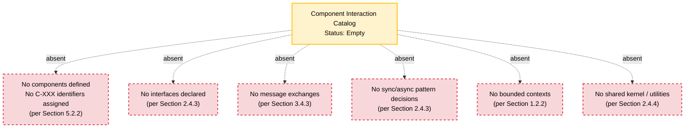

### 5.3.3 Required Diagram — State Transition Diagram (Empty State)

The requested state transition diagram cannot be populated because no domain entities, lifecycle states, or transition events are documented. This finding is consistent with Section 4.4.1 (State Management Status) and is re-rendered here under the architectural lens.

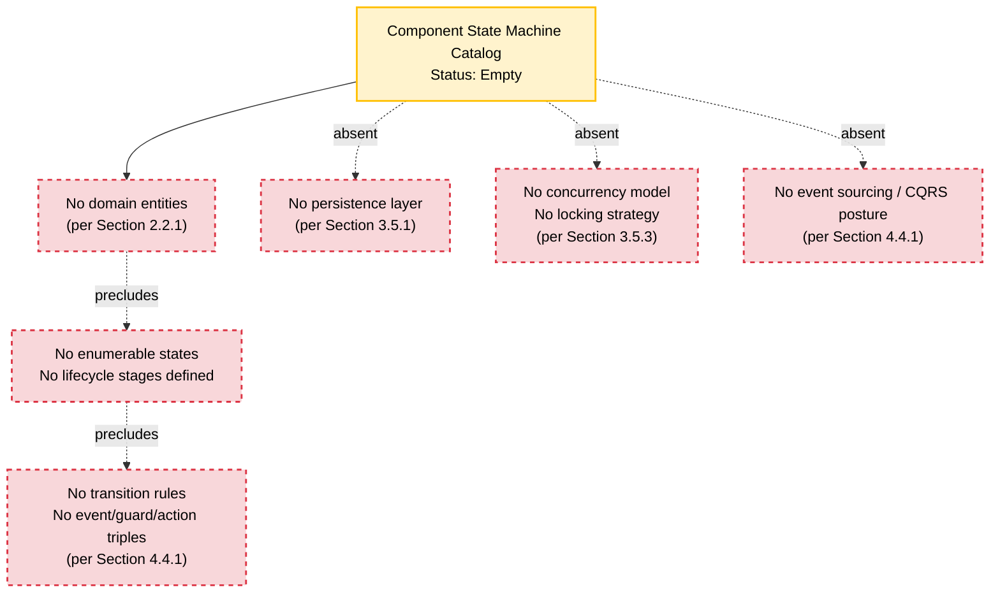

### 5.3.4 Required Diagram — Sequence Diagram for Key Flows (Empty State)

The requested sequence diagram cannot be populated because no participating actors, systems, message exchanges, API contracts, or event payloads are documented. Per Mermaid conventions, sequence diagrams require at minimum two participants and one message exchange; neither is derivable. The empty-state visualization below depicts this absence using a flowchart representation consistent with the pattern established in Section 4.5.4.

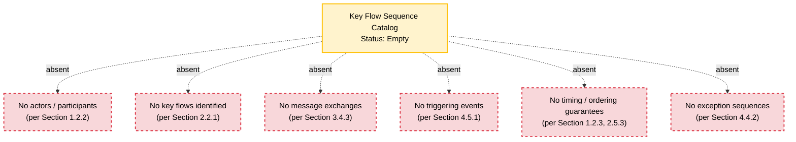

---

## 5.4 TECHNICAL DECISIONS

### 5.4.1 Architecture Decision Record (ADR) Status

**No architecture decisions have been ratified.** Per Section 2.5.1 (Implementation Status), no implementation considerations are documented; per Section 3.7.2, the absence of source files, package manifests, build/container definitions, configuration files, infrastructure-as-code, and CI/CD definitions precludes derivation of any technology or architecture decision. The following ADR register is reserved and not yet allocated.

#### Architecture Decision Record (ADR) Placeholder Schema

| ADR ID | Decision Topic | Status | Authoritative Source |
|--------|----------------|--------|----------------------|
| Not specified | Not specified | Pending (pre-implementation) | Solution Architect |

#### Decision Topic Reservation

The following decision topics are reserved for future ADR authoring once Sections 2, 3, and 4 are populated:

- **ADR Topic 1** — Architecture style selection (monolith vs. layered vs. microservices vs. serverless vs. event-driven)
- **ADR Topic 2** — Communication pattern selection (synchronous REST/gRPC vs. asynchronous messaging vs. event streaming)
- **ADR Topic 3** — Data storage solution selection (relational vs. document vs. key-value vs. graph vs. polyglot persistence)
- **ADR Topic 4** — Caching strategy selection (none vs. in-process vs. distributed vs. CDN-edge)
- **ADR Topic 5** — Authentication and authorization mechanism (session vs. JWT vs. OAuth2/OIDC vs. mTLS)
- **ADR Topic 6** — Observability stack selection (logs / metrics / traces tooling)
- **ADR Topic 7** — Deployment topology and orchestration (VM vs. container vs. serverless)
- **ADR Topic 8** — Disaster recovery posture (RPO / RTO targets, multi-region strategy)

### 5.4.2 Architecture Style Decisions and Tradeoffs

**No architecture style decision has been recorded.** The tradeoff analysis between candidate styles (e.g., development velocity vs. operational complexity; deployment independence vs. inter-service consistency; vertical scaling simplicity vs. horizontal scaling elasticity) is reserved for the Solution Architect.

| Candidate Style | Indicative Tradeoff Axis | Status |
|-----------------|--------------------------|--------|
| Not specified | Not specified | Pending Solution Architect ratification |

### 5.4.3 Communication Pattern Choices

**No communication pattern choices are documented.** Per Section 2.4.3, no message broker / event bus topology is documented; per Section 3.4.3, no API contracts or interface specifications exist; per Section 4.5.4, no integration sequences are derivable. The selection between synchronous request/response, asynchronous messaging, event streaming, or hybrid patterns is reserved.

| Communication Pattern | Application Scenario | Status |
|-----------------------|----------------------|--------|
| Not specified | Not specified | Pending Solution Architect ratification |

### 5.4.4 Data Storage Solution Rationale

**No data storage solution has been selected.** Per Section 3.5.1, no database, persistence layer, schema definition, or storage configuration is present. Per Section 3.5.3, no transactional consistency model is documented. The Default Stack forward-looking candidate established in Section 3.5.6 is **MongoDB** (with **AWS S3** as a likely object-storage companion if AWS is ratified as the cloud platform per Section 3.4.7); both candidates are **non-evidentiary** and carry "Validation Required: Yes" status pending Solution Architect / Development Team ratification.

| Storage Candidate | Proposed Role | Evidence Status | Validation Required |
|-------------------|---------------|------------------|----------------------|
| MongoDB | Forward-looking primary database candidate (per Section 3.5.6) | Non-evidentiary | Yes — Solution Architect / Development Team |
| AWS S3 | Forward-looking object storage candidate (contingent on AWS ratification per Section 3.4.7) | Non-evidentiary | Yes — Solution Architect |

These candidates are provided as forward-looking guidance and are explicitly non-evidentiary. They are subject to ratification or replacement by the Solution Architect.

### 5.4.5 Caching Strategy Justification

**No caching strategy is documented.** Per Section 3.5.4 (Caching Strategy Status) and Section 4.4.1, no caching layer, eviction policy, consistency model (write-through, write-back, write-around), or invalidation strategy is defined. Justification for any caching approach is reserved for the Solution Architect once persistence and performance characteristics are ratified.

| Caching Dimension | Status |
|-------------------|--------|
| Cache Topology (in-process / distributed / CDN-edge) | Not specified |
| Eviction Policy (LRU / LFU / TTL / Manual) | Not specified |
| Consistency Model | Not specified |
| Invalidation Strategy | Not specified |

### 5.4.6 Security Mechanism Selection

**No security mechanism is documented.** Per Section 2.5.4 (Security Implications Status), no authentication / authorization model and no regulatory compliance scope are specified; per Section 3.4.4 (Authentication Service Status), no authentication or identity-provider integration is present. The Default Stack forward-looking candidate established in Section 3.4.7 is **Auth0**; this candidate is **non-evidentiary** and carries "Validation Required: Yes" status pending Solution Architect / Security Lead ratification. Per Section 3.7.3, representative Auth0 security considerations include tenant isolation model, token lifetime policy, MFA enforcement, social identity provider scope, and audit log retention — none of which can be authoritatively addressed at this time.

| Security Candidate | Proposed Role | Evidence Status | Validation Required |
|--------------------|---------------|------------------|----------------------|
| Auth0 | Forward-looking authentication / authorization candidate (per Section 3.4.7) | Non-evidentiary | Yes — Solution Architect / Security Lead |

### 5.4.7 Required Diagram — Architecture Decision Tree (Empty State)

The requested decision tree diagram cannot be populated because no decision points, candidate options, or selection criteria have been documented. The empty-state visualization below depicts this absence following the subgraph convention established in Sections 3.7.1 and 4.5.6.

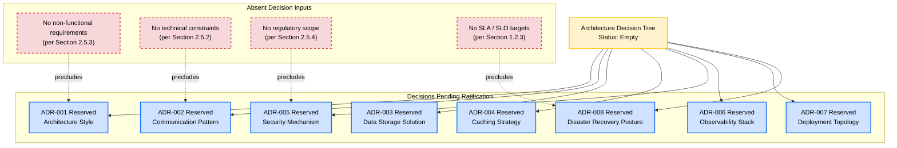

### 5.4.8 Architecture Decision Record (ADR) Template

The following ADR template is reserved for future use. It follows the canonical ADR format (Context → Decision → Status → Consequences) and is not yet populated.

| Field | Reserved Content |
|-------|------------------|
| ADR Identifier | `ADR-XXX` (zero-padded sequential) |
| Title | Not specified |
| Status | Proposed / Accepted / Deprecated / Superseded — Not specified |
| Context | Not specified — to be populated with non-functional drivers, constraints, and forces |
| Decision | Not specified — to be populated with the chosen alternative |
| Consequences | Not specified — to be populated with positive, negative, and neutral outcomes |
| Authoritative Source | Solution Architect (with cross-functional sign-off as applicable) |

---

## 5.5 CROSS-CUTTING CONCERNS

### 5.5.1 Monitoring and Observability Approach

**No monitoring or observability approach is documented.** Per Section 3.4.5 (Monitoring and Observability Service Status), no monitoring, logging, tracing, or alerting service integration is documented. Per Section 2.5.5 (Maintenance Requirements Status), no observability or monitoring expectations are specified.

| Observability Dimension | Repository Evidence | Cross-Reference |
|-------------------------|---------------------|-----------------|
| Metrics Collection (RED / USE methodologies) | None documented | Section 3.4.5 |
| Distributed Tracing | None documented | Section 3.4.5 |
| Application Performance Monitoring (APM) | None documented | Section 2.5.5 |
| Synthetic / Real-User Monitoring | None documented | Section 2.5.5 |
| Alerting and Paging Topology | None documented | Section 3.4.5 |

The monitoring and observability approach is reserved for the **SRE / Operations Lead**.

### 5.5.2 Logging and Tracing Strategy

**No logging or tracing strategy is documented.** Per Section 3.4.5, no telemetry sinks are documented; per Section 4.4.2 (Error Handling Status), no logging and tracing posture is documented.

| Telemetry Dimension | Repository Evidence | Cross-Reference |
|---------------------|---------------------|-----------------|
| Structured Logging Schema | None documented | Section 4.4.2 |
| Log Aggregation Sink | None documented | Section 3.4.5 |
| Log Retention Policy | None documented | Section 2.5.5 |
| Trace Propagation Standard (W3C, B3) | None documented | Section 3.4.5 |
| Sampling Strategy | None documented | Section 3.4.5 |
| Correlation Identifier Convention | None documented | Section 4.4.2 |

The logging and tracing strategy is reserved for the **SRE / Operations Lead**.

### 5.5.3 Error Handling Patterns

**No error handling patterns are documented.** Per Section 4.4.2 (Error Handling Status), no exception taxonomy, retry mechanism, fallback process, error notification flow, recovery procedure, circuit-breaker pattern, or dead-letter queue strategy exists. This finding is foundational to Section 5.5.3 and is re-stated here for completeness.

| Error Handling Dimension | Repository Evidence | Cross-Reference |
|--------------------------|---------------------|-----------------|
| Exception Taxonomy | None documented | Section 4.4.2 |
| Retry Mechanism (backoff, jitter, max attempts) | None documented | Section 4.4.2 |
| Fallback Strategy (degraded-mode behavior) | None documented | Section 4.4.2 |
| Circuit-Breaker Pattern | None documented | Section 4.4.2 |
| Dead-Letter Queue Strategy | None documented | Section 4.4.2 |
| Error Notification Channels | None documented | Section 3.4.5 |
| Recovery Procedures and Runbooks | None documented | Section 2.5.5 |

The error handling pattern catalog is reserved for the **Development Team** and the **SRE Lead**.

#### Required Diagram — Error Handling Flow (Empty State)

This subsection re-renders the empty-state error handling flowchart established in Section 4.5.3, recontextualized as a cross-cutting concern in the architecture.

```mermaid
graph TD
    ErrorFlow["Error Handling Flow<br/>Status: Empty"]
    NoTaxonomy["No Error Taxonomy<br/>(per Section 4.4.2)"]
    NoRetry["No Retry Mechanism<br/>No backoff/jitter policy"]
    NoFallback["No Fallback Processes<br/>(per Section 2.5.1, 4.4.2)"]
    NoNotify["No Error Notification Flow<br/>(per Section 3.4.5)"]
    NoRecovery["No Recovery Procedure<br/>(per Section 2.5.5)"]
    NoCircuit["No Circuit-Breaker Pattern<br/>(per Section 2.4.3)"]
    NoDLQ["No Dead-Letter Queue<br/>(per Section 2.4.3)"]
    NoTracing["No Distributed Tracing<br/>(per Section 5.5.2)"]

    ErrorFlow -.absent.-> NoTaxonomy
    ErrorFlow -.absent.-> NoRetry
    ErrorFlow -.absent.-> NoFallback
    ErrorFlow -.absent.-> NoNotify
    ErrorFlow -.absent.-> NoRecovery
    ErrorFlow -.absent.-> NoCircuit
    ErrorFlow -.absent.-> NoDLQ
    ErrorFlow -.absent.-> NoTracing

    classDef root fill:#fff3cd,stroke:#ffc107,stroke-width:2px,color:#000
    classDef absent fill:#f8d7da,stroke:#dc3545,stroke-width:2px,stroke-dasharray: 5 5,color:#000

    class ErrorFlow root
    class NoTaxonomy,NoRetry,NoFallback,NoNotify,NoRecovery,NoCircuit,NoDLQ,NoTracing absent
```

### 5.5.4 Authentication and Authorization Framework

**No authentication or authorization framework is documented.** Per Section 2.5.4 (Security Implications Status), no authentication / authorization model is specified. Per Section 3.4.4 (Authentication Service Status), no authentication or identity-provider integration is present. Per Section 4.3.2 (per Section 4.8.4 cross-reference), no authorization checkpoints or access-control logic are defined.

The Default Stack forward-looking candidate (per Section 3.4.7) is **Auth0**. Per Section 5.4.6, this candidate is non-evidentiary and validation-required.

| AuthN / AuthZ Dimension | Repository Evidence | Cross-Reference |
|-------------------------|---------------------|-----------------|
| Identity Provider Integration | None documented | Section 3.4.4 |
| Token Format and Lifetime (JWT / opaque / session) | None documented | Section 2.5.4 |
| Multi-Factor Authentication (MFA) Posture | None documented | Section 3.7.3 |
| Authorization Model (RBAC / ABAC / ReBAC) | None documented | Section 2.5.4 |
| Authorization Checkpoint Catalog | None documented | Section 4.4.2 cross-references |
| Audit Log Retention | None documented | Section 3.7.3 |

The authentication and authorization framework selection is reserved for the **Solution Architect** and the **Security Lead**.

### 5.5.5 Performance Requirements and SLAs

**No performance requirements or SLAs are documented.** Per Section 1.2.3 (Success Criteria), no KPIs, SLAs, or SLOs are specified; per Section 2.5.3 (Performance and Scalability Considerations), no throughput, latency, or concurrency targets are documented.

| Performance Dimension | Repository Evidence | Cross-Reference |
|------------------------|---------------------|-----------------|
| Latency Budget (p50 / p95 / p99) | None documented | Section 1.2.3, 2.5.3 |
| Throughput Targets (requests per second, events per second) | None documented | Section 2.5.3 |
| Concurrency Targets | None documented | Section 2.5.3 |
| Availability Target (e.g., 99.9%) | None documented | Section 1.2.3 |
| Capacity Plan (peak vs. steady-state) | None documented | Section 2.5.3 |
| Workload Class (real-time / near-real-time / batch / best-effort) | None documented | Section 1.2.3, 2.5.3 |

The performance requirements and SLA specification is reserved for the **Solution Architect** and the **SRE Lead**.

### 5.5.6 Disaster Recovery Procedures

**No disaster recovery (DR) procedures are documented.** Per Section 2.5.5 (Maintenance Requirements Status), "Backup and Disaster Recovery Expectations: Not specified." Per Section 3.5.3, no backup cadence, replication topology, or partitioning strategy is defined.

| Disaster Recovery Dimension | Repository Evidence | Cross-Reference |
|------------------------------|---------------------|-----------------|
| Recovery Point Objective (RPO) | None documented | Section 2.5.5 |
| Recovery Time Objective (RTO) | None documented | Section 2.5.5 |
| Backup Cadence and Retention | None documented | Section 3.5.3 |
| Multi-Region / Multi-AZ Topology | None documented | Section 3.4.7 |
| Failover Strategy (active-active / active-passive / cold standby) | None documented | Section 2.5.5 |
| Runbooks and Operational Procedures | None documented | Section 2.5.5 |

The disaster recovery procedure catalog is reserved for the **SRE / Operations Lead**.

---

## 5.6 CROSS-SECTION CONSISTENCY VERIFICATION

The absence findings reported throughout Section 5 are consistent with — and traceable to — previously authored sections of this Technical Specification, mirroring the cross-reference verification pattern established in Section 3.7.2 and Section 4.6.

| Section 5 Subsection | Cross-Referenced Section | Established Finding |
|----------------------|--------------------------|---------------------|
| 5.2.1 Architecture Style | Section 1.2.2 (Core Technical Approach) | No technology stack indicators present |
| 5.2.1 Architectural Principles | Section 2.5.1 (Implementation Status) | No implementation considerations documented |
| 5.2.1 System Boundaries | Section 1.3.1 (In-Scope Elements) | No system boundaries documented |
| 5.2.1 Major Interfaces | Section 1.2.1 (Project Context) | No integration touchpoints documented |
| 5.2.2 Core Components | Section 1.2.2 (Major System Components) | No architectural components defined |
| 5.2.2 Component Dependencies | Section 2.4 (Feature Relationships) | No feature relationships derivable |
| 5.2.3 Data Flows | Section 1.2.2 (Primary System Capabilities) | No background/async processing documented |
| 5.2.3 Integration Patterns | Section 2.4.3 (Integration Points Status) | No internal/external integrations |
| 5.2.3 Data Transformation | Section 2.5.1 (Implementation Status) | No implementation considerations |
| 5.2.3 Data Stores and Caches | Section 3.5.1, Section 3.5.4 | No persistence layer; no caching strategy |
| 5.2.4 External Integrations | Section 3.4.1 (Third-Party Services Evidence) | No external services documented |
| 5.2.4 SLA Requirements | Section 1.2.3 (Success Criteria) | No KPIs, SLAs, SLOs documented |
| 5.3.1 Component Persistence | Section 3.5.3 (Data Persistence Strategy Status) | No consistency model |
| 5.3.1 Component Scaling | Section 2.5.3 (Performance and Scalability) | No throughput / latency targets |
| 5.4.3 Communication Patterns | Section 2.4.3 (Integration Points Status) | No message broker / event bus |
| 5.4.4 Storage Rationale | Section 3.5.6 (Default Stack — MongoDB candidate) | Forward-looking; non-evidentiary |
| 5.4.5 Caching Strategy | Section 3.5.4 (Caching Strategy Status) | No caching strategy documented |
| 5.4.6 Security Mechanism | Section 2.5.4, Section 3.4.4 | No auth model; Auth0 forward-looking candidate |
| 5.5.1 Monitoring & Observability | Section 2.5.5, Section 3.4.5 | No observability/monitoring documented |
| 5.5.2 Logging & Tracing | Section 3.4.5 | No telemetry sinks documented |
| 5.5.3 Error Handling | Section 4.4.2 (Error Handling Status) | No error handling model documented |
| 5.5.4 AuthN / AuthZ Framework | Section 3.4.4, Section 2.5.4 | No identity provider integration |
| 5.5.5 Performance & SLAs | Section 1.2.3, Section 2.5.3 | No KPIs / SLAs / SLOs |
| 5.5.6 Disaster Recovery | Section 2.5.5 (Maintenance Requirements) | "Backup and Disaster Recovery Expectations: Not specified" |
| 5.3.3 State Transitions | Section 4.4.1 (State Management Status) | No state machine; no entities |
| 5.3.2 Component Interactions | Section 4.5 (Required Diagrams) | All flow diagrams rendered as empty-state |
| 5.4.1 ADR Register | Section 2.5.1 (Implementation Status) | No implementation considerations |

---

## 5.7 PATH FORWARD FOR SYSTEM ARCHITECTURE DEFINITION

### 5.7.1 Required Inputs and Authoritative Sources

To populate this System Architecture section authoritatively in subsequent revisions, the following inputs are required. This subsection mirrors the pattern established in Sections 2.7.1, 3.8.1, and 4.7.1.

| Required Input | Authoritative Source | Section 5 Subsection Populated |
|----------------|----------------------|---------------------------------|
| Architecture style ratification | Solution Architect | 5.2.1, 5.4.2 |
| Major component identification and boundaries | Solution Architect | 5.2.2, 5.3.1 |
| Component responsibilities and interfaces | Solution Architect / Development Team | 5.3.1 |
| Data flow design | Solution Architect / Integration Lead | 5.2.3 |
| External integration catalog | Integration Lead / Solution Architect | 5.2.4 |
| Communication pattern selection | Solution Architect | 5.4.3 |
| Data storage solution ratification | Solution Architect / Development Team | 5.4.4 |
| Caching strategy selection | Solution Architect | 5.4.5 |
| Security mechanism (AuthN/AuthZ) selection | Solution Architect / Security Lead | 5.4.6, 5.5.4 |
| Monitoring and observability approach | SRE / Operations Lead | 5.5.1 |
| Logging and tracing strategy | SRE / Operations Lead | 5.5.2 |
| Error handling patterns | Development Team / SRE Lead | 5.5.3 |
| Performance requirements and SLAs | Solution Architect / SRE Lead | 5.5.5 |
| Disaster recovery procedures | SRE / Operations Lead | 5.5.6 |
| Architecture Decision Records | Solution Architect (with cross-functional sign-off) | 5.4.1, 5.4.7, 5.4.8 |

### 5.7.2 System Architecture Definition Sequence

Per the specification evolution pattern established in Sections 2.7.2, 3.8.2, and 4.7.2, the following phased sequence is recommended for populating Section 5 once authoritative inputs become available.

#### Phase 1: Architecture Style Ratification

The Solution Architect ratifies the architecture style (monolithic, layered, microservices, event-driven, serverless, hexagonal, or hybrid) using non-functional requirements, technical constraints (Section 2.5.2), and operational maturity targets as decision drivers. This phase produces `ADR-001` and enables evidence-derived population of Section 5.2.1 (System Overview) and Section 5.4.2 (Architecture Style Decisions and Tradeoffs).

#### Phase 2: Component Boundary Definition

The Solution Architect, in coordination with the Development Team, identifies major components, assigns `C-XXX` identifiers, and defines bounded contexts, responsibilities, ownership, and interfaces. This phase enables evidence-derived population of Sections 5.2.2 and 5.3.1.

#### Phase 3: Data Flow and Persistence Modeling

The Solution Architect, in coordination with the Development Team and Integration Lead, defines primary data flows, transformation points, persistence boundaries, transaction semantics, and consistency models. Data store selections are aligned with Section 3.5 ratifications. This phase enables evidence-derived population of Sections 5.2.3 and 5.4.4 and produces `ADR-003`.

#### Phase 4: External Integration Catalog Definition

The Integration Lead and Solution Architect compile the catalog of external integration points, assigning `INT-XXX` identifiers, declaring integration types (synchronous API, asynchronous event, file transfer, replication), protocols/formats (REST/JSON, gRPC/Protobuf, GraphQL, AsyncAPI/JSON, SFTP/CSV), data exchange patterns, and SLA commitments. This phase enables evidence-derived population of Section 5.2.4 and produces `ADR-002`.

#### Phase 5: Cross-Cutting Concerns Codification

The SRE Lead, Security Lead, and Solution Architect codify cross-cutting concerns: monitoring/observability stack, logging/tracing strategy, error handling patterns (retry, fallback, circuit-breaker, DLQ), authentication/authorization framework, performance SLAs/SLOs, and disaster recovery procedures (RPO/RTO, failover topology). This phase produces `ADR-004` through `ADR-008` and enables evidence-derived population of Section 5.5.

#### Phase 6: Architecture Decision Record (ADR) Authoring

The Solution Architect authors and stewards the formal ADR register per the template in Section 5.4.8, ensuring each accepted decision has documented context, alternatives considered, consequences, and traceability to the populating authoritative source. This phase enables evidence-derived population of Section 5.4.1, supersedes the placeholder ADR schema, and replaces the empty-state decision tree in Section 5.4.7 with a content-bearing decision tree.

### 5.7.3 Assumptions and Constraints

The following assumptions and constraints govern Section 5's current state, consistent with the pattern established in Sections 2.7.3, 3.8.3, and 4.7.3.

| Assumption / Constraint | Description |
|-------------------------|-------------|
| Repository State Assumption | The repository is assumed to be in a pre-implementation state per Section 1.1, not a partially synchronized or obscured state. |
| Evidence Boundary Constraint | Section 5 is constrained to evidence observable in the repository at authoring time; no external knowledge of domain architecture, component topologies, or integration patterns is incorporated. |
| Schema Forward-Compatibility Assumption | The placeholder schemas (Core Components, External Integrations, Component Specifications, ADR Register) assume the structural schemas requested by the section prompt remain applicable to Artifact10's eventual architecture. |
| Identifier Convention Reservation | The `C-XXX`, `ADR-XXX`, and `INT-XXX` identifier conventions are reserved but not yet allocated; first allocations should begin at `C-001`, `ADR-001`, and `INT-001` respectively, and be cross-referenced to `F-XXX` (Feature IDs, Section 2.7.2) and `WF-XXX` (Workflow IDs, Section 4.7.3) as those are assigned. |
| Dependency on Upstream Section Population | Section 5 cannot be authoritatively populated until Sections 2 (Product Requirements), 3 (Technology Stack), and 4 (Process Flowchart) are populated. |
| Default Stack Non-Endorsement | The Default Stack forward-looking candidates (Flask, React, TailwindCSS, React-Native, Langchain, ElectronJS, MongoDB, AWS, Auth0, Docker, Terraform, GitHub Actions) referenced from Section 3 are explicitly non-evidentiary and require Solution Architect ratification. |
| Diagram Empty-State Discipline | All Mermaid diagrams in Section 5 are rendered as empty-state visualizations and do not represent fabricated components, interactions, state machines, sequences, or decision trees. Any future replacement of these diagrams with content-bearing diagrams must be traceable to the authoritative input sources designated in Section 5.7.1. |
| Four-Column Table Maximum | Where the section prompt requested tables exceeding four columns (Core Components: 5 columns; External Integration Points: 5 columns), tables have been split into related sub-tables joined by Component ID or Integration ID to comply with the documentation formatting standard. |

### 5.7.4 Version Tracking Reservation

A system architecture version tracking table is reserved for future use to record amendments as components, decisions, integrations, and cross-cutting concerns are introduced. This mirrors the version tracking pattern established in Sections 2.7.4, 3.8.4, and 4.7.4.

| Version | Date | Subsection Amended | Change Summary |
|---------|------|---------------------|----------------|
| Not specified | Not specified | Not specified | Initial empty-state authoring; placeholder schemas, ADR template, and empty-state Mermaid diagrams established |

Subsequent revisions are expected to record, at minimum: architecture style ratification, component boundary definition, data flow modeling, external integration catalog, communication pattern selection, data storage ratification, caching strategy selection, security mechanism selection, monitoring/observability codification, logging/tracing codification, error handling pattern catalog, AuthN/AuthZ framework definition, performance SLA specification, disaster recovery procedure specification, and ADR authoring.

---

## 5.8 REFERENCES

### 5.8.1 Files Examined

- `README.md` — The repository's sole file (12 bytes). Contains only the H1 Markdown heading `# Artifact10`. Confirmed via direct read that no architectural component definitions, service boundaries, communication contracts, data flow specifications, integration touchpoints, state machine descriptions, error handling models, observability configurations, security framework references, performance commitments, or disaster recovery procedures exist in the content. Serves as the sole evidentiary basis for all absence findings in Section 5.

### 5.8.2 Folders Explored

- `/` (repository root, depth 0) — Contains exactly one child file (`README.md`) and zero project subdirectories. The absence of any folder hierarchy commonly associated with architectural artifacts (e.g., `architecture/`, `adr/`, `decisions/`, `diagrams/`, `components/`, `services/`, `api/`, `interfaces/`, `contracts/`, `events/`, `schemas/`, `infrastructure/`, `terraform/`, `helm/`, `k8s/`, `docs/`, `runbooks/`, `observability/`) is a property of the repository itself and confirms the unavailability of architecture-defining artifacts.

### 5.8.3 Search Activities Performed

| Search Activity | Outcome |
|-----------------|---------|
| Root folder enumeration for architectural artifacts | Only `README.md` identified |
| Semantic search: "architecture components services modules system design" | No results |
| Semantic search: "component diagram interaction sequence flow" | No results |
| Semantic search: "configuration build deployment infrastructure" | No results |
| Semantic search: "microservice API gateway authentication observability" | No results |
| Semantic search: "database schema entity model" | No results |
| Folder search: "source code application infrastructure deployment" | No results |
| Folder search: "backend frontend mobile desktop services" | No results |
| File-name scan for `*.bpmn`, `*.drawio`, `*.puml`, `*.mmd`, `*.dot`, `*.c4`, `*.adr`, `*.md` (other than README) | No matches |
| Directory scan for `architecture/`, `adr/`, `decisions/`, `components/`, `services/`, `api/`, `contracts/`, `events/`, `schemas/`, `infrastructure/`, `runbooks/` | No matches |
| `.blitzyignore` presence check | None found; no path restrictions in effect |

### 5.8.4 Technical Specification Cross-References

| Referenced Section | Relevance to Section 5 |
|--------------------|------------------------|
| Section 1.1 (Executive Summary) | Establishes Artifact10 identifier and pre-implementation state; foundational to all Section 5 absence findings |
| Section 1.2.1 (Project Context) | Establishes absence of integration touchpoints; foundational to Sections 5.2.1, 5.2.4 |
| Section 1.2.2 (High-Level Description) | Establishes absence of system capabilities, components, and technical approach; foundational to Sections 5.2.1, 5.2.2, 5.2.3; provides the Repository Structure Visualization Mermaid pattern adopted in Section 5 |
| Section 1.2.3 (Success Criteria) | Establishes absence of KPIs, SLAs, SLOs; foundational to Sections 5.2.4, 5.5.5 |
| Section 1.3.1 (In-Scope Elements) | Establishes absence of system boundaries; foundational to Section 5.2.1 |
| Section 1.4 (Documentation Integrity Statement) | Mandates the evidence-based authoring discipline applied throughout Section 5 |
| Section 2.1 (Section Authoring Methodology) | Establishes the schema-preservation and placeholder approach adopted by Sections 5.2.2, 5.2.4, 5.3.1, 5.4.1 |
| Section 2.2.1 (Feature Enumeration Status) | Establishes zero features documented; foundational to Sections 5.3.3, 5.3.4 |
| Section 2.4.2 (Dependency Map) | Provides the empty-state Mermaid pattern adopted in Section 5; introduces the `precludes` edge-label semantic |
| Section 2.4.3 (Integration Points Status) | Establishes absence of integrations and communication topology; foundational to Sections 5.2.3, 5.2.4, 5.4.3 |
| Section 2.4.4 (Shared Components and Common Services Status) | Establishes absence of shared components; foundational to Section 5.2.2 |
| Section 2.5.1 (Implementation Status) | Establishes absence of implementation considerations; foundational to Sections 5.2.1, 5.3, 5.4.1 |
| Section 2.5.2 (Technical Constraints Status) | Establishes absence of language, framework, platform constraints; foundational to Sections 5.3.1, 5.4 |
| Section 2.5.3 (Performance and Scalability Considerations) | Establishes absence of performance targets; foundational to Sections 5.3.1, 5.5.5 |
| Section 2.5.4 (Security Implications Status) | Establishes absence of AuthN/AuthZ model; foundational to Sections 5.4.6, 5.5.4 |
| Section 2.5.5 (Maintenance Requirements Status) | Establishes absence of observability and DR expectations; foundational to Sections 5.5.1, 5.5.6 |
| Section 2.7 (Path Forward for Requirements Definition) | Provides the template for Section 5.7's path forward subsection |
| Section 3.1.4 (Default Stack — Language Candidates) | Provides non-evidentiary language candidates referenced by Section 5 |
| Section 3.2.6 (Default Stack — Framework Candidates) | Provides non-evidentiary framework candidates (Flask, React, TailwindCSS, React-Native, Langchain, ElectronJS) |
| Section 3.4.1 (Third-Party Services Evidence) | Establishes absence of external services; foundational to Section 5.2.4 |
| Section 3.4.3 (External API Integration Status) | Establishes absence of API contracts; foundational to Sections 5.2.3, 5.3.4 |
| Section 3.4.4 (Authentication Service Status) | Establishes absence of identity-provider integration; foundational to Sections 5.4.6, 5.5.4 |
| Section 3.4.5 (Monitoring and Observability Service Status) | Establishes absence of telemetry sinks; foundational to Sections 5.5.1, 5.5.2 |
| Section 3.4.7 (Default Stack — Service Candidates) | Provides non-evidentiary service candidates (AWS, Auth0) referenced by Sections 5.4.4, 5.4.6 |
| Section 3.5.1 (Databases & Storage Evidence) | Establishes absence of persistence layer; foundational to Sections 5.2.3, 5.4.4 |
| Section 3.5.3 (Data Persistence Strategy Status) | Establishes absence of consistency model; foundational to Sections 5.4.4, 5.5.6 |
| Section 3.5.4 (Caching Strategy Status) | Establishes absence of caching strategy; foundational to Section 5.4.5 |
| Section 3.5.6 (Default Stack — Storage Candidate) | Provides non-evidentiary MongoDB candidate referenced by Section 5.4.4 |
| Section 3.6.7 (Default Stack — Tooling Candidates) | Provides non-evidentiary Docker / Terraform / GitHub Actions candidates |
| Section 3.7.1 (Technology Stack Status Visualization) | Provides the sophisticated subgraph-based Mermaid visualization pattern adopted in Section 5.2.5; introduces `precludes` / `will populate` dual-edge semantic and `decision` / `absent` / `pending` class definitions |
| Section 3.7.2 (Cross-Section Consistency Verification) | Provides the cross-reference table pattern adopted in Section 5.6 |
| Section 3.7.3 (Security Implications of Forward-Looking Candidates) | Establishes security considerations for Auth0, MongoDB, AWS candidates referenced by Sections 5.4.6, 5.5.4 |
| Section 3.8 (Path Forward for Technology Stack Definition) | Provides the phased evolution sequence template adopted in Section 5.7.2 |
| Section 4.4.1 (State Management Status) | Establishes absence of state machine; foundational to Section 5.3.3 |
| Section 4.4.2 (Error Handling Status) | Establishes absence of error handling model; foundational to Section 5.5.3 |
| Section 4.5 (Required Diagrams — Empty-State Visualizations) | Provides the empty-state Mermaid diagram templates re-rendered in Sections 5.3.2, 5.3.3, 5.3.4, 5.5.3 |
| Section 4.5.6 (Consolidated Process Flow Status Visualization) | Provides the consolidated subgraph visualization pattern adopted in Section 5.2.5 |
| Section 4.7 (Path Forward for Process Flowchart Definition) | Provides the path forward template adopted in Section 5.7 |
| Section 4.8 (References) | Provides the detailed References subsection template adopted in Section 5.8 |

### 5.8.5 Coverage Confidence

**100% of repository contents examined for architecture-relevant artifacts.** The repository's minimal size (one file, 12 bytes) enabled exhaustive review through multiple independent verification methods. No architectural component definitions, service boundary descriptions, interface contracts, data flow specifications, integration touchpoints, state machine descriptions, error handling models, observability configurations, security framework references, performance commitments, or disaster recovery procedures exist from which a system architecture could be derived. The single `README.md` file's content (`# Artifact10`) was directly read and contains no semantic content beyond the repository name itself.

Per Section 1.4.2 (Specification Evolution), Section 5 is expected to be revised when authoritative inputs (per Section 5.7.1) are supplied or when the repository is augmented with architecture-bearing artifacts — including but not limited to: architecture decision records (ADRs), C4 model diagrams, component-and-connector views, service contracts (OpenAPI, gRPC, GraphQL, AsyncAPI), schema definitions, infrastructure-as-code (Terraform, Helm, Kubernetes manifests), CI/CD pipeline definitions, observability configurations, security policy documents, runbooks, or operational architecture documentation.

---

# 6. SYSTEM COMPONENTS DESIGN

## 6.1 Core Services Architecture

### 6.1.1 Applicability and Authoring Methodology

#### Applicability Determination

The section prompt offers two authoring paths: declaring Core Services Architecture **not applicable** when the system does not require microservices, distributed architecture, or distinct service components; or addressing the full set of service-component, scalability, and resilience dimensions when it does. Selecting between these paths requires a ratified architecture style decision.

Per Section 5.2.1 (System Overview), **no architecture style is documented in the Artifact10 repository.** Architecture styles — monolithic, layered, microservices, event-driven, service-oriented, serverless, hexagonal, or pipe-and-filter — are evidenced by the topology of source code, deployment artifacts, communication contracts, and infrastructure definitions, none of which exist in the repository. Per Section 5.4 (Technical Decisions), the architecture-style decision is reserved as `ADR-001` and is the prerequisite to determining whether a Core Services Architecture is required.

Consequently, this section adopts the following position:

> **Applicability of Core Services Architecture is undetermined at authoring time and is reserved pending Solution Architect ratification of `ADR-001` (Architecture Style Selection).** A determination of "not applicable" cannot be made on evidentiary grounds because the repository contains no evidence that excludes a microservices, distributed, or service-oriented architecture from future selection. A determination of "applicable" cannot be made on evidentiary grounds because the repository contains no service definitions, deployment manifests, communication contracts, or scaling configurations. This section therefore preserves the structural schema requested by the prompt and renders each dimension as an empty-state placeholder traceable to its source-section absence finding, consistent with the discipline established throughout Section 5.

#### Authoring Discipline

This section inherits the evidence-based discipline established by Section 1.4 (Documentation Integrity Statement) and reaffirmed in Section 5.1.1. Per Section 5.1.1, the Artifact10 repository is in a **pre-implementation state** containing a single file (`README.md`, 12 bytes) whose entire substantive content is the H1 Markdown heading `# Artifact10`. Per Section 1.2.2, no source files, package manifests, build definitions, configuration files, infrastructure-as-code, or CI/CD definitions are present. Per Section 5.2.2, no architectural components, modules, services, layers, or bounded contexts are defined.

This section therefore performs four operations consistent with the methodology of Section 5.1.1:

1. Transparently reports the absence of each service-architecture dimension requested by the section prompt and traces that absence to its established source section.
2. Preserves the structural schemas requested by the section prompt with `Not specified` markers so that future revisions may populate them in place.
3. Re-states the Default Stack forward-looking candidates (per Section 5.7.3) as **non-evidentiary** inputs subject to Solution Architect ratification.
4. Establishes a Path Forward (authoritative input sources, phased sequence, assumptions and constraints) following the pattern of Section 5.7.

#### Identifier Convention Inheritance

This section does not introduce new identifier conventions. It inherits and references the reservations established by Section 5.1.2:

| Identifier Convention | Domain | First Allocation Status |
|----------------------|--------|--------------------------|
| `C-XXX` | Architectural / Service Components | Reserved; first allocation `C-001` |
| `ADR-XXX` | Architecture Decision Records | Reserved; first allocation `ADR-001` |
| `INT-XXX` | External Integration Points | Reserved; first allocation `INT-001` |

The introduction of a service-component identifier convention distinct from `C-XXX` is itself reserved for the Solution Architect, contingent on whether `ADR-001` ratifies a service-oriented or microservices style that would justify a dedicated `SVC-XXX` namespace.

#### Mermaid Visualization Inheritance

All Mermaid diagrams in this section adopt the class definitions and edge-label conventions established in Section 5.1.3:

- `decision` (blue) — elements reserved for future ratification
- `absent` (red dashed) — unpopulated architectural dimensions
- `pending` (yellow) — forward-looking input sources
- `root` (yellow) — diagram root nodes anchoring empty-state visualizations
- Edge labels: `-.absent.->`, `-.precludes.->`, `-.will populate.->`

---

### 6.1.2 Service Components

#### Service Boundaries and Responsibilities

**No service boundaries or service responsibilities are documented.** Service boundaries presuppose the existence of distinct, deployable units with declared interfaces and ownership. Per Section 5.2.2 (Core Components), no architectural components, modules, services, layers, or bounded contexts are derivable from the repository. Per Section 1.2.2 (Major System Components), no source folders, package manifests, or deployment artifacts that would delineate service boundaries are present. Per Section 2.4.4 (Shared Components and Common Services), no shared services are documented because zero features are defined (per Section 2.2.1).

The placeholder schema below preserves the structure requested by the section prompt. Columns are split across two related tables to comply with the four-column maximum established in Section 5.7.3.

**Table A — Service Identity and Boundary**

| Service ID | Service Name | Bounded Context | Status |
|------------|--------------|------------------|--------|
| Not specified | Not specified | Not specified | Not derivable (pre-implementation) |

**Table B — Service Responsibility and Ownership**

| Service ID | Primary Responsibility | Owning Team | Evidence Source |
|------------|------------------------|-------------|------------------|
| Not specified | Not specified | Not specified | No components documented (per Section 5.2.2) |

Service boundary identification and responsibility assignment are reserved for the **Solution Architect** in coordination with the **Development Team**, contingent on ratification of `ADR-001`.

#### Inter-Service Communication Patterns

**No inter-service communication patterns are documented.** Per Section 5.4 (Technical Decisions), communication pattern selection is reserved as `ADR-002` and is dependent on the architecture style ratified in `ADR-001`. Per Section 2.4.3 (Feature Integration Points), no internal service-to-service integrations, API contracts, or message broker / event bus topology are defined. Per Section 3.4.1 (Third-Party Services — Current Repository Evidence), no broker, queue, streaming platform, or service mesh integration is present.

| Communication Dimension | Repository Evidence | Cross-Reference |
|--------------------------|---------------------|-----------------|
| Synchronous Request/Response (REST, gRPC, GraphQL) | None documented | Section 2.4.3, 5.4 |
| Asynchronous Messaging (queue, pub/sub) | None documented | Section 2.4.3, 3.4.1 |
| Event Streaming (Kafka, Kinesis, Pulsar) | None documented | Section 2.4.3, 3.4.1 |
| Service Mesh Sidecar (Istio, Linkerd, Consul) | None documented | Section 3.6.7 |
| Contract Format (OpenAPI, AsyncAPI, Protobuf) | None documented | Section 5.2.3 |
| Serialization Format (JSON, Protobuf, Avro) | None documented | Section 5.2.3 |

Communication pattern selection is reserved for the **Solution Architect** and contributes to `ADR-002`.

#### Service Discovery Mechanisms

**No service discovery mechanisms are documented.** Service discovery presupposes the existence of services, a runtime platform on which they execute, and a registry or routing layer that resolves service identities to network endpoints. Per Section 3.4.6 (Cloud Platform Status), no cloud platform, container orchestrator, or DNS-based discovery infrastructure is documented. Per Section 3.6.7 (Containerization and Orchestration Status), no Kubernetes, ECS, Nomad, or comparable orchestrator is configured.

| Discovery Dimension | Repository Evidence | Cross-Reference |
|---------------------|---------------------|-----------------|
| Discovery Mechanism (DNS, registry, mesh) | None documented | Section 3.4.6 |
| Registry Implementation (Consul, etcd, Eureka) | None documented | Section 3.6.7 |
| Health-Check Protocol | None documented | Section 5.5.1 |
| Endpoint Resolution Strategy (client-side, server-side) | None documented | Section 5.4 |

Service discovery mechanism selection is reserved for the **Solution Architect** and the **SRE / Operations Lead**.

#### Load Balancing Strategy

**No load balancing strategy is documented.** Load balancing presupposes a deployment topology with multiple service replicas, a routing tier, and traffic-distribution policies. Per Section 2.5.3 (Performance and Scalability Considerations), no horizontal/vertical scaling strategy is documented. Per Section 3.4.6, no cloud-provider load-balancer service (e.g., AWS ALB/NLB, GCP Cloud Load Balancing) is configured. Per Section 3.6.7, no ingress controller (NGINX, Traefik, Envoy) or service mesh data plane is configured.

| Load Balancing Dimension | Repository Evidence | Cross-Reference |
|---------------------------|---------------------|-----------------|
| Load Balancer Layer (L4 / L7) | None documented | Section 3.4.6 |
| Distribution Algorithm (round-robin, least-connections, weighted, hash) | None documented | Section 2.5.3 |
| Session Affinity / Sticky Sessions | None documented | Section 5.4 |
| TLS Termination Point | None documented | Section 5.5.4 |
| Health-Check Integration | None documented | Section 5.5.1 |

Load balancing strategy selection is reserved for the **Solution Architect** and the **SRE / Operations Lead**.

#### Circuit Breaker Patterns

**No circuit breaker patterns are documented.** Per Section 5.5.3 (Error Handling Patterns) and Section 4.4.2 (Error Handling Status), no circuit-breaker pattern exists in the repository. This finding is foundational to Section 6.1.2 and is re-stated for completeness.

| Circuit Breaker Dimension | Repository Evidence | Cross-Reference |
|----------------------------|---------------------|-----------------|
| Failure-Threshold Policy | None documented | Section 5.5.3 |
| Open-State Behavior (fail-fast, fallback) | None documented | Section 5.5.3 |
| Half-Open Probe Strategy | None documented | Section 5.5.3 |
| Library / Framework (Resilience4j, Polly, Istio fault injection) | None documented | Section 3.2.6 |
| Metric Emission for Tripped Breakers | None documented | Section 5.5.1 |

Circuit breaker pattern selection is reserved for the **Development Team** and the **SRE Lead**.

#### Retry and Fallback Mechanisms

**No retry or fallback mechanisms are documented.** Per Section 5.5.3 and Section 4.4.2, no retry mechanism (backoff, jitter, max attempts) and no fallback strategy (degraded-mode behavior) are documented. This finding is re-stated here for completeness.

| Retry / Fallback Dimension | Repository Evidence | Cross-Reference |
|------------------------------|---------------------|-----------------|
| Retry Policy (max attempts, total deadline) | None documented | Section 5.5.3 |
| Backoff Strategy (exponential, linear, jittered) | None documented | Section 5.5.3 |
| Idempotency Guarantee (idempotency keys, exactly-once) | None documented | Section 4.4.1 |
| Fallback Path (cached response, default value, alternate service) | None documented | Section 5.5.3 |
| Dead-Letter Queue Strategy | None documented | Section 5.5.3 |
| Timeout Budget (per-call, end-to-end) | None documented | Section 5.5.5 |

Retry and fallback mechanism selection is reserved for the **Development Team** and the **SRE Lead**.

#### Required Diagram — Service Interaction (Empty State)

The following diagram renders the service interaction landscape as an empty-state visualization, mirroring the pattern established by Section 5.2.5 (High-Level Architecture Status Visualization) and Section 5.5.3 (Error Handling Flow). It depicts the relationship between the service-component decisions reserved by this subsection, the absent repository evidence categories that would normally evidence those decisions, and the authoritative input sources designated by Section 6.1.5 to populate them.

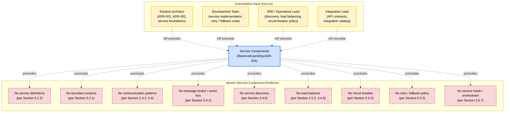

---

### 6.1.3 Scalability Design

#### Horizontal and Vertical Scaling Approach

**No horizontal or vertical scaling approach is documented.** Per Section 2.5.3 (Performance and Scalability Considerations), the Horizontal/Vertical Scaling Strategy is explicitly marked as **Not specified**. Per Section 5.3.1 (Component Specifications), no component-level scaling dimension (horizontal/vertical), no stateful-versus-stateless determination, and no concurrency model are documented. Per Section 3.7.3 (Security / Operational Implications), no operational maturity targets exist that would constrain a scaling choice.

| Scaling Dimension | Repository Evidence | Cross-Reference |
|-------------------|---------------------|-----------------|
| Scaling Axis (horizontal / vertical / hybrid) | None documented | Section 2.5.3 |
| Stateful vs. Stateless Determination | None documented | Section 5.3.1 |
| Concurrency Model (thread-pool, event-loop, actor) | None documented | Section 5.3.1 |
| Sharding / Partitioning Strategy | None documented | Section 3.5.3 |
| Replica Count Targets (minimum, maximum) | None documented | Section 5.5.5 |

The scaling approach selection is reserved for the **Solution Architect** and the **SRE / Operations Lead**.

#### Auto-Scaling Triggers and Rules

**No auto-scaling triggers or rules are documented.** Auto-scaling presupposes a runtime platform that exposes metrics, a controller capable of acting on those metrics, and a workload profile that justifies elasticity. Per Section 3.4.6 (Cloud Platform Status), no cloud platform with auto-scaling primitives (e.g., AWS Auto Scaling Groups, GCP Managed Instance Groups, Kubernetes HPA/VPA/Cluster Autoscaler) is documented. Per Section 5.5.5 (Performance Requirements and SLAs), no performance targets exist that would inform scaling thresholds.

| Auto-Scaling Dimension | Repository Evidence | Cross-Reference |
|--------------------------|---------------------|-----------------|
| Trigger Signal (CPU, memory, RPS, queue depth, custom) | None documented | Section 5.5.5 |
| Scale-Out Threshold | None documented | Section 5.5.5 |
| Scale-In Threshold | None documented | Section 5.5.5 |
| Cooldown / Stabilization Window | None documented | Section 3.4.6 |
| Min / Max Replica Bounds | None documented | Section 3.4.6 |
| Predictive vs. Reactive Mode | None documented | Section 3.4.6 |

Auto-scaling trigger and rule definition is reserved for the **SRE / Operations Lead** in coordination with the **Solution Architect**.

#### Resource Allocation Strategy

**No resource allocation strategy is documented.** Per Section 3.6.7 (Containerization and Orchestration Status), no container resource requests/limits, no orchestrator scheduling policy, and no quality-of-service class definitions exist. Per Section 3.4.6, no instance-type catalog or capacity reservation strategy is documented.

| Resource Allocation Dimension | Repository Evidence | Cross-Reference |
|--------------------------------|---------------------|-----------------|
| CPU Request / Limit per Service | None documented | Section 3.6.7 |
| Memory Request / Limit per Service | None documented | Section 3.6.7 |
| Storage Class and Volume Sizing | None documented | Section 3.5.1 |
| Quality-of-Service Class (Guaranteed / Burstable / BestEffort) | None documented | Section 3.6.7 |
| Affinity / Anti-Affinity Rules | None documented | Section 3.6.7 |
| Instance Type Catalog | None documented | Section 3.4.6 |

Resource allocation strategy definition is reserved for the **SRE / Operations Lead**.

#### Performance Optimization Techniques

**No performance optimization techniques are documented.** Per Section 5.5.5, no latency budgets, throughput targets, concurrency targets, or workload class are documented. Per Section 5.2.3 (Data Flow Description), no caching strategy is documented (Section 3.5.4). Per Section 5.4 (Technical Decisions), caching strategy selection is reserved as part of the cross-cutting ADR series.

| Performance Optimization Dimension | Repository Evidence | Cross-Reference |
|-------------------------------------|---------------------|-----------------|
| Caching Strategy (in-process, distributed, CDN) | None documented | Section 3.5.4, 5.4 |
| Connection Pooling Configuration | None documented | Section 5.4 |
| Read / Write Path Separation (CQRS, read replicas) | None documented | Section 4.4.1 |
| Asynchronous Processing / Background Jobs | None documented | Section 2.4.3 |
| Content Delivery Network (CDN) | None documented | Section 3.4.1 |
| Compression and Payload Optimization | None documented | Section 5.2.3 |

Performance optimization selection is reserved for the **Solution Architect** and the **Development Team**.

#### Capacity Planning Guidelines

**No capacity planning guidelines are documented.** Per Section 5.5.5, the Capacity Plan (peak vs. steady-state) is explicitly recorded as **None documented**. Per Section 1.2.3 (Success Criteria), no availability target, no throughput KPI, and no workload class are specified.

| Capacity Planning Dimension | Repository Evidence | Cross-Reference |
|------------------------------|---------------------|-----------------|
| Steady-State Workload Estimate | None documented | Section 5.5.5 |
| Peak Workload Estimate | None documented | Section 5.5.5 |
| Headroom Reserve Policy | None documented | Section 5.5.5 |
| Growth Projection Horizon | None documented | Section 1.2.3 |
| Cost Envelope / Budget Constraint | None documented | Section 2.5.2 |
| Capacity Review Cadence | None documented | Section 5.5.5 |

Capacity planning guideline authoring is reserved for the **Solution Architect** and the **SRE / Operations Lead**.

#### Required Diagram — Scalability Architecture (Empty State)

The following diagram renders the scalability architecture as an empty-state visualization, mirroring the pattern established by Section 5.2.5 and Section 5.5.3.

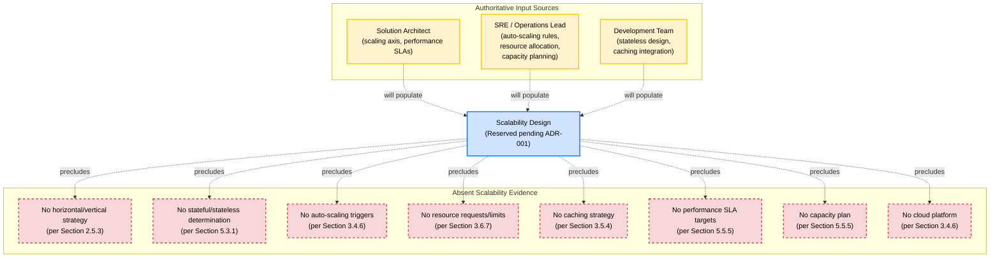

---

### 6.1.4 Resilience Patterns

#### Fault Tolerance Mechanisms

**No fault tolerance mechanisms are documented.** Per Section 5.5.3 (Error Handling Patterns) and Section 4.4.2 (Error Handling Status), no exception taxonomy, retry mechanism, fallback strategy, circuit-breaker pattern, dead-letter queue strategy, or recovery procedures exist. Per Section 4.4.1 (State Management Status), no transaction boundaries, locking strategy, or saga / distributed transaction patterns are documented.

| Fault Tolerance Dimension | Repository Evidence | Cross-Reference |
|----------------------------|---------------------|-----------------|
| Exception Taxonomy | None documented | Section 4.4.2, 5.5.3 |
| Bulkhead Isolation (thread pools, connection pools) | None documented | Section 5.5.3 |
| Timeout Strategy (per-call, end-to-end) | None documented | Section 5.5.3 |
| Idempotency / Exactly-Once Guarantees | None documented | Section 4.4.1 |
| Compensating Transaction / Saga | None documented | Section 4.4.1 |
| Dead-Letter Queue (DLQ) | None documented | Section 5.5.3 |
| Graceful Shutdown / Drain Behavior | None documented | Section 3.6.7 |

Fault tolerance mechanism selection is reserved for the **Development Team** and the **SRE / Operations Lead**.

#### Disaster Recovery Procedures

**No disaster recovery procedures are documented.** Per Section 5.5.6 (Disaster Recovery Procedures), all DR dimensions are recorded as **None documented**. Per Section 2.5.5 (Maintenance Requirements Status), "Backup and Disaster Recovery Expectations: Not specified." This finding is re-stated here for completeness.

| Disaster Recovery Dimension | Repository Evidence | Cross-Reference |
|------------------------------|---------------------|-----------------|
| Recovery Point Objective (RPO) | None documented | Section 5.5.6 |
| Recovery Time Objective (RTO) | None documented | Section 5.5.6 |
| Backup Cadence and Retention | None documented | Section 3.5.3, 5.5.6 |
| Restore Procedure and Drill Cadence | None documented | Section 5.5.6 |
| Disaster Declaration Criteria | None documented | Section 5.5.6 |
| DR Runbook Catalog | None documented | Section 2.5.5 |

Disaster recovery procedure authoring is reserved for the **SRE / Operations Lead**.

#### Data Redundancy Approach

**No data redundancy approach is documented.** Per Section 3.5 (Databases & Storage), no database, persistence layer, schema definition, or storage configuration exists. Per Section 3.5.3, no replication topology (single-region, multi-region, multi-AZ), no partitioning strategy, and no transactional consistency model are defined. Per Section 5.2.3, no data stores or caches exist that would carry redundancy commitments.

| Data Redundancy Dimension | Repository Evidence | Cross-Reference |
|----------------------------|---------------------|-----------------|
| Replication Topology (synchronous / asynchronous) | None documented | Section 3.5.3 |
| Multi-AZ Deployment | None documented | Section 3.4.6, 5.5.6 |
| Multi-Region Deployment | None documented | Section 3.4.6, 5.5.6 |
| Snapshot / Point-in-Time Restore | None documented | Section 3.5.3, 5.5.6 |
| Cross-Region Backup Replication | None documented | Section 5.5.6 |
| Consistency Model (strong / eventual / causal) | None documented | Section 3.5.3 |

Data redundancy approach selection is reserved for the **Solution Architect** and the **SRE / Operations Lead**.

#### Failover Configurations

**No failover configurations are documented.** Per Section 5.5.6, the Failover Strategy (active-active / active-passive / cold standby) is recorded as **None documented**. Per Section 3.4.6, no multi-region or multi-AZ topology is documented.

| Failover Dimension | Repository Evidence | Cross-Reference |
|--------------------|---------------------|-----------------|
| Failover Topology (active-active / active-passive / cold standby) | None documented | Section 5.5.6 |
| Failover Trigger (health check, manual, traffic anomaly) | None documented | Section 5.5.6 |
| Failover Orchestration (DNS, global load balancer, automation) | None documented | Section 5.5.6 |
| Failback Procedure | None documented | Section 5.5.6 |
| Data Synchronization on Failover | None documented | Section 3.5.3 |
| Failover Drill Cadence | None documented | Section 5.5.6 |

Failover configuration authoring is reserved for the **SRE / Operations Lead**.

#### Service Degradation Policies

**No service degradation policies are documented.** Service degradation policies define what behavior the system exhibits when a dependency is unavailable, when load exceeds capacity, or when partial-failure conditions are detected. Per Section 5.5.3, no fallback strategy (degraded-mode behavior) exists; per Section 4.4.2, no fallback processes are documented. Per Section 2.5.4 (Security Implications Status), no rate-limiting or admission-control policy is documented.

| Service Degradation Dimension | Repository Evidence | Cross-Reference |
|---------------------------------|---------------------|-----------------|
| Graceful Degradation Tiers (full / reduced / read-only / offline) | None documented | Section 5.5.3 |
| Load Shedding Strategy | None documented | Section 5.5.5 |
| Rate Limiting and Quota Enforcement | None documented | Section 2.5.4 |
| Feature-Flag / Kill-Switch Inventory | None documented | Section 2.5.1 |
| User-Facing Error Communication | None documented | Section 5.5.3 |
| Recovery Signaling (system-restored notifications) | None documented | Section 5.5.1 |

Service degradation policy authoring is reserved for the **Development Team**, **SRE / Operations Lead**, and **Product Owner**.

#### Required Diagram — Resilience Pattern Implementation (Empty State)

The following diagram renders the resilience pattern landscape as an empty-state visualization, mirroring the pattern established by Section 5.5.3 (Error Handling Flow) and Section 5.2.5.

```mermaid
graph TD
    ResilienceDecision["Resilience Patterns<br/>(Reserved pending ADR-001)"]

    subgraph AbsentResilience["Absent Resilience Evidence"]
        NoExcept["No exception taxonomy<br/>(per Section 4.4.2)"]
        NoBulkhead["No bulkhead isolation<br/>(per Section 5.5.3)"]
        NoTimeout["No timeout strategy<br/>(per Section 5.5.3)"]
        NoSaga["No saga / compensation<br/>(per Section 4.4.1)"]
        NoRPO["No RPO / RTO targets<br/>(per Section 5.5.6)"]
        NoBackup["No backup cadence<br/>(per Section 3.5.3, 5.5.6)"]
        NoReplica["No replication topology<br/>(per Section 3.5.3)"]
        NoMultiAZ["No multi-AZ / multi-region<br/>(per Section 3.4.6)"]
        NoFailover["No failover strategy<br/>(per Section 5.5.6)"]
        NoDegrade["No degradation tiers<br/>(per Section 5.5.3)"]
        NoLoadShed["No load shedding / rate limit<br/>(per Section 2.5.4)"]
    end

    subgraph ResilienceInputs["Authoritative Input Sources"]
        ResArch["Solution Architect<br/>(resilience architecture,<br/>consistency model)"]
        ResSRE["SRE / Operations Lead<br/>(DR procedures, failover,<br/>backup cadence)"]
        ResDev["Development Team<br/>(fault tolerance code,<br/>degradation logic)"]
        ResSec["Security Lead<br/>(rate limiting,<br/>admission control)"]
    end

    ResilienceDecision -.precludes.-> NoExcept
    ResilienceDecision -.precludes.-> NoBulkhead
    ResilienceDecision -.precludes.-> NoTimeout
    ResilienceDecision -.precludes.-> NoSaga
    ResilienceDecision -.precludes.-> NoRPO
    ResilienceDecision -.precludes.-> NoBackup
    ResilienceDecision -.precludes.-> NoReplica
    ResilienceDecision -.precludes.-> NoMultiAZ
    ResilienceDecision -.precludes.-> NoFailover
    ResilienceDecision -.precludes.-> NoDegrade
    ResilienceDecision -.precludes.-> NoLoadShed

    ResArch -.will populate.-> ResilienceDecision
    ResSRE -.will populate.-> ResilienceDecision
    ResDev -.will populate.-> ResilienceDecision
    ResSec -.will populate.-> ResilienceDecision

    classDef decision fill:#cfe2ff,stroke:#0d6efd,stroke-width:2px,color:#000
    classDef absent fill:#f8d7da,stroke:#dc3545,stroke-width:2px,stroke-dasharray: 5 5,color:#000
    classDef pending fill:#fff3cd,stroke:#ffc107,stroke-width:2px,color:#000

    class ResilienceDecision decision
    class NoExcept,NoBulkhead,NoTimeout,NoSaga,NoRPO,NoBackup,NoReplica,NoMultiAZ,NoFailover,NoDegrade,NoLoadShed absent
    class ResArch,ResSRE,ResDev,ResSec pending
```

---

### 6.1.5 Path Forward for Core Services Architecture Definition

#### Required Inputs and Authoritative Sources

The following inputs are required to populate Section 6.1 authoritatively in subsequent revisions. This subsection inherits the authoritative-source mapping established in Section 5.7.1 and projects it onto the service-architecture, scalability, and resilience dimensions enumerated by the section prompt.

| Required Input | Authoritative Source | Section 6.1 Subsection Populated |
|----------------|----------------------|------------------------------------|
| Architecture style ratification (`ADR-001`) | Solution Architect | 6.1.1 (Applicability), 6.1.2 |
| Service boundary and responsibility identification | Solution Architect / Development Team | 6.1.2 |
| Inter-service communication pattern selection (`ADR-002`) | Solution Architect | 6.1.2 |
| Service discovery mechanism selection | Solution Architect / SRE Lead | 6.1.2 |
| Load balancing strategy selection | Solution Architect / SRE Lead | 6.1.2 |
| Circuit breaker, retry, and fallback policies | Development Team / SRE Lead | 6.1.2, 6.1.4 |
| Horizontal / vertical scaling approach | Solution Architect / SRE Lead | 6.1.3 |
| Auto-scaling trigger and rule definition | SRE / Operations Lead | 6.1.3 |
| Resource allocation strategy | SRE / Operations Lead | 6.1.3 |
| Performance optimization techniques (caching, CDN, async) | Solution Architect / Development Team | 6.1.3 |
| Capacity planning guidelines | Solution Architect / SRE Lead | 6.1.3 |
| Fault tolerance mechanism catalog | Development Team / SRE Lead | 6.1.4 |
| Disaster recovery procedures (RPO, RTO, runbooks) | SRE / Operations Lead | 6.1.4 |
| Data redundancy and replication topology | Solution Architect / SRE Lead | 6.1.4 |
| Failover configuration and drill cadence | SRE / Operations Lead | 6.1.4 |
| Service degradation policy catalog | Development Team / SRE Lead / Product Owner | 6.1.4 |

#### Definition Sequence

Per the phased-evolution pattern established in Sections 2.7.2, 3.8.2, 4.7.2, and 5.7.2, the following sequence is recommended for populating Section 6.1 once authoritative inputs become available.

#### Phase 1: Architecture Style Confirmation and Applicability Determination

The Solution Architect's ratification of `ADR-001` (Architecture Style) determines whether Section 6.1 remains applicable. If the ratified style is monolithic with no distinct service components, Section 6.1.1 is amended to declare the section **not applicable** with a documented rationale. If the ratified style introduces distinct service components (microservices, service-oriented, event-driven, or hybrid), the placeholder schemas in 6.1.2 through 6.1.4 are populated through Phases 2 through 5 below.

#### Phase 2: Service Boundary and Communication Definition

The Solution Architect and the Development Team identify service boundaries, assign component identifiers (`C-XXX` or a ratified `SVC-XXX` namespace), and select inter-service communication patterns. Communication pattern selection produces `ADR-002` and enables population of Section 6.1.2 (Service Boundaries, Inter-Service Communication).

#### Phase 3: Operational Topology Definition

The SRE / Operations Lead, in coordination with the Solution Architect, selects service discovery mechanisms, load balancing strategies, container orchestration platform, and resource allocation policies. This phase enables population of the remaining Section 6.1.2 dimensions (Service Discovery, Load Balancing) and the Section 6.1.3 dimensions (Auto-Scaling, Resource Allocation).

#### Phase 4: Performance and Scaling Specification

The Solution Architect and the SRE / Operations Lead specify performance SLAs (latency, throughput, concurrency, availability), workload class, and capacity planning guidelines. These inputs become the decision drivers for the horizontal/vertical scaling approach and the auto-scaling thresholds. This phase populates Section 6.1.3 in full and is interlocked with Section 5.5.5.

#### Phase 5: Resilience Pattern Codification

The Development Team and the SRE / Operations Lead codify fault tolerance mechanisms (retry, fallback, circuit-breaker, bulkhead, timeout), disaster recovery procedures (RPO, RTO, backup cadence, restore drills), data redundancy topology, failover configurations, and service degradation policies. This phase populates Section 6.1.4 in full and is interlocked with Sections 5.5.3 and 5.5.6.

#### Phase 6: Cross-Section Consistency Reconciliation

The Solution Architect verifies that Section 6.1 is consistent with Sections 5.2 (High-Level Architecture), 5.3 (Component Details), 5.4 (Technical Decisions), and 5.5 (Cross-Cutting Concerns), and that all `C-XXX`, `INT-XXX`, and `ADR-XXX` identifiers used in Section 6.1 are cross-referenced to their canonical definitions.

#### Assumptions and Constraints

The following assumptions and constraints govern Section 6.1's current state, consistent with the pattern established in Sections 2.7.3, 3.8.3, 4.7.3, and 5.7.3.

| Assumption / Constraint | Description |
|-------------------------|-------------|
| Repository State Assumption | The repository is assumed to be in a pre-implementation state per Section 1.1, not a partially synchronized or obscured state. |
| Applicability Reservation | Applicability of Core Services Architecture is reserved pending Solution Architect ratification of `ADR-001` (Architecture Style); the section cannot be evidentiarily declared "not applicable" at authoring time. |
| Evidence Boundary Constraint | Section 6.1 is constrained to evidence observable in the repository at authoring time; no external assumptions about service decomposition, scaling needs, or resilience targets are incorporated. |
| Schema Forward-Compatibility Assumption | The placeholder schemas for service components, scalability dimensions, and resilience dimensions assume the structural categories requested by the section prompt remain applicable to Artifact10's eventual architecture; they will be amended in place if the ratified architecture style materially alters the schema set. |
| Identifier Convention Inheritance | Section 6.1 inherits the `C-XXX`, `ADR-XXX`, and `INT-XXX` reservations from Section 5.1.2; a dedicated `SVC-XXX` namespace for services may be introduced upon `ADR-001` ratification if a service-oriented style is selected. |
| Dependency on Section 5 Population | Section 6.1 cannot be authoritatively populated until Section 5 (System Architecture) is populated; in particular, until `ADR-001` is ratified. |
| Default Stack Non-Endorsement | The Default Stack forward-looking candidates (Flask, React, TailwindCSS, React-Native, Langchain, ElectronJS, MongoDB, AWS, Auth0, Docker, Terraform, GitHub Actions) referenced from Section 3 are explicitly non-evidentiary and require Solution Architect ratification before any of them may be cited as a service-architecture decision. |
| Diagram Empty-State Discipline | All Mermaid diagrams in Section 6.1 are rendered as empty-state visualizations and do not represent fabricated services, interactions, scaling topologies, or resilience flows. Any future replacement of these diagrams with content-bearing diagrams must be traceable to the authoritative input sources designated in Section 6.1.5.1. |
| Four-Column Table Maximum | Where the section prompt requested multi-attribute schemas (Core Components, External Integrations), tables have been split into related sub-tables joined by Service ID or Integration ID to comply with the documentation formatting standard established in Section 5.7.3. |

#### Version Tracking Reservation

A Section 6.1 version tracking table is reserved for future use to record amendments as service boundaries, scaling rules, and resilience patterns are introduced. This mirrors the version tracking pattern established in Sections 2.7.4, 3.8.4, 4.7.4, and 5.7.4.

| Version | Date | Subsection Amended | Change Summary |
|---------|------|---------------------|----------------|
| Not specified | Not specified | Not specified | Initial empty-state authoring; placeholder schemas, empty-state Mermaid diagrams, and applicability reservation established |

Subsequent revisions are expected to record, at minimum: applicability confirmation following `ADR-001` ratification, service boundary definition, communication pattern selection, scaling approach selection, auto-scaling rule codification, resource allocation policy, capacity plan, disaster recovery procedure specification, failover configuration, and service degradation policy authoring.

---

### 6.1.6 References

#### Files Examined

- `README.md` — Sole repository file (12 bytes); content limited to the H1 Markdown heading `# Artifact10`; confirms pre-implementation state precluding evidence-based derivation of service components, scaling configurations, or resilience patterns.

#### Folders Explored

- `` (repository root, depth 0) — Confirmed to contain only `README.md`; no source folders, configuration directories, infrastructure-as-code folders, or CI/CD definitions exist that would evidence service boundaries, deployment topology, or operational resilience artifacts.

#### Technical Specification Sections Cross-Referenced

- **Section 1.1 (Executive Summary)** — Established pre-implementation state with single README file as authoritative baseline.
- **Section 1.2 (System Overview)** — Confirmed absence of source code, package manifests, components, and integrations that would evidence service architecture.
- **Section 1.4 (Documentation Integrity Statement)** — Source of evidence-based authoring discipline applied throughout this section.
- **Section 2.2 (Feature Catalog)** — Zero features defined, precluding feature-to-service mapping.
- **Section 2.4 (Feature Relationships)** — No integration points, shared components, or message broker topology documented.
- **Section 2.5 (Implementation Considerations)** — Horizontal/Vertical Scaling Strategy explicitly Not specified (Section 2.5.3); Backup and Disaster Recovery Expectations Not specified (Section 2.5.5).
- **Section 3.4 (Third-Party Services)** — No cloud platform, no service mesh, no message broker, no monitoring service integrations.
- **Section 3.5 (Databases & Storage)** — No persistence layer, no replication topology, no backup cadence; relevant to data redundancy.
- **Section 3.6 (Development & Deployment)** — No containerization, orchestration, IaC, or CI/CD; relevant to resource allocation and deployment topology.
- **Section 3.7 (Technology Stack Status Summary)** — Default Stack candidates catalogued as non-evidentiary forward-looking inputs.
- **Section 4.4 (Technical Implementation Status)** — No state management, transactions, error handling, retry, fallback, or circuit-breaker patterns documented.
- **Section 5.1 (Section Authoring Methodology)** — Source of identifier conventions (`C-XXX`, `ADR-XXX`, `INT-XXX`) and Mermaid visualization conventions inherited by this section.
- **Section 5.2 (High-Level Architecture)** — No architecture style, no components, no data flows, no external integrations; foundational to applicability reservation.
- **Section 5.3 (Component Details)** — Empty-state component diagrams; placeholder schemas inherited by Section 6.1.2.
- **Section 5.4 (Technical Decisions)** — Eight reserved ADR topics (`ADR-001` through `ADR-008`); `ADR-001` is the prerequisite to determining Section 6.1 applicability.
- **Section 5.5 (Cross-Cutting Concerns)** — No observability, no error handling, no AuthN/AuthZ, no performance SLAs, no disaster recovery; directly governs Section 6.1.4.
- **Section 5.7 (Path Forward for System Architecture Definition)** — Authoritative input sources, phased sequence, and assumptions and constraints inherited by Section 6.1.5.

## 6.2 Database Design

### 6.2.1 Applicability Determination

#### 6.2.1.1 Authoritative Position

**Database Design is not applicable to this system at authoring time.**

The section prompt offers two authoring paths: declaring Database Design **not applicable** when "the system does not require or direct database or persistent storage interactions are not clearly evident," or addressing the full set of schema, data management, compliance, and performance dimensions when it does. This section adopts the **not-applicable** path, on the following evidentiary basis:

- Per Section 3.5.1, **no database systems, persistence layers, schema definitions, storage volumes, caching tiers, or object-storage configurations are referenced within the Artifact10 repository.** No `*.sql`, `*.prisma`, `*.dbml`, `migrations/`, `schemas/`, or ORM model files exist.
- Per Section 2.5.2 (Technical Constraints Status), the *Data Persistence Constraints* dimension is explicitly recorded as **"Not specified (no schema artifacts present)."**
- Per Section 5.2.3 (Data Flow Description), no data flows, no data transformation points, and no key data stores or caches are documented.
- Per Section 5.4.4 (Data Storage Solution Rationale), **no data storage solution has been selected.**
- Per Section 4.4.1 (State Management Status), no entities, lifecycle stages, persistence points, transaction boundaries, or locking strategies are documented.

A database design — the schema, indexing, partitioning, replication, backup, migration, and access patterns of a persistent store — cannot be authored in the absence of (a) a ratified persistence technology, (b) defined domain entities, (c) declared transactional semantics, and (d) committed consistency, durability, and recovery targets. All four of these prerequisites are absent from the repository.

#### 6.2.1.2 Scope of the Non-Applicability Declaration

The non-applicability declaration is bounded in scope and time. Specifically, this declaration:

| Bound | Description |
|-------|-------------|
| Temporal scope | Applies at authoring time, based on the repository state established in Section 1.1 (Executive Summary). |
| Evidentiary scope | Applies to evidence observable in the repository at authoring time; no external assumptions about domain data, persistence needs, or storage selections are incorporated. |
| Forward-looking scope | Does **not** preclude a future ratification of a database technology; if the repository evolves to introduce persistence artifacts, this section is expected to be amended in place per the Path Forward in Section 6.2.7. |
| Forward-looking candidate scope | Does **not** ratify the Default Stack forward-looking candidates (MongoDB primary database; likely AWS S3 object storage if AWS is ratified) catalogued in Section 3.5.6 and Section 5.4.4. Those candidates remain **non-evidentiary** and require Solution Architect / Development Team ratification before they may be cited as a database-design decision. |

#### 6.2.1.3 Distinction from Section 6.1 Authoring Posture

Section 6.1 (Core Services Architecture) adopted an **undetermined-applicability** posture because the architecture-style decision (`ADR-001`) is the prerequisite to determining whether a Core Services Architecture is required, and that decision is reserved pending Solution Architect ratification. The section prompt for Section 6.1 did not provide explicit "not applicable" language.

By contrast, the section prompt for Section 6.2 provides explicit language ("clearly state 'Database Design is not applicable to this system' and explain why") that authorizes a not-applicable declaration whenever direct database or persistent storage interactions are not clearly evident. Because Section 3.5 establishes categorical absence of every persistence artifact category (schema files, migration scripts, ORM models, storage configurations, caching configurations, object-storage configurations), the evidentiary threshold for non-applicability is satisfied.

This distinction is documented to make the differing authoring posture between sibling sections (6.1 and 6.2) traceable and intentional rather than incidental.

#### 6.2.1.4 Authoring Discipline Inheritance

This section inherits the evidence-based discipline established by Section 1.4 (Documentation Integrity Statement) and reaffirmed in Section 5.1.1. Per Section 5.1.1, the Artifact10 repository is in a **pre-implementation state** containing a single file (`README.md`, 12 bytes) whose entire substantive content is the H1 Markdown heading `# Artifact10`. Per Section 1.4.1, where standard Technical Specification subsections cannot be populated due to absent evidence, this absence is explicitly stated rather than filled with speculative content.

Consequently, the remainder of Section 6.2 performs four operations:

1. Declares non-applicability with full evidentiary rationale (Section 6.2.1).
2. Preserves the structural schemas requested by the section prompt as empty-state documentation across Schema Design, Data Management, Compliance Considerations, and Performance Optimization (Sections 6.2.2 through 6.2.5), so that future revisions may populate them in place.
3. Renders the three required diagrams (database schema / ERD, data flow, replication architecture) as empty-state Mermaid visualizations using the conventions established in Section 5.1.3 (Sections 6.2.6).
4. Establishes a Path Forward (authoritative input sources, phased sequence, assumptions and constraints, version tracking) following the pattern of Section 5.7 and Section 6.1.5 (Section 6.2.7).

#### Identifier Convention Inheritance

This section does not introduce new identifier conventions. It inherits and references the reservations established by Section 5.1.2 and Section 5.4.1:

| Identifier Convention | Domain | First Allocation Status |
|----------------------|--------|--------------------------|
| `C-XXX` | Architectural Components (including persistence components) | Reserved; first allocation `C-001` |
| `ADR-XXX` | Architecture Decision Records | Reserved; `ADR-003` reserved for Data Storage Solution Selection; `ADR-004` reserved for Caching Strategy; `ADR-008` reserved for Disaster Recovery Posture |
| `INT-XXX` | External Integration Points (including managed-database integrations) | Reserved; first allocation `INT-001` |

#### Mermaid Visualization Inheritance

All Mermaid diagrams in this section adopt the class definitions and edge-label conventions established in Section 5.1.3:

- `decision` (blue) — elements reserved for future ratification
- `absent` (red dashed) — unpopulated database-design dimensions
- `pending` (yellow) — forward-looking input sources
- `root` (yellow) — diagram root nodes anchoring empty-state visualizations

Edge-label semantics: `-.absent.->` (direct absence), `-.precludes.->` (absence prevents derivation), `-.will populate.->` (authoritative input source).

---

## 6.2 Database Design — Empty-State Documentation by Dimension

The remainder of this section preserves the structural schemas requested by the section prompt across the four dimensional groupings (Schema Design, Data Management, Compliance Considerations, Performance Optimization). Each subsection enumerates the dimensions requested by the prompt and traces their absence to the established source-section findings. These schemas are preserved to enable in-place population once `ADR-003` (Data Storage Solution Selection) and `ADR-004` (Caching Strategy) are ratified by the Solution Architect and the Development Team.

---

### 6.2.2 Schema Design — Empty-State Documentation

#### 6.2.2.1 Entity Relationships

**No entity relationships are documented.** Entity relationships presuppose the existence of defined domain entities, attribute sets, primary keys, foreign-key associations, and cardinality declarations. Per Section 4.4.1 (State Management Status), no domain entities, lifecycle states, or transition rules are derivable. Per Section 2.2 (Feature Catalog), zero features are defined, precluding feature-to-entity mapping. Per Section 5.2.3 (Data Flow Description — Key Data Stores and Caches), no data stores exist that would carry entities.

| Entity Relationship Dimension | Repository Evidence | Cross-Reference |
|-------------------------------|---------------------|-----------------|
| Domain Entity Inventory | None documented | Section 2.2, 4.4.1 |
| Entity Attribute Sets | None documented | Section 4.4.1 |
| Primary Key Declarations | None documented | Section 3.5.1 |
| Foreign Key / Reference Associations | None documented | Section 3.5.1 |
| Cardinality (1:1, 1:N, M:N) | None documented | Section 3.5.1 |
| Aggregate / Bounded Context Definitions | None documented | Section 5.2.1 |

#### 6.2.2.2 Data Models and Structures

**No data models or structures are documented.** Data models — whether relational schemas, document schemas, key-value namespaces, graph node/edge taxonomies, columnar structures, or hybrid polyglot designs — presuppose a ratified database technology and a defined data domain. Per Section 5.4.4 (Data Storage Solution Rationale), no data storage solution has been selected. Per Section 3.5.6, the forward-looking candidate is **MongoDB** (non-evidentiary), which would imply document-oriented modeling considerations (embedded vs. referenced documents, denormalization patterns) that cannot be evaluated absent the data-domain definitions reserved by Section 2.2.

| Data Model Dimension | Repository Evidence | Cross-Reference |
|----------------------|---------------------|-----------------|
| Modeling Paradigm (relational / document / key-value / graph / columnar) | None documented | Section 3.5.6, 5.4.4 |
| Logical Schema (entities, attributes, types) | None documented | Section 4.4.1 |
| Physical Schema (tables, collections, namespaces) | None documented | Section 3.5.1 |
| Document Embedding vs. Referencing Strategy | None documented | Section 3.5.6 |
| Polyglot Persistence Composition | None documented | Section 3.5.6 |
| Data Type Catalog | None documented | Section 3.5.1 |

#### 6.2.2.3 Indexing Strategy

**No indexing strategy is documented.** Indexing strategies — primary index structure, secondary index inventory, composite index designs, full-text or vector indexes, partial / sparse indexes, and index-build cadence — presuppose a defined data model and observed query workload. Per Section 5.5.5 (Performance Requirements and SLAs), no latency targets, throughput targets, or workload class are documented; without these, indexing cost/benefit cannot be evaluated.

| Indexing Dimension | Repository Evidence | Cross-Reference |
|--------------------|---------------------|-----------------|
| Primary Index Strategy | None documented | Section 3.5.1 |
| Secondary Index Inventory | None documented | Section 3.5.1 |
| Composite / Compound Index Designs | None documented | Section 3.5.1 |
| Full-Text / Search Index Strategy | None documented | Section 3.5.6 |
| Vector / Embedding Index Strategy | None documented | Section 3.5.6 |
| Partial / Sparse / Filtered Indexes | None documented | Section 3.5.1 |
| Index Build and Maintenance Cadence | None documented | Section 5.5.5 |

#### 6.2.2.4 Partitioning Approach

**No partitioning approach is documented.** Partitioning approaches — horizontal sharding by key, range partitioning, hash partitioning, geographic partitioning, or vertical partitioning — presuppose a defined data volume, access pattern, and locality requirement. Per Section 3.5.3 (Data Persistence Strategy Status), no partitioning/sharding approach is documented. Per Section 6.1.3 (Scalability Design), no sharding/partitioning strategy is documented as part of the broader scaling approach.

| Partitioning Dimension | Repository Evidence | Cross-Reference |
|------------------------|---------------------|-----------------|
| Partitioning Style (horizontal / vertical / functional) | None documented | Section 3.5.3 |
| Shard Key Selection | None documented | Section 3.5.3 |
| Partitioning Algorithm (range / hash / list / composite) | None documented | Section 3.5.3 |
| Geographic / Regional Partitioning | None documented | Section 5.5.6 |
| Rebalancing / Resharding Strategy | None documented | Section 3.5.3 |
| Cross-Partition Query Strategy | None documented | Section 3.5.3 |

#### 6.2.2.5 Replication Configuration

**No replication configuration is documented.** Replication configuration — synchronous vs. asynchronous topology, primary-replica / multi-primary roles, read-replica count, replica lag tolerance, and consistency model — presupposes a ratified persistence technology and committed durability targets. Per Section 6.1.4 (Resilience Patterns — Data Redundancy Approach), no replication topology, multi-AZ deployment, multi-region deployment, cross-region backup replication, or consistency model is documented. Per Section 5.5.6 (Disaster Recovery Procedures), no multi-region / multi-AZ topology is documented.

| Replication Dimension | Repository Evidence | Cross-Reference |
|------------------------|---------------------|-----------------|
| Replication Topology (single-primary / multi-primary / leaderless) | None documented | Section 3.5.3, 6.1.4 |
| Synchronous vs. Asynchronous Mode | None documented | Section 3.5.3, 6.1.4 |
| Replica Count and Placement | None documented | Section 6.1.4 |
| Consistency Model (strong / bounded staleness / eventual / causal) | None documented | Section 3.5.3, 6.1.4 |
| Replica Lag Tolerance | None documented | Section 5.5.5 |
| Multi-AZ / Multi-Region Topology | None documented | Section 5.5.6, 6.1.4 |
| Failover / Promotion Protocol | None documented | Section 5.5.6 |

#### 6.2.2.6 Backup Architecture

**No backup architecture is documented.** Backup architecture — full / incremental / differential cadence, snapshot mechanisms, point-in-time recovery (PITR) windows, encryption at rest, retention tiers, and cross-region replication of backups — presupposes a ratified storage technology and committed RPO/RTO targets. Per Section 2.5.5 (Maintenance Requirements Status), "Backup and Disaster Recovery Expectations: Not specified." Per Section 5.5.6, no backup cadence and retention, no restore procedure, and no DR runbook catalog are documented.

| Backup Architecture Dimension | Repository Evidence | Cross-Reference |
|--------------------------------|---------------------|-----------------|
| Backup Cadence (full / incremental / differential) | None documented | Section 2.5.5, 5.5.6 |
| Snapshot Mechanism | None documented | Section 3.5.3 |
| Point-In-Time Recovery (PITR) Window | None documented | Section 5.5.6 |
| Backup Encryption at Rest | None documented | Section 3.5.5 |
| Retention Tier Policy | None documented | Section 5.5.6 |
| Cross-Region Backup Replication | None documented | Section 6.1.4 |
| Restore Drill Cadence | None documented | Section 5.5.6 |

---

### 6.2.3 Data Management — Empty-State Documentation

#### 6.2.3.1 Migration Procedures

**No migration procedures are documented.** Migration procedures — forward / backward migration scripts, schema evolution tooling (e.g., Flyway, Liquibase, Alembic, Prisma Migrate, Mongo migration frameworks), zero-downtime deploy patterns (expand-contract), and rollback strategies — presuppose an extant schema and a ratified ORM / migration framework. Per Section 3.5.1, no `migrations/` directory, schema files, or ORM model files exist. Per Section 3.2 (Frameworks & Libraries), no frameworks or libraries are in use.

| Migration Dimension | Repository Evidence | Cross-Reference |
|---------------------|---------------------|-----------------|
| Migration Tooling Selection | None documented | Section 3.2, 3.5.1 |
| Forward / Backward Migration Scripts | None documented | Section 3.5.1 |
| Zero-Downtime Deploy Pattern (expand-contract) | None documented | Section 3.5.3 |
| Schema Versioning Convention | None documented | Section 3.5.1 |
| Rollback Strategy | None documented | Section 3.5.3 |
| Data Backfill Procedure | None documented | Section 3.5.1 |

#### 6.2.3.2 Versioning Strategy

**No versioning strategy is documented.** Versioning strategy — schema version registry, deprecation windows, contract-versioned data (e.g., schema evolution with Avro / Protobuf), and API-to-schema version mapping — presupposes a defined schema and a release process. Per Section 3.6 (Development & Deployment) cross-references, no release process, CI/CD pipeline, or deployment tooling is documented.

| Versioning Dimension | Repository Evidence | Cross-Reference |
|----------------------|---------------------|-----------------|
| Schema Version Registry | None documented | Section 3.5.1 |
| Backward / Forward Compatibility Policy | None documented | Section 3.5.1 |
| Deprecation Window | None documented | Section 3.5.1 |
| Contract-Versioned Data Format (Avro / Protobuf) | None documented | Section 3.5.1 |
| API-to-Schema Version Mapping | None documented | Section 5.2.4 |
| Multi-Version Coexistence Strategy | None documented | Section 3.5.3 |

#### 6.2.3.3 Archival Policies

**No archival policies are documented.** Archival policies — hot / warm / cold tiering, archive trigger criteria (age, status, regulatory class), archive storage technology, retrieval SLA, and purge cadence — presuppose a regulatory or operational driver and a multi-tier storage architecture. Per Section 3.5.5 (Storage Services Status), no object storage, file storage, or archival storage decisions are documented. Per Section 2.5.4 (Security Implications Status), no regulatory compliance scope is specified.

| Archival Dimension | Repository Evidence | Cross-Reference |
|--------------------|---------------------|-----------------|
| Storage Tiering (hot / warm / cold) | None documented | Section 3.5.5 |
| Archive Trigger Criteria | None documented | Section 3.5.5 |
| Archive Storage Technology | None documented | Section 3.5.5, 3.5.6 |
| Archive Retrieval SLA | None documented | Section 5.5.5 |
| Purge / Deletion Cadence | None documented | Section 2.5.4 |
| Legal-Hold / Litigation-Hold Workflow | None documented | Section 2.5.4 |

#### 6.2.3.4 Data Storage and Retrieval Mechanisms

**No data storage or retrieval mechanisms are documented.** Storage and retrieval mechanisms — driver / client library selection, connection management, query / mutation API surface, transaction API, bulk-load and bulk-export tooling — presuppose a ratified database technology. Per Section 3.3 (Open Source Dependencies) cross-references, no driver libraries are present. Per Section 5.2.3, no data flow design is documented.

| Storage / Retrieval Dimension | Repository Evidence | Cross-Reference |
|--------------------------------|---------------------|-----------------|
| Driver / Client Library Selection | None documented | Section 3.3, 3.5.1 |
| Query / Mutation API Surface | None documented | Section 5.2.3 |
| Transaction API and Isolation Level | None documented | Section 4.4.1 |
| Bulk-Load / Bulk-Export Tooling | None documented | Section 3.5.1 |
| Change-Data-Capture (CDC) Stream | None documented | Section 2.4.3 |
| Read / Write Path Topology | None documented | Section 5.2.3 |

#### 6.2.3.5 Caching Policies

**No caching policies are documented.** Caching policies — what is cached, where (in-process / distributed / CDN-edge / HTTP), eviction policy (LRU / LFU / TTL / manual), consistency model with the primary store (write-through / write-back / write-around / read-through), and invalidation strategy — presuppose a ratified caching technology and a workload profile. Per Section 3.5.4 (Caching Strategy Status), no caching strategy is documented. Per Section 5.4.5 (Caching Strategy Justification), all dimensions (Cache Topology, Eviction Policy, Consistency Model, Invalidation Strategy) are recorded as **Not specified**. `ADR-004` is reserved for Caching Strategy selection.

| Caching Policy Dimension | Repository Evidence | Cross-Reference |
|---------------------------|---------------------|-----------------|
| Cache Topology (in-process / distributed / CDN-edge / HTTP) | None documented | Section 3.5.4, 5.4.5 |
| Eviction Policy (LRU / LFU / TTL / Manual) | None documented | Section 5.4.5 |
| Write Policy (write-through / write-back / write-around) | None documented | Section 5.4.5 |
| Read Policy (read-through / cache-aside) | None documented | Section 5.4.5 |
| Consistency Model with Primary Store | None documented | Section 3.5.4 |
| Invalidation Strategy (event-driven / time-based / manual) | None documented | Section 5.4.5 |

---

### 6.2.4 Compliance Considerations — Empty-State Documentation

#### 6.2.4.1 Data Retention Rules

**No data retention rules are documented.** Data retention rules — minimum / maximum retention windows by data class, deletion verification, and right-to-erasure workflows (e.g., GDPR Article 17, CCPA deletion request) — presuppose a regulatory compliance scope and a defined data classification. Per Section 2.5.4 (Security Implications Status), "Regulatory Compliance Scope: Not specified."

| Data Retention Dimension | Repository Evidence | Cross-Reference |
|---------------------------|---------------------|-----------------|
| Regulatory Compliance Scope (GDPR, CCPA, HIPAA, PCI-DSS, SOX) | None documented | Section 2.5.4 |
| Data Classification Taxonomy | None documented | Section 2.5.4 |
| Minimum Retention Window by Class | None documented | Section 2.5.4 |
| Maximum Retention Window by Class | None documented | Section 2.5.4 |
| Right-to-Erasure Workflow | None documented | Section 2.5.4 |
| Deletion Verification Mechanism | None documented | Section 2.5.4 |

#### 6.2.4.2 Backup and Fault Tolerance Policies

**No backup or fault tolerance policies are documented.** Per Section 6.1.4 (Resilience Patterns — Fault Tolerance Mechanisms), no fault tolerance dimension is documented (exception taxonomy, bulkhead isolation, timeout strategy, idempotency, compensating transaction, DLQ, graceful shutdown). Per Section 5.5.6 (Disaster Recovery Procedures), no RPO, RTO, backup cadence, restore procedure, disaster declaration criteria, or DR runbook catalog is documented. This finding is foundational to Section 6.2.4 and is re-stated for completeness.

| Backup / Fault Tolerance Dimension | Repository Evidence | Cross-Reference |
|-------------------------------------|---------------------|-----------------|
| Recovery Point Objective (RPO) | None documented | Section 5.5.6, 6.1.4 |
| Recovery Time Objective (RTO) | None documented | Section 5.5.6, 6.1.4 |
| Backup Cadence and Retention | None documented | Section 2.5.5, 5.5.6 |
| Geographic Redundancy Posture | None documented | Section 5.5.6, 6.1.4 |
| Transactional Durability Guarantee | None documented | Section 3.5.3 |
| Idempotency / Exactly-Once Guarantees | None documented | Section 4.4.1, 6.1.4 |
| Restore Drill Cadence | None documented | Section 5.5.6 |

#### 6.2.4.3 Privacy Controls

**No privacy controls are documented.** Privacy controls — personally identifiable information (PII) classification, encryption at rest, encryption in transit, tokenization / pseudonymization, data masking, and consent management — presuppose a regulatory scope and a data inventory. Per Section 2.5.4, "Data Protection (encryption, masking): Not specified."

| Privacy Control Dimension | Repository Evidence | Cross-Reference |
|---------------------------|---------------------|-----------------|
| PII / Sensitive Data Inventory | None documented | Section 2.5.4 |
| Encryption at Rest (algorithm, key management) | None documented | Section 2.5.4, 3.5.5 |
| Encryption in Transit (TLS version, cipher suite) | None documented | Section 5.5.4 |
| Tokenization / Pseudonymization | None documented | Section 2.5.4 |
| Data Masking for Non-Production Environments | None documented | Section 2.5.4 |
| Consent Management Workflow | None documented | Section 2.5.4 |
| Cross-Border Data Transfer Policy | None documented | Section 2.5.4 |

#### 6.2.4.4 Audit Mechanisms

**No audit mechanisms are documented.** Audit mechanisms — audit log schema, immutable log storage, change-data-capture audit streams, query-level audit trails, and audit log retention — presuppose a logging strategy and a compliance scope. Per Section 5.5.2 (Logging and Tracing Strategy), no structured logging schema, log aggregation sink, or log retention policy is documented. Per Section 5.5.4 (Authentication and Authorization Framework), no audit log retention is documented.

| Audit Mechanism Dimension | Repository Evidence | Cross-Reference |
|----------------------------|---------------------|-----------------|
| Audit Log Schema | None documented | Section 5.5.2 |
| Immutable / Append-Only Audit Storage | None documented | Section 5.5.2 |
| Change-Data-Capture Audit Stream | None documented | Section 2.4.3 |
| Query-Level Audit Trail (who accessed what, when) | None documented | Section 5.5.4 |
| Audit Log Retention Period | None documented | Section 5.5.4 |
| Audit Review Cadence | None documented | Section 2.5.5 |

#### 6.2.4.5 Access Controls

**No access controls are documented.** Access controls at the database tier — database-user role inventory, least-privilege grant catalog, schema-level / row-level / column-level security, network ACL / VPC peering, and IAM-integrated authentication (e.g., AWS IAM database authentication) — presuppose a ratified database technology and a security framework. Per Section 5.5.4 (Authentication and Authorization Framework), no identity provider integration, no authorization model (RBAC / ABAC / ReBAC), and no authorization checkpoint catalog are documented. Per Section 3.4.4 (Authentication Service Status), no identity-provider integration is present.

| Access Control Dimension | Repository Evidence | Cross-Reference |
|---------------------------|---------------------|-----------------|
| Database-User Role Inventory | None documented | Section 5.5.4 |
| Least-Privilege Grant Catalog | None documented | Section 5.5.4 |
| Row-Level Security (RLS) Policy | None documented | Section 2.5.4 |
| Column-Level Security / Masking | None documented | Section 2.5.4 |
| Network ACL / VPC / Private Endpoint Posture | None documented | Section 3.4.6 |
| IAM-Integrated Authentication | None documented | Section 3.4.4 |
| Secrets-Management Integration (rotation, vaulting) | None documented | Section 5.5.4 |

---

### 6.2.5 Performance Optimization — Empty-State Documentation

#### 6.2.5.1 Query Optimization Patterns

**No query optimization patterns are documented.** Query optimization patterns — query plan analysis cadence, index hints, materialized views, denormalized read models, query timeout policy, and N+1 prevention strategies — presuppose an extant query workload and observed performance characteristics. Per Section 5.5.5 (Performance Requirements and SLAs), no latency budget (p50 / p95 / p99), throughput targets, or workload class are documented. Per Section 6.1.3 (Performance Optimization Techniques), read/write path separation (CQRS, read replicas) is recorded as **None documented**.

| Query Optimization Dimension | Repository Evidence | Cross-Reference |
|-------------------------------|---------------------|-----------------|
| Query Plan Analysis Cadence | None documented | Section 5.5.5 |
| Materialized View / Pre-Computed Read Model | None documented | Section 6.1.3 |
| Denormalization Strategy | None documented | Section 3.5.6 |
| Query Timeout Policy | None documented | Section 5.5.3 |
| N+1 / Cartesian-Product Prevention | None documented | Section 5.5.5 |
| Slow-Query Logging and Alerting | None documented | Section 5.5.1 |

#### 6.2.5.2 Caching Strategy

**No caching strategy is documented.** This dimension overlaps with Section 6.2.3.5 (Caching Policies) and Section 5.4.5 (Caching Strategy Justification). All cache-topology, eviction-policy, consistency-model, and invalidation-strategy dimensions are recorded as **Not specified** in those upstream sections, and this finding is re-stated here for completeness. `ADR-004` is reserved for Caching Strategy selection.

| Caching Strategy Dimension | Repository Evidence | Cross-Reference |
|-----------------------------|---------------------|-----------------|
| Cache Tier Composition (L1 in-process / L2 distributed / L3 CDN) | None documented | Section 3.5.4, 5.4.5 |
| Cache Key Design Convention | None documented | Section 5.4.5 |
| TTL / Eviction Policy Catalog | None documented | Section 5.4.5 |
| Cache-Warming Strategy | None documented | Section 5.4.5 |
| Thundering-Herd / Cache-Stampede Mitigation | None documented | Section 5.4.5 |
| Cache Observability (hit rate, miss rate, eviction rate) | None documented | Section 5.5.1 |

#### 6.2.5.3 Connection Pooling

**No connection pooling configuration is documented.** Connection pooling — minimum / maximum pool size, acquisition timeout, idle eviction, health-check protocol, and pool-per-service vs. shared-pool topology — presupposes a ratified driver library and a deployment topology. Per Section 3.3 (Open Source Dependencies) cross-references, no driver libraries are present. Per Section 6.1.3 (Resource Allocation Strategy), no CPU / memory / quality-of-service class is documented.

| Connection Pooling Dimension | Repository Evidence | Cross-Reference |
|-------------------------------|---------------------|-----------------|
| Pool Library / Driver Selection | None documented | Section 3.3, 3.5.1 |
| Minimum / Maximum Pool Size | None documented | Section 6.1.3 |
| Connection Acquisition Timeout | None documented | Section 5.5.3 |
| Idle Connection Eviction Policy | None documented | Section 5.5.5 |
| Pool Health-Check Protocol | None documented | Section 5.5.1 |
| Pool Topology (per-service / shared / sidecar proxy like PgBouncer / RDS Proxy) | None documented | Section 3.4.6 |

#### 6.2.5.4 Read/Write Splitting

**No read/write splitting strategy is documented.** Read/write splitting — primary-write replica-read topology, read-replica selection algorithm, replication-lag handling (read-your-writes guarantees), and CQRS materialization — presuppose a replication configuration (Section 6.2.2.5) and a defined consistency model (Section 3.5.3). Both are absent.

| Read/Write Splitting Dimension | Repository Evidence | Cross-Reference |
|--------------------------------|---------------------|-----------------|
| Primary-Write / Replica-Read Routing | None documented | Section 6.1.3, 6.2.2.5 |
| Replica Selection Algorithm (round-robin, lag-aware, latency-aware) | None documented | Section 3.5.3 |
| Read-Your-Writes Consistency Handling | None documented | Section 3.5.3 |
| CQRS / Read-Model Materialization | None documented | Section 4.4.1 |
| Replica Lag Threshold for Read Eligibility | None documented | Section 5.5.5 |
| Read-Stickiness / Session Affinity | None documented | Section 6.1.2 |

#### 6.2.5.5 Batch Processing Approach

**No batch processing approach is documented.** Batch processing approach — batch job scheduler (cron / Airflow / Step Functions / Kubernetes Jobs), batch window definition, chunking and pagination strategy, idempotency guarantee, and failure recovery — presupposes a runtime platform and a job catalog. Per Section 3.6 (Development & Deployment) cross-references, no scheduler or job-orchestration tooling is documented. Per Section 6.1.3 (Performance Optimization Techniques), asynchronous processing / background jobs are recorded as **None documented**.

| Batch Processing Dimension | Repository Evidence | Cross-Reference |
|-----------------------------|---------------------|-----------------|
| Batch Job Scheduler Selection | None documented | Section 3.6 |
| Batch Window Definition | None documented | Section 5.5.5 |
| Chunking / Pagination Strategy | None documented | Section 5.5.5 |
| Idempotency Guarantee | None documented | Section 4.4.1, 6.1.4 |
| Failure Recovery and Retry on Partial Failure | None documented | Section 5.5.3, 6.1.4 |
| Batch Observability (job status, throughput, lag) | None documented | Section 5.5.1 |

---

### 6.2.6 Required Diagrams — Empty-State Visualizations

The section prompt requires three Mermaid diagrams: a database schema (ERD) diagram, a data flow diagram, and a replication architecture diagram. Because no entities, no data flows, and no replication topology exist in the repository (per Sections 3.5.1, 4.4.1, 5.2.3, and 6.1.4), each required diagram is rendered as an empty-state visualization. These diagrams adopt the class definitions and edge-label conventions established in Section 5.1.3 and exemplified in Sections 4.5, 5.2.5, and 6.1.

#### 6.2.6.1 Database Schema Diagram (ERD) — Empty State

The requested entity-relationship diagram cannot be populated because no domain entities, attribute sets, primary keys, foreign-key associations, or cardinality declarations are documented. The empty-state visualization below depicts this absence.

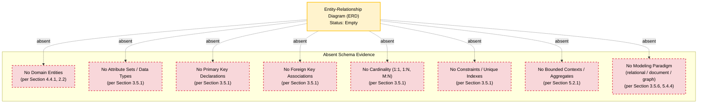

#### 6.2.6.2 Data Flow Diagram — Empty State

The requested data flow diagram cannot be populated because no producers, transformations, persistent sinks, or downstream consumers are documented. The empty-state visualization below depicts this absence, mirroring the pattern established by Section 5.2.5 and Section 4.5.1.

```mermaid
graph TD
    DFDRoot["Data Flow Diagram<br/>Status: Empty"]

    subgraph AbsentFlow["Absent Data Flow Evidence"]
        NoProducers["No Data Producers / Sources<br/>(per Section 5.2.3, 2.4.3)"]
        NoTransform["No Transformation Points<br/>(per Section 5.2.3)"]
        NoStores["No Data Stores / Persistent Sinks<br/>(per Section 3.5.1, 5.2.3)"]
        NoCaches["No Cache Tiers<br/>(per Section 3.5.4, 5.4.5)"]
        NoConsumers["No Downstream Consumers<br/>(per Section 5.2.4)"]
        NoTxBoundary["No Transaction Boundaries<br/>(per Section 4.4.1)"]
        NoConsistency["No Consistency Model<br/>(per Section 3.5.3)"]
        NoCDC["No Change-Data-Capture Stream<br/>(per Section 2.4.3)"]
        NoFormat["No Serialization / Contract Format<br/>(per Section 5.2.3)"]
    end

    DFDRoot -.absent.-> NoProducers
    DFDRoot -.absent.-> NoTransform
    DFDRoot -.absent.-> NoStores
    DFDRoot -.absent.-> NoCaches
    DFDRoot -.absent.-> NoConsumers
    DFDRoot -.absent.-> NoTxBoundary
    DFDRoot -.absent.-> NoConsistency
    DFDRoot -.absent.-> NoCDC
    DFDRoot -.absent.-> NoFormat

    classDef root fill:#fff3cd,stroke:#ffc107,stroke-width:2px,color:#000
    classDef absent fill:#f8d7da,stroke:#dc3545,stroke-width:2px,stroke-dasharray: 5 5,color:#000

    class DFDRoot root
    class NoProducers,NoTransform,NoStores,NoCaches,NoConsumers,NoTxBoundary,NoConsistency,NoCDC,NoFormat absent
```

#### 6.2.6.3 Replication Architecture Diagram — Empty State

The requested replication architecture diagram cannot be populated because no primary node, no replica topology, no synchronous / asynchronous mode, no consistency model, no multi-AZ / multi-region deployment, and no failover protocol are documented. The empty-state visualization below depicts this absence, mirroring the pattern established by Section 6.1.4 (Resilience Patterns).

```mermaid
graph TD
    ReplRoot["Replication Architecture<br/>Status: Empty"]

    subgraph AbsentReplication["Absent Replication Evidence"]
        NoPrimary["No Primary Node Identity<br/>(per Section 3.5.1, 5.4.4)"]
        NoReplicas["No Replica Count / Placement<br/>(per Section 6.1.4)"]
        NoTopology["No Replication Topology<br/>(single-primary / multi-primary / leaderless)<br/>(per Section 3.5.3)"]
        NoMode["No Sync / Async Mode<br/>(per Section 3.5.3, 6.1.4)"]
        NoConsistency["No Consistency Model<br/>(strong / eventual / causal)<br/>(per Section 3.5.3, 6.1.4)"]
        NoMultiAZ["No Multi-AZ / Multi-Region Posture<br/>(per Section 5.5.6, 6.1.4)"]
        NoLag["No Replica-Lag Tolerance<br/>(per Section 5.5.5)"]
        NoFailover["No Failover / Promotion Protocol<br/>(per Section 5.5.6, 6.1.4)"]
        NoBackup["No Cross-Region Backup Replication<br/>(per Section 5.5.6, 6.1.4)"]
    end

    ReplRoot -.absent.-> NoPrimary
    ReplRoot -.absent.-> NoReplicas
    ReplRoot -.absent.-> NoTopology
    ReplRoot -.absent.-> NoMode
    ReplRoot -.absent.-> NoConsistency
    ReplRoot -.absent.-> NoMultiAZ
    ReplRoot -.absent.-> NoLag
    ReplRoot -.absent.-> NoFailover
    ReplRoot -.absent.-> NoBackup

    classDef root fill:#fff3cd,stroke:#ffc107,stroke-width:2px,color:#000
    classDef absent fill:#f8d7da,stroke:#dc3545,stroke-width:2px,stroke-dasharray: 5 5,color:#000

    class ReplRoot root
    class NoPrimary,NoReplicas,NoTopology,NoMode,NoConsistency,NoMultiAZ,NoLag,NoFailover,NoBackup absent
```

#### 6.2.6.4 Consolidated Database Design Status Visualization

The following consolidated diagram mirrors the visualization pattern established in Section 5.2.5 (High-Level Architecture Status Visualization) and Section 6.1.2 (Service Interaction Status Visualization). It depicts the relationship between the database-design decisions reserved by this section, the absent repository evidence categories that would normally evidence those decisions, and the authoritative input sources designated by Section 6.2.7 to populate them.

```mermaid
graph TD
    DBDecision["Database Design<br/>(Not Applicable;<br/>Reserved pending ADR-003)"]

    subgraph AbsentEvidence["Absent Database Evidence"]
        NoDB["No database / persistence layer<br/>(per Section 3.5.1)"]
        NoSchema["No schema files / migrations<br/>(per Section 3.5.1)"]
        NoORM["No ORM model files<br/>(per Section 3.5.1)"]
        NoEntities["No domain entities<br/>(per Section 4.4.1)"]
        NoConsistency["No transactional consistency model<br/>(per Section 3.5.3)"]
        NoReplication["No replication topology<br/>(per Section 3.5.3, 6.1.4)"]
        NoBackup["No backup cadence / retention<br/>(per Section 2.5.5, 5.5.6)"]
        NoCache["No caching strategy<br/>(per Section 3.5.4, 5.4.5)"]
        NoStorage["No object / file / archival storage<br/>(per Section 3.5.5)"]
        NoCompliance["No regulatory scope<br/>(per Section 2.5.4)"]
        NoSLA["No performance / SLA targets<br/>(per Section 5.5.5)"]
    end

    subgraph InputSources["Authoritative Input Sources"]
        SolArch["Solution Architect<br/>(ADR-003 data storage,<br/>ADR-004 caching,<br/>schema design)"]
        DevTeam["Development Team<br/>(entity modeling,<br/>migration scripts,<br/>driver / pool config)"]
        IntLead["Integration Lead<br/>(data flow,<br/>CDC contracts)"]
        SRELead["SRE / Operations Lead<br/>(backup, RPO/RTO,<br/>replication, failover)"]
        SecLead["Security Lead<br/>(encryption,<br/>access controls,<br/>audit)"]
        Compliance["Compliance Officer<br/>(retention rules,<br/>privacy controls)"]
    end

    DBDecision -.precludes.-> NoDB
    DBDecision -.precludes.-> NoSchema
    DBDecision -.precludes.-> NoORM
    DBDecision -.precludes.-> NoEntities
    DBDecision -.precludes.-> NoConsistency
    DBDecision -.precludes.-> NoReplication
    DBDecision -.precludes.-> NoBackup
    DBDecision -.precludes.-> NoCache
    DBDecision -.precludes.-> NoStorage
    DBDecision -.precludes.-> NoCompliance
    DBDecision -.precludes.-> NoSLA

    SolArch -.will populate.-> DBDecision
    DevTeam -.will populate.-> DBDecision
    IntLead -.will populate.-> DBDecision
    SRELead -.will populate.-> DBDecision
    SecLead -.will populate.-> DBDecision
    Compliance -.will populate.-> DBDecision

    classDef decision fill:#cfe2ff,stroke:#0d6efd,stroke-width:2px,color:#000
    classDef absent fill:#f8d7da,stroke:#dc3545,stroke-width:2px,stroke-dasharray: 5 5,color:#000
    classDef pending fill:#fff3cd,stroke:#ffc107,stroke-width:2px,color:#000

    class DBDecision decision
    class NoDB,NoSchema,NoORM,NoEntities,NoConsistency,NoReplication,NoBackup,NoCache,NoStorage,NoCompliance,NoSLA absent
    class SolArch,DevTeam,IntLead,SRELead,SecLead,Compliance pending
```

---

### 6.2.7 Path Forward for Database Design Definition

#### 6.2.7.1 Required Inputs and Authoritative Sources

The following inputs are required to revisit and populate Section 6.2 authoritatively in subsequent revisions. This subsection inherits the authoritative-source mapping established in Section 5.7.1 and Section 6.1.5.1, projecting it onto the database-design dimensions enumerated by the section prompt.

| Required Input | Authoritative Source | Section 6.2 Subsection Populated |
|----------------|----------------------|------------------------------------|
| Data storage solution ratification (`ADR-003`) | Solution Architect / Development Team | 6.2.1, 6.2.2 |
| Caching strategy selection (`ADR-004`) | Solution Architect | 6.2.3.5, 6.2.5.2 |
| Disaster recovery posture (`ADR-008`, RPO / RTO) | SRE / Operations Lead | 6.2.2.6, 6.2.4.2 |
| Domain entity inventory and attribute sets | Solution Architect / Development Team | 6.2.2.1, 6.2.2.2 |
| Indexing strategy and query workload profile | Development Team / Solution Architect | 6.2.2.3, 6.2.5.1 |
| Partitioning / sharding approach | Solution Architect / SRE Lead | 6.2.2.4 |
| Replication configuration | Solution Architect / SRE Lead | 6.2.2.5 |
| Backup architecture and cadence | SRE / Operations Lead | 6.2.2.6 |
| Migration tooling and procedures | Development Team | 6.2.3.1, 6.2.3.2 |
| Archival and tiering policies | Solution Architect / Compliance Officer | 6.2.3.3 |
| Driver / client library and connection pooling | Development Team / SRE Lead | 6.2.3.4, 6.2.5.3 |
| Data retention rules and regulatory scope | Compliance Officer / Security Lead | 6.2.4.1, 6.2.4.3 |
| Privacy controls (encryption, masking, tokenization) | Security Lead | 6.2.4.3 |
| Audit mechanisms and log retention | Security Lead / SRE Lead | 6.2.4.4 |
| Database access controls (roles, grants, IAM) | Security Lead / Development Team | 6.2.4.5 |
| Query optimization and read/write splitting | Development Team / Solution Architect | 6.2.5.1, 6.2.5.4 |
| Batch processing approach and scheduling | Development Team / SRE Lead | 6.2.5.5 |

#### 6.2.7.2 Definition Sequence

Per the phased-evolution pattern established in Sections 2.7.2, 3.8.2, 4.7.2, 5.7.2, and 6.1.5.2, the following sequence is recommended for revisiting Section 6.2 once authoritative inputs become available. This sequence is interlocked with Phase 3 (Data Flow and Persistence Modeling) of the Section 5.7.2 phased sequence.

#### Phase 1: Persistence Need Confirmation and Applicability Re-Determination

The Solution Architect, in coordination with the Product Owner and Development Team, confirms whether the ratified architecture style and feature catalog require persistent storage. If the system remains stateless (e.g., a pure compute-only workflow with no entities to persist), Section 6.2.1 is amended in place to retain the non-applicable declaration with a documented rationale tied to the ratified architecture. If persistence is required, Phases 2 through 6 below proceed.

#### Phase 2: Data Storage Technology Ratification

The Solution Architect and the Development Team ratify the primary database technology and any companion stores (object storage, search index, cache tier). This phase produces `ADR-003` (Data Storage Solution Selection) per Section 5.4.1 and supersedes the forward-looking MongoDB / AWS S3 candidates catalogued in Section 3.5.6 and Section 5.4.4 with an evidence-bound decision. This phase enables population of Section 6.2.2.2 (Data Models and Structures) at the modeling-paradigm level.

#### Phase 3: Schema and Entity Modeling

The Solution Architect, in coordination with the Development Team and the Product Owner, defines domain entities, attribute sets, primary keys, foreign-key associations, cardinalities, and bounded contexts. This phase is interlocked with Section 2.2 (Feature Catalog) population, since entities derive from feature data domains. This phase enables population of Section 6.2.2.1 (Entity Relationships) and replaces the empty-state ERD in Section 6.2.6.1 with a content-bearing ERD.

#### Phase 4: Indexing, Partitioning, and Replication Specification

The Solution Architect and the SRE / Operations Lead specify indexing strategy (informed by query workload), partitioning approach (informed by data volume and locality requirements), and replication configuration (informed by RPO / RTO and consistency model). This phase enables population of Sections 6.2.2.3, 6.2.2.4, and 6.2.2.5, and replaces the empty-state replication architecture diagram in Section 6.2.6.3 with a content-bearing diagram.

#### Phase 5: Backup, Caching, and Data Management Codification

The SRE / Operations Lead defines backup cadence, retention tiers, restore procedures, and DR runbooks (interlocked with `ADR-008` and Section 5.5.6). The Solution Architect ratifies caching strategy (`ADR-004`) per Section 5.4.5. The Development Team selects migration tooling and defines versioning conventions. This phase populates Sections 6.2.2.6, 6.2.3.1 through 6.2.3.5.

#### Phase 6: Compliance and Performance Optimization

The Compliance Officer and Security Lead specify data retention rules, privacy controls, audit mechanisms, and access controls (interlocked with `ADR-005` Security Mechanism per Section 5.4.6). The Development Team and Solution Architect codify query optimization patterns, connection pooling, read/write splitting, and batch processing approach (interlocked with Section 5.5.5 performance SLAs). This phase populates Sections 6.2.4 and 6.2.5 and replaces the empty-state data flow diagram in Section 6.2.6.2 with a content-bearing diagram.

#### Phase 7: Cross-Section Consistency Reconciliation

The Solution Architect verifies that Section 6.2 is consistent with Sections 3.5 (Databases & Storage), 5.2.3 (Data Flow Description), 5.4.4 (Data Storage Rationale), 5.4.5 (Caching Strategy), 5.5.6 (Disaster Recovery), and 6.1.4 (Resilience — Data Redundancy), and that all `C-XXX`, `INT-XXX`, and `ADR-XXX` identifiers used in Section 6.2 are cross-referenced to their canonical definitions.

#### 6.2.7.3 Assumptions and Constraints

The following assumptions and constraints govern Section 6.2's current state, consistent with the pattern established in Sections 2.7.3, 3.8.3, 4.7.3, 5.7.3, and 6.1.5.3.

| Assumption / Constraint | Description |
|-------------------------|-------------|
| Repository State Assumption | The repository is assumed to be in a pre-implementation state per Section 1.1, not a partially synchronized or obscured state. The non-applicability declaration in Section 6.2.1 is grounded in this assumption. |
| Non-Applicability Declaration Bound | The "Database Design is not applicable" declaration is bounded to evidence observable in the repository at authoring time; it does not preclude future ratification of a persistence technology and is expected to be revisited as the repository evolves. |
| Evidence Boundary Constraint | Section 6.2 is constrained to evidence observable in the repository at authoring time; no external assumptions about domain entities, persistence needs, consistency targets, or compliance scope are incorporated. |
| Schema Forward-Compatibility Assumption | The placeholder dimensional tables for Schema Design, Data Management, Compliance, and Performance Optimization assume the structural categories requested by the section prompt remain applicable to Artifact10's eventual data architecture; they will be amended in place if the ratified database technology materially alters the schema set. |
| Identifier Convention Reservation | Section 6.2 inherits the `C-XXX`, `ADR-XXX`, and `INT-XXX` reservations from Section 5.1.2; `ADR-003` (Data Storage Solution), `ADR-004` (Caching Strategy), and `ADR-008` (Disaster Recovery Posture) are the ADRs most directly relevant to populating this section. |
| Default Stack Non-Endorsement | The Default Stack forward-looking candidates (MongoDB primary database, likely AWS S3 object storage if AWS is ratified) catalogued in Section 3.5.6 and Section 5.4.4 are explicitly **non-evidentiary** and require Solution Architect / Development Team ratification before they may be cited as a database-design decision. |
| Diagram Empty-State Discipline | All Mermaid diagrams in Section 6.2 are rendered as empty-state visualizations and do not represent fabricated entities, relationships, data flows, or replication topologies. Any future replacement of these diagrams with content-bearing diagrams (ERD with entities and attributes, content-bearing DFD with producers / sinks / transformations, replication topology with primary / replicas / consistency mode) must be traceable to the authoritative input sources designated in Section 6.2.7.1. |
| Four-Column Table Maximum | All tables in Section 6.2 conform to the four-column maximum established in Section 5.7.3. Where multi-attribute schemas would have exceeded four columns, the schema is decomposed into related dimensional tables joined by the dimension name. |
| Dependency on Upstream Section Population | Section 6.2 cannot be authoritatively populated until Sections 2.2 (Feature Catalog), 3.5 (Databases & Storage), 5.4 (Technical Decisions — specifically `ADR-003` and `ADR-004`), and 5.5.6 (Disaster Recovery Procedures) are populated. |
| Distinction from Section 6.1 Posture | Section 6.2 declares non-applicability under the explicit authorization of its section prompt, in contrast to Section 6.1 which adopted an undetermined-applicability posture because its prompt did not provide explicit non-applicable language. This distinction is intentional and traceable. |

#### 6.2.7.4 Version Tracking Reservation

A Section 6.2 version tracking table is reserved for future use to record amendments as persistence decisions, schema definitions, and operational policies are introduced. This mirrors the version tracking pattern established in Sections 2.7.4, 3.8.4, 4.7.4, 5.7.4, and 6.1.5.4.

| Version | Date | Subsection Amended | Change Summary |
|---------|------|---------------------|----------------|
| Not specified | Not specified | Not specified | Initial empty-state authoring; non-applicability declared per section-prompt direction; placeholder dimensional schemas, empty-state Mermaid diagrams (ERD, DFD, Replication), and Path Forward established |

Subsequent revisions are expected to record, at minimum: re-affirmation or rescission of the non-applicability declaration following `ADR-003` ratification, schema and entity model definition, indexing strategy specification, partitioning approach specification, replication topology specification, backup architecture specification, migration tooling selection, archival policy specification, caching strategy ratification (`ADR-004`), data retention and privacy control authoring, audit mechanism specification, database access-control authoring, query optimization specification, connection pooling configuration, read/write splitting specification, and batch processing approach specification.

---

### 6.2.8 References

#### Files Examined

- `README.md` — Sole repository file (12 bytes); content limited to the H1 Markdown heading `# Artifact10`; confirms pre-implementation state precluding evidence-based derivation of database schemas, persistence configurations, migration scripts, ORM models, replication topologies, backup architectures, or caching strategies. Sole evidentiary basis for the non-applicability declaration in Section 6.2.1.

#### Folders Explored

- `` (repository root, depth 0) — Confirmed to contain only `README.md`; no source folders, configuration directories, infrastructure-as-code folders, database schema directories, migration directories, or ORM model directories exist that would evidence persistence design.

#### Technical Specification Sections Cross-Referenced

- **Section 1.1 (Executive Summary)** — Established pre-implementation state with single README file as authoritative baseline.
- **Section 1.2 (System Overview)** — Confirmed absence of source code, package manifests, components, integrations, and database artifacts.
- **Section 1.4 (Documentation Integrity Statement)** — Source of evidence-based authoring discipline applied throughout this section; basis for explicit-absence-over-speculation principle.
- **Section 2.2 (Feature Catalog)** — Zero features defined, precluding feature-to-entity mapping and entity inventory.
- **Section 2.5 (Implementation Considerations)** — Section 2.5.2 explicitly records "Data Persistence Constraints: Not specified (no schema artifacts present)"; Section 2.5.4 records no regulatory compliance scope; Section 2.5.5 records "Backup and Disaster Recovery Expectations: Not specified."
- **Section 3.4 (Third-Party Services)** — No cloud platform, no managed-database service, no monitoring service, no authentication service integration; relevant to access controls and audit mechanisms.
- **Section 3.5 (Databases & Storage)** — **Primary source** for the non-applicability declaration. Section 3.5.1 confirms no database systems, persistence layers, schema definitions, storage volumes, caching tiers, or object-storage configurations. Sections 3.5.2 through 3.5.5 catalog absent dimensions across storage tiers, persistence strategy, caching, and storage services. Section 3.5.6 catalogs MongoDB and AWS S3 as non-evidentiary forward-looking candidates.
- **Section 4.4 (Technical Implementation Status)** — Section 4.4.1 confirms no state management, no transactions, no entities, no locking strategy, no event sourcing, no saga pattern.
- **Section 4.5 (Required Diagrams — Empty-State Visualizations)** — Source of empty-state Mermaid diagram pattern adopted in Section 6.2.6.
- **Section 5.1 (Section Authoring Methodology)** — Source of identifier conventions (`C-XXX`, `ADR-XXX`, `INT-XXX`) and Mermaid visualization conventions inherited by this section.
- **Section 5.2 (High-Level Architecture)** — Section 5.2.3 confirms no data flows, no transformation points, no data stores, no caches; foundational to the empty-state Data Flow Diagram (Section 6.2.6.2).
- **Section 5.4 (Technical Decisions)** — Section 5.4.1 catalogs `ADR-003` (Data Storage Solution), `ADR-004` (Caching Strategy), and `ADR-008` (Disaster Recovery Posture) as reserved ADRs governing future population of Section 6.2. Section 5.4.4 catalogs MongoDB and AWS S3 as non-evidentiary forward-looking candidates. Section 5.4.5 catalogs all caching-strategy dimensions as Not specified.
- **Section 5.5 (Cross-Cutting Concerns)** — Section 5.5.2 establishes absent logging / tracing posture relevant to audit mechanisms. Section 5.5.4 establishes absent AuthN / AuthZ framework relevant to database access controls. Section 5.5.5 establishes absent performance SLAs relevant to query optimization, indexing, and connection pooling. Section 5.5.6 establishes absent disaster recovery procedures relevant to backup architecture and replication.
- **Section 5.7 (Path Forward for System Architecture Definition)** — Source of phased-evolution pattern (Phase 3: Data Flow and Persistence Modeling) and authoritative-source mapping adopted in Section 6.2.7.
- **Section 6.1 (Core Services Architecture)** — **Direct sibling precedent** for empty-state authoring methodology, four-column-maximum table discipline, Mermaid visualization conventions, and Path Forward structure. Section 6.1.4 (Resilience Patterns — Data Redundancy) directly establishes absent replication and consistency dimensions relevant to Section 6.2.2.5 and the empty-state Replication Architecture diagram (Section 6.2.6.3). The distinction between Section 6.1's undetermined-applicability posture and Section 6.2's non-applicability declaration is documented in Section 6.2.1.3.

## 6.3 Integration Architecture

### 6.3.1 Applicability Determination

#### 6.3.1.1 Authoritative Position

**Integration Architecture is not applicable for this system at authoring time.**

The section prompt explicitly authorizes this declaration with the language: *"If the system does not require integration with external systems or services, clearly state 'Integration Architecture is not applicable for this system' and explain why."* This section adopts the **not-applicable** path on the following evidentiary basis:

- Per Section 1.2.1 (Integration with Existing Enterprise Landscape), *"No integration touchpoints, third-party service references, API contracts, message broker configurations, or enterprise system dependencies are documented. The repository contains no manifests, schemas, environment files, or descriptive documentation that would indicate planned integrations with surrounding systems."*
- Per Section 2.4.3 (Integration Points Status), all four integration dimensions — Internal Service-to-Service Integrations, External Third-Party Integrations, API Contracts and Interface Specifications, and Message Broker / Event Bus Topology — are recorded as **"None documented."**
- Per Section 3.4.1 (Third-Party Services — Current Repository Evidence), no third-party services, external APIs, SaaS integrations, authentication providers, monitoring platforms, or cloud-managed services are referenced within the Artifact10 repository.
- Per Section 3.4.3 (External API Integration Status), no API client configuration, no endpoint catalog, no contract definitions (OpenAPI/Swagger, gRPC `.proto`, GraphQL schemas, AsyncAPI), and no API key/secret management approach are present.
- Per Section 5.2.4 (External Integration Points), *"No external integration points exist."*
- Per Section 5.4.3 (Communication Pattern Choices), *"No communication pattern choices are documented."*
- Per Section 6.1.2 (Inter-Service Communication Patterns), all six communication dimensions (synchronous request/response, asynchronous messaging, event streaming, service mesh sidecar, contract format, serialization format) are recorded as **"None documented."**

An integration architecture — the catalog of external systems with which the system exchanges data; the protocols, contracts, and message formats governing those exchanges; the authentication, authorization, rate-limiting, and versioning policies applied to API surfaces; the message-processing topology spanning queues, streams, and batch pipelines; and the resilience patterns (retry, circuit-breaker, DLQ) protecting those interactions — cannot be authored in the absence of (a) a ratified architecture style, (b) defined system boundaries, (c) declared external systems with which to integrate, (d) communication pattern selections, and (e) a security framework defining identity and access. All five of these prerequisites are absent from the repository.

#### 6.3.1.2 Scope of the Non-Applicability Declaration

The non-applicability declaration is bounded in scope and time, consistent with the bounding pattern established in Section 6.2.1.2.

| Bound | Description |
|-------|-------------|
| Temporal scope | Applies at authoring time, based on the repository state established in Section 1.1 (Executive Summary): a single 12-byte `README.md` whose entire substantive content is the H1 Markdown heading `# Artifact10`. |
| Evidentiary scope | Applies to evidence observable in the repository at authoring time; no external assumptions about integration needs, external systems, or API surfaces are incorporated. |
| Forward-looking scope | Does **not** preclude future ratification of an integration architecture; if the repository evolves to introduce integration artifacts (API contracts, message broker configurations, third-party service clients, gateway definitions), this section is expected to be amended in place per the Path Forward in Section 6.3.6. |
| Forward-looking candidate scope | Does **not** ratify the Default Stack forward-looking candidates (AWS as cloud platform, Auth0 as authentication provider, Langchain as AI/LLM orchestration) catalogued in Section 3.4.7. Those candidates remain **non-evidentiary** and require Solution Architect ratification before they may be cited as integration-architecture decisions. |

#### 6.3.1.3 Distinction from Section 6.1 Authoring Posture

Section 6.1 (Core Services Architecture) adopted an **undetermined-applicability** posture because the architecture-style decision (`ADR-001`) is the prerequisite to determining whether a Core Services Architecture is required, and that decision is reserved pending Solution Architect ratification. The section prompt for Section 6.1 did not provide explicit "not applicable" language.

By contrast, the section prompt for Section 6.3 — like the section prompt for Section 6.2 — provides explicit language ("clearly state 'Integration Architecture is not applicable for this system' and explain why") that authorizes a not-applicable declaration whenever the system does not require integration with external systems or services. Because Section 1.2.1, Section 2.4.3, Section 3.4.1, Section 3.4.3, Section 5.2.4, Section 5.4.3, and Section 6.1.2 collectively establish categorical absence of every integration-architecture artifact category, the evidentiary threshold for non-applicability is satisfied.

This distinction is documented to make the differing authoring posture between sibling sections (6.1 undetermined-applicability; 6.2 and 6.3 non-applicability) traceable and intentional rather than incidental, mirroring the explicit precedent documented in Section 6.2.1.3.

#### 6.3.1.4 Authoring Discipline Inheritance

This section inherits the evidence-based discipline established by Section 1.4 (Documentation Integrity Statement) and reaffirmed in Section 5.1.1. Per Section 1.4.1, where standard Technical Specification subsections cannot be populated due to absent evidence, this absence is explicitly stated rather than filled with speculative content. Per Section 5.1.1, the Artifact10 repository is in a **pre-implementation state** containing a single file (`README.md`, 12 bytes) whose entire substantive content is the H1 Markdown heading `# Artifact10`.

Consequently, the remainder of Section 6.3 performs four operations consistent with the methodology of Section 5.1.1 and the precedent of Section 6.2:

1. Declares non-applicability with full evidentiary rationale (Section 6.3.1).
2. Preserves the structural schemas requested by the section prompt as empty-state documentation across API Design, Message Processing, and External Systems (Sections 6.3.2 through 6.3.4), so that future revisions may populate them in place.
3. Renders the required diagrams (integration flow, API architecture, message flow) and the supporting sequence diagram as empty-state Mermaid visualizations using the conventions established in Section 5.1.3 (Section 6.3.5).
4. Establishes a Path Forward (authoritative input sources, phased sequence, assumptions and constraints, version tracking) following the pattern of Section 5.7 and Section 6.2.7 (Section 6.3.6).

#### 6.3.1.5 Identifier Convention Inheritance

This section does not introduce new identifier conventions. It inherits and references the reservations established by Section 5.1.2 and Section 5.4.1:

| Identifier Convention | Domain | First Allocation Status |
|----------------------|--------|--------------------------|
| `INT-XXX` | External Integration Points (primary identifier convention for Section 6.3) | Reserved; first allocation `INT-001` |
| `ADR-XXX` | Architecture Decision Records | Reserved; `ADR-002` (Communication Pattern), `ADR-005` (Security Mechanism), `ADR-006` (Observability Stack), and `ADR-007` (Deployment Topology) are most directly relevant to populating this section |
| `C-XXX` | Architectural Components (including integration-edge components such as API gateways and message brokers) | Reserved; first allocation `C-001` |

The introduction of dedicated identifier namespaces for API endpoints (e.g., `API-XXX`), event topics (e.g., `EVT-XXX`), or message channels (e.g., `MSG-XXX`) is itself reserved for the Integration Lead and Solution Architect, contingent on whether the ratified integration architecture justifies dedicated namespaces beyond `INT-XXX`.

#### 6.3.1.6 Mermaid Visualization Inheritance

All Mermaid diagrams in this section adopt the class definitions and edge-label conventions established in Section 5.1.3 and exemplified in Sections 5.2.5, 6.1, and 6.2.6:

- `decision` (blue, `fill:#cfe2ff,stroke:#0d6efd,stroke-width:2px`) — elements reserved for future ratification
- `absent` (red dashed, `fill:#f8d7da,stroke:#dc3545,stroke-width:2px,stroke-dasharray: 5 5`) — unpopulated integration dimensions
- `pending` (yellow, `fill:#fff3cd,stroke:#ffc107,stroke-width:2px`) — forward-looking input sources
- `root` (yellow, same as pending) — diagram root nodes anchoring empty-state visualizations

Edge-label semantics:

- `-.absent.->` — direct absence relationship
- `-.precludes.->` — absence of one dimension prevents derivation of another
- `-.will populate.->` — authoritative input source will eventually populate the decision

---

### 6.3.2 API Design — Empty-State Documentation

The section prompt enumerates six API-design dimensions: protocol specifications, authentication methods, authorization framework, rate limiting strategy, versioning approach, and documentation standards. Each dimension is rendered as an empty-state schema below, with absence traced to the source-section findings. These schemas are preserved to enable in-place population once `ADR-002` (Communication Pattern Selection) and `ADR-005` (Authentication and Authorization Mechanism) are ratified by the Solution Architect.

#### 6.3.2.1 Protocol Specifications

**No API protocol specifications are documented.** Protocol specifications — the selection between REST, gRPC, GraphQL, WebSocket, AsyncAPI/MQTT, SOAP, or hybrid protocol surfaces; the serialization format (JSON, Protobuf, Avro, MessagePack, XML); and the transport-layer profile (HTTP/1.1, HTTP/2, HTTP/3, TLS version, cipher suite) — presuppose the existence of an API surface to be served and a client population to be supported. Per Section 6.1.2 (Inter-Service Communication Patterns), all protocol-related dimensions (Synchronous Request/Response, Contract Format, Serialization Format) are recorded as **None documented**. Per Section 3.4.3 (External API Integration Status), no API client configuration, endpoint catalog, or contract definitions exist.

| Protocol Specification Dimension | Repository Evidence | Cross-Reference |
|----------------------------------|---------------------|-----------------|
| API Surface Protocol (REST / gRPC / GraphQL / WebSocket / SOAP / Hybrid) | None documented | Section 6.1.2, 3.4.3 |
| Serialization Format (JSON / Protobuf / Avro / MessagePack / XML) | None documented | Section 6.1.2 |
| Transport Profile (HTTP/1.1 / HTTP/2 / HTTP/3) | None documented | Section 5.4.3 |
| TLS Version and Cipher Suite | None documented | Section 5.5.4 |
| Content-Type Negotiation Strategy | None documented | Section 3.4.3 |
| Compression (gzip / brotli / zstd) | None documented | Section 5.5.5 |

Protocol specification selection is reserved for the **Solution Architect** and the **Integration Lead** and contributes to `ADR-002` (Communication Pattern Selection).

#### 6.3.2.2 Authentication Methods

**No authentication methods are documented.** Authentication methods at the API edge — the identity provider integration; the credential format (API key, bearer token, OAuth 2.0 access token, OIDC ID token, mTLS client certificate, AWS SigV4); the token lifetime and refresh policy; and the multi-factor enforcement posture — presuppose a ratified identity provider and a defined trust boundary. Per Section 5.5.4 (Authentication and Authorization Framework), no identity provider integration, no token format, no MFA posture, and no audit log retention are documented. Per Section 3.4.4 (Authentication Service Status), no authentication or identity-provider integration is present.

The Default Stack forward-looking candidate (per Section 3.4.7) is **Auth0**. Per Section 5.4.6 (Security Mechanism Selection), this candidate is non-evidentiary and validation-required.

| Authentication Method Dimension | Repository Evidence | Cross-Reference |
|---------------------------------|---------------------|-----------------|
| Identity Provider Integration | None documented | Section 3.4.4, 5.5.4 |
| Credential Format (API key / Bearer JWT / OAuth 2.0 / OIDC / mTLS / SigV4) | None documented | Section 5.5.4 |
| Token Lifetime and Refresh Policy | None documented | Section 5.5.4 |
| Multi-Factor Authentication (MFA) Posture | None documented | Section 3.7.3, 5.5.4 |
| Federation Protocol (OAuth 2.0 / OIDC / SAML) | None documented | Section 3.4.4 |
| Anonymous / Public Endpoint Policy | None documented | Section 5.5.4 |
| Service-to-Service Authentication (mTLS / Workload Identity) | None documented | Section 6.1.2 |

Authentication method selection is reserved for the **Solution Architect** and the **Security Lead** and contributes to `ADR-005` (Authentication and Authorization Mechanism).

#### 6.3.2.3 Authorization Framework

**No authorization framework is documented.** Authorization framework — the access-control model (RBAC, ABAC, ReBAC, ACL); the policy-definition language and storage; the authorization checkpoint catalog (where in the request pipeline access decisions are made); the scope/permission taxonomy; and the audit logging of access decisions — presupposes an authentication framework and a defined resource taxonomy. Per Section 5.5.4, no authorization model (RBAC / ABAC / ReBAC), no authorization checkpoint catalog, and no audit log retention are documented. Per Section 2.5.4 (Security Implications Status), the *Authentication / Authorization Model* dimension is recorded as **Not specified**.

| Authorization Framework Dimension | Repository Evidence | Cross-Reference |
|-----------------------------------|---------------------|-----------------|
| Access-Control Model (RBAC / ABAC / ReBAC / ACL) | None documented | Section 5.5.4 |
| Policy-Definition Language (OPA Rego / Cedar / Casbin / custom) | None documented | Section 5.5.4 |
| Policy Storage and Distribution | None documented | Section 5.5.4 |
| Authorization Checkpoint Catalog | None documented | Section 5.5.4 |
| Scope / Permission Taxonomy | None documented | Section 5.5.4 |
| Decision Audit Logging | None documented | Section 5.5.2, 5.5.4 |
| Resource Ownership / Tenancy Model | None documented | Section 3.7.3 |

Authorization framework selection is reserved for the **Security Lead** in coordination with the **Solution Architect** and contributes to `ADR-005`.

#### 6.3.2.4 Rate Limiting Strategy

**No rate limiting strategy is documented.** Rate limiting strategy — the throttling algorithm (fixed window, sliding window, token bucket, leaky bucket); the quota granularity (per-IP, per-API-key, per-user, per-tenant); the limit tier structure; the response semantics on exceedance (HTTP 429, `Retry-After`, request shedding); and the back-pressure propagation to upstream callers — presupposes an API surface, an admission-control tier, and observable workload characteristics. Per Section 2.5.4 (Security Implications Status), no rate-limiting or admission-control policy is documented. Per Section 6.1.4 (Service Degradation Policies), *Rate Limiting and Quota Enforcement* is recorded as **None documented**.

| Rate Limiting Dimension | Repository Evidence | Cross-Reference |
|-------------------------|---------------------|-----------------|
| Throttling Algorithm (fixed / sliding window / token bucket / leaky bucket) | None documented | Section 2.5.4 |
| Quota Granularity (per-IP / per-API-key / per-user / per-tenant) | None documented | Section 6.1.4 |
| Limit Tier Structure (free / standard / premium / internal) | None documented | Section 2.5.4 |
| Exceedance Response (HTTP 429, `Retry-After`, shedding) | None documented | Section 5.5.3 |
| Back-Pressure Propagation Strategy | None documented | Section 6.1.4 |
| Burst Allowance and Refill Cadence | None documented | Section 5.5.5 |
| Distributed Counter Storage (Redis, DynamoDB, in-memory + sync) | None documented | Section 3.5.4 |

Rate limiting strategy selection is reserved for the **Security Lead** and the **SRE / Operations Lead** in coordination with the **Integration Lead**.

#### 6.3.2.5 Versioning Approach

**No API versioning approach is documented.** API versioning approach — the version identifier convention (URL path versioning, header-based versioning, media-type versioning, query-parameter versioning); the deprecation window and sunset policy; the backward / forward compatibility contract; and the multi-version coexistence strategy — presupposes a defined API surface and a release process. Per Section 5.2.3 (Integration Patterns and Protocols), no integration patterns or protocols are documented. Per Section 3.4.3, no contract definitions exist that would carry a version identifier.

| Versioning Dimension | Repository Evidence | Cross-Reference |
|----------------------|---------------------|-----------------|
| Version Identifier Convention (URL / header / media-type / query) | None documented | Section 5.2.3 |
| SemVer / CalVer Adoption | None documented | Section 3.4.3 |
| Deprecation Window and Sunset Policy | None documented | Section 3.4.3 |
| Backward / Forward Compatibility Contract | None documented | Section 5.2.3 |
| Multi-Version Coexistence Strategy | None documented | Section 5.2.3 |
| Breaking-Change Communication Channel | None documented | Section 5.5.2 |
| Client SDK Versioning Alignment | None documented | Section 3.4.3 |

API versioning approach selection is reserved for the **Integration Lead** and the **Solution Architect**.

#### 6.3.2.6 Documentation Standards

**No API documentation standards are documented.** API documentation standards — the contract format (OpenAPI/Swagger, gRPC `.proto`, GraphQL SDL, AsyncAPI), the documentation generation tooling, the publication channel (developer portal, internal wiki, embedded SwaggerUI), the example payload catalog, and the changelog convention — presuppose an extant API surface. Per Section 3.4.3, *"no contract definitions (OpenAPI/Swagger, gRPC `.proto`, GraphQL schemas, AsyncAPI) ... are present."* Per Section 6.1.2, the *Contract Format* dimension is recorded as **None documented**.

| Documentation Standard Dimension | Repository Evidence | Cross-Reference |
|----------------------------------|---------------------|-----------------|
| Contract Format (OpenAPI 3.x / gRPC `.proto` / GraphQL SDL / AsyncAPI) | None documented | Section 3.4.3, 6.1.2 |
| Documentation Generation Tooling | None documented | Section 3.4.3 |
| Developer Portal / Publication Channel | None documented | Section 3.4.3 |
| Example Payload and Code Sample Catalog | None documented | Section 3.4.3 |
| Changelog / Release Notes Convention | None documented | Section 3.4.3 |
| Contract-First vs. Code-First Workflow | None documented | Section 3.4.3 |
| Schema Registry Integration (for Protobuf / Avro) | None documented | Section 6.1.2 |

Documentation standard selection is reserved for the **Integration Lead** and the **Development Team**.

---

### 6.3.3 Message Processing — Empty-State Documentation

The section prompt enumerates five message-processing dimensions: event processing patterns, message queue architecture, stream processing design, batch processing flows, and error handling strategy. Each dimension is rendered as an empty-state schema below.

#### 6.3.3.1 Event Processing Patterns

**No event processing patterns are documented.** Event processing patterns — event sourcing posture; CQRS adoption; event taxonomy (domain events, integration events, command events); event schema evolution policy; event delivery semantics (at-most-once, at-least-once, exactly-once); ordering guarantees; and idempotency strategy — presuppose an extant event-driven architecture and a defined domain model. Per Section 4.4.1 (State Management Status), no event sourcing posture, no transaction boundaries, no saga / distributed transaction patterns, and no idempotency / exactly-once guarantees are documented. Per Section 5.2.3 (Data Flow Description), no data flows or transformation points are derivable. Per Section 6.1.2, *Event Streaming (Kafka, Kinesis, Pulsar)* is recorded as **None documented**.

| Event Processing Dimension | Repository Evidence | Cross-Reference |
|----------------------------|---------------------|-----------------|
| Event Sourcing Posture | None documented | Section 4.4.1 |
| CQRS Adoption | None documented | Section 4.4.1, 6.1.3 |
| Event Taxonomy (domain / integration / command) | None documented | Section 4.4.1 |
| Event Schema Evolution Policy | None documented | Section 5.2.3 |
| Delivery Semantics (at-most-once / at-least-once / exactly-once) | None documented | Section 4.4.1, 6.1.4 |
| Ordering Guarantee (global / per-key / none) | None documented | Section 6.1.2 |
| Idempotency Strategy (idempotency keys / dedup window) | None documented | Section 4.4.1, 6.1.4 |
| Outbox / Inbox Pattern | None documented | Section 4.4.1 |

Event processing pattern selection is reserved for the **Solution Architect** in coordination with the **Development Team** and contributes to `ADR-002`.

#### 6.3.3.2 Message Queue Architecture

**No message queue architecture is documented.** Message queue architecture — the broker technology selection (RabbitMQ, ActiveMQ, AWS SQS, Azure Service Bus, GCP Pub/Sub, NATS); the topology (point-to-point, publish-subscribe, fan-out, work-queue); the durability and persistence guarantees; the consumer-group / competing-consumer model; the message TTL and retention; and the dead-letter routing — presupposes a ratified messaging platform and a defined producer/consumer inventory. Per Section 2.4.3, *Message Broker / Event Bus Topology* is recorded as **None documented**. Per Section 3.4.1, no messaging / event services are referenced. Per Section 6.1.2, *Asynchronous Messaging (queue, pub/sub)* is recorded as **None documented**.

| Message Queue Dimension | Repository Evidence | Cross-Reference |
|--------------------------|---------------------|-----------------|
| Broker Technology Selection | None documented | Section 2.4.3, 3.4.1 |
| Topology (point-to-point / pub-sub / fan-out / work-queue) | None documented | Section 6.1.2 |
| Durability and Persistence Guarantee | None documented | Section 4.4.1 |
| Consumer-Group / Competing-Consumer Model | None documented | Section 6.1.2 |
| Message TTL and Retention Policy | None documented | Section 5.5.6 |
| Dead-Letter Routing Strategy | None documented | Section 5.5.3, 6.1.4 |
| Poison-Pill Handling | None documented | Section 5.5.3 |
| Message-Size Constraints and Chunking | None documented | Section 5.5.5 |

Message queue architecture selection is reserved for the **Solution Architect** and the **Integration Lead** in coordination with the **Development Team**.

#### 6.3.3.3 Stream Processing Design

**No stream processing design is documented.** Stream processing design — the platform selection (Kafka Streams, Apache Flink, Apache Spark Streaming, AWS Kinesis Data Analytics, Apache Beam, ksqlDB); the processing model (windowed aggregation, joins, stateful transformations); the state-store backend; the watermarking and late-arrival policy; the exactly-once processing guarantees; and the topology topology / DAG composition — presupposes a ratified streaming platform and a defined event volume. Per Section 6.1.2, *Event Streaming (Kafka, Kinesis, Pulsar)* is recorded as **None documented**. Per Section 4.4.1, no state management strategy is documented.

| Stream Processing Dimension | Repository Evidence | Cross-Reference |
|-----------------------------|---------------------|-----------------|
| Streaming Platform Selection (Kafka Streams / Flink / Spark / Beam / Kinesis Analytics) | None documented | Section 6.1.2, 3.4.1 |
| Processing Model (windowed / joins / stateful transformations) | None documented | Section 4.4.1 |
| State-Store Backend (RocksDB / managed / in-memory) | None documented | Section 4.4.1, 3.5.4 |
| Watermarking and Late-Arrival Policy | None documented | Section 5.5.5 |
| Exactly-Once Processing Guarantee | None documented | Section 4.4.1, 6.1.4 |
| Topology / DAG Composition | None documented | Section 5.2.3 |
| Backpressure and Flow-Control Strategy | None documented | Section 6.1.4 |
| Checkpointing Cadence and Storage | None documented | Section 5.5.6 |

Stream processing design is reserved for the **Solution Architect** and the **Development Team** in coordination with the **SRE / Operations Lead**.

#### 6.3.3.4 Batch Processing Flows

**No batch processing flows are documented.** Batch processing flows — the scheduler selection (cron, Apache Airflow, AWS Step Functions, Kubernetes CronJob, Azure Data Factory, GCP Cloud Composer); the batch window definition; the input / output dataset catalog; the chunking and pagination strategy; the idempotency guarantee on partial-failure re-runs; the lineage and observability instrumentation; and the SLA for completion — presuppose a runtime platform and a defined job catalog. Per Section 6.2.5.5 (Batch Processing Approach), all batch processing dimensions (scheduler, window, chunking, idempotency, recovery, observability) are recorded as **None documented**. Per Section 6.1.3 (Performance Optimization Techniques), *Asynchronous Processing / Background Jobs* is recorded as **None documented**.

| Batch Processing Dimension | Repository Evidence | Cross-Reference |
|----------------------------|---------------------|-----------------|
| Scheduler Selection (cron / Airflow / Step Functions / K8s CronJob / Composer) | None documented | Section 6.2.5.5, 3.6 |
| Batch Window Definition | None documented | Section 6.2.5.5 |
| Input / Output Dataset Catalog | None documented | Section 5.2.3 |
| Chunking and Pagination Strategy | None documented | Section 6.2.5.5 |
| Idempotency Guarantee on Re-Run | None documented | Section 4.4.1, 6.2.5.5 |
| Lineage / Observability Instrumentation | None documented | Section 5.5.1 |
| Completion SLA and Late-Run Escalation | None documented | Section 5.5.5 |
| Partial-Failure Recovery and Restart Strategy | None documented | Section 5.5.3, 6.1.4 |

Batch processing flow design is reserved for the **Development Team** and the **SRE / Operations Lead** in coordination with the **Integration Lead**.

#### 6.3.3.5 Error Handling Strategy

**No error handling strategy is documented.** Per Section 4.4.2 (Error Handling Status) and Section 5.5.3 (Error Handling Patterns), no exception taxonomy, retry mechanism (backoff, jitter, max attempts), fallback strategy (degraded-mode behavior), error notification flow, recovery procedure, circuit-breaker pattern, or dead-letter queue strategy exists. Per Section 6.1.4 (Fault Tolerance Mechanisms), no fault tolerance dimension is documented. These findings are foundational to Section 6.3.3.5 and are re-stated here for completeness in the integration-architecture context.

| Error Handling Dimension | Repository Evidence | Cross-Reference |
|--------------------------|---------------------|-----------------|
| Exception Taxonomy (transient / permanent / poison) | None documented | Section 4.4.2, 5.5.3 |
| Retry Policy (max attempts, total deadline) | None documented | Section 5.5.3, 6.1.2 |
| Backoff Strategy (exponential / linear / jittered) | None documented | Section 5.5.3, 6.1.2 |
| Circuit-Breaker Pattern (thresholds, half-open) | None documented | Section 5.5.3, 6.1.2 |
| Dead-Letter Queue (DLQ) Strategy | None documented | Section 5.5.3, 6.1.4 |
| Fallback / Degraded-Mode Behavior | None documented | Section 5.5.3, 6.1.4 |
| Idempotency Key Convention | None documented | Section 4.4.1, 6.1.4 |
| Error Notification Channels | None documented | Section 3.4.5, 5.5.3 |
| Recovery Procedures and Runbooks | None documented | Section 2.5.5, 5.5.3 |

Error handling strategy selection is reserved for the **Development Team** and the **SRE / Operations Lead**.

---

### 6.3.4 External Systems — Empty-State Documentation

The section prompt enumerates four external-systems dimensions: third-party integration patterns, legacy system interfaces, API gateway configuration, and external service contracts. Each dimension is rendered as an empty-state schema below. Throughout this subsection, the `INT-XXX` identifier convention reserved by Section 5.1.2 will be applied as integration touchpoints are catalogued; no `INT-XXX` allocations exist at authoring time.

#### 6.3.4.1 Third-Party Integration Patterns

**No third-party integration patterns are documented.** Per Section 3.4.1 (Third-Party Services — Current Repository Evidence), *"No third-party services, external APIs, SaaS integrations, authentication providers, monitoring platforms, or cloud-managed services are referenced within the Artifact10 repository."* Per Section 5.2.4 (External Integration Points), *"No external integration points exist."* The empty-state schema below preserves the structure requested by the section prompt; the five attributes customary for an integration catalog (System Name, Integration Type, Data Exchange Pattern, Protocol/Format, SLA Requirements) are split across two tables to comply with the four-column maximum established in Section 5.7.3.

**Table A — Third-Party Integration Identity and Pattern**

| Integration ID | System Name | Integration Type | Data Exchange Pattern |
|----------------|-------------|------------------|------------------------|
| Not specified | Not specified | Not specified | Not specified |

**Table B — Third-Party Integration Protocol and SLA**

| Integration ID | Protocol / Format | SLA Requirements | Evidence Source |
|----------------|--------------------|------------------|------------------|
| Not specified | Not specified | Not specified | No third-party services documented (per Section 3.4.1) |

Forward-looking candidates catalogued in Section 3.4.7 (AWS as cloud platform, Auth0 as authentication provider) are explicitly **non-evidentiary** and carry "Validation Required: Yes" status pending Solution Architect ratification. They are not enumerated above because they have not been ratified as integrations.

Third-party integration pattern selection and cataloguing is reserved for the **Integration Lead** and the **Solution Architect**.

#### 6.3.4.2 Legacy System Interfaces

**No legacy system interfaces are documented.** Per Section 1.2.1 (Integration with Existing Enterprise Landscape), *"No integration touchpoints, third-party service references, API contracts, message broker configurations, or enterprise system dependencies are documented."* The repository contains no enterprise landscape descriptors, no system-of-record references, no file-transfer (SFTP / FTPS / S3-based) integration definitions, and no message-bridge configurations that would indicate planned interfaces with legacy systems.

| Legacy Interface Dimension | Repository Evidence | Cross-Reference |
|-----------------------------|---------------------|-----------------|
| Legacy System Inventory | None documented | Section 1.2.1 |
| Interface Protocol (SOAP / EDI / SFTP / Fixed-Width File / Mainframe Adapter) | None documented | Section 1.2.1, 3.4.3 |
| Adapter / Anti-Corruption Layer Design | None documented | Section 5.2.1 |
| Data Format Bridging (XML↔JSON, EBCDIC↔UTF-8, CSV↔JSON) | None documented | Section 5.2.3 |
| Synchronization Cadence (real-time / scheduled / on-demand) | None documented | Section 6.2.5.5 |
| Reconciliation and Audit Strategy | None documented | Section 5.5.2 |
| Legacy Authentication Bridging | None documented | Section 5.5.4 |

Legacy system interface specification is reserved for the **Integration Lead** in coordination with the **Solution Architect**.

#### 6.3.4.3 API Gateway Configuration

**No API gateway configuration is documented.** API gateway configuration — the gateway technology selection (AWS API Gateway, Kong, Apigee, NGINX, Envoy, Istio Ingress, Azure API Management, GCP API Gateway); the route definitions; the policy plugins (authentication, rate limiting, request/response transformation, CORS, IP filtering); the upstream backend catalog; and the deployment topology (regional, edge-deployed, multi-region) — presuppose a ratified cloud platform / ingress tier and a defined API surface. Per Section 3.4.6 (Cloud Services Status), *"No cloud platform usage is documented."* Per Section 6.1.2 (Service Mesh Sidecar) and Section 6.1.2 (Load Balancing Strategy), no ingress controller or service mesh data plane is configured.

| API Gateway Dimension | Repository Evidence | Cross-Reference |
|-----------------------|---------------------|-----------------|
| Gateway Technology Selection | None documented | Section 3.4.6, 6.1.2 |
| Route Definitions and Path Catalog | None documented | Section 3.4.3 |
| Authentication Policy Integration | None documented | Section 5.5.4 |
| Rate Limiting Policy Plugin | None documented | Section 2.5.4 |
| Request / Response Transformation Plugin | None documented | Section 5.2.3 |
| CORS / Origin Whitelist Policy | None documented | Section 5.5.4 |
| Upstream Backend Catalog | None documented | Section 5.2.2 |
| Deployment Topology (regional / edge / multi-region) | None documented | Section 5.5.6 |
| TLS Termination and Certificate Management | None documented | Section 5.5.4 |
| Observability Integration (access logs, metrics, traces) | None documented | Section 5.5.1, 5.5.2 |

API gateway configuration is reserved for the **Integration Lead** and the **SRE / Operations Lead** in coordination with the **Solution Architect**.

#### 6.3.4.4 External Service Contracts

**No external service contracts are documented.** External service contracts — the SLA / SLO commitments by external counterparty (availability, latency p95/p99, throughput ceiling, error budget); the data-sharing agreement; the security / compliance attestation (SOC 2, ISO 27001, HIPAA BAA, PCI-DSS); the failure / outage notification channel; the change-management coordination protocol; and the version-lifecycle alignment — presuppose ratified external integrations and contractual relationships. Per Section 5.2.4, no `INT-XXX` allocations have been made; per Section 3.4.7, the forward-looking candidates (AWS, Auth0) carry "no version, region, tier, or SLA commitments and shall not be construed as procured or provisioned services."

| External Service Contract Dimension | Repository Evidence | Cross-Reference |
|--------------------------------------|---------------------|-----------------|
| SLA / SLO Commitments (availability, latency, throughput, error budget) | None documented | Section 3.4.7, 5.5.5 |
| Data-Sharing Agreement | None documented | Section 2.5.4 |
| Security / Compliance Attestation (SOC 2 / ISO 27001 / HIPAA BAA / PCI-DSS) | None documented | Section 2.5.4 |
| Failure / Outage Notification Channel | None documented | Section 3.4.5 |
| Change-Management Coordination Protocol | None documented | Section 3.4.3 |
| Version-Lifecycle Alignment | None documented | Section 3.4.3 |
| Cost / Pricing Tier and Quota Allocation | None documented | Section 3.4.7 |
| Termination / Off-Boarding Clause | None documented | Section 2.5.4 |

External service contract authoring is reserved for the **Integration Lead** and the **Solution Architect** in coordination with the **Compliance Officer** and the **Procurement / Vendor Management** function.

---

### 6.3.5 Required Diagrams — Empty-State Visualizations

The section prompt requires three Mermaid diagrams (integration flow, API architecture, message flow) plus sequence diagrams for key flows. Because no integrations, no API surface, no message-processing topology, and no key flows exist in the repository, each required diagram is rendered as an empty-state visualization. These diagrams adopt the class definitions and edge-label conventions established in Section 5.1.3 and exemplified in Sections 4.5, 5.2.5, 6.1, and 6.2.6.

#### 6.3.5.1 Integration Flow Diagram — Empty State

The requested integration flow diagram cannot be populated because no integration touchpoints, no participating systems, no exchange directions, no protocols, no transformation steps, and no SLA bindings are documented. The empty-state visualization below depicts this absence.

```mermaid
graph TD
    IntFlowRoot["Integration Flow Diagram<br/>Status: Empty"]

    subgraph AbsentIntegrationFlow["Absent Integration Flow Evidence"]
        NoPartners["No Partner Systems / Counterparties<br/>(per Section 1.2.1, 3.4.1)"]
        NoTouchpoints["No Integration Touchpoints<br/>(per Section 2.4.3, 5.2.4)"]
        NoProtocols["No Protocols / Formats<br/>(per Section 3.4.3, 6.1.2)"]
        NoDirection["No Exchange Direction<br/>(inbound / outbound / bidirectional)<br/>(per Section 2.4.3)"]
        NoTransform["No Transformation Steps<br/>(per Section 5.2.3)"]
        NoSync["No Synchronization Cadence<br/>(per Section 6.2.5.5)"]
        NoSLA["No SLA / SLO Bindings<br/>(per Section 5.5.5)"]
        NoContracts["No Contract Definitions<br/>(OpenAPI / AsyncAPI / Proto)<br/>(per Section 3.4.3)"]
        NoAuth["No Authentication Binding<br/>(per Section 5.5.4)"]
        NoGateway["No Gateway / Adapter Tier<br/>(per Section 3.4.6, 6.1.2)"]
    end

    IntFlowRoot -.absent.-> NoPartners
    IntFlowRoot -.absent.-> NoTouchpoints
    IntFlowRoot -.absent.-> NoProtocols
    IntFlowRoot -.absent.-> NoDirection
    IntFlowRoot -.absent.-> NoTransform
    IntFlowRoot -.absent.-> NoSync
    IntFlowRoot -.absent.-> NoSLA
    IntFlowRoot -.absent.-> NoContracts
    IntFlowRoot -.absent.-> NoAuth
    IntFlowRoot -.absent.-> NoGateway

    classDef root fill:#fff3cd,stroke:#ffc107,stroke-width:2px,color:#000
    classDef absent fill:#f8d7da,stroke:#dc3545,stroke-width:2px,stroke-dasharray: 5 5,color:#000

    class IntFlowRoot root
    class NoPartners,NoTouchpoints,NoProtocols,NoDirection,NoTransform,NoSync,NoSLA,NoContracts,NoAuth,NoGateway absent
```

#### 6.3.5.2 API Architecture Diagram — Empty State

The requested API architecture diagram cannot be populated because no API surface protocol, no endpoint catalog, no authentication tier, no authorization framework, no rate-limiting tier, no versioning convention, no documentation contract, and no gateway / ingress tier are documented. The empty-state visualization below depicts this absence.

```mermaid
graph TD
    APIArchRoot["API Architecture Diagram<br/>Status: Empty"]

    subgraph AbsentAPIArch["Absent API Architecture Evidence"]
        NoProtocol["No API Protocol<br/>(REST / gRPC / GraphQL)<br/>(per Section 6.1.2, 3.4.3)"]
        NoEndpoints["No Endpoint Catalog<br/>(per Section 3.4.3)"]
        NoAuthN["No Authentication Tier<br/>(per Section 3.4.4, 5.5.4)"]
        NoAuthZ["No Authorization Framework<br/>(per Section 5.5.4)"]
        NoRateLimit["No Rate-Limiting Tier<br/>(per Section 2.5.4)"]
        NoVersion["No Versioning Convention<br/>(per Section 5.2.3)"]
        NoDocs["No Documentation Standard<br/>(OpenAPI / AsyncAPI / Proto)<br/>(per Section 3.4.3)"]
        NoGateway["No API Gateway / Ingress<br/>(per Section 3.4.6, 6.1.2)"]
        NoTLS["No TLS Termination Policy<br/>(per Section 5.5.4)"]
        NoObsv["No API Observability<br/>(access logs, metrics, traces)<br/>(per Section 5.5.1, 5.5.2)"]
    end

    APIArchRoot -.absent.-> NoProtocol
    APIArchRoot -.absent.-> NoEndpoints
    APIArchRoot -.absent.-> NoAuthN
    APIArchRoot -.absent.-> NoAuthZ
    APIArchRoot -.absent.-> NoRateLimit
    APIArchRoot -.absent.-> NoVersion
    APIArchRoot -.absent.-> NoDocs
    APIArchRoot -.absent.-> NoGateway
    APIArchRoot -.absent.-> NoTLS
    APIArchRoot -.absent.-> NoObsv

    classDef root fill:#fff3cd,stroke:#ffc107,stroke-width:2px,color:#000
    classDef absent fill:#f8d7da,stroke:#dc3545,stroke-width:2px,stroke-dasharray: 5 5,color:#000

    class APIArchRoot root
    class NoProtocol,NoEndpoints,NoAuthN,NoAuthZ,NoRateLimit,NoVersion,NoDocs,NoGateway,NoTLS,NoObsv absent
```

#### 6.3.5.3 Message Flow Diagram — Empty State

The requested message flow diagram cannot be populated because no producers, no brokers / topics / queues, no consumers, no event taxonomy, no delivery semantics, no ordering guarantees, no dead-letter routing, and no observability instrumentation are documented. The empty-state visualization below depicts this absence, mirroring the pattern established by Section 6.2.6.2 (Data Flow Diagram).

```mermaid
graph TD
    MsgFlowRoot["Message Flow Diagram<br/>Status: Empty"]

    subgraph AbsentMsgFlow["Absent Message Flow Evidence"]
        NoProducers["No Message Producers<br/>(per Section 2.4.3, 5.2.3)"]
        NoBroker["No Broker / Topic / Queue<br/>(per Section 2.4.3, 3.4.1)"]
        NoConsumers["No Message Consumers<br/>(per Section 6.1.2)"]
        NoTaxonomy["No Event / Message Taxonomy<br/>(per Section 4.4.1)"]
        NoSemantics["No Delivery Semantics<br/>(at-most / at-least / exactly-once)<br/>(per Section 4.4.1, 6.1.4)"]
        NoOrdering["No Ordering Guarantee<br/>(per Section 6.1.2)"]
        NoDLQ["No Dead-Letter Routing<br/>(per Section 5.5.3, 6.1.4)"]
        NoSchema["No Message Schema / Contract<br/>(per Section 3.4.3, 6.1.2)"]
        NoStream["No Stream Processing Topology<br/>(per Section 6.1.2)"]
        NoObsv["No Message Observability<br/>(lag, throughput, error rate)<br/>(per Section 5.5.1)"]
    end

    MsgFlowRoot -.absent.-> NoProducers
    MsgFlowRoot -.absent.-> NoBroker
    MsgFlowRoot -.absent.-> NoConsumers
    MsgFlowRoot -.absent.-> NoTaxonomy
    MsgFlowRoot -.absent.-> NoSemantics
    MsgFlowRoot -.absent.-> NoOrdering
    MsgFlowRoot -.absent.-> NoDLQ
    MsgFlowRoot -.absent.-> NoSchema
    MsgFlowRoot -.absent.-> NoStream
    MsgFlowRoot -.absent.-> NoObsv

    classDef root fill:#fff3cd,stroke:#ffc107,stroke-width:2px,color:#000
    classDef absent fill:#f8d7da,stroke:#dc3545,stroke-width:2px,stroke-dasharray: 5 5,color:#000

    class MsgFlowRoot root
    class NoProducers,NoBroker,NoConsumers,NoTaxonomy,NoSemantics,NoOrdering,NoDLQ,NoSchema,NoStream,NoObsv absent
```

#### 6.3.5.4 Sequence Diagram for Key Flows — Empty State

The section prompt requests sequence diagrams for key flows. Because no key integration flows are documented — no participating systems, no message exchanges, no temporal ordering, and no error / compensation paths — a Mermaid sequence diagram cannot be populated with content-bearing lifelines or interactions. The empty-state sequence visualization below uses the Mermaid `sequenceDiagram` syntax to render placeholder participants and notes, all of which trace to the established absence findings. This approach preserves the requested diagram type (sequence) while honoring the evidence-based discipline of Section 1.4.

```mermaid
sequenceDiagram
    participant Client as External Client<br/>(Not specified)
    participant Gateway as API Gateway<br/>(Not specified per Section 3.4.6)
    participant Service as Internal Service<br/>(Not specified per Section 5.2.2)
    participant Broker as Message Broker<br/>(Not specified per Section 2.4.3)
    participant External as External System<br/>(Not specified per Section 5.2.4)

    Note over Client,External: No key integration flows are documented.
    Note over Client,External: No participants, no message exchanges,<br/>no temporal ordering, no compensation paths.

    Note over Client,Gateway: Authentication binding absent (per Section 5.5.4)
    Note over Gateway,Service: Routing / authorization absent (per Section 5.5.4)
    Note over Service,Broker: Publish semantics absent (per Section 4.4.1, 6.1.4)
    Note over Broker,External: Delivery / consumer model absent (per Section 6.1.2)
    Note over Service,External: Synchronous integration contract absent (per Section 3.4.3)

    Note over Client,External: This diagram will be replaced with content-bearing<br/>sequences once INT-XXX integrations are catalogued<br/>per Section 6.3.6.
```

#### 6.3.5.5 Consolidated Integration Architecture Status Visualization

The following consolidated diagram mirrors the visualization pattern established in Section 5.2.5 (High-Level Architecture Status Visualization), Section 6.1.2 (Service Interaction Status Visualization), and Section 6.2.6.4 (Consolidated Database Design Status Visualization). It depicts the relationship between the integration-architecture decisions reserved by this section, the absent repository evidence categories that would normally evidence those decisions, and the authoritative input sources designated by Section 6.3.6 to populate them.

```mermaid
graph TD
    IntDecision["Integration Architecture<br/>(Not Applicable;<br/>Reserved pending ADR-002, ADR-005)"]

    subgraph AbsentEvidence["Absent Integration Evidence"]
        NoTouchpoints["No integration touchpoints<br/>(per Section 1.2.1, 2.4.3)"]
        No3P["No third-party services<br/>(per Section 3.4.1)"]
        NoAPI["No API contracts / endpoints<br/>(per Section 3.4.3)"]
        NoBroker["No message broker / event bus<br/>(per Section 2.4.3, 3.4.1)"]
        NoStream["No event streaming platform<br/>(per Section 6.1.2)"]
        NoAuthN["No authentication integration<br/>(per Section 3.4.4, 5.5.4)"]
        NoAuthZ["No authorization framework<br/>(per Section 5.5.4)"]
        NoGateway["No API gateway / ingress<br/>(per Section 3.4.6, 6.1.2)"]
        NoRateLimit["No rate limiting / admission control<br/>(per Section 2.5.4, 6.1.4)"]
        NoVersion["No API versioning approach<br/>(per Section 5.2.3)"]
        NoErrors["No error handling / DLQ / retry<br/>(per Section 4.4.2, 5.5.3, 6.1.4)"]
        NoLegacy["No legacy system interfaces<br/>(per Section 1.2.1)"]
        NoContracts["No SLA / external contracts<br/>(per Section 3.4.7, 5.5.5)"]
    end

    subgraph InputSources["Authoritative Input Sources"]
        IntLead["Integration Lead<br/>(INT-XXX catalog,<br/>API contracts, gateway,<br/>legacy interfaces)"]
        SolArch["Solution Architect<br/>(ADR-002 comm pattern,<br/>protocol selection,<br/>integration topology)"]
        SecLead["Security Lead<br/>(ADR-005 AuthN/AuthZ,<br/>rate limiting,<br/>external attestations)"]
        SRELead["SRE / Operations Lead<br/>(observability, DLQ,<br/>circuit-breaker,<br/>retry policy)"]
        DevTeam["Development Team<br/>(client SDK selection,<br/>error handling code,<br/>idempotency keys)"]
        Compliance["Compliance Officer<br/>(data-sharing agreements,<br/>SOC 2 / GDPR attestations)"]
    end

    IntDecision -.precludes.-> NoTouchpoints
    IntDecision -.precludes.-> No3P
    IntDecision -.precludes.-> NoAPI
    IntDecision -.precludes.-> NoBroker
    IntDecision -.precludes.-> NoStream
    IntDecision -.precludes.-> NoAuthN
    IntDecision -.precludes.-> NoAuthZ
    IntDecision -.precludes.-> NoGateway
    IntDecision -.precludes.-> NoRateLimit
    IntDecision -.precludes.-> NoVersion
    IntDecision -.precludes.-> NoErrors
    IntDecision -.precludes.-> NoLegacy
    IntDecision -.precludes.-> NoContracts

    IntLead -.will populate.-> IntDecision
    SolArch -.will populate.-> IntDecision
    SecLead -.will populate.-> IntDecision
    SRELead -.will populate.-> IntDecision
    DevTeam -.will populate.-> IntDecision
    Compliance -.will populate.-> IntDecision

    classDef decision fill:#cfe2ff,stroke:#0d6efd,stroke-width:2px,color:#000
    classDef absent fill:#f8d7da,stroke:#dc3545,stroke-width:2px,stroke-dasharray: 5 5,color:#000
    classDef pending fill:#fff3cd,stroke:#ffc107,stroke-width:2px,color:#000

    class IntDecision decision
    class NoTouchpoints,No3P,NoAPI,NoBroker,NoStream,NoAuthN,NoAuthZ,NoGateway,NoRateLimit,NoVersion,NoErrors,NoLegacy,NoContracts absent
    class IntLead,SolArch,SecLead,SRELead,DevTeam,Compliance pending
```

---

### 6.3.6 Path Forward for Integration Architecture Definition

#### 6.3.6.1 Required Inputs and Authoritative Sources

The following inputs are required to revisit and populate Section 6.3 authoritatively in subsequent revisions. This subsection inherits the authoritative-source mapping established in Section 5.7.1 and Section 6.2.7.1, projecting it onto the integration-architecture dimensions enumerated by the section prompt.

| Required Input | Authoritative Source | Section 6.3 Subsection Populated |
|----------------|----------------------|------------------------------------|
| Architecture style ratification (`ADR-001`) | Solution Architect | 6.3.1, 6.3.4 |
| Communication pattern selection (`ADR-002`) | Solution Architect | 6.3.2.1, 6.3.3.1, 6.3.3.2 |
| Authentication and authorization mechanism (`ADR-005`) | Solution Architect / Security Lead | 6.3.2.2, 6.3.2.3, 6.3.4.3 |
| External integration catalog (`INT-XXX` identifiers) | Integration Lead / Solution Architect | 6.3.4.1, 6.3.4.4 |
| API protocol and serialization format selection | Solution Architect / Integration Lead | 6.3.2.1 |
| Rate limiting and admission control policy | Security Lead / SRE Lead | 6.3.2.4 |
| API versioning convention | Integration Lead / Solution Architect | 6.3.2.5 |
| API documentation standard (OpenAPI / AsyncAPI / Proto) | Integration Lead / Development Team | 6.3.2.6 |
| Message broker / event bus topology | Solution Architect / Integration Lead | 6.3.3.2 |
| Event processing pattern (sourcing, CQRS, taxonomy) | Solution Architect / Development Team | 6.3.3.1 |
| Stream processing platform and topology | Solution Architect / Development Team | 6.3.3.3 |
| Batch processing scheduler and job catalog | Development Team / SRE Lead | 6.3.3.4 |
| Error handling strategy (retry, circuit-breaker, DLQ) | Development Team / SRE Lead | 6.3.3.5 |
| Legacy system interface specifications | Integration Lead | 6.3.4.2 |
| API gateway configuration | Integration Lead / SRE Lead | 6.3.4.3 |
| External service contracts and SLA commitments | Integration Lead / Compliance Officer | 6.3.4.4 |
| Observability integration (logs, metrics, traces for integrations) | SRE / Operations Lead | 6.3.5 |

#### 6.3.6.2 Definition Sequence

Per the phased-evolution pattern established in Sections 2.7.2, 3.8.2, 4.7.2, 5.7.2, 6.1.5.2, and 6.2.7.2, the following sequence is recommended for revisiting Section 6.3 once authoritative inputs become available. This sequence is interlocked with Phase 4 (External Integration Catalog Definition) of the Section 5.7.2 phased sequence.

#### Phase 1: Integration Need Confirmation and Applicability Re-Determination

The Solution Architect, in coordination with the Product Owner and Integration Lead, confirms whether the ratified architecture style, feature catalog, and external-system landscape require integration architecture. If the system remains hermetic (e.g., a pure command-line tool or library with no external system interactions and no API surface), Section 6.3.1 is amended in place to retain the non-applicable declaration with a documented rationale tied to the ratified architecture. If integrations are required, Phases 2 through 6 below proceed.

#### Phase 2: Architecture Style and Communication Pattern Ratification

The Solution Architect ratifies the architecture style (`ADR-001`) and the communication pattern selection (`ADR-002`). Communication pattern selection determines whether the integration surface is dominated by synchronous (REST / gRPC / GraphQL), asynchronous (message-broker / event-bus), event-streaming (Kafka / Kinesis / Pulsar), or hybrid patterns. This phase produces the foundational decisions on which all subsequent Section 6.3 dimensions depend.

#### Phase 3: External Integration Catalog Definition

The Integration Lead, in coordination with the Solution Architect and the Product Owner, compiles the catalog of external integration touchpoints, assigning `INT-XXX` identifiers (beginning at `INT-001`). For each integration, the catalog records: counterparty system identity, integration type (synchronous API, asynchronous event, file transfer, replication, legacy adapter), direction (inbound, outbound, bidirectional), data exchange pattern (request/response, publish/subscribe, fire-and-forget, request/callback), protocol and format, and SLA commitments. This phase populates Section 6.3.4 in full and is interlocked with Section 5.2.4.

#### Phase 4: API Surface Design and Contract Authoring

The Integration Lead and the Development Team, under the Solution Architect's guidance, define the API surface protocol, the endpoint catalog, the versioning convention, and the documentation standard. Contract authoring (OpenAPI, AsyncAPI, gRPC `.proto`, GraphQL SDL) produces the artifacts that populate Section 6.3.2 and supersedes the placeholder schemas. This phase replaces the empty-state API Architecture Diagram (Section 6.3.5.2) with a content-bearing diagram.

#### Phase 5: Security and Admission-Control Codification

The Security Lead, in coordination with the Solution Architect, ratifies the authentication mechanism, the authorization framework, and the rate-limiting strategy (`ADR-005`). Identity provider integration, token format, MFA posture, RBAC/ABAC/ReBAC model, scope/permission taxonomy, and throttling algorithm are codified. This phase populates Sections 6.3.2.2, 6.3.2.3, and 6.3.2.4.

#### Phase 6: Message Processing Topology Specification

The Solution Architect and the Development Team specify the message processing topology, including event processing patterns (sourcing, CQRS, idempotency), message queue architecture (broker selection, topology, durability), stream processing design (platform, processing model, watermarking), and batch processing flows (scheduler, window, chunking). This phase replaces the empty-state Message Flow Diagram (Section 6.3.5.3) with a content-bearing diagram.

#### Phase 7: Resilience and Error Handling Codification

The Development Team and the SRE / Operations Lead codify the error handling strategy, including exception taxonomy, retry policy (backoff, jitter, max attempts), circuit-breaker pattern, dead-letter queue strategy, fallback / degraded-mode behavior, and idempotency key convention. This phase populates Section 6.3.3.5 and is interlocked with Section 5.5.3 and Section 6.1.4.

#### Phase 8: Gateway, Legacy, and External Contract Authoring

The Integration Lead, in coordination with the SRE Lead and the Compliance Officer, configures the API gateway, specifies the legacy system interfaces, and authors the external service contracts (SLA / SLO commitments, data-sharing agreements, security / compliance attestations, change-management coordination, termination clauses). This phase populates Sections 6.3.4.2, 6.3.4.3, and 6.3.4.4 and replaces the empty-state Integration Flow Diagram (Section 6.3.5.1) and Sequence Diagram (Section 6.3.5.4) with content-bearing diagrams.

#### Phase 9: Cross-Section Consistency Reconciliation

The Solution Architect verifies that Section 6.3 is consistent with Sections 1.2.1 (Enterprise Landscape Integration), 2.4.3 (Feature Integration Points), 3.4 (Third-Party Services), 5.2.4 (External Integration Points), 5.4.3 (Communication Patterns), 5.5.4 (AuthN/AuthZ Framework), 5.5.3 (Error Handling Patterns), and 6.1.2 (Inter-Service Communication Patterns), and that all `C-XXX`, `INT-XXX`, and `ADR-XXX` identifiers used in Section 6.3 are cross-referenced to their canonical definitions.

#### 6.3.6.3 Assumptions and Constraints

The following assumptions and constraints govern Section 6.3's current state, consistent with the pattern established in Sections 2.7.3, 3.8.3, 4.7.3, 5.7.3, 6.1.5.3, and 6.2.7.3.

| Assumption / Constraint | Description |
|-------------------------|-------------|
| Repository State Assumption | The repository is assumed to be in a pre-implementation state per Section 1.1, not a partially synchronized or obscured state. The non-applicability declaration in Section 6.3.1 is grounded in this assumption. |
| Non-Applicability Declaration Bound | The "Integration Architecture is not applicable" declaration is bounded to evidence observable in the repository at authoring time; it does not preclude future ratification of integration touchpoints and is expected to be revisited as the repository evolves. |
| Evidence Boundary Constraint | Section 6.3 is constrained to evidence observable in the repository at authoring time; no external assumptions about external systems, API consumers, partner integrations, or compliance scope are incorporated. |
| Schema Forward-Compatibility Assumption | The placeholder dimensional tables for API Design, Message Processing, and External Systems assume the structural categories requested by the section prompt remain applicable to Artifact10's eventual integration architecture; they will be amended in place if the ratified communication pattern materially alters the schema set. |
| Identifier Convention Reservation | Section 6.3 inherits the `C-XXX`, `ADR-XXX`, and `INT-XXX` reservations from Section 5.1.2; `ADR-002` (Communication Pattern), `ADR-005` (Authentication and Authorization Mechanism), `ADR-006` (Observability Stack), and `ADR-007` (Deployment Topology) are the ADRs most directly relevant to populating this section. |
| Default Stack Non-Endorsement | The Default Stack forward-looking candidates (AWS as cloud platform, Auth0 as authentication provider, Langchain as AI/LLM orchestration) catalogued in Section 3.4.7 are explicitly **non-evidentiary** and require Solution Architect / Security Lead ratification before they may be cited as integration-architecture decisions. Per Section 3.4.7, these candidates *"carry no version, region, tier, or SLA commitments and shall not be construed as procured or provisioned services."* |
| Diagram Empty-State Discipline | All Mermaid diagrams in Section 6.3 are rendered as empty-state visualizations and do not represent fabricated integrations, API surfaces, message flows, or sequences. Any future replacement of these diagrams with content-bearing diagrams (integration flow with counterparty systems, API architecture with endpoint and policy tiers, message flow with producers/topics/consumers, sequence diagrams with lifelines and exchanges) must be traceable to the authoritative input sources designated in Section 6.3.6.1. |
| Four-Column Table Maximum | All tables in Section 6.3 conform to the four-column maximum established in Section 5.7.3. Where multi-attribute schemas would have exceeded four columns (Third-Party Integration: 5 columns customary), the schema is decomposed into related dimensional tables joined by Integration ID. |
| Dependency on Upstream Section Population | Section 6.3 cannot be authoritatively populated until Sections 1.2.1 (Enterprise Landscape), 3.4 (Third-Party Services), 5.2.4 (External Integration Points), 5.4.3 (Communication Patterns), and 5.5.4 (AuthN/AuthZ Framework) are populated. |
| Distinction from Section 6.1 Posture | Section 6.3 declares non-applicability under the explicit authorization of its section prompt, consistent with Section 6.2 and in contrast to Section 6.1 which adopted an undetermined-applicability posture because its prompt did not provide explicit non-applicable language. This distinction is intentional and traceable per Section 6.3.1.3. |
| External Dependency Documentation | All external dependencies are explicitly documented as **none** at authoring time. No managed services, no SaaS providers, no identity providers, no observability backends, no message brokers, and no API counterparties exist as external dependencies. This finding is foundational to the Integration Architecture non-applicability declaration. |

#### 6.3.6.4 Version Tracking Reservation

A Section 6.3 version tracking table is reserved for future use to record amendments as integration decisions, API contracts, message-processing topologies, and external service contracts are introduced. This mirrors the version tracking pattern established in Sections 2.7.4, 3.8.4, 4.7.4, 5.7.4, 6.1.5.4, and 6.2.7.4.

| Version | Date | Subsection Amended | Change Summary |
|---------|------|---------------------|----------------|
| Not specified | Not specified | Not specified | Initial empty-state authoring; non-applicability declared per section-prompt direction; placeholder dimensional schemas, empty-state Mermaid diagrams (integration flow, API architecture, message flow, sequence), and Path Forward established |

Subsequent revisions are expected to record, at minimum: re-affirmation or rescission of the non-applicability declaration following architecture-style and communication-pattern ratification (`ADR-001`, `ADR-002`), external integration catalog assignment (`INT-XXX` allocations), API protocol and contract authoring, authentication mechanism ratification (`ADR-005`), authorization framework definition, rate-limiting strategy codification, API versioning convention adoption, API documentation standard selection, message broker topology specification, event processing pattern selection, stream processing platform ratification, batch processing flow specification, error handling strategy codification, legacy interface specification, API gateway configuration, and external service contract authoring.

---

### 6.3.7 References

#### Files Examined

- `README.md` — Sole repository file (12 bytes); content limited to the H1 Markdown heading `# Artifact10`; confirms pre-implementation state precluding evidence-based derivation of API surfaces, integration touchpoints, message-processing topologies, gateway configurations, or external service contracts. Sole evidentiary basis for the non-applicability declaration in Section 6.3.1.

#### Folders Explored

- `` (repository root, depth 0) — Confirmed to contain only `README.md`; no source folders, configuration directories, infrastructure-as-code folders, API contract directories (`/openapi`, `/proto`, `/graphql`, `/asyncapi`), message-schema directories, gateway-configuration directories, or CI/CD definitions exist that would evidence integration architecture.

#### Technical Specification Sections Cross-Referenced

- **Section 1.1 (Executive Summary)** — Established pre-implementation state with single README file as authoritative baseline for the non-applicability declaration.
- **Section 1.2 (System Overview)** — Section 1.2.1 explicitly establishes *"No integration touchpoints, third-party service references, API contracts, message broker configurations, or enterprise system dependencies are documented,"* providing primary evidentiary support for Section 6.3.1.1.
- **Section 1.3 (Scope)** — Confirmed no system boundaries or integration scope defined.
- **Section 1.4 (Documentation Integrity Statement)** — Source of evidence-based authoring discipline applied throughout this section; basis for explicit-absence-over-speculation principle.
- **Section 2.4 (Feature Relationships)** — Section 2.4.3 (Integration Points Status) records all four integration dimensions as "None documented"; directly supports Section 6.3.1.1 and Section 6.3.4.
- **Section 2.5 (Implementation Considerations)** — Section 2.5.4 (Security Implications Status) records the *Authentication / Authorization Model* dimension as "Not specified"; foundational to Section 6.3.2.2 through 6.3.2.4.
- **Section 3.4 (Third-Party Services)** — **Primary source** for Section 6.3.4.1. Section 3.4.1 confirms no third-party services, external APIs, SaaS integrations, authentication providers, monitoring platforms, or cloud-managed services. Section 3.4.3 confirms no API client configuration, endpoint catalog, or contract definitions. Section 3.4.4 confirms no authentication or identity-provider integration. Section 3.4.5 confirms no monitoring/telemetry integration. Section 3.4.6 confirms no cloud platform usage. Section 3.4.7 catalogs AWS, Auth0, and other Default Stack forward-looking candidates as non-evidentiary.
- **Section 3.7 (Technology Stack Status Summary)** — Source of cross-section consistency framing and security implications of Default Stack forward-looking candidates.
- **Section 4.4 (Technical Implementation Status)** — Section 4.4.1 (State Management Status) confirms no event sourcing, transaction boundaries, locking, saga patterns, or idempotency guarantees; foundational to Section 6.3.3.1. Section 4.4.2 (Error Handling Status) confirms no exception taxonomy, retry mechanism, fallback, circuit-breaker, DLQ, or recovery procedures; foundational to Section 6.3.3.5.
- **Section 5.1 (Section Authoring Methodology)** — Source of identifier conventions (`C-XXX`, `ADR-XXX`, `INT-XXX`) and Mermaid visualization conventions (`decision`, `absent`, `pending`, `root` classes; `-.absent.->`, `-.precludes.->`, `-.will populate.->` edge labels) inherited by this section.
- **Section 5.2 (High-Level Architecture)** — Section 5.2.3 (Data Flow Description — Integration Patterns and Protocols) confirms no integration patterns or protocols are documented. Section 5.2.4 explicitly states *"No external integration points exist"*; directly supports Section 6.3.1.1 and underpins the empty-state schemas in Section 6.3.4.
- **Section 5.4 (Technical Decisions)** — Section 5.4.1 catalogs `ADR-002` (Communication Pattern), `ADR-005` (Authentication and Authorization Mechanism), `ADR-006` (Observability Stack), and `ADR-007` (Deployment Topology) as reserved ADRs governing future population of Section 6.3. Section 5.4.3 confirms no communication pattern choices are documented. Section 5.4.6 catalogs Auth0 as a non-evidentiary security candidate.
- **Section 5.5 (Cross-Cutting Concerns)** — Section 5.5.3 (Error Handling Patterns) establishes absent error-handling dimensions relevant to Section 6.3.3.5. Section 5.5.4 (Authentication and Authorization Framework) establishes absent AuthN/AuthZ dimensions relevant to Section 6.3.2.2 and 6.3.2.3. Section 5.5.5 (Performance Requirements and SLAs) establishes absent SLA/SLO targets relevant to Section 6.3.4.4. Section 5.5.6 (Disaster Recovery Procedures) establishes absent DR posture relevant to Section 6.3.4.3 (multi-region gateway deployment).
- **Section 5.7 (Path Forward for System Architecture Definition)** — Source of phased-evolution pattern (Phase 4: External Integration Catalog Definition) and authoritative-source mapping adopted in Section 6.3.6.
- **Section 6.1 (Core Services Architecture)** — **Direct sibling precedent** for empty-state authoring methodology, four-column-maximum table discipline, Mermaid visualization conventions, and Path Forward structure. Section 6.1.2 (Inter-Service Communication Patterns) directly establishes the categorical absence of all six communication dimensions (synchronous, asynchronous, event streaming, service mesh, contract format, serialization format), providing the foundational evidentiary basis for Section 6.3.3 (Message Processing). Section 6.1.4 (Resilience Patterns) establishes absent fault tolerance, dead-letter queue, and circuit-breaker dimensions relevant to Section 6.3.3.5. The undetermined-applicability posture of Section 6.1 is contrasted with the non-applicability declaration of Section 6.3 per Section 6.3.1.3.
- **Section 6.2 (Database Design)** — **Direct sibling precedent** for the non-applicability declaration pattern. Section 6.2.1.3 (Distinction from Section 6.1 Authoring Posture) is the explicit precedent for Section 6.3.1.3. Section 6.2.7 (Path Forward) is the structural precedent for Section 6.3.6, including the phased-sequence discipline, the assumptions-and-constraints table, and the version-tracking reservation. Section 6.2.5.5 (Batch Processing Approach) is directly cross-referenced by Section 6.3.3.4.

## 6.4 Security Architecture

### 6.4.1 Applicability Determination

#### 6.4.1.1 Authoritative Position

**Detailed Security Architecture is not applicable for this system at authoring time.**

The section prompt explicitly authorizes this declaration with the language: *"If the system does not require specific security considerations beyond standard practices, clearly state 'Detailed Security Architecture is not applicable for this system' and explain which standard security practices will be followed instead."* This section adopts the **not-applicable** path on the following evidentiary basis, which mirrors the precedent established in Section 6.2.1 (Database Design) and Section 6.3.1 (Integration Architecture):

- Per Section 2.5.4 (Security Implications Status), all four security dimensions — *Authentication / Authorization Model*, *Data Protection (encryption, masking)*, *Threat Model and Risk Assessment*, and *Regulatory Compliance Scope* — are categorically recorded as **"Not specified."**
- Per Section 3.4.1 (Third-Party Services — Current Repository Evidence), no third-party services, external APIs, SaaS integrations, authentication providers, monitoring platforms, or cloud-managed services are referenced within the Artifact10 repository.
- Per Section 3.4.4 (Authentication Service Status), no authentication or identity-provider integration is documented. The security implications enumerated in Section 2.5.4 preclude authoritative documentation of identity provider, federation protocol (OAuth 2.0, OIDC, SAML), session management strategy, or multi-factor enforcement.
- Per Section 5.4.6 (Security Mechanism Selection), no security mechanism is documented; the **Auth0** Default Stack candidate cataloged in Section 3.4.7 is explicitly **non-evidentiary** and carries "Validation Required: Yes" status pending Solution Architect / Security Lead ratification.
- Per Section 5.5.4 (Authentication and Authorization Framework), all six AuthN/AuthZ dimensions — *Identity Provider Integration*, *Token Format and Lifetime*, *Multi-Factor Authentication Posture*, *Authorization Model (RBAC/ABAC/ReBAC)*, *Authorization Checkpoint Catalog*, and *Audit Log Retention* — are categorically recorded as **"None documented."**
- Per Section 5.4.1 (Architecture Decision Record Status), `ADR-005` (Authentication and Authorization Mechanism) is reserved pending Solution Architect / Security Lead ratification and has not been allocated.
- Per Section 6.2.4 (Database Compliance Considerations), all privacy controls, audit mechanisms, and access controls at the database tier are recorded as "None documented."
- Per Section 6.3.2 (Integration Architecture API Design), all API-level authentication methods, authorization frameworks, and rate-limiting strategies are recorded as "None documented."

A detailed security architecture — encompassing the identity management substrate, authentication credential and session models, authorization decision logic and policy enforcement topology, cryptographic data protection mechanisms, key management lifecycle, compliance control catalog, audit trail design, and the network/zone segmentation that bounds these controls — cannot be authored in the absence of (a) a ratified architecture style, (b) defined system boundaries, (c) declared identities to authenticate, (d) declared resources to authorize access to, (e) declared data assets to protect, and (f) a regulatory compliance scope. All six of these prerequisites are absent from the repository.

#### 6.4.1.2 Standard Security Practices to Be Followed

While a system-specific Security Architecture cannot be authored from current repository evidence, the section prompt requests an explanation of which standard security practices will be followed in the interim. The following baseline practices are derived from industry-recognized frameworks (OWASP ASVS, NIST CSF, CIS Controls) and from the security considerations enumerated in Section 3.7.3 for the Default Stack forward-looking candidates. They constitute the **minimum baseline** that applies regardless of which architecture style, technology stack, or compliance scope is eventually ratified. None of these practices are evidence-derived from the current repository — they are forward-looking commitments that govern future implementation activity.

#### Baseline Practice Categories

The baseline is grouped into four practice categories. Each category is rendered as a four-column table for consistency with Section 5.7.3's table formatting discipline.

#### Source Code and Repository Hygiene

| Standard Practice | Scope | Rationale | Adoption Status |
|-------------------|-------|-----------|------------------|
| No hardcoded credentials, API keys, tokens, or secrets in source code or version control | All future source contributions | Prevents inadvertent credential disclosure via repository access | Baseline commitment; enforced when source code is introduced |
| Branch protection and code review on default branches | Repository governance | Reduces single-point-of-failure for malicious or accidental change | Baseline commitment; enforced when default branch is established |
| Signed commits or signed tags for release artifacts | Release governance | Establishes authorship attestation and supply-chain integrity | Baseline commitment; enforced when release process is defined |
| Mandatory peer review prior to merge | Repository governance | Provides four-eyes assurance against insecure code patterns | Baseline commitment; enforced when contributor model is defined |

#### Dependency and Supply-Chain Hygiene

| Standard Practice | Scope | Rationale | Adoption Status |
|-------------------|-------|-----------|------------------|
| Lockfile-pinned dependency versions in package manifests | All future dependency manifests | Ensures reproducible builds and prevents transitive-dependency drift | Baseline commitment; enforced when manifests are introduced (per Section 3.2) |
| Automated vulnerability scanning of dependencies (e.g., Dependabot, Snyk, OSV) | All future dependency manifests | Detects known vulnerabilities in third-party libraries | Baseline commitment; enforced when CI/CD is configured (per Section 3.6) |
| License compliance scanning | All future dependency manifests | Identifies incompatible or restrictive license obligations | Baseline commitment; enforced when CI/CD is configured |
| Container base-image provenance and vulnerability scanning | All future container images | Aligns with Docker security considerations enumerated in Section 3.7.3 | Baseline commitment; enforced when containerization is introduced |

#### Transport, Storage, and Data-In-Transit Hygiene

| Standard Practice | Scope | Rationale | Adoption Status |
|-------------------|-------|-----------|------------------|
| Transport Layer Security (TLS 1.2 or higher) for all network communication | All future network endpoints | Industry-standard floor for encryption in transit | Baseline commitment; binding once endpoints are introduced |
| Encryption at rest for any persisted data | All future persistence layers | Standard expectation for any system handling user or operational data | Baseline commitment; binding once persistence is ratified (per Section 6.2) |
| No transmission or storage of plaintext credentials | All authentication mechanisms | Foundational credential-handling discipline | Baseline commitment; binding once identity model is ratified |
| Sensitive-data redaction in logs and telemetry | All observability sinks | Prevents secondary exposure via observability tooling | Baseline commitment; binding once observability is ratified (per Section 5.5.1, 5.5.2) |

#### Operational and Lifecycle Hygiene

| Standard Practice | Scope | Rationale | Adoption Status |
|-------------------|-------|-----------|------------------|
| Least-privilege principle for all human and machine identities | All future IAM grants | Foundational access control discipline (aligns with AWS IAM considerations in Section 3.7.3) | Baseline commitment; binding once IAM is ratified |
| Documented vulnerability disclosure / responsible disclosure process | Repository governance | Provides a channel for external security researchers | Baseline commitment; published when repository becomes user-facing |
| Security review prior to public release | Release governance | Ensures pre-flight verification of security posture | Baseline commitment; binding at first release milestone |
| Periodic credential, key, and certificate rotation | Operational lifecycle | Limits blast radius of credential compromise | Baseline commitment; binding once credentials are introduced |

#### Reference Frameworks

The standard practices above derive from, and are intended to remain consistent with, the following industry-recognized frameworks. None of these frameworks has been formally adopted; they are listed as the reference vocabulary that future revisions of this section are expected to draw upon.

| Reference Framework | Scope | Anticipated Use |
|----------------------|-------|------------------|
| OWASP ASVS (Application Security Verification Standard) | Application-layer security controls | Verification taxonomy for AuthN, AuthZ, session management, data protection |
| OWASP Top 10 | Common web-application risks | Risk taxonomy for threat modeling once an API surface is defined |
| NIST Cybersecurity Framework (CSF) | Enterprise security functions | Function-level (Identify, Protect, Detect, Respond, Recover) categorization |
| CIS Critical Security Controls | Prioritized control catalog | Control-implementation prioritization once a system exists to protect |
| NIST SP 800-63B | Digital identity guidelines | Authenticator assurance level (AAL) and password policy guidance |
| NIST SP 800-57 | Key management recommendations | Cryptographic key lifecycle, key length, and algorithm guidance |

These frameworks are **non-binding** at authoring time and are subject to ratification, refinement, or replacement once the Security Lead engages and `ADR-005` is allocated.

#### 6.4.1.3 Scope of the Non-Applicability Declaration

The non-applicability declaration is bounded in scope and time, consistent with the bounding pattern established in Section 6.2.1.2 and Section 6.3.1.2.

| Bound | Description |
|-------|-------------|
| Temporal scope | Applies at authoring time, based on the repository state established in Section 1.1 (Executive Summary): a single 12-byte `README.md` whose entire substantive content is the H1 Markdown heading `# Artifact10`. |
| Evidentiary scope | Applies to evidence observable in the repository at authoring time; no external assumptions about identity providers, user populations, threat actors, regulatory obligations, or compliance scope are incorporated. |
| Forward-looking scope | Does **not** preclude future ratification of a detailed Security Architecture; if the repository evolves to introduce identity integrations, authorization policies, encryption configurations, or compliance artifacts, this section is expected to be amended in place per the Path Forward in Section 6.4.7. |
| Forward-looking candidate scope | Does **not** ratify the Default Stack forward-looking candidate (Auth0 as authentication provider) cataloged in Section 3.4.7 and Section 5.4.6. The Auth0 candidate remains **non-evidentiary** and requires Solution Architect / Security Lead ratification before it may be cited as a security-architecture decision. |
| Standard-practice scope | The standard security practices enumerated in Section 6.4.1.2 are **forward-looking baseline commitments** rather than evidence-derived facts; they are intended to govern future implementation activity and may be superseded, refined, or extended once a Security Lead engages and `ADR-005` is allocated. |

#### 6.4.1.4 Distinction from Section 6.1 Authoring Posture

Section 6.1 (Core Services Architecture) adopted an **undetermined-applicability** posture because the architecture-style decision (`ADR-001`) is the prerequisite to determining whether a Core Services Architecture is required, and that decision is reserved pending Solution Architect ratification. The section prompt for Section 6.1 did not provide explicit "not applicable" language.

By contrast, the section prompt for Section 6.4 — like the section prompts for Sections 6.2 and 6.3 — provides explicit language authorizing a not-applicable declaration whenever the system does not require specific security considerations beyond standard practices. Because Section 2.5.4, Section 3.4.4, Section 5.4.6, Section 5.5.4, Section 6.2.4, and Section 6.3.2 collectively establish categorical absence of every security-architecture artifact category — and because no system yet exists to secure — the evidentiary threshold for non-applicability is satisfied.

The Section 6.4 prompt also differs subtly from the Section 6.2 and 6.3 prompts in one respect: it requires that the author "explain which standard security practices will be followed instead." This explanatory obligation is discharged in Section 6.4.1.2 (Standard Security Practices to Be Followed) above. This distinction is documented to make the differing authoring posture between sibling sections (6.1 undetermined-applicability; 6.2, 6.3, 6.4 non-applicability) traceable and intentional rather than incidental, mirroring the explicit precedent established in Section 6.2.1.3 and Section 6.3.1.3.

#### 6.4.1.5 Authoring Discipline Inheritance

This section inherits the evidence-based discipline established by Section 1.4 (Documentation Integrity Statement) and reaffirmed in Section 5.1.1. Per Section 1.4.1, where standard Technical Specification subsections cannot be populated due to absent evidence, this absence is explicitly stated rather than filled with speculative content. Per Section 5.1.1, the Artifact10 repository is in a **pre-implementation state** containing a single file (`README.md`, 12 bytes) whose entire substantive content is the H1 Markdown heading `# Artifact10`.

Consequently, the remainder of Section 6.4 performs five operations consistent with the methodology of Section 5.1.1 and the precedent of Sections 6.2 and 6.3:

1. Declares non-applicability with full evidentiary rationale (Section 6.4.1).
2. Enumerates the standard security practices that will be followed in the absence of a detailed Security Architecture (Section 6.4.1.2).
3. Preserves the structural schemas requested by the section prompt as empty-state documentation across Authentication Framework, Authorization System, and Data Protection (Sections 6.4.2 through 6.4.4), so that future revisions may populate them in place.
4. Renders the required diagrams (authentication flow, authorization flow, security zone) plus a consolidated status visualization as empty-state Mermaid visualizations using the conventions established in Section 5.1.3 (Section 6.4.5).
5. Establishes a Security Control Matrix schema, Compliance Requirements schema, and a Path Forward (authoritative input sources, phased sequence, assumptions and constraints, version tracking) following the pattern of Section 5.7, Section 6.2.7, and Section 6.3.6 (Sections 6.4.6 and 6.4.7).

#### 6.4.1.6 Identifier Convention Inheritance

This section does not introduce new identifier conventions. It inherits and references the reservations established by Section 5.1.2 and Section 5.4.1:

| Identifier Convention | Domain | First Allocation Status |
|----------------------|--------|--------------------------|
| `ADR-XXX` | Architecture Decision Records (primary identifier for Section 6.4) | Reserved; `ADR-005` (Authentication and Authorization Mechanism) is most directly relevant; `ADR-001` (Architecture Style) and `ADR-008` (Disaster Recovery Posture) are secondarily relevant |
| `C-XXX` | Architectural Components (including security-edge components such as identity gateways, policy decision points, and key management services) | Reserved; first allocation `C-001` |
| `INT-XXX` | External Integration Points (including identity-provider, KMS, and HSM integrations) | Reserved; first allocation `INT-001` |

The introduction of dedicated identifier namespaces for security artifacts — such as `POL-XXX` for authorization policies, `ROLE-XXX` for RBAC role definitions, `KEY-XXX` for cryptographic keys, or `CTRL-XXX` for security controls — is itself reserved for the Security Lead and Solution Architect, contingent on whether the ratified security architecture justifies dedicated namespaces beyond the existing reservations.

#### 6.4.1.7 Mermaid Visualization Inheritance

All Mermaid diagrams in this section adopt the class definitions and edge-label conventions established in Section 5.1.3 and exemplified in Sections 5.2.5, 6.1, 6.2.6, and 6.3.5:

- `decision` (blue, `fill:#cfe2ff,stroke:#0d6efd,stroke-width:2px`) — elements reserved for future ratification
- `absent` (red dashed, `fill:#f8d7da,stroke:#dc3545,stroke-width:2px,stroke-dasharray: 5 5`) — unpopulated security dimensions
- `pending` (yellow, `fill:#fff3cd,stroke:#ffc107,stroke-width:2px`) — forward-looking input sources
- `root` (yellow, same as pending) — diagram root nodes anchoring empty-state visualizations

Edge-label semantics:

- `-.absent.->` — direct absence relationship
- `-.precludes.->` — absence of one dimension prevents derivation of another
- `-.will populate.->` — authoritative input source will eventually populate the decision

---

### 6.4.2 Authentication Framework — Empty-State Documentation

The section prompt enumerates five authentication-framework dimensions: identity management, multi-factor authentication, session management, token handling, and password policies. Each dimension is rendered as an empty-state schema below, with absence traced to the source-section findings. These schemas are preserved to enable in-place population once `ADR-005` (Authentication and Authorization Mechanism) is ratified by the Solution Architect and the Security Lead.

#### 6.4.2.1 Identity Management

**No identity management is documented.** Identity management — the user/principal taxonomy (human users, service accounts, machine identities, federated identities); the identity store (directory service, identity provider, internal user database); the identity lifecycle (provisioning, suspension, deprovisioning, re-enablement); and the identity federation topology (OAuth 2.0, OIDC, SAML, WS-Federation) — presupposes a ratified identity provider and a defined principal taxonomy. Per Section 3.4.4 (Authentication Service Status), no authentication or identity-provider integration is documented. Per Section 5.5.4 (Authentication and Authorization Framework), no identity provider integration is documented.

| Identity Management Dimension | Repository Evidence | Cross-Reference |
|-------------------------------|---------------------|-----------------|
| Principal Taxonomy (human / service account / machine / federated) | None documented | Section 3.4.4, 5.5.4 |
| Identity Provider Integration | None documented | Section 3.4.4, 5.5.4 |
| Federation Protocol (OAuth 2.0 / OIDC / SAML / WS-Federation) | None documented | Section 3.4.4 |
| Identity Store Topology (directory / IdP / internal DB) | None documented | Section 3.4.4 |
| Provisioning Workflow (SCIM / manual / JIT) | None documented | Section 3.4.4 |
| Deprovisioning and Suspension Workflow | None documented | Section 3.4.4 |
| Identity Attribute / Claim Schema | None documented | Section 5.5.4 |
| Anonymous / Guest Access Policy | None documented | Section 5.5.4 |

The forward-looking candidate per Section 3.4.7 is **Auth0**; per Section 5.4.6, this candidate is non-evidentiary and validation-required. Identity management selection is reserved for the **Security Lead** in coordination with the **Solution Architect** and contributes to `ADR-005`.

#### 6.4.2.2 Multi-Factor Authentication

**No multi-factor authentication (MFA) posture is documented.** MFA posture — the enforcement scope (all users, privileged users, risk-based); the factor inventory (knowledge, possession, inherence); the second-factor delivery mechanism (TOTP, push, hardware token, WebAuthn/FIDO2, SMS); the step-up authentication policy; and the recovery / bypass workflow — presupposes a ratified identity provider with MFA capabilities and a defined risk-tier model. Per Section 5.5.4 (Authentication and Authorization Framework), the *Multi-Factor Authentication (MFA) Posture* dimension is recorded as **None documented**. Per Section 3.7.3 (Security Implications of Forward-Looking Candidates), MFA enforcement is enumerated as a representative Auth0 security consideration that cannot be authoritatively addressed at this time.

| MFA Dimension | Repository Evidence | Cross-Reference |
|----------------|---------------------|-----------------|
| MFA Enforcement Scope (all / privileged / risk-based / none) | None documented | Section 3.7.3, 5.5.4 |
| Second-Factor Catalog (TOTP / push / WebAuthn / hardware / SMS) | None documented | Section 5.5.4 |
| Authenticator Assurance Level (AAL1 / AAL2 / AAL3 per NIST 800-63B) | None documented | Section 5.5.4 |
| Step-Up Authentication Triggers | None documented | Section 5.5.4 |
| MFA Bypass / Recovery Workflow | None documented | Section 5.5.4 |
| Backup Code / Recovery Code Policy | None documented | Section 5.5.4 |
| Phishing Resistance Posture (WebAuthn vs. TOTP vs. SMS) | None documented | Section 3.7.3 |

MFA posture selection is reserved for the **Security Lead** in coordination with the **Solution Architect** and contributes to `ADR-005`.

#### 6.4.2.3 Session Management

**No session management strategy is documented.** Session management — the session model (server-side, stateless token, hybrid); the session lifetime (absolute, idle, sliding); the renewal / refresh policy; the concurrent-session policy; the session-binding mechanism (IP, device, user-agent); and the session revocation / forced-logout mechanism — presupposes a ratified authentication mechanism and a defined session storage tier. Per Section 5.5.4, no session management strategy is documented; per Section 3.4.4, the security implications enumerated in Section 2.5.4 preclude authoritative documentation of session management strategy.

| Session Management Dimension | Repository Evidence | Cross-Reference |
|------------------------------|---------------------|-----------------|
| Session Model (server-side / stateless token / hybrid) | None documented | Section 3.4.4, 5.5.4 |
| Absolute Session Lifetime | None documented | Section 5.5.4 |
| Idle Timeout Policy | None documented | Section 5.5.4 |
| Sliding-Window / Renewal Policy | None documented | Section 5.5.4 |
| Concurrent-Session Policy (single / multiple / device-bound) | None documented | Section 5.5.4 |
| Session Binding (IP / device / user-agent / TLS channel) | None documented | Section 5.5.4 |
| Session Revocation / Forced-Logout Mechanism | None documented | Section 5.5.4 |
| Session Storage Tier (in-memory / distributed cache / database) | None documented | Section 3.5.4, 5.5.4 |

Session management strategy selection is reserved for the **Security Lead** and the **Development Team** in coordination with the **Solution Architect** and contributes to `ADR-005`.

#### 6.4.2.4 Token Handling

**No token handling strategy is documented.** Token handling — the token format (JWT, opaque, PASETO, SAML assertion); the issuance algorithm and key strength (RSA, ECDSA, EdDSA); the claim taxonomy and required claims; the token lifetime (access token, refresh token, ID token); the revocation strategy (introspection, blocklist, short-lifetime + refresh); the token storage on client (cookie, secure storage, in-memory); and the audience / scope binding — presupposes a ratified identity provider and a defined trust boundary. Per Section 5.5.4 (Authentication and Authorization Framework), the *Token Format and Lifetime (JWT / opaque / session)* dimension is recorded as **None documented**. Per Section 6.3.2.2 (API Authentication Methods), the *Credential Format (API key / Bearer JWT / OAuth 2.0 / OIDC / mTLS / SigV4)* dimension is recorded as **None documented**.

| Token Handling Dimension | Repository Evidence | Cross-Reference |
|--------------------------|---------------------|-----------------|
| Token Format (JWT / opaque / PASETO / SAML assertion) | None documented | Section 5.5.4, 6.3.2.2 |
| Signing Algorithm and Key Strength (RS256 / ES256 / EdDSA) | None documented | Section 5.5.4 |
| Claim Taxonomy and Required Claims | None documented | Section 5.5.4 |
| Access Token Lifetime | None documented | Section 5.5.4 |
| Refresh Token Lifetime and Rotation Policy | None documented | Section 5.5.4 |
| ID Token Lifetime (OIDC) | None documented | Section 5.5.4 |
| Token Revocation Strategy (introspection / blocklist / short TTL) | None documented | Section 5.5.4 |
| Client-Side Token Storage (cookie attributes / secure storage / memory) | None documented | Section 5.5.4 |
| Audience / Scope / Resource Binding | None documented | Section 5.5.4 |
| Token Replay / Reuse Detection | None documented | Section 5.5.4 |

Token handling strategy selection is reserved for the **Security Lead** in coordination with the **Solution Architect** and the **Development Team** and contributes to `ADR-005`.

#### 6.4.2.5 Password Policies

**No password policies are documented.** Password policies — the complexity / strength requirements (length floor, character classes, deny-list); the rotation policy; the history retention preventing reuse; the lockout policy on failed attempts; the password recovery / reset workflow; the storage hashing algorithm (Argon2id, bcrypt, scrypt) and parameters; and the credential-breach detection (e.g., HaveIBeenPwned API integration) — presuppose a ratified identity store that performs password authentication. Per Section 2.5.4 (Security Implications Status), the *Authentication / Authorization Model* dimension is recorded as **Not specified**, precluding documentation of any password handling. Per Section 5.5.4, no identity provider integration is documented.

| Password Policy Dimension | Repository Evidence | Cross-Reference |
|---------------------------|---------------------|-----------------|
| Minimum Length and Composition Requirements | None documented | Section 2.5.4, 5.5.4 |
| Compromised-Password Deny-List / Breach Check | None documented | Section 5.5.4 |
| Rotation Policy (mandatory rotation cadence / no rotation per NIST 800-63B) | None documented | Section 5.5.4 |
| Password History Retention | None documented | Section 5.5.4 |
| Failed-Attempt Lockout Policy | None documented | Section 5.5.4 |
| Account Recovery / Reset Workflow | None documented | Section 5.5.4 |
| Hashing Algorithm (Argon2id / bcrypt / scrypt) and Parameters | None documented | Section 5.5.4 |
| Password-less Alternative Posture (WebAuthn / magic link / SSO-only) | None documented | Section 5.5.4 |

Password policy specification is reserved for the **Security Lead** in coordination with the **Solution Architect** and contributes to `ADR-005`. If the ratified identity strategy is password-less (e.g., SSO-only, WebAuthn-only), this subsection will be amended to reflect that posture.

---

### 6.4.3 Authorization System — Empty-State Documentation

The section prompt enumerates five authorization-system dimensions: role-based access control, permission management, resource authorization, policy enforcement points, and audit logging. Each dimension is rendered as an empty-state schema below.

#### 6.4.3.1 Role-Based Access Control

**No role-based access control (RBAC) model is documented.** An RBAC model — the role inventory; the role-to-permission mapping; the role-to-principal assignment; the role hierarchy (inheritance, composition); the separation-of-duties constraints; and the role-explosion mitigation strategy — presupposes a defined principal taxonomy and a defined resource taxonomy. Per Section 5.5.4 (Authentication and Authorization Framework), the *Authorization Model (RBAC / ABAC / ReBAC)* dimension is recorded as **None documented**. Per Section 6.3.2.3 (API Authorization Framework), the *Access-Control Model (RBAC / ABAC / ReBAC / ACL)* dimension is recorded as **None documented**. Per Section 6.2.4.5 (Database Access Controls), the *Database-User Role Inventory* dimension is recorded as **None documented**.

Note that the ratified authorization model is itself undetermined; the system may eventually adopt RBAC, attribute-based access control (ABAC), relationship-based access control (ReBAC), access-control lists (ACL), or a hybrid. The placeholder schema below preserves the RBAC dimension specifically as required by the section prompt; should a non-RBAC model be ratified, this subsection will be amended in place to reflect the chosen model while preserving the requested dimensional schema for traceability.

| RBAC Dimension | Repository Evidence | Cross-Reference |
|----------------|---------------------|-----------------|
| Role Inventory and Role Catalog | None documented | Section 5.5.4, 6.3.2.3 |
| Role-to-Permission Mapping | None documented | Section 5.5.4 |
| Role-to-Principal Assignment | None documented | Section 5.5.4 |
| Role Hierarchy (inheritance / composition) | None documented | Section 5.5.4 |
| Separation-of-Duties (SoD) Constraints | None documented | Section 5.5.4 |
| Role Lifecycle (creation / modification / retirement) | None documented | Section 5.5.4 |
| Role-Assignment Approval Workflow | None documented | Section 5.5.4 |
| Privileged-Role Tier (admin, super-admin) Policy | None documented | Section 5.5.4 |

RBAC (or alternative model) selection is reserved for the **Security Lead** in coordination with the **Solution Architect** and contributes to `ADR-005`.

#### 6.4.3.2 Permission Management

**No permission management is documented.** Permission management — the permission/scope taxonomy; the granularity (coarse-grained operations, fine-grained resource+action tuples); the permission-grant workflow (request, approval, attestation); the permission-recertification cadence; the dynamic vs. static permission model; and the permission-delegation mechanism — presupposes a ratified authorization model and a defined resource taxonomy. Per Section 5.5.4, the *Authorization Checkpoint Catalog* dimension is recorded as **None documented**. Per Section 6.2.4.5, the *Least-Privilege Grant Catalog* dimension is recorded as **None documented**.

| Permission Management Dimension | Repository Evidence | Cross-Reference |
|----------------------------------|---------------------|-----------------|
| Permission / Scope Taxonomy | None documented | Section 5.5.4 |
| Permission Granularity (resource+action tuple / coarse-grained operation) | None documented | Section 5.5.4 |
| Permission-Grant Workflow (request / approval / attestation) | None documented | Section 5.5.4 |
| Permission-Recertification Cadence | None documented | Section 5.5.4 |
| Dynamic vs. Static Permission Model | None documented | Section 5.5.4 |
| Permission-Delegation Mechanism (impersonation / on-behalf-of) | None documented | Section 5.5.4 |
| Permission Storage and Distribution (centralized / federated) | None documented | Section 5.5.4 |
| Just-In-Time (JIT) Permission Elevation | None documented | Section 5.5.4 |

Permission management specification is reserved for the **Security Lead** in coordination with the **Solution Architect**.

#### 6.4.3.3 Resource Authorization

**No resource authorization is documented.** Resource authorization — the resource taxonomy (system resources, domain resources, integration resources); the resource ownership / tenancy model (single-tenant, multi-tenant, hybrid); the cross-tenant access policy; the resource-level decision logic (allow, deny, conditional); and the policy-effect composition (deny-overrides, permit-overrides, first-applicable) — presupposes a defined resource catalog and an authentication framework that yields identifiable principals. Per Section 2.2 (Feature Catalog), zero features are defined; per Section 5.2.2 (Core Components), no architectural components, modules, services, layers, or bounded contexts are defined; per Section 5.5.4, no resource ownership / tenancy model is documented.

| Resource Authorization Dimension | Repository Evidence | Cross-Reference |
|----------------------------------|---------------------|-----------------|
| Resource Taxonomy and Inventory | None documented | Section 2.2, 5.2.2 |
| Resource Ownership / Tenancy Model (single / multi / hybrid) | None documented | Section 3.7.3, 5.5.4 |
| Cross-Tenant Access Policy | None documented | Section 5.5.4 |
| Resource-Level Decision Logic (allow / deny / conditional) | None documented | Section 5.5.4 |
| Policy-Effect Composition (deny-overrides / permit-overrides / first-applicable) | None documented | Section 5.5.4 |
| Data Row-Level Authorization | None documented | Section 6.2.4.5 |
| Field/Column-Level Authorization | None documented | Section 6.2.4.5 |
| Attribute-Based Conditions (time-of-day, location, risk score) | None documented | Section 5.5.4 |

Resource authorization specification is reserved for the **Security Lead** in coordination with the **Solution Architect** and the **Development Team**.

#### 6.4.3.4 Policy Enforcement Points

**No policy enforcement points (PEPs) are documented.** Policy enforcement points — the architectural locations at which authorization decisions are enforced (API gateway, service mesh sidecar, application middleware, database layer, storage layer); the policy decision point (PDP) topology; the policy information point (PIP) integration; the policy administration point (PAP); the decision caching strategy; and the deny-by-default posture — presuppose a ratified architecture style, a deployment topology, and an authorization framework. Per Section 5.5.4, the *Authorization Checkpoint Catalog* dimension is recorded as **None documented**. Per Section 6.3.4.3 (API Gateway Configuration), no API gateway, no authentication policy integration, and no rate-limiting policy plugin are documented. Per Section 6.1.2 (Inter-Service Communication Patterns), no service mesh sidecar is documented.

| Policy Enforcement Point Dimension | Repository Evidence | Cross-Reference |
|------------------------------------|---------------------|-----------------|
| PEP Location Inventory (gateway / mesh sidecar / app middleware / DB / storage) | None documented | Section 5.5.4, 6.1.2 |
| Policy Decision Point (PDP) Topology (in-process / external / federated) | None documented | Section 5.5.4 |
| Policy Definition Language (OPA Rego / Cedar / Casbin / custom) | None documented | Section 5.5.4, 6.3.2.3 |
| Policy Information Point (PIP) Integration | None documented | Section 5.5.4 |
| Policy Administration Point (PAP) | None documented | Section 5.5.4 |
| Decision Caching Strategy and TTL | None documented | Section 5.5.4 |
| Deny-by-Default Posture | None documented | Section 5.5.4 |
| Policy Versioning and Distribution | None documented | Section 5.5.4 |
| Break-Glass / Emergency Access Procedure | None documented | Section 5.5.4 |

Policy enforcement point specification is reserved for the **Security Lead** and the **Solution Architect** in coordination with the **SRE / Operations Lead** (for gateway / mesh deployment) and contributes to `ADR-005`.

#### 6.4.3.5 Audit Logging

**No audit logging strategy is documented.** Audit logging in the authorization context — the audit event taxonomy (authentication events, authorization decisions, administrative actions, data access events); the audit log schema (who, what, when, where, how, outcome); the audit log immutability / append-only storage; the audit log retention period; the audit review cadence; and the audit log integrity protection (cryptographic chaining, signing, external storage) — presupposes a logging strategy and a compliance scope. Per Section 5.5.4, the *Audit Log Retention* dimension is recorded as **None documented**. Per Section 5.5.2 (Logging and Tracing Strategy), no structured logging schema, log aggregation sink, or log retention policy is documented. Per Section 6.2.4.4 (Audit Mechanisms), all six audit mechanism dimensions are recorded as **None documented**.

| Audit Logging Dimension | Repository Evidence | Cross-Reference |
|-------------------------|---------------------|-----------------|
| Audit Event Taxonomy (authN / authZ / admin / data access) | None documented | Section 5.5.2, 5.5.4 |
| Audit Log Schema (who / what / when / where / how / outcome) | None documented | Section 5.5.2, 6.2.4.4 |
| Immutable / Append-Only Storage | None documented | Section 6.2.4.4 |
| Audit Log Retention Period | None documented | Section 5.5.4, 6.2.4.4 |
| Audit Review Cadence | None documented | Section 6.2.4.4 |
| Audit Log Integrity Protection (chaining / signing / WORM storage) | None documented | Section 6.2.4.4 |
| Audit Forwarding to SIEM / External Sink | None documented | Section 5.5.2 |
| Authorization Decision Audit (allow / deny / why) | None documented | Section 5.5.4 |
| Privileged Action Real-Time Alerting | None documented | Section 5.5.1 |

Audit logging strategy specification is reserved for the **Security Lead** and the **SRE / Operations Lead** in coordination with the **Compliance Officer**.

---

### 6.4.4 Data Protection — Empty-State Documentation

The section prompt enumerates five data-protection dimensions: encryption standards, key management, data masking rules, secure communication, and compliance controls. Each dimension is rendered as an empty-state schema below.

#### 6.4.4.1 Encryption Standards

**No encryption standards are documented.** Encryption standards — the at-rest encryption algorithm and key length (AES-256-GCM, AES-256-XTS, ChaCha20-Poly1305); the in-transit encryption profile (TLS version floor, cipher suite allow-list, perfect forward secrecy posture); the application-layer / field-level encryption strategy; the envelope encryption pattern; the cryptographic agility posture; and the FIPS 140-2 / FIPS 140-3 compliance posture — presuppose a ratified persistence and transport architecture. Per Section 2.5.4 (Security Implications Status), the *Data Protection (encryption, masking)* dimension is recorded as **Not specified**. Per Section 6.2.4.3 (Database Privacy Controls), the *Encryption at Rest (algorithm, key management)* and *Encryption in Transit (TLS version, cipher suite)* dimensions are recorded as **None documented**. Per Section 6.3.2.1 (API Protocol Specifications), the *TLS Version and Cipher Suite* dimension is recorded as **None documented**.

| Encryption Standard Dimension | Repository Evidence | Cross-Reference |
|-------------------------------|---------------------|-----------------|
| Encryption-at-Rest Algorithm (AES-256-GCM / AES-256-XTS / ChaCha20) | None documented | Section 2.5.4, 6.2.4.3 |
| Encryption-in-Transit Profile (TLS version floor, cipher allow-list, PFS) | None documented | Section 5.5.4, 6.2.4.3 |
| Application-Layer / Field-Level Encryption | None documented | Section 2.5.4, 6.2.4.3 |
| Envelope Encryption Pattern (DEK + KEK) | None documented | Section 2.5.4 |
| Cryptographic Agility (algorithm rotation, downgrade resistance) | None documented | Section 2.5.4 |
| FIPS 140-2 / FIPS 140-3 Compliance Posture | None documented | Section 2.5.4 |
| Backup Encryption | None documented | Section 3.7.3, 6.2.2.6 |
| Encryption of Logs and Telemetry | None documented | Section 5.5.2 |

Encryption standard selection is reserved for the **Security Lead** in coordination with the **Solution Architect** and the **Compliance Officer**.

#### 6.4.4.2 Key Management

**No key management strategy is documented.** Key management — the key management service (KMS) selection (cloud-provider KMS, customer-managed keys, on-premises HSM, hybrid); the key hierarchy (root key, data encryption keys, key encryption keys); the key lifecycle (generation, distribution, rotation, archival, destruction); the rotation cadence; the access control on keys (least-privilege, separation of duties); the key escrow / recovery posture; and the BYOK / HYOK posture — presupposes a ratified cloud platform or on-premises key infrastructure. Per Section 3.4.6 (Cloud Services Status), no cloud platform usage is documented; per Section 3.7.3, KMS key management is enumerated as a representative AWS security consideration that cannot be authoritatively addressed at this time. Per Section 6.2.4.5 (Database Access Controls), the *Secrets-Management Integration (rotation, vaulting)* dimension is recorded as **None documented**.

| Key Management Dimension | Repository Evidence | Cross-Reference |
|--------------------------|---------------------|-----------------|
| KMS Selection (cloud KMS / customer-managed / HSM / hybrid) | None documented | Section 3.4.6, 3.7.3 |
| Key Hierarchy (root / KEK / DEK) | None documented | Section 2.5.4 |
| Key Generation Source (KMS-generated / HSM-generated / BYOK) | None documented | Section 2.5.4 |
| Key Rotation Cadence (automatic / manual / event-triggered) | None documented | Section 6.2.4.5 |
| Key Access Control (IAM grants, separation of duties) | None documented | Section 5.5.4 |
| Key Escrow / Recovery Posture | None documented | Section 5.5.6 |
| Secrets Vault Integration (Vault / Secrets Manager / SOPS) | None documented | Section 6.2.4.5 |
| Certificate Lifecycle Management (issuance, renewal, revocation) | None documented | Section 5.5.4 |
| Cryptographic Material Inventory | None documented | Section 2.5.4 |

Key management strategy selection is reserved for the **Security Lead** and the **SRE / Operations Lead** in coordination with the **Solution Architect**.

#### 6.4.4.3 Data Masking Rules

**No data masking rules are documented.** Data masking rules — the sensitive-data classification taxonomy (public, internal, confidential, restricted, PII); the masking technique per class (static masking, dynamic masking, tokenization, redaction, format-preserving encryption); the masking application context (non-production environments, log streams, screen-level, API responses); the de-identification posture (pseudonymization, anonymization); and the re-identification risk assessment — presuppose a regulatory scope, a data inventory, and a defined classification taxonomy. Per Section 2.5.4, *Data Protection (encryption, masking)* is recorded as **Not specified**. Per Section 6.2.4.3 (Database Privacy Controls), the *Tokenization / Pseudonymization*, *Data Masking for Non-Production Environments*, and *PII / Sensitive Data Inventory* dimensions are recorded as **None documented**.

| Data Masking Dimension | Repository Evidence | Cross-Reference |
|------------------------|---------------------|-----------------|
| Sensitive-Data Classification Taxonomy (public / internal / confidential / restricted / PII) | None documented | Section 2.5.4, 6.2.4.3 |
| Masking Technique per Class (static / dynamic / tokenization / redaction / FPE) | None documented | Section 2.5.4, 6.2.4.3 |
| Non-Production Environment Masking | None documented | Section 6.2.4.3 |
| Log / Telemetry Redaction | None documented | Section 5.5.2 |
| API Response Masking | None documented | Section 6.3.2.6 |
| Screen / UI Masking | None documented | Section 2.5.4 |
| Pseudonymization vs. Anonymization Posture | None documented | Section 6.2.4.3 |
| Re-identification Risk Assessment Cadence | None documented | Section 2.5.4 |
| Tokenization Vault / Service | None documented | Section 6.2.4.3 |

Data masking rule specification is reserved for the **Security Lead** and the **Compliance Officer** in coordination with the **Development Team**.

#### 6.4.4.4 Secure Communication

**No secure communication standards are documented.** Secure communication — the inter-component transport security (mTLS, TLS with one-way authentication); the external-facing transport security (TLS profile, certificate authority, certificate transparency monitoring); the service-mesh data-plane encryption; the message-bus transport security; the certificate pinning posture; and the protocol downgrade resistance — presupposes a ratified inter-service communication pattern and an ingress topology. Per Section 5.5.4 (Authentication and Authorization Framework), the *Encryption in Transit (TLS version, cipher suite)* dimension is recorded as **None documented**. Per Section 6.1.2 (Inter-Service Communication Patterns), all communication dimensions including service mesh sidecar are recorded as **None documented**. Per Section 6.3.2.1 (API Protocol Specifications), no transport profile, TLS version, or cipher suite is documented.

| Secure Communication Dimension | Repository Evidence | Cross-Reference |
|---------------------------------|---------------------|-----------------|
| External TLS Profile (version floor, cipher allow-list, PFS, OCSP stapling) | None documented | Section 5.5.4, 6.3.2.1 |
| Inter-Service mTLS Posture | None documented | Section 6.1.2 |
| Service Mesh Data-Plane Encryption | None documented | Section 6.1.2 |
| Message-Bus Transport Security | None documented | Section 6.3.3.2 |
| Certificate Authority Topology (public / private / hybrid) | None documented | Section 5.5.4 |
| Certificate Pinning Posture | None documented | Section 5.5.4 |
| Protocol Downgrade Resistance (HSTS, STARTTLS-strict) | None documented | Section 5.5.4 |
| Certificate Lifecycle Automation (cert-manager, ACME) | None documented | Section 5.5.4 |
| Internal Network Segmentation (VPC, security groups) | None documented | Section 3.4.6, 3.7.3 |

Secure communication standard specification is reserved for the **Security Lead** and the **SRE / Operations Lead** in coordination with the **Solution Architect**.

#### 6.4.4.5 Compliance Controls

**No compliance controls are documented.** Compliance controls — the in-scope regulatory regimes (GDPR, CCPA, HIPAA, PCI-DSS, SOX, FedRAMP, SOC 2, ISO 27001); the in-scope industry standards; the control mapping to authoritative frameworks; the evidence-collection and attestation cadence; the data subject rights workflow (access, rectification, deletion, portability); the breach notification workflow; and the cross-border data transfer mechanism — presuppose a defined business / data domain, a defined data inventory, and a ratified jurisdictional posture. Per Section 2.5.4 (Security Implications Status), the *Regulatory Compliance Scope* dimension is recorded as **Not specified**. Per Section 6.2.4.1 (Data Retention Rules), the *Regulatory Compliance Scope (GDPR, CCPA, HIPAA, PCI-DSS, SOX)*, *Data Classification Taxonomy*, *Right-to-Erasure Workflow*, and *Deletion Verification Mechanism* dimensions are recorded as **None documented**. Per Section 6.3.4.4 (External Service Contracts), no security / compliance attestation (SOC 2, ISO 27001, HIPAA BAA, PCI-DSS) is documented.

| Compliance Control Dimension | Repository Evidence | Cross-Reference |
|-------------------------------|---------------------|-----------------|
| In-Scope Regulatory Regime (GDPR / CCPA / HIPAA / PCI-DSS / SOX) | None documented | Section 2.5.4, 6.2.4.1 |
| In-Scope Industry Standard (SOC 2 / ISO 27001 / FedRAMP / NIST CSF) | None documented | Section 2.5.4, 6.3.4.4 |
| Control Framework Mapping (e.g., NIST 800-53, ISO 27002) | None documented | Section 2.5.4 |
| Evidence-Collection and Attestation Cadence | None documented | Section 6.2.4.4 |
| Data Subject Rights Workflow (access / rectification / deletion / portability) | None documented | Section 6.2.4.1 |
| Breach Notification Workflow and SLA | None documented | Section 2.5.4 |
| Cross-Border Data Transfer Mechanism (SCC / BCR / adequacy) | None documented | Section 6.2.4.3 |
| Consent Management Workflow | None documented | Section 6.2.4.3 |
| Records of Processing Activities (ROPA) | None documented | Section 2.5.4 |
| Data Protection Impact Assessment (DPIA) Cadence | None documented | Section 2.5.4 |
| Vendor / Sub-Processor Inventory and Due Diligence | None documented | Section 6.3.4.4 |

Compliance control specification is reserved for the **Compliance Officer** and the **Security Lead** in coordination with the **Solution Architect** and the **Legal / Privacy Counsel**.

---

### 6.4.5 Required Diagrams — Empty-State Visualizations

The section prompt requires three Mermaid diagrams: authentication flow diagrams, authorization flow diagrams, and security zone diagrams. Because no authentication framework, no authorization framework, and no infrastructure / network segmentation are documented in the repository, each required diagram is rendered as an empty-state visualization. These diagrams adopt the class definitions and edge-label conventions established in Section 5.1.3 and exemplified in Sections 4.5, 5.2.5, 6.1, 6.2.6, and 6.3.5.

#### 6.4.5.1 Authentication Flow Diagram — Empty State

The requested authentication flow diagram cannot be populated because no identity provider, no credential format, no token issuance flow, no session establishment mechanism, no MFA second-factor flow, and no logout / revocation flow are documented. The empty-state visualization below depicts this absence.

```mermaid
graph TD
    AuthNFlowRoot["Authentication Flow Diagram<br/>Status: Empty"]

    subgraph AbsentAuthNFlow["Absent Authentication Flow Evidence"]
        NoIdP["No Identity Provider<br/>(per Section 3.4.4, 5.5.4)"]
        NoPrincipal["No Principal Taxonomy<br/>(human / service / machine)<br/>(per Section 5.5.4)"]
        NoCredFormat["No Credential Format<br/>(password / token / certificate / passkey)<br/>(per Section 5.5.4, 6.3.2.2)"]
        NoFederation["No Federation Protocol<br/>(OAuth 2.0 / OIDC / SAML)<br/>(per Section 3.4.4)"]
        NoMFA["No MFA Second-Factor Flow<br/>(per Section 3.7.3, 5.5.4)"]
        NoSession["No Session Establishment<br/>(per Section 5.5.4)"]
        NoToken["No Token Issuance / Refresh Flow<br/>(per Section 5.5.4)"]
        NoLogout["No Logout / Revocation Flow<br/>(per Section 5.5.4)"]
        NoPwdReset["No Password / Account Recovery Flow<br/>(per Section 5.5.4)"]
        NoStepUp["No Step-Up Authentication Trigger<br/>(per Section 5.5.4)"]
    end

    AuthNFlowRoot -.absent.-> NoIdP
    AuthNFlowRoot -.absent.-> NoPrincipal
    AuthNFlowRoot -.absent.-> NoCredFormat
    AuthNFlowRoot -.absent.-> NoFederation
    AuthNFlowRoot -.absent.-> NoMFA
    AuthNFlowRoot -.absent.-> NoSession
    AuthNFlowRoot -.absent.-> NoToken
    AuthNFlowRoot -.absent.-> NoLogout
    AuthNFlowRoot -.absent.-> NoPwdReset
    AuthNFlowRoot -.absent.-> NoStepUp

    classDef root fill:#fff3cd,stroke:#ffc107,stroke-width:2px,color:#000
    classDef absent fill:#f8d7da,stroke:#dc3545,stroke-width:2px,stroke-dasharray: 5 5,color:#000

    class AuthNFlowRoot root
    class NoIdP,NoPrincipal,NoCredFormat,NoFederation,NoMFA,NoSession,NoToken,NoLogout,NoPwdReset,NoStepUp absent
```

#### 6.4.5.2 Authorization Flow Diagram — Empty State

The requested authorization flow diagram cannot be populated because no resource taxonomy, no role inventory, no permission catalog, no policy enforcement points, no policy decision logic, no policy effect composition, and no audit logging are documented. The empty-state visualization below depicts this absence.

```mermaid
graph TD
    AuthZFlowRoot["Authorization Flow Diagram<br/>Status: Empty"]

    subgraph AbsentAuthZFlow["Absent Authorization Flow Evidence"]
        NoModel["No Authorization Model<br/>(RBAC / ABAC / ReBAC / ACL)<br/>(per Section 5.5.4, 6.3.2.3)"]
        NoResource["No Resource Taxonomy<br/>(per Section 2.2, 5.2.2)"]
        NoRoles["No Role Inventory<br/>(per Section 5.5.4)"]
        NoPerms["No Permission Catalog<br/>(per Section 5.5.4)"]
        NoPEP["No Policy Enforcement Point<br/>(gateway / mesh / middleware)<br/>(per Section 5.5.4, 6.3.4.3)"]
        NoPDP["No Policy Decision Point<br/>(per Section 5.5.4)"]
        NoPolicyLang["No Policy Definition Language<br/>(OPA Rego / Cedar / Casbin)<br/>(per Section 5.5.4)"]
        NoEffect["No Effect Composition<br/>(deny-overrides / permit-overrides)<br/>(per Section 5.5.4)"]
        NoDenyDefault["No Deny-by-Default Posture<br/>(per Section 5.5.4)"]
        NoAuditDecision["No Decision Audit Logging<br/>(per Section 5.5.4, 6.2.4.4)"]
        NoTenancy["No Tenancy / Ownership Model<br/>(per Section 3.7.3, 5.5.4)"]
        NoBreakGlass["No Break-Glass / Emergency Access<br/>(per Section 5.5.4)"]
    end

    AuthZFlowRoot -.absent.-> NoModel
    AuthZFlowRoot -.absent.-> NoResource
    AuthZFlowRoot -.absent.-> NoRoles
    AuthZFlowRoot -.absent.-> NoPerms
    AuthZFlowRoot -.absent.-> NoPEP
    AuthZFlowRoot -.absent.-> NoPDP
    AuthZFlowRoot -.absent.-> NoPolicyLang
    AuthZFlowRoot -.absent.-> NoEffect
    AuthZFlowRoot -.absent.-> NoDenyDefault
    AuthZFlowRoot -.absent.-> NoAuditDecision
    AuthZFlowRoot -.absent.-> NoTenancy
    AuthZFlowRoot -.absent.-> NoBreakGlass

    classDef root fill:#fff3cd,stroke:#ffc107,stroke-width:2px,color:#000
    classDef absent fill:#f8d7da,stroke:#dc3545,stroke-width:2px,stroke-dasharray: 5 5,color:#000

    class AuthZFlowRoot root
    class NoModel,NoResource,NoRoles,NoPerms,NoPEP,NoPDP,NoPolicyLang,NoEffect,NoDenyDefault,NoAuditDecision,NoTenancy,NoBreakGlass absent
```

#### 6.4.5.3 Security Zone Diagram — Empty State

The requested security zone diagram cannot be populated because no network topology, no VPC / subnet segmentation, no trust boundaries, no DMZ / public-zone / private-zone tiering, no ingress / egress controls, and no zone-to-zone access policies are documented. The empty-state visualization below depicts this absence.

```mermaid
graph TD
    ZoneRoot["Security Zone Diagram<br/>Status: Empty"]

    subgraph AbsentZoneEvidence["Absent Security Zone Evidence"]
        NoCloud["No Cloud Platform / Account Topology<br/>(per Section 3.4.6, 3.7.3)"]
        NoVPC["No VPC / Network Topology<br/>(per Section 3.4.6, 3.7.3)"]
        NoSubnet["No Subnet / Zone Segmentation<br/>(per Section 3.4.6)"]
        NoTrustBoundary["No Trust Boundary Definitions<br/>(per Section 1.3, 5.2.1)"]
        NoPublicZone["No Public / DMZ Zone<br/>(per Section 6.3.4.3)"]
        NoPrivateZone["No Private / Application Zone<br/>(per Section 5.2.2, 6.1.2)"]
        NoDataZone["No Restricted / Data Zone<br/>(per Section 3.5.1, 6.2)"]
        NoIngress["No Ingress Controls<br/>(WAF, gateway, ACL)<br/>(per Section 3.4.6, 6.3.4.3)"]
        NoEgress["No Egress Controls<br/>(per Section 6.3.4.3)"]
        NoSegmentation["No Network Segmentation Policy<br/>(per Section 3.7.3)"]
        NoPrivateEndpoint["No Private Endpoint / VPC Peering<br/>(per Section 6.2.4.5)"]
        NoBastion["No Bastion / Jump Host / PAW<br/>(per Section 5.5.4)"]
        NoZeroTrust["No Zero-Trust / SASE Posture<br/>(per Section 5.5.4)"]
    end

    ZoneRoot -.absent.-> NoCloud
    ZoneRoot -.absent.-> NoVPC
    ZoneRoot -.absent.-> NoSubnet
    ZoneRoot -.absent.-> NoTrustBoundary
    ZoneRoot -.absent.-> NoPublicZone
    ZoneRoot -.absent.-> NoPrivateZone
    ZoneRoot -.absent.-> NoDataZone
    ZoneRoot -.absent.-> NoIngress
    ZoneRoot -.absent.-> NoEgress
    ZoneRoot -.absent.-> NoSegmentation
    ZoneRoot -.absent.-> NoPrivateEndpoint
    ZoneRoot -.absent.-> NoBastion
    ZoneRoot -.absent.-> NoZeroTrust

    classDef root fill:#fff3cd,stroke:#ffc107,stroke-width:2px,color:#000
    classDef absent fill:#f8d7da,stroke:#dc3545,stroke-width:2px,stroke-dasharray: 5 5,color:#000

    class ZoneRoot root
    class NoCloud,NoVPC,NoSubnet,NoTrustBoundary,NoPublicZone,NoPrivateZone,NoDataZone,NoIngress,NoEgress,NoSegmentation,NoPrivateEndpoint,NoBastion,NoZeroTrust absent
```

#### 6.4.5.4 Consolidated Security Architecture Status Visualization

The following consolidated diagram mirrors the visualization pattern established in Section 5.2.5 (High-Level Architecture Status Visualization), Section 6.1.2 (Service Interaction Status Visualization), Section 6.2.6.4 (Consolidated Database Design Status Visualization), and Section 6.3.5.5 (Consolidated Integration Architecture Status Visualization). It depicts the relationship between the security-architecture decisions reserved by this section, the absent repository evidence categories that would normally evidence those decisions, and the authoritative input sources designated by Section 6.4.7 to populate them.

```mermaid
graph TD
    SecDecision["Security Architecture<br/>(Not Applicable;<br/>Reserved pending ADR-005)"]

    subgraph AbsentSecEvidence["Absent Security Evidence"]
        NoAuthN["No identity / authentication framework<br/>(per Section 3.4.4, 5.5.4)"]
        NoMFA["No MFA posture<br/>(per Section 3.7.3, 5.5.4)"]
        NoSession["No session management<br/>(per Section 5.5.4)"]
        NoToken["No token handling strategy<br/>(per Section 5.5.4, 6.3.2.2)"]
        NoPassword["No password policy<br/>(per Section 2.5.4, 5.5.4)"]
        NoAuthZModel["No authorization model<br/>(per Section 5.5.4, 6.3.2.3)"]
        NoRBAC["No RBAC / permission catalog<br/>(per Section 5.5.4, 6.2.4.5)"]
        NoPEP["No policy enforcement points<br/>(per Section 5.5.4, 6.3.4.3)"]
        NoAuditLog["No audit logging<br/>(per Section 5.5.2, 5.5.4, 6.2.4.4)"]
        NoEncrypt["No encryption standards<br/>(per Section 2.5.4, 6.2.4.3)"]
        NoKMS["No key management<br/>(per Section 3.4.6, 3.7.3)"]
        NoMasking["No data masking rules<br/>(per Section 2.5.4, 6.2.4.3)"]
        NoTLS["No secure communication / TLS profile<br/>(per Section 5.5.4, 6.3.2.1)"]
        NoCompliance["No regulatory compliance scope<br/>(per Section 2.5.4, 6.2.4.1)"]
        NoThreatModel["No threat model / risk assessment<br/>(per Section 2.5.4)"]
        NoZones["No security zones / network segmentation<br/>(per Section 3.4.6, 3.7.3)"]
    end

    subgraph SecInputSources["Authoritative Input Sources"]
        SecLead["Security Lead<br/>(ADR-005 AuthN/AuthZ,<br/>threat model, encryption,<br/>key management, audit)"]
        SolArch["Solution Architect<br/>(ADR-001, identity provider,<br/>tenancy model,<br/>integration topology)"]
        Compliance["Compliance Officer<br/>(regulatory scope,<br/>data subject rights,<br/>attestation cadence)"]
        SRELead["SRE / Operations Lead<br/>(secrets management,<br/>certificate lifecycle,<br/>SIEM integration)"]
        DevTeam["Development Team<br/>(secure coding,<br/>error handling,<br/>idempotency keys)"]
        Legal["Legal / Privacy Counsel<br/>(cross-border transfers,<br/>vendor agreements,<br/>breach notification)"]
    end

    SecDecision -.precludes.-> NoAuthN
    SecDecision -.precludes.-> NoMFA
    SecDecision -.precludes.-> NoSession
    SecDecision -.precludes.-> NoToken
    SecDecision -.precludes.-> NoPassword
    SecDecision -.precludes.-> NoAuthZModel
    SecDecision -.precludes.-> NoRBAC
    SecDecision -.precludes.-> NoPEP
    SecDecision -.precludes.-> NoAuditLog
    SecDecision -.precludes.-> NoEncrypt
    SecDecision -.precludes.-> NoKMS
    SecDecision -.precludes.-> NoMasking
    SecDecision -.precludes.-> NoTLS
    SecDecision -.precludes.-> NoCompliance
    SecDecision -.precludes.-> NoThreatModel
    SecDecision -.precludes.-> NoZones

    SecLead -.will populate.-> SecDecision
    SolArch -.will populate.-> SecDecision
    Compliance -.will populate.-> SecDecision
    SRELead -.will populate.-> SecDecision
    DevTeam -.will populate.-> SecDecision
    Legal -.will populate.-> SecDecision

    classDef decision fill:#cfe2ff,stroke:#0d6efd,stroke-width:2px,color:#000
    classDef absent fill:#f8d7da,stroke:#dc3545,stroke-width:2px,stroke-dasharray: 5 5,color:#000
    classDef pending fill:#fff3cd,stroke:#ffc107,stroke-width:2px,color:#000

    class SecDecision decision
    class NoAuthN,NoMFA,NoSession,NoToken,NoPassword,NoAuthZModel,NoRBAC,NoPEP,NoAuditLog,NoEncrypt,NoKMS,NoMasking,NoTLS,NoCompliance,NoThreatModel,NoZones absent
    class SecLead,SolArch,Compliance,SRELead,DevTeam,Legal pending
```

---

### 6.4.6 Security Control Matrix and Compliance Requirements

The section prompt requires the inclusion of security control matrices and compliance requirement documentation. Because no security controls have been implemented and no regulatory scope has been defined, the matrices below are rendered as empty-state schemas with `Not specified` markers. They are preserved to enable in-place population once a Security Lead engages, `ADR-005` is allocated, and the Compliance Officer ratifies an in-scope regulatory regime.

#### 6.4.6.1 Security Control Matrix

The security control matrix correlates a control identifier to its protection domain, its implementation status, and its evidence source. The matrix below uses the reserved `CTRL-XXX` identifier namespace (per Section 6.4.1.6); no allocations exist at authoring time.

#### Control Identity and Protection Domain

| Control ID | Control Name | Protection Domain | Status |
|------------|--------------|-------------------|--------|
| Not specified | Not specified | Not specified | Not derivable (pre-implementation) |

#### Control Implementation and Evidence

| Control ID | Implementation Mechanism | Evidence Source | Cross-Reference |
|------------|--------------------------|------------------|------------------|
| Not specified | Not specified | No controls documented | Section 2.5.4, 5.5.4 |

#### Control Coverage by Security Dimension

The following coverage matrix enumerates the eight security dimensions requested by the section prompt and the expected control population once authoritative inputs are received. All cells are currently empty.

| Security Dimension | Expected Control Count | Current Population | Authoritative Source |
|--------------------|------------------------|--------------------|----------------------|
| Identity Management | Not specified | 0 | Security Lead |
| Multi-Factor Authentication | Not specified | 0 | Security Lead |
| Session Management | Not specified | 0 | Security Lead |
| Token Handling | Not specified | 0 | Security Lead |
| Password Policies | Not specified | 0 | Security Lead |
| Role-Based Access Control | Not specified | 0 | Security Lead |
| Permission Management | Not specified | 0 | Security Lead |
| Resource Authorization | Not specified | 0 | Security Lead |
| Policy Enforcement Points | Not specified | 0 | Security Lead / SRE |
| Audit Logging | Not specified | 0 | Security Lead / SRE |
| Encryption Standards | Not specified | 0 | Security Lead |
| Key Management | Not specified | 0 | Security Lead / SRE |
| Data Masking Rules | Not specified | 0 | Security Lead / Compliance |
| Secure Communication | Not specified | 0 | Security Lead / SRE |
| Compliance Controls | Not specified | 0 | Compliance Officer / Security Lead |

#### 6.4.6.2 Compliance Requirements

Compliance requirements derive from the in-scope regulatory regime, the in-scope industry standards, and the contractual obligations to which the system is subject. Per Section 2.5.4 (Security Implications Status), the *Regulatory Compliance Scope* dimension is recorded as **Not specified**. Per Section 6.2.4.1 (Data Retention Rules) and Section 6.3.4.4 (External Service Contracts), no compliance attestations or data-sharing agreements are documented. Consequently, the compliance requirements schema below is rendered as empty-state documentation.

#### In-Scope Regulatory Regime Catalog

| Regulatory Regime | Applicability | Status | Authoritative Source |
|--------------------|---------------|--------|----------------------|
| Not specified | Not specified | Not specified | Compliance Officer / Legal Counsel |

#### Candidate Regulatory Regimes (For Future Evaluation)

The following candidate regulatory regimes are enumerated for future evaluation by the Compliance Officer. Inclusion in this list constitutes neither an endorsement nor a determination of applicability; the Compliance Officer's evaluation is the only authoritative source.

| Candidate Regime | Trigger Conditions | Evaluation Status |
|------------------|---------------------|--------------------|
| GDPR | Processing of EU/EEA resident personal data | Not evaluated |
| CCPA / CPRA | Processing of California resident personal data above threshold | Not evaluated |
| HIPAA | Processing of Protected Health Information (PHI) | Not evaluated |
| PCI-DSS | Storage / processing / transmission of cardholder data | Not evaluated |
| SOX | Public-company financial reporting impact | Not evaluated |
| FedRAMP | US Federal Government customer / data | Not evaluated |
| SOC 2 (Type I / II) | B2B SaaS trust attestation | Not evaluated |
| ISO 27001 | Information Security Management System certification | Not evaluated |

#### Compliance Control Mapping Schema

| Control Framework | In-Scope Sections | Control Mapping Status | Cross-Reference |
|-------------------|--------------------|------------------------|------------------|
| Not specified | Not specified | Not specified | Section 6.4.4.5 |

Control framework selection and mapping (e.g., to NIST SP 800-53, ISO 27002, CIS Controls v8) is reserved for the **Compliance Officer** and **Security Lead** once the in-scope regulatory regime is ratified.

---

### 6.4.7 Path Forward for Security Architecture Definition

#### 6.4.7.1 Required Inputs and Authoritative Sources

The following inputs are required to revisit and populate Section 6.4 authoritatively in subsequent revisions. This subsection inherits the authoritative-source mapping established in Section 5.7.1, Section 6.2.7.1, and Section 6.3.6.1, projecting it onto the security-architecture dimensions enumerated by the section prompt.

| Required Input | Authoritative Source | Section 6.4 Subsection Populated |
|----------------|----------------------|------------------------------------|
| Architecture style ratification (`ADR-001`) | Solution Architect | 6.4.1, 6.4.5.3 |
| Authentication and authorization mechanism (`ADR-005`) | Solution Architect / Security Lead | 6.4.2, 6.4.3 |
| Threat model and risk assessment | Security Lead | 6.4.1, 6.4.6 |
| Regulatory compliance scope ratification | Compliance Officer / Security Lead | 6.4.4.5, 6.4.6.2 |
| Identity provider integration selection | Security Lead / Solution Architect | 6.4.2.1, 6.4.2.2 |
| Session management strategy | Security Lead / Development Team | 6.4.2.3 |
| Token format and lifetime policy | Security Lead / Development Team | 6.4.2.4 |
| Password policy (or password-less posture) | Security Lead | 6.4.2.5 |
| Authorization model selection (RBAC / ABAC / ReBAC / hybrid) | Security Lead / Solution Architect | 6.4.3.1, 6.4.3.2 |
| Resource taxonomy and tenancy model | Solution Architect / Security Lead | 6.4.3.3 |
| Policy enforcement point topology | Security Lead / Solution Architect / SRE Lead | 6.4.3.4 |
| Audit log schema, retention, and forwarding | Security Lead / SRE Lead | 6.4.3.5 |
| Encryption-at-rest algorithm and parameters | Security Lead | 6.4.4.1 |
| Encryption-in-transit profile (TLS, mTLS) | Security Lead / SRE Lead | 6.4.4.1, 6.4.4.4 |
| Key management service and key hierarchy | Security Lead / SRE Lead | 6.4.4.2 |
| Sensitive-data classification and masking rules | Security Lead / Compliance Officer | 6.4.4.3 |
| Secure communication and network segmentation | Security Lead / SRE Lead | 6.4.4.4, 6.4.5.3 |
| Compliance control mapping (to NIST 800-53, ISO 27002, etc.) | Compliance Officer / Security Lead | 6.4.4.5, 6.4.6 |
| Vulnerability disclosure / responsible disclosure process | Security Lead | 6.4.1.2 |
| Security incident response runbook | Security Lead / SRE Lead | 6.4.4.5 |
| Vendor / sub-processor inventory and due diligence | Compliance Officer / Procurement | 6.4.4.5 |

#### 6.4.7.2 Definition Sequence

Per the phased-evolution pattern established in Sections 2.7.2, 3.8.2, 4.7.2, 5.7.2, 6.1.5.2, 6.2.7.2, and 6.3.6.2, the following sequence is recommended for revisiting Section 6.4 once authoritative inputs become available. This sequence is interlocked with Phase 5 (Cross-Cutting Concerns Codification) of the Section 5.7.2 phased sequence.

#### Phase 1: Security Need Confirmation and Applicability Re-Determination

The Solution Architect, in coordination with the Product Owner, Security Lead, and Compliance Officer, confirms whether the ratified architecture style, feature catalog, data inventory, and customer landscape introduce specific security considerations beyond standard practices. If the system remains a hermetic, non-data-processing utility (e.g., a stateless mathematical library), Section 6.4.1 is amended in place to retain the non-applicable declaration with a documented rationale and an explicit confirmation that the Section 6.4.1.2 standard-practice baseline remains sufficient. If specific security considerations are required, Phases 2 through 6 below proceed.

#### Phase 2: Threat Model and Compliance Scope Definition

The Security Lead conducts a structured threat-modeling exercise (e.g., STRIDE, PASTA, LINDDUN for privacy) against the ratified architecture and feature catalog. The Compliance Officer ratifies the in-scope regulatory regime (GDPR, CCPA, HIPAA, PCI-DSS, SOX, FedRAMP, SOC 2, ISO 27001, or combination thereof) and the in-scope industry standards. This phase populates Section 6.4.6 and Section 6.4.4.5 and produces the risk-and-compliance scope that drives Phases 3 through 5.

#### Phase 3: Authentication Framework Ratification

The Solution Architect and the Security Lead ratify the identity-provider integration (superseding the Auth0 forward-looking candidate per Section 5.4.6 with an evidence-bound decision), the credential format (password / SSO-only / passkey / mTLS / hybrid), the session model, the token format and lifetime policy, and the MFA enforcement posture. This phase produces `ADR-005` (Authentication and Authorization Mechanism) per Section 5.4.1 and populates Section 6.4.2 in full. This phase replaces the empty-state Authentication Flow Diagram (Section 6.4.5.1) with a content-bearing diagram.

#### Phase 4: Authorization Framework Definition

The Security Lead, in coordination with the Solution Architect and the Development Team, defines the authorization model (RBAC / ABAC / ReBAC / ACL / hybrid), the role-and-permission catalog, the resource taxonomy and tenancy model, the policy definition language and storage, the policy enforcement point topology, and the deny-by-default posture. This phase populates Section 6.4.3 in full and replaces the empty-state Authorization Flow Diagram (Section 6.4.5.2) with a content-bearing diagram.

#### Phase 5: Data Protection Codification

The Security Lead, in coordination with the SRE / Operations Lead and the Compliance Officer, codifies the encryption standards (at rest, in transit, application-layer), the key management strategy (KMS, key hierarchy, rotation cadence), the data masking rules (classification taxonomy, masking technique per class, non-production-environment masking), the secure communication profile (TLS profile, mTLS posture, certificate lifecycle), and the network segmentation / security zone topology. This phase populates Section 6.4.4 in full and replaces the empty-state Security Zone Diagram (Section 6.4.5.3) with a content-bearing diagram.

#### Phase 6: Audit, Observability, and Incident Response Integration

The Security Lead and the SRE / Operations Lead integrate the audit logging schema with the broader observability pipeline (Section 5.5.1, 5.5.2), forward audit events to a SIEM, define the incident response runbook, codify the breach notification workflow, and establish the privileged-action real-time alerting. This phase populates Section 6.4.3.5 (Audit Logging) and is interlocked with Section 5.5.6 (Disaster Recovery) and Section 6.2.4.4 (Database Audit Mechanisms).

#### Phase 7: Security Control Matrix Authoring

The Security Lead authors the security control matrix (Section 6.4.6.1), allocating `CTRL-XXX` identifiers to each implemented control, mapping each control to the applicable framework (e.g., NIST 800-53, ISO 27002, CIS Controls), and recording the evidence source for each control's effective operation. This phase enables internal and external attestation activities (SOC 2 Type II, ISO 27001 certification, regulatory audits).

#### Phase 8: Cross-Section Consistency Reconciliation

The Solution Architect, in coordination with the Security Lead, verifies that Section 6.4 is consistent with Sections 2.5.4 (Security Implications Status), 3.4.4 (Authentication Service Status), 5.4.6 (Security Mechanism Selection), 5.5.4 (AuthN/AuthZ Framework), 6.2.4 (Database Compliance Considerations), and 6.3.2 (Integration Architecture API Security), and that all `C-XXX`, `INT-XXX`, `ADR-XXX`, and `CTRL-XXX` identifiers used in Section 6.4 are cross-referenced to their canonical definitions.

#### 6.4.7.3 Assumptions and Constraints

The following assumptions and constraints govern Section 6.4's current state, consistent with the pattern established in Sections 2.7.3, 3.8.3, 4.7.3, 5.7.3, 6.1.5.3, 6.2.7.3, and 6.3.6.3.

| Assumption / Constraint | Description |
|-------------------------|-------------|
| Repository State Assumption | The repository is assumed to be in a pre-implementation state per Section 1.1, not a partially synchronized or obscured state. The non-applicability declaration in Section 6.4.1 is grounded in this assumption. |
| Non-Applicability Declaration Bound | The "Detailed Security Architecture is not applicable" declaration is bounded to evidence observable in the repository at authoring time; it does not preclude future ratification of a detailed Security Architecture and is expected to be revisited as the repository evolves. |
| Standard-Practice Baseline Bound | The standard security practices enumerated in Section 6.4.1.2 are forward-looking baseline commitments aligned with industry-recognized frameworks (OWASP, NIST CSF, CIS Controls), not evidence-derived facts; they may be superseded, refined, or extended once a Security Lead engages and `ADR-005` is allocated. |
| Evidence Boundary Constraint | Section 6.4 is constrained to evidence observable in the repository at authoring time; no external assumptions about user populations, threat actors, regulatory obligations, data sensitivity, or compliance scope are incorporated. |
| Schema Forward-Compatibility Assumption | The placeholder dimensional tables for Authentication Framework, Authorization System, and Data Protection assume the structural categories requested by the section prompt remain applicable to Artifact10's eventual security architecture; they will be amended in place if the ratified security model materially alters the schema set (e.g., adoption of a password-less identity model, ratification of a non-RBAC authorization model). |
| Identifier Convention Reservation | Section 6.4 inherits the `C-XXX`, `ADR-XXX`, and `INT-XXX` reservations from Section 5.1.2; `ADR-005` (Authentication and Authorization Mechanism) is the ADR most directly relevant to populating this section; `ADR-001` (Architecture Style) and `ADR-008` (Disaster Recovery Posture) are secondarily relevant. A dedicated `CTRL-XXX` namespace for security controls is reserved for the Security Lead's allocation. |
| Default Stack Non-Endorsement | The Default Stack forward-looking candidate (Auth0 as authentication provider) cataloged in Section 3.4.7 and Section 5.4.6 is explicitly **non-evidentiary** and requires Solution Architect / Security Lead ratification before it may be cited as a security-architecture decision. Per Section 3.4.7, these candidates "carry no version, region, tier, or SLA commitments and shall not be construed as procured or provisioned services." The Section 3.7.3 enumeration of representative Auth0 security considerations (tenant isolation, token lifetime, MFA enforcement, social IdP scope, audit log retention) is similarly non-evidentiary. |
| Reference-Framework Non-Adoption | The industry-recognized frameworks referenced in Section 6.4.1.2 (OWASP ASVS, OWASP Top 10, NIST CSF, CIS Controls, NIST SP 800-63B, NIST SP 800-57) are listed as reference vocabulary and have not been formally adopted. Adoption is reserved for the Security Lead and Compliance Officer. |
| Diagram Empty-State Discipline | All Mermaid diagrams in Section 6.4 are rendered as empty-state visualizations and do not represent fabricated authentication flows, authorization decision trees, security zones, or control matrices. Any future replacement of these diagrams with content-bearing diagrams must be traceable to the authoritative input sources designated in Section 6.4.7.1. |
| Four-Column Table Maximum | All tables in Section 6.4 conform to the four-column maximum established in Section 5.7.3. Where multi-attribute schemas would have exceeded four columns (Security Control Matrix: 5+ columns customary; Compliance Mapping: 5+ columns customary), the schema is decomposed into related dimensional tables joined by Control ID or Regulatory Regime. |
| Dependency on Upstream Section Population | Section 6.4 cannot be authoritatively populated until Sections 2.5.4 (Security Implications Status), 3.4.4 (Authentication Service Status), 5.4.6 (Security Mechanism Selection), and 5.5.4 (AuthN/AuthZ Framework) are populated. |
| Distinction from Section 6.1 Posture | Section 6.4 declares non-applicability under the explicit authorization of its section prompt, consistent with Sections 6.2 and 6.3 and in contrast to Section 6.1 which adopted an undetermined-applicability posture because its prompt did not provide explicit non-applicable language. This distinction is intentional and traceable per Section 6.4.1.4. |
| Standard-Practices Disclosure Obligation | The Section 6.4 prompt is distinct from the Section 6.2 and Section 6.3 prompts in requiring explicit enumeration of standard security practices to be followed in lieu of a detailed Security Architecture. This obligation is discharged in Section 6.4.1.2. |
| Inseparability from Threat Model | Even when populated, Section 6.4 should not be construed as a substitute for a formal threat model. A documented threat model (STRIDE, PASTA, LINDDUN, or equivalent) is a prerequisite to a defensible Security Architecture per Section 6.4.7.2 Phase 2. |

#### 6.4.7.4 Version Tracking Reservation

A Section 6.4 version tracking table is reserved for future use to record amendments as security decisions, identity integrations, authorization frameworks, encryption configurations, key management policies, audit mechanisms, and compliance attestations are introduced. This mirrors the version tracking pattern established in Sections 2.7.4, 3.8.4, 4.7.4, 5.7.4, 6.1.5.4, 6.2.7.4, and 6.3.6.4.

| Version | Date | Subsection Amended | Change Summary |
|---------|------|---------------------|----------------|
| Not specified | Not specified | Not specified | Initial empty-state authoring; non-applicability declared per section-prompt direction; standard-practice baseline enumerated (Section 6.4.1.2); placeholder dimensional schemas for Authentication, Authorization, and Data Protection preserved; empty-state Mermaid diagrams (authentication flow, authorization flow, security zone, consolidated status) rendered; security control matrix and compliance requirements schemas reserved; Path Forward established |

Subsequent revisions are expected to record, at minimum: re-affirmation or rescission of the non-applicability declaration following architecture-style and security-mechanism ratification (`ADR-001`, `ADR-005`), threat model authoring, regulatory compliance scope ratification, identity provider integration ratification, MFA posture codification, session management strategy adoption, token handling specification, password (or password-less) policy adoption, authorization model selection, role and permission catalog definition, resource taxonomy ratification, policy enforcement point specification, audit logging schema and retention codification, encryption-at-rest and encryption-in-transit standard ratification, key management strategy ratification, data masking rule codification, secure communication profile codification, network segmentation / security zone definition, security control matrix authoring (with `CTRL-XXX` allocations), and compliance attestation cadence establishment.

---

### 6.4.8 References

#### Files Examined

- `README.md` — Sole repository file (12 bytes); content limited to the H1 Markdown heading `# Artifact10`; confirms pre-implementation state precluding evidence-based derivation of authentication frameworks, authorization models, encryption configurations, key management policies, audit logging schemas, security controls, compliance attestations, or security zone topologies. Sole evidentiary basis for the non-applicability declaration in Section 6.4.1.

#### Folders Explored

- `` (repository root, depth 0) — Confirmed to contain only `README.md`; no source folders, configuration directories, infrastructure-as-code folders, security policy directories (no `auth/`, `security/`, `iam/`, `policies/`, `certificates/`, `secrets/`), identity-provider configuration directories, key management directories, or CI/CD definitions exist that would evidence security architecture artifacts.

#### Technical Specification Sections Cross-Referenced

- **Section 1.1 (Executive Summary)** — Established pre-implementation state with single 12-byte `README.md` file as authoritative baseline for the non-applicability declaration.
- **Section 1.2 (System Overview)** — Section 1.2.1 confirms no integration touchpoints, third-party service references, API contracts, or enterprise system dependencies; Section 1.2.2 confirms absence of source code, package manifests, and infrastructure artifacts.
- **Section 1.3 (Scope)** — Confirmed no system boundaries or in-scope security elements defined.
- **Section 1.4 (Documentation Integrity Statement)** — Source of evidence-based authoring discipline applied throughout this section; basis for explicit-absence-over-speculation principle and standard-practice enumeration discipline.
- **Section 2.5 (Implementation Considerations)** — Section 2.5.4 (Security Implications Status) is **PRIMARY EVIDENCE**; all four security dimensions (Authentication / Authorization Model, Data Protection, Threat Model and Risk Assessment, Regulatory Compliance Scope) are categorically recorded as "Not specified." Section 2.5.5 records "Backup and Disaster Recovery Expectations: Not specified," relevant to audit retention and incident response.
- **Section 3.4 (Third-Party Services)** — Section 3.4.1 confirms no third-party services, external APIs, SaaS integrations, authentication providers, or monitoring platforms are referenced. Section 3.4.4 (Authentication Service Status) confirms no authentication or identity-provider integration is documented. Section 3.4.6 (Cloud Services Status) confirms no cloud platform usage, no IAM posture, and no networking topology decisions. Section 3.4.7 catalogs **Auth0 as forward-looking authentication candidate** with "Validation Required: Yes" status.
- **Section 3.7 (Technology Stack Status Summary)** — Section 3.7.3 (Security Implications of Forward-Looking Candidates) enumerates representative security considerations for Auth0 (tenant isolation, token lifetime, MFA enforcement, social IdP scope, audit log retention), MongoDB (encryption-at-rest, network isolation, RBAC granularity, audit logging, backup encryption), AWS (account topology, IAM least-privilege, VPC segmentation, KMS key management, GuardDuty), Docker (base image provenance, image signing, vulnerability scanning, non-root execution), Terraform (state encryption, policy-as-code), GitHub Actions (secrets scope, OIDC federation, workflow permissions), and Langchain (prompt injection mitigation, output sanitization).
- **Section 5.1 (Section Authoring Methodology)** — Source of identifier conventions (`C-XXX`, `ADR-XXX`, `INT-XXX`) and Mermaid visualization conventions (`decision`, `absent`, `pending`, `root` classes; `-.absent.->`, `-.precludes.->`, `-.will populate.->` edge labels) inherited by this section.
- **Section 5.2 (High-Level Architecture)** — Section 5.2.2 confirms no architectural components, modules, services, layers, or bounded contexts; foundational to resource taxonomy absence in Section 6.4.3.3.
- **Section 5.4 (Technical Decisions)** — Section 5.4.1 reserves **`ADR-005` for Authentication and Authorization Mechanism**. Section 5.4.6 catalogs Auth0 as non-evidentiary security candidate with "Validation Required: Yes" status. Section 5.4.7 includes `D5` (ADR-005 Reserved Security Mechanism) in the empty-state decision tree, with the regulatory-compliance-absence edge `NoCompliance -.precludes.-> D5` explicitly traced.
- **Section 5.5 (Cross-Cutting Concerns)** — Section 5.5.2 (Logging and Tracing Strategy) confirms no structured logging schema, log aggregation sink, or log retention policy; foundational to audit logging absence in Section 6.4.3.5. Section 5.5.4 (Authentication and Authorization Framework) is **PRIMARY EVIDENCE**; all six AuthN/AuthZ dimensions (Identity Provider Integration, Token Format and Lifetime, MFA Posture, Authorization Model, Authorization Checkpoint Catalog, Audit Log Retention) are categorically recorded as "None documented." Section 5.5.6 (Disaster Recovery Procedures) establishes absent DR posture relevant to incident response and key escrow.
- **Section 5.7 (Path Forward for System Architecture Definition)** — Source of phased-evolution pattern (Phase 5: Cross-Cutting Concerns Codification) and authoritative-source mapping (Security mechanism reserved for Solution Architect / Security Lead) adopted in Section 6.4.7.
- **Section 6.1 (Core Services Architecture)** — **Direct sibling precedent** for empty-state authoring methodology, four-column-maximum table discipline, Mermaid visualization conventions, and Path Forward structure. Section 6.1.2 (Inter-Service Communication Patterns) establishes absent service mesh and contract-format dimensions relevant to mTLS and policy enforcement points. The undetermined-applicability posture of Section 6.1 is contrasted with the non-applicability declaration of Section 6.4 per Section 6.4.1.4.
- **Section 6.2 (Database Design / Database Design — Empty-State Documentation by Dimension)** — **Direct sibling precedent** for the non-applicability declaration pattern. Section 6.2.1.3 (Distinction from Section 6.1 Authoring Posture) is the explicit precedent for Section 6.4.1.4. Section 6.2.4.1 (Data Retention Rules), 6.2.4.3 (Privacy Controls), 6.2.4.4 (Audit Mechanisms), and 6.2.4.5 (Access Controls) directly cover security-adjacent topics that Section 6.4 cross-references: regulatory compliance scope, encryption at rest, encryption in transit, tokenization, data masking, audit log schema, database-user roles, and secrets-management integration are all recorded as "None documented" in those subsections.
- **Section 6.3 (Integration Architecture)** — **Direct sibling precedent** for the non-applicability declaration. Section 6.3.1.3 is the structural precedent for Section 6.4.1.4. Section 6.3.2.2 (Authentication Methods), 6.3.2.3 (Authorization Framework), 6.3.2.4 (Rate Limiting Strategy), 6.3.4.3 (API Gateway Configuration), and 6.3.4.4 (External Service Contracts) directly cover API-level security topics that Section 6.4 integrates and cross-references. Section 6.3.6 (Path Forward) is the structural precedent for Section 6.4.7.

## 6.5 Monitoring and Observability

### 6.5.1 Applicability Determination

#### 6.5.1.1 Authoritative Position

**Detailed Monitoring Architecture is not applicable for this system at authoring time.**

The section prompt explicitly authorizes this declaration with the language: *"If the system does not require specific monitoring beyond basic health checks, clearly state 'Detailed Monitoring Architecture is not applicable for this system' and explain which basic monitoring practices will be followed instead."* This section adopts the **not-applicable** path on the following evidentiary basis, which mirrors the precedent established in Section 6.2.1 (Database Design), Section 6.3.1 (Integration Architecture), and most directly Section 6.4.1 (Security Architecture):

- Per Section 1.2.3 (Success Criteria), no KPIs, service-level agreements (SLAs), service-level objectives (SLOs), or performance targets are specified. The categorical absence of these targets precludes the derivation of any monitoring threshold, alert condition, or SLA-bound dashboard panel.
- Per Section 2.5.5 (Maintenance Requirements Status), both *Observability and Monitoring Requirements* and *Operational Runbooks and Procedures* are recorded as **"Not specified."**
- Per Section 3.4.5 (Monitoring and Observability Service Status), *"No monitoring, logging, tracing, or alerting service integration is documented."* The selection of telemetry sinks (APM platforms, log aggregators, distributed tracing backends, metrics platforms) is reserved for future revisions.
- Per Section 3.4.7 (Default Stack Forward-Looking Candidates), the Monitoring candidate provider row is explicitly recorded as **"Not specified"** with "Validation Required: Yes — Site Reliability / Operations Lead." Unlike the Cloud Platform (AWS) and Authentication (Auth0) candidates, no forward-looking monitoring candidate has been catalogued.
- Per Section 5.4.1 (ADR Register), `ADR-006` (Observability Stack selection — logs / metrics / traces tooling) is reserved pending Solution Architect ratification and has not been allocated. The Section 5.4.7 empty-state Architecture Decision Tree includes `D6: ADR-006 Reserved — Observability Stack` among the eight pending decisions.
- Per Section 5.5.1 (Monitoring and Observability Approach), all five observability dimensions — *Metrics Collection (RED / USE methodologies)*, *Distributed Tracing*, *Application Performance Monitoring (APM)*, *Synthetic / Real-User Monitoring*, and *Alerting and Paging Topology* — are categorically recorded as **"None documented."**
- Per Section 5.5.2 (Logging and Tracing Strategy), all six telemetry dimensions — *Structured Logging Schema*, *Log Aggregation Sink*, *Log Retention Policy*, *Trace Propagation Standard (W3C, B3)*, *Sampling Strategy*, and *Correlation Identifier Convention* — are categorically recorded as **"None documented."**
- Per Section 5.5.3 (Error Handling Patterns), the *Error Notification Channels* dimension is recorded as **"None documented"** with explicit cross-reference to Section 3.4.5, and the *Recovery Procedures and Runbooks* dimension is recorded as **"None documented"** with explicit cross-reference to Section 2.5.5.
- Per Section 5.5.5 (Performance Requirements and SLAs), all six performance dimensions — *Latency Budget (p50 / p95 / p99)*, *Throughput Targets*, *Concurrency Targets*, *Availability Target*, *Capacity Plan*, and *Workload Class* — are categorically recorded as **"None documented."** This finding directly precludes the authoring of SLA monitoring thresholds, capacity tracking baselines, and performance dashboards.
- Per Section 5.5.6 (Disaster Recovery Procedures), all DR dimensions including *Runbooks and Operational Procedures* are recorded as **"None documented,"** precluding the authoring of incident response runbooks that depend on DR semantics.
- Per Section 4.4.2 (Error Handling Status) cross-references, no error notification flows and no logging/tracing posture are documented, both of which are prerequisites to alert routing and observability instrumentation.

A detailed monitoring architecture — encompassing the metrics collection topology (agents, exporters, scrape targets, push gateways), the log aggregation pipeline (collectors, buffers, indexers, retention tiers), the distributed tracing backbone (instrumentation SDKs, propagation context, sampling strategy, span storage), the alert management substrate (rule engine, deduplication, routing, escalation), the dashboard catalog (panels, queries, target audiences, refresh cadence), the SLI/SLO catalog (error budgets, burn-rate alerts), the runbook library, and the incident response workflow — cannot be authored in the absence of (a) a ratified architecture style, (b) a ratified deployment topology, (c) defined service boundaries and components to instrument, (d) defined performance SLAs/SLOs against which to alert, (e) a defined identity / on-call population to page, and (f) a ratified observability stack. All six of these prerequisites are absent from the repository.

#### 6.5.1.2 Basic Monitoring Practices to Be Followed

While a system-specific Monitoring Architecture cannot be authored from current repository evidence, the section prompt requests an explanation of which basic monitoring practices will be followed in the interim. The following baseline practices are derived from industry-recognized observability frameworks (the Google SRE Workbook, the OpenTelemetry specification, the RED method, the USE method, and the Four Golden Signals) and are anchored to the cross-cutting concerns enumerated in Section 5.5. They constitute the **minimum baseline** that applies regardless of which architecture style, technology stack, or deployment topology is eventually ratified. None of these practices are evidence-derived from the current repository — they are forward-looking commitments that govern future implementation activity and are anchored to the categorical absences recorded in Sections 5.5.1, 5.5.2, and 5.5.5.

#### Baseline Practice Categories

The baseline is grouped into four practice categories. Each category is rendered as a four-column table for consistency with the table formatting discipline established in Section 5.7.3.

#### Application Health and Liveness

| Standard Practice | Scope | Rationale | Adoption Status |
|-------------------|-------|-----------|------------------|
| HTTP-based health endpoint (e.g., `/health`, `/livez`, `/readyz`) on any future request-driven component | All future request-driven components | Industry-standard baseline for orchestrator-level liveness and readiness probing | Baseline commitment; enforced when request-driven services are introduced |
| Standard process exit-code convention (zero on success, non-zero on failure) | All future executable artifacts | Foundational signal for orchestrator / supervisor restart logic | Baseline commitment; enforced when executable artifacts are introduced |
| Graceful shutdown on SIGTERM with bounded drain window | All future long-running processes | Prevents in-flight request loss during deployment or auto-scale-in (consistent with Section 6.1.4 graceful-shutdown reservation) | Baseline commitment; enforced when process model is defined |
| Application startup gating (readiness probe distinct from liveness probe) | All future request-driven components | Prevents traffic routing to instances not yet ready to serve | Baseline commitment; enforced when deployment topology is ratified (`ADR-007`) |

#### Logging Hygiene

| Standard Practice | Scope | Rationale | Adoption Status |
|-------------------|-------|-----------|------------------|
| Structured logging format (JSON or comparable schema) when source code is introduced | All future source contributions | Enables downstream log aggregation, parsing, and indexing (consistent with Section 5.5.2 *Structured Logging Schema* dimension) | Baseline commitment; binding when source code is introduced |
| Standardized log levels (DEBUG, INFO, WARN, ERROR, FATAL) | All future source contributions | Universal vocabulary for severity classification and alert routing | Baseline commitment; binding when source code is introduced |
| Sensitive-data redaction in logs (PII, credentials, tokens, secrets) | All observability sinks | Prevents secondary exposure via observability tooling; aligns with Section 6.4.1.2 "Sensitive-data redaction in logs and telemetry" practice | Baseline commitment; binding when source code is introduced |
| Timestamp standardization (UTC, ISO 8601) | All observability sinks | Foundational requirement for cross-component event correlation | Baseline commitment; binding when source code is introduced |
| Correlation identifier propagation across components | All future request flows | Enables end-to-end request tracing (consistent with Section 5.5.2 *Correlation Identifier Convention* dimension) | Baseline commitment; binding when inter-component communication is introduced |

#### Infrastructure and Runtime Telemetry

| Standard Practice | Scope | Rationale | Adoption Status |
|-------------------|-------|-----------|------------------|
| Standard OS / host metrics (CPU, memory, disk, network) | All future host or VM deployments | Foundational USE-method telemetry (Utilization, Saturation, Errors) | Baseline commitment; binding when deployment topology is ratified (`ADR-007`) |
| Container runtime metrics (CPU throttling, memory pressure, restart count) | All future container deployments | Aligns with Docker security considerations in Section 3.7.3 and resource-allocation reservations in Section 6.1.3 | Baseline commitment; binding when containerization is introduced |
| Build / deployment event capture in CI/CD logs | All future CI/CD pipelines | Establishes deployment provenance for incident correlation (anchored to Section 3.6.6 CI/CD reservation) | Baseline commitment; binding when CI/CD pipeline is configured |
| Cloud provider native monitoring agent enablement | All future cloud deployments | Default baseline for cloud-managed resources (consistent with AWS GuardDuty / CloudWatch considerations in Section 3.7.3) | Baseline commitment; contingent on cloud platform ratification per Section 3.4.7 |

#### Operational Lifecycle Hygiene

| Standard Practice | Scope | Rationale | Adoption Status |
|-------------------|-------|-----------|------------------|
| Issue-tracker integration for incident logging | Repository governance | Provides minimal incident-tracking substrate prior to full incident response tooling | Baseline commitment; enforced when repository becomes user-facing |
| Blameless post-mortem discipline for any production incident | Operational lifecycle | Establishes psychological-safety baseline for learning-oriented incident review (Google SRE Workbook practice) | Baseline commitment; binding at first production incident |
| Quarterly review of monitoring coverage gaps | Operational lifecycle | Ensures monitoring evolves with system complexity | Baseline commitment; binding once any monitoring is configured |
| Documented on-call rotation (even if single-engineer) | Operational lifecycle | Establishes accountability for alert disposition | Baseline commitment; binding once any alerting is configured |

#### Reference Frameworks

The standard practices above derive from, and are intended to remain consistent with, the following industry-recognized frameworks. None of these frameworks has been formally adopted; they are listed as the reference vocabulary that future revisions of this section are expected to draw upon.

| Reference Framework | Scope | Anticipated Use |
|---------------------|-------|------------------|
| OpenTelemetry | Vendor-neutral instrumentation specification for traces, metrics, and logs | Default instrumentation API once `ADR-006` is allocated |
| Google SRE Workbook | SLI/SLO discipline, error budgets, alerting philosophy | Reference for SLA/SLO authoring and alert philosophy |
| RED Method (Rate, Errors, Duration) | Request-driven service telemetry | Default service-level metric taxonomy |
| USE Method (Utilization, Saturation, Errors) | Resource-level telemetry | Default infrastructure-level metric taxonomy |
| Four Golden Signals (Latency, Traffic, Errors, Saturation) | Synthesis of RED + USE for end-user-impacting services | Default dashboard panel taxonomy |
| Prometheus Exposition Format | De-facto open metrics standard | Default metric serialization format when metrics are introduced |
| W3C Trace Context | Distributed trace propagation standard | Default trace-propagation header convention (consistent with Section 5.5.2 *Trace Propagation Standard* dimension) |
| B3 Propagation | Alternative distributed trace propagation standard | Reference alternative to W3C Trace Context |

These frameworks are **non-binding** at authoring time and are subject to ratification, refinement, or replacement once the SRE / Operations Lead engages and `ADR-006` is allocated.

#### 6.5.1.3 Scope of the Non-Applicability Declaration

The non-applicability declaration is bounded in scope and time, consistent with the bounding pattern established in Sections 6.2.1.2, 6.3.1.2, and 6.4.1.3.

| Bound | Description |
|-------|-------------|
| Temporal scope | Applies at authoring time, based on the repository state established in Section 1.1 (Executive Summary): a single 12-byte `README.md` whose entire substantive content is the H1 Markdown heading `# Artifact10`. |
| Evidentiary scope | Applies to evidence observable in the repository at authoring time; no external assumptions about workload characteristics, user populations, on-call rotations, error budgets, regulatory observability obligations, or compliance scope are incorporated. |
| Forward-looking scope | Does **not** preclude future ratification of a detailed Monitoring Architecture; if the repository evolves to introduce instrumentation, log emission, metric exposition, dashboard definitions, alert rules, or runbook artifacts, this section is expected to be amended in place per the Path Forward in Section 6.5.7. |
| Forward-looking-candidate scope | Differs from Sections 6.3 and 6.4 in that the Default Stack catalogued in Sections 3.4.7 and 5.7.3 contains **no monitoring or observability tooling candidate**. Section 3.4.7 explicitly lists Monitoring candidate provider as "Not specified" with "Validation Required: Yes — Site Reliability / Operations Lead." Consequently, there is no non-evidentiary candidate (analogous to Auth0 in Section 6.4 or AWS in Section 6.3) for this section to acknowledge and disclaim. |
| Basic-practice scope | The basic monitoring practices enumerated in Section 6.5.1.2 are **forward-looking baseline commitments** rather than evidence-derived facts; they are intended to govern future implementation activity and may be superseded, refined, or extended once an SRE / Operations Lead engages and `ADR-006` is allocated. |

#### 6.5.1.4 Distinction from Section 6.1 Authoring Posture

Section 6.1 (Core Services Architecture) adopted an **undetermined-applicability** posture because the architecture-style decision (`ADR-001`) is the prerequisite to determining whether a Core Services Architecture is required, and that decision is reserved pending Solution Architect ratification. The section prompt for Section 6.1 did not provide explicit "not applicable" language.

By contrast, the section prompt for Section 6.5 — like the section prompts for Sections 6.2, 6.3, and 6.4 — provides explicit language authorizing a not-applicable declaration whenever the system does not require specific monitoring beyond basic health checks. Because Section 1.2.3, Section 2.5.5, Section 3.4.5, Section 3.4.7, Section 5.4.1 (`ADR-006`), Section 5.5.1, Section 5.5.2, Section 5.5.5, and Section 5.5.6 collectively establish categorical absence of every monitoring-architecture artifact category — and because no system yet exists to monitor — the evidentiary threshold for non-applicability is satisfied.

The Section 6.5 prompt is structurally most analogous to the Section 6.4 prompt in that **both** sections require not only a non-applicability declaration but also explicit enumeration of standard/basic practices to be followed in the interim. This explanatory obligation is discharged in Section 6.5.1.2 (Basic Monitoring Practices to Be Followed) above. This distinction is documented to make the differing authoring posture between sibling sections (6.1 undetermined-applicability; 6.2, 6.3, 6.4, 6.5 non-applicability) traceable and intentional rather than incidental, mirroring the explicit precedent established in Sections 6.2.1.3, 6.3.1.3, and 6.4.1.4.

#### 6.5.1.5 Authoring Discipline Inheritance

This section inherits the evidence-based discipline established by Section 1.4 (Documentation Integrity Statement) and reaffirmed in Section 5.1.1. Per Section 1.4.1, where standard Technical Specification subsections cannot be populated due to absent evidence, this absence is explicitly stated rather than filled with speculative content. Per Section 5.1.1, the Artifact10 repository is in a **pre-implementation state** containing a single file (`README.md`, 12 bytes) whose entire substantive content is the H1 Markdown heading `# Artifact10`.

Consequently, the remainder of Section 6.5 performs five operations consistent with the methodology of Section 5.1.1 and the precedent of Sections 6.2, 6.3, and 6.4:

1. Declares non-applicability with full evidentiary rationale (Section 6.5.1).
2. Enumerates the basic monitoring practices that will be followed in the absence of a detailed Monitoring Architecture (Section 6.5.1.2).
3. Preserves the structural schemas requested by the section prompt as empty-state documentation across Monitoring Infrastructure, Observability Patterns, and Incident Response (Sections 6.5.2 through 6.5.4), so that future revisions may populate them in place.
4. Renders the required diagrams (monitoring architecture, alert flow, dashboard layout) plus a consolidated status visualization as empty-state Mermaid visualizations using the conventions established in Section 5.1.3 (Section 6.5.5).
5. Establishes a Metric Definitions schema, an Alert Threshold Matrix, and an SLA Requirements schema (Section 6.5.6) plus a Path Forward (authoritative input sources, phased sequence, assumptions and constraints, version tracking) following the pattern of Section 5.7, Section 6.2.7, Section 6.3.6, and Section 6.4.7 (Section 6.5.7).

#### 6.5.1.6 Identifier Convention Inheritance

This section does not introduce new identifier conventions. It inherits and references the reservations established by Section 5.1.2 and Section 5.4.1:

| Identifier Convention | Domain | First Allocation Status |
|----------------------|--------|--------------------------|
| `ADR-XXX` | Architecture Decision Records (primary identifier for Section 6.5) | Reserved; `ADR-006` (Observability Stack) is most directly relevant; `ADR-001` (Architecture Style), `ADR-007` (Deployment Topology), and `ADR-008` (Disaster Recovery Posture) are secondarily relevant |
| `C-XXX` | Architectural Components (including observability-edge components such as collectors, agents, exporters, log shippers, scrape targets, and trace backends) | Reserved; first allocation `C-001` |
| `INT-XXX` | External Integration Points (including monitoring SaaS integrations such as APM platforms, log aggregators, and tracing backends if ratified) | Reserved; first allocation `INT-001` |

The introduction of dedicated identifier namespaces for monitoring artifacts — such as `METRIC-XXX` for metric definitions, `ALERT-XXX` for alert rules, `SLI-XXX` / `SLO-XXX` for service-level indicators / objectives, `DASH-XXX` for dashboards, and `RUNBOOK-XXX` for runbooks — is itself reserved for the SRE / Operations Lead's allocation, contingent on whether the ratified observability stack justifies dedicated namespaces beyond the existing reservations.

#### 6.5.1.7 Mermaid Visualization Inheritance

All Mermaid diagrams in this section adopt the class definitions and edge-label conventions established in Section 5.1.3 and exemplified in Sections 5.2.5, 6.1, 6.2.6, 6.3.5, and 6.4.5:

- `decision` (blue, `fill:#cfe2ff,stroke:#0d6efd,stroke-width:2px`) — elements reserved for future ratification
- `absent` (red dashed, `fill:#f8d7da,stroke:#dc3545,stroke-width:2px,stroke-dasharray: 5 5`) — unpopulated monitoring dimensions
- `pending` (yellow, `fill:#fff3cd,stroke:#ffc107,stroke-width:2px`) — forward-looking input sources
- `root` (yellow, same as pending) — diagram root nodes anchoring empty-state visualizations

Edge-label semantics:

- `-.absent.->` — direct absence relationship
- `-.precludes.->` — absence of one dimension prevents derivation of another
- `-.will populate.->` — authoritative input source will eventually populate the decision

---

### 6.5.2 Monitoring Infrastructure — Empty-State Documentation

The section prompt enumerates five monitoring-infrastructure dimensions: metrics collection, log aggregation, distributed tracing, alert management, and dashboard design. Each dimension is rendered as an empty-state schema below, with absence traced to the source-section findings. These schemas are preserved to enable in-place population once `ADR-006` (Observability Stack selection) is ratified by the Solution Architect and the SRE / Operations Lead.

#### 6.5.2.1 Metrics Collection

**No metrics collection topology is documented.** Metrics collection — the metrics platform selection (Prometheus, Datadog, New Relic, Dynatrace, CloudWatch, Azure Monitor, GCP Cloud Monitoring, Honeycomb); the collection model (pull/scrape vs. push); the exposition format (Prometheus exposition, OpenMetrics, StatsD, OpenTelemetry OTLP); the cardinality budget; the collection cadence; the metric taxonomy (RED for services, USE for resources, Four Golden Signals); and the storage backend / retention tiers — presupposes a ratified deployment topology, an instrumented application, and a defined workload profile. Per Section 5.5.1 (Monitoring and Observability Approach), the *Metrics Collection (RED / USE methodologies)* dimension is recorded as **None documented**. Per Section 3.4.5 (Monitoring and Observability Service Status), no metrics platform integration is documented.

| Metrics Collection Dimension | Repository Evidence | Cross-Reference |
|-------------------------------|---------------------|-----------------|
| Metrics Platform Selection | None documented | Section 3.4.5, 5.5.1 |
| Collection Model (pull/scrape / push) | None documented | Section 5.5.1 |
| Exposition Format (Prometheus / OpenMetrics / StatsD / OTLP) | None documented | Section 5.5.1 |
| Metric Taxonomy (RED / USE / Four Golden Signals) | None documented | Section 5.5.1 |
| Cardinality Budget and Label Hygiene | None documented | Section 5.5.1 |
| Collection Cadence (scrape interval / push frequency) | None documented | Section 5.5.1 |
| Retention Tiers (high-resolution / downsampled / long-term) | None documented | Section 2.5.5, 5.5.1 |
| Service-Level vs. Resource-Level Metric Split | None documented | Section 5.5.1 |
| Custom / Business-Metric Emission Path | None documented | Section 5.5.1 |

Metrics collection topology selection is reserved for the **SRE / Operations Lead** in coordination with the **Solution Architect** and the **Development Team** and contributes to `ADR-006`.

#### 6.5.2.2 Log Aggregation

**No log aggregation pipeline is documented.** Log aggregation — the log shipper / collector (Fluent Bit, Fluentd, Vector, Logstash, Filebeat, cloud-native agents); the aggregation sink (Elasticsearch, OpenSearch, Loki, Splunk, Datadog Logs, Sumo Logic, CloudWatch Logs); the indexing strategy; the retention tier policy (hot, warm, cold, archival); the search / query interface; the access control on log data; and the egress-cost / volume budget — presupposes an instrumented application emitting structured logs and a ratified storage tier. Per Section 5.5.2 (Logging and Tracing Strategy), the *Structured Logging Schema*, *Log Aggregation Sink*, and *Log Retention Policy* dimensions are all recorded as **None documented**. Per Section 4.4.2 (Error Handling Status) cross-references, no logging and tracing posture is documented.

| Log Aggregation Dimension | Repository Evidence | Cross-Reference |
|---------------------------|---------------------|-----------------|
| Log Shipper / Collector | None documented | Section 5.5.2 |
| Aggregation Sink (Elasticsearch / Loki / Splunk / CloudWatch / Datadog) | None documented | Section 3.4.5, 5.5.2 |
| Structured Log Schema (JSON / logfmt / custom) | None documented | Section 5.5.2 |
| Index Strategy and Partitioning | None documented | Section 5.5.2 |
| Retention Tier Policy (hot / warm / cold / archival) | None documented | Section 2.5.5, 5.5.2 |
| Search / Query Interface | None documented | Section 5.5.2 |
| Access Control on Log Data | None documented | Section 5.5.2, 5.5.4 |
| Egress-Cost / Volume Budget | None documented | Section 5.5.2 |
| Sensitive-Data Redaction Policy | None documented | Section 5.5.2 |
| Compliance-Bound Retention Overrides | None documented | Section 2.5.4, 5.5.2 |

Log aggregation pipeline selection is reserved for the **SRE / Operations Lead** in coordination with the **Security Lead** (for redaction policy) and the **Compliance Officer** (for retention overrides) and contributes to `ADR-006`.

#### 6.5.2.3 Distributed Tracing

**No distributed tracing backbone is documented.** Distributed tracing — the instrumentation SDK (OpenTelemetry, Jaeger client, Zipkin Brave); the propagation standard (W3C Trace Context, B3, AWS X-Amzn-Trace-Id); the sampling strategy (head-based, tail-based, probabilistic, deterministic, adaptive); the trace backend (Jaeger, Tempo, Zipkin, Honeycomb, Datadog APM, AWS X-Ray, GCP Cloud Trace); the span / event schema; the trace-to-log and trace-to-metric correlation strategy; and the trace retention window — presupposes inter-component communication and an instrumented application. Per Section 5.5.1 (Monitoring and Observability Approach), the *Distributed Tracing* dimension is recorded as **None documented**. Per Section 5.5.2 (Logging and Tracing Strategy), the *Trace Propagation Standard (W3C, B3)*, *Sampling Strategy*, and *Correlation Identifier Convention* dimensions are all recorded as **None documented**.

| Distributed Tracing Dimension | Repository Evidence | Cross-Reference |
|--------------------------------|---------------------|-----------------|
| Instrumentation SDK (OpenTelemetry / Jaeger / Zipkin) | None documented | Section 5.5.1, 5.5.2 |
| Propagation Standard (W3C Trace Context / B3 / X-Amzn-Trace-Id) | None documented | Section 5.5.2 |
| Sampling Strategy (head-based / tail-based / probabilistic / adaptive) | None documented | Section 5.5.2 |
| Trace Backend (Jaeger / Tempo / Honeycomb / Datadog APM / X-Ray) | None documented | Section 3.4.5, 5.5.1 |
| Span / Event Schema | None documented | Section 5.5.2 |
| Correlation Identifier Convention (trace_id / span_id / request_id) | None documented | Section 5.5.2 |
| Trace-to-Log Correlation | None documented | Section 5.5.2 |
| Trace-to-Metric Exemplar Linkage | None documented | Section 5.5.1 |
| Trace Retention Window | None documented | Section 5.5.2 |
| Service-Mesh Native Tracing Integration | None documented | Section 5.5.2, 6.1.2 |

Distributed tracing backbone selection is reserved for the **SRE / Operations Lead** in coordination with the **Solution Architect** and the **Development Team** and contributes to `ADR-006`.

#### 6.5.2.4 Alert Management

**No alert management substrate is documented.** Alert management — the alert rule engine (Prometheus Alertmanager, Grafana Alerting, PagerDuty rule sets, Datadog Monitors, CloudWatch Alarms); the alert taxonomy (symptom-based vs. cause-based, page-worthy vs. ticket-worthy); the deduplication strategy; the grouping/aggregation rules; the silencing/inhibition policy; the routing topology; and the integration with notification channels (PagerDuty, Opsgenie, VictorOps, Slack, email, SMS, webhook) — presupposes defined SLIs/SLOs, ratified error budgets, and an on-call rotation. Per Section 5.5.1 (Monitoring and Observability Approach), the *Alerting and Paging Topology* dimension is recorded as **None documented**. Per Section 5.5.3 (Error Handling Patterns), the *Error Notification Channels* dimension is recorded as **None documented** with explicit cross-reference to Section 3.4.5.

| Alert Management Dimension | Repository Evidence | Cross-Reference |
|----------------------------|---------------------|-----------------|
| Alert Rule Engine | None documented | Section 5.5.1 |
| Alert Taxonomy (symptom-based / cause-based) | None documented | Section 5.5.1 |
| Page-Worthy vs. Ticket-Worthy Severity Tiering | None documented | Section 5.5.1 |
| Deduplication Strategy | None documented | Section 5.5.1 |
| Grouping / Aggregation Rules | None documented | Section 5.5.1 |
| Silencing / Inhibition Policy | None documented | Section 5.5.1 |
| Notification Channel Integration (PagerDuty / Opsgenie / Slack / email) | None documented | Section 3.4.5, 5.5.3 |
| Webhook-Based Alert Dispatch | None documented | Section 5.5.3 |
| Alert-as-Code Versioning Discipline | None documented | Section 5.5.1 |
| Burn-Rate Alerting on Error Budgets | None documented | Section 5.5.5 |

Alert management substrate selection is reserved for the **SRE / Operations Lead** in coordination with the **Development Team** (for alert authoring) and contributes to `ADR-006`.

#### 6.5.2.5 Dashboard Design

**No dashboards are documented.** Dashboard design — the dashboard tool (Grafana, Datadog dashboards, Kibana, New Relic dashboards, CloudWatch dashboards); the panel taxonomy (overview, drill-down, golden-signals, executive, on-call); the query language (PromQL, LogQL, Datadog query syntax, KQL); the variable/templating strategy; the access-control model; the refresh cadence; the as-code authoring discipline (Grafana JSON, Terraform provider, Datadog DashboardYAML); and the audience-specific dashboard catalog (engineering, on-call, leadership, customer-facing status) — presupposes a metrics backend, a defined service inventory, and a defined audience taxonomy. Per Section 5.5.1, no dashboards are documented across any observability dimension; per Section 5.2.2 (Core Components), no architectural components exist that would warrant dashboard panels.

| Dashboard Design Dimension | Repository Evidence | Cross-Reference |
|----------------------------|---------------------|-----------------|
| Dashboard Tool (Grafana / Datadog / Kibana / New Relic / CloudWatch) | None documented | Section 3.4.5, 5.5.1 |
| Panel Taxonomy (overview / drill-down / golden-signals / on-call) | None documented | Section 5.5.1 |
| Query Language (PromQL / LogQL / Datadog / KQL) | None documented | Section 5.5.1 |
| Variable / Templating Strategy | None documented | Section 5.5.1 |
| Access-Control Model | None documented | Section 5.5.1, 5.5.4 |
| Refresh Cadence and Time-Range Defaults | None documented | Section 5.5.1 |
| As-Code Authoring Discipline | None documented | Section 5.5.1 |
| Audience-Specific Dashboard Catalog | None documented | Section 5.5.1 |
| Public Status-Page Integration | None documented | Section 3.4.5 |

Dashboard design selection is reserved for the **SRE / Operations Lead** in coordination with the **Solution Architect** and the **Product Owner** (for executive / status-page dashboards) and contributes to `ADR-006`.

---

### 6.5.3 Observability Patterns — Empty-State Documentation

The section prompt enumerates five observability-pattern dimensions: health checks, performance metrics, business metrics, SLA monitoring, and capacity tracking. Each dimension is rendered as an empty-state schema below.

#### 6.5.3.1 Health Checks

**No health check protocol is documented.** Health checks — the liveness probe semantics (process alive, internal deadlock detection), the readiness probe semantics (ready to serve traffic, downstream dependencies available), the startup probe semantics (slow-start gating), the endpoint convention (`/health`, `/livez`, `/readyz`, `/startupz`), the probe cadence and timeout, the dependency-health checking depth (shallow vs. deep), and the synthetic / external health probe (uptime monitoring, blackbox probing) — presuppose request-driven components and a ratified deployment topology. Per Section 6.1.2 (Service Components), no service discovery health-check protocol is documented; per Section 6.1.4 (Resilience Patterns), no graceful shutdown / drain behavior is documented; per Section 5.5.1, no synthetic / real-user monitoring is documented.

| Health Check Dimension | Repository Evidence | Cross-Reference |
|------------------------|---------------------|-----------------|
| Liveness Probe Semantics | None documented | Section 5.5.1, 6.1.2 |
| Readiness Probe Semantics | None documented | Section 5.5.1, 6.1.2 |
| Startup / Slow-Start Probe Semantics | None documented | Section 6.1.2 |
| Endpoint Convention (`/health` / `/livez` / `/readyz` / `/startupz`) | None documented | Section 5.5.1 |
| Probe Cadence and Timeout | None documented | Section 6.1.2 |
| Dependency-Health Checking Depth (shallow / deep) | None documented | Section 6.1.2 |
| Synthetic / External Uptime Probe | None documented | Section 5.5.1 |
| Blackbox / Real-User Monitoring | None documented | Section 5.5.1 |
| Graceful-Shutdown Coordination with Probes | None documented | Section 6.1.4 |

Health check protocol specification is reserved for the **Development Team** and the **SRE / Operations Lead** and is anchored to the basic-practice commitment in Section 6.5.1.2 (Application Health and Liveness).

#### 6.5.3.2 Performance Metrics

**No performance metrics are documented.** Performance metrics — the latency catalog (per-endpoint, per-component, end-to-end), the throughput catalog (RPS, EPS, TPS, batch records/second), the concurrency catalog (in-flight requests, queue depth, thread-pool utilization), the saturation catalog (CPU saturation, memory pressure, I/O wait, network saturation), and the error-rate catalog (4xx, 5xx, exception class, dependency-failure category) — presupposes an instrumented application and observed workload. Per Section 5.5.5 (Performance Requirements and SLAs), the *Latency Budget (p50 / p95 / p99)*, *Throughput Targets*, *Concurrency Targets*, *Capacity Plan*, and *Workload Class* dimensions are all recorded as **None documented**. Per Section 6.1.3 (Performance Optimization Techniques), no performance optimization techniques are documented.

| Performance Metric Dimension | Repository Evidence | Cross-Reference |
|-------------------------------|---------------------|-----------------|
| Latency Catalog (per-endpoint p50 / p95 / p99) | None documented | Section 5.5.5 |
| End-to-End Latency Budget Decomposition | None documented | Section 5.5.5 |
| Throughput Catalog (RPS / EPS / TPS / batch records/sec) | None documented | Section 5.5.5 |
| Concurrency Catalog (in-flight / queue depth / pool utilization) | None documented | Section 5.5.5, 6.1.3 |
| Saturation Catalog (CPU / memory / I/O / network) | None documented | Section 6.1.3 |
| Error-Rate Catalog (4xx / 5xx / exception class) | None documented | Section 4.4.2, 5.5.3 |
| Dependency-Failure Categorization | None documented | Section 5.5.3 |
| Apdex / User-Experience Score | None documented | Section 1.2.3, 5.5.5 |
| Cold-Start / Warm-Up Performance Telemetry | None documented | Section 5.5.5 |

Performance metric definition is reserved for the **Solution Architect** and the **SRE / Operations Lead** in coordination with the **Development Team** and is anchored to the prerequisite ratification of `ADR-006` and the performance-SLA specification activity reserved by Section 5.5.5.

#### 6.5.3.3 Business Metrics

**No business metrics are documented.** Business metrics — the domain-event taxonomy (user signups, orders placed, transactions completed, content created, conversions), the funnel taxonomy (top-of-funnel, mid-funnel, conversion), the cohort metric set, the revenue / monetization metric set, and the user-engagement metric set (DAU, MAU, retention curves) — presupposes a defined business domain, a feature catalog, and a user population. Per Section 2.2 (Feature Catalog), zero features are defined; per Section 1.2.3 (Success Criteria), no KPIs are specified; per Section 5.2.2 (Core Components), no bounded contexts or domain modules are derivable.

| Business Metric Dimension | Repository Evidence | Cross-Reference |
|---------------------------|---------------------|-----------------|
| Domain-Event Taxonomy | None documented | Section 2.2, 5.2.2 |
| Funnel Taxonomy (top / mid / conversion) | None documented | Section 1.2.3, 2.2 |
| Cohort Definition and Retention Curves | None documented | Section 1.2.3 |
| Revenue / Monetization Metrics | None documented | Section 1.2.3 |
| User-Engagement Metrics (DAU / MAU / WAU) | None documented | Section 1.2.3 |
| Feature Adoption Telemetry | None documented | Section 2.2 |
| Customer Health / NPS Telemetry | None documented | Section 1.2.3 |
| Business-Metric Emission Path (from app to analytics sink) | None documented | Section 5.5.1 |

Business metric definition is reserved for the **Product Owner** in coordination with the **Solution Architect** and the **SRE / Operations Lead** and is anchored to the prerequisite definition of feature catalog (Section 2.2) and success criteria (Section 1.2.3).

#### 6.5.3.4 SLA Monitoring

**No SLA monitoring is documented.** SLA monitoring — the SLI catalog (per-service, per-endpoint, per-dependency), the SLO target catalog (availability, latency, error rate, durability, freshness), the error-budget computation, the burn-rate alerting (fast burn vs. slow burn), the SLA / customer-contractual binding, and the SLO review cadence — presupposes ratified performance targets, defined service boundaries, and a defined customer population. Per Section 1.2.3 (Success Criteria), *"No KPIs, service-level agreements (SLAs), service-level objectives (SLOs), or performance targets are specified."* Per Section 5.5.5 (Performance Requirements and SLAs), all six performance dimensions including *Availability Target (e.g., 99.9%)* are recorded as **None documented**. Per Section 6.3.4.4 (External Service Contracts), no SLA / SLO commitments by external counterparty are documented.

| SLA Monitoring Dimension | Repository Evidence | Cross-Reference |
|--------------------------|---------------------|-----------------|
| Service-Level Indicator (SLI) Catalog | None documented | Section 1.2.3, 5.5.5 |
| Service-Level Objective (SLO) Target Catalog | None documented | Section 1.2.3, 5.5.5 |
| Availability Target (e.g., 99.9%, 99.95%, 99.99%) | None documented | Section 1.2.3, 5.5.5 |
| Latency SLO (p50 / p95 / p99) | None documented | Section 5.5.5 |
| Error-Rate SLO | None documented | Section 4.4.2, 5.5.5 |
| Error-Budget Computation Method | None documented | Section 5.5.5 |
| Burn-Rate Alerting (multi-window, multi-burn-rate) | None documented | Section 5.5.5 |
| Customer-Contractual SLA Binding | None documented | Section 6.3.4.4 |
| SLO Review Cadence | None documented | Section 5.5.5 |
| Error-Budget Policy (deploy freeze on burn) | None documented | Section 5.5.5 |

SLA monitoring specification is reserved for the **Solution Architect** and the **SRE / Operations Lead** in coordination with the **Product Owner** (for customer-contractual SLAs) and is anchored to the prerequisite ratification of performance SLAs per Section 5.5.5.

#### 6.5.3.5 Capacity Tracking

**No capacity tracking is documented.** Capacity tracking — the steady-state vs. peak-state characterization, the headroom-reserve policy, the growth-projection horizon, the resource-saturation early-warning thresholds (CPU, memory, connection pools, queue depth, storage), the cost-envelope monitoring, the capacity-review cadence, and the predictive vs. reactive capacity planning posture — presupposes a defined workload class, ratified resource-allocation policies, and observed historical utilization. Per Section 5.5.5 (Performance Requirements and SLAs), the *Capacity Plan (peak vs. steady-state)* dimension is recorded as **None documented**. Per Section 6.1.3 (Scalability Design — Capacity Planning Guidelines), all six capacity-planning dimensions are recorded as **None documented**. Per Section 6.1.3 (Resource Allocation Strategy), all six resource-allocation dimensions are recorded as **None documented**.

| Capacity Tracking Dimension | Repository Evidence | Cross-Reference |
|------------------------------|---------------------|-----------------|
| Steady-State Workload Baseline | None documented | Section 5.5.5, 6.1.3 |
| Peak Workload Baseline | None documented | Section 5.5.5, 6.1.3 |
| Headroom-Reserve Policy | None documented | Section 6.1.3 |
| Growth-Projection Horizon | None documented | Section 1.2.3, 6.1.3 |
| Resource-Saturation Early-Warning Thresholds | None documented | Section 6.1.3 |
| Cost-Envelope Monitoring | None documented | Section 2.5.2, 6.1.3 |
| Capacity-Review Cadence | None documented | Section 6.1.3 |
| Predictive vs. Reactive Capacity Planning Posture | None documented | Section 6.1.3 |
| Capacity-Bound Connection Pool / Queue Telemetry | None documented | Section 6.2.5.3, 6.1.3 |

Capacity tracking specification is reserved for the **SRE / Operations Lead** in coordination with the **Solution Architect** and is anchored to the prerequisite ratification of capacity planning per Section 6.1.3 and performance SLAs per Section 5.5.5.

---

### 6.5.4 Incident Response — Empty-State Documentation

The section prompt enumerates five incident-response dimensions: alert routing, escalation procedures, runbooks, post-mortem processes, and improvement tracking. Each dimension is rendered as an empty-state schema below.

#### 6.5.4.1 Alert Routing

**No alert routing topology is documented.** Alert routing — the receiver catalog (team-based, service-based, severity-based), the route-tree configuration (Alertmanager-style match/match_re), the time-based routing (business-hours vs. after-hours), the geographic routing (follow-the-sun rotations), the routing-key convention, the integration with notification channels, and the dead-letter handling for unrouted alerts — presupposes a defined alert taxonomy, an on-call rotation, and a notification-channel inventory. Per Section 5.5.1 (Monitoring and Observability Approach), the *Alerting and Paging Topology* dimension is recorded as **None documented**. Per Section 5.5.3 (Error Handling Patterns), the *Error Notification Channels* dimension is recorded as **None documented**.

| Alert Routing Dimension | Repository Evidence | Cross-Reference |
|--------------------------|---------------------|-----------------|
| Receiver Catalog (team / service / severity) | None documented | Section 5.5.1 |
| Route-Tree Configuration (match / match_re) | None documented | Section 5.5.1 |
| Time-Based Routing (business-hours / after-hours) | None documented | Section 5.5.1 |
| Geographic / Follow-the-Sun Routing | None documented | Section 5.5.1 |
| Routing-Key Convention | None documented | Section 5.5.1 |
| Notification Channel Integration | None documented | Section 3.4.5, 5.5.3 |
| Dead-Letter Handling for Unrouted Alerts | None documented | Section 5.5.1 |
| Alert-Routing As-Code Discipline | None documented | Section 5.5.1 |

Alert routing topology specification is reserved for the **SRE / Operations Lead** in coordination with the **Development Team** (for service-owner attribution) and contributes to `ADR-006`.

#### 6.5.4.2 Escalation Procedures

**No escalation procedures are documented.** Escalation procedures — the escalation policy (primary on-call → secondary on-call → manager → executive), the escalation-time-window per tier, the auto-escalation trigger (no acknowledgment within window), the manual-override procedure, the major-incident declaration criteria, the incident-commander role assignment, and the customer-communication protocol — presupposes an organizational structure, an on-call rotation, and a defined severity taxonomy. Per Section 2.5.5 (Maintenance Requirements Status), *Operational Runbooks and Procedures* is recorded as **Not specified**. Per Section 5.5.6 (Disaster Recovery Procedures), *Runbooks and Operational Procedures* is recorded as **None documented**.

| Escalation Procedure Dimension | Repository Evidence | Cross-Reference |
|---------------------------------|---------------------|-----------------|
| Escalation Tier Catalog (primary / secondary / manager / executive) | None documented | Section 2.5.5, 5.5.6 |
| Per-Tier Escalation Time Window | None documented | Section 5.5.6 |
| Auto-Escalation Trigger (no-ack timeout) | None documented | Section 5.5.6 |
| Manual-Override Procedure | None documented | Section 5.5.6 |
| Major-Incident Declaration Criteria | None documented | Section 5.5.6 |
| Incident-Commander Role Assignment | None documented | Section 5.5.6 |
| Customer-Communication Protocol | None documented | Section 5.5.6 |
| Status-Page Update Protocol | None documented | Section 5.5.6 |
| Executive Notification Threshold | None documented | Section 5.5.6 |

Escalation procedure specification is reserved for the **SRE / Operations Lead** in coordination with the **Solution Architect** and the **Product Owner** (for customer-communication and status-page protocols).

#### 6.5.4.3 Runbooks

**No runbooks are documented.** Runbooks — the alert-linked runbook catalog (one runbook per page-worthy alert), the service-onboarding runbook, the deployment runbook, the rollback runbook, the disaster-recovery runbook, the security-incident runbook, the runbook authoring standard (decision trees, command snippets, validation steps), and the runbook-staleness review cadence — presupposes defined alerts, defined services, a defined deployment pipeline, and an authoring discipline. Per Section 2.5.5, *Operational Runbooks and Procedures* is recorded as **Not specified**. Per Section 5.5.3 (Error Handling Patterns), the *Recovery Procedures and Runbooks* dimension is recorded as **None documented**. Per Section 5.5.6, the *Runbooks and Operational Procedures* dimension is recorded as **None documented**. Per Section 6.1.4 (Resilience Patterns — Disaster Recovery Procedures), the *DR Runbook Catalog* is recorded as **None documented**.

| Runbook Dimension | Repository Evidence | Cross-Reference |
|--------------------|---------------------|-----------------|
| Alert-Linked Runbook Catalog | None documented | Section 2.5.5, 5.5.3 |
| Service-Onboarding Runbook | None documented | Section 2.5.5 |
| Deployment Runbook | None documented | Section 3.6.6 |
| Rollback Runbook | None documented | Section 3.6.6, 5.5.3 |
| Disaster-Recovery Runbook | None documented | Section 5.5.6, 6.1.4 |
| Security-Incident Runbook | None documented | Section 6.4.7 Phase 6 |
| Runbook Authoring Standard | None documented | Section 2.5.5 |
| Runbook-Staleness Review Cadence | None documented | Section 2.5.5 |
| Runbook-as-Code Discipline (Markdown in repo / wiki) | None documented | Section 2.5.5 |

Runbook authoring is reserved for the **SRE / Operations Lead** in coordination with the **Development Team** (for service-specific runbooks) and the **Security Lead** (for security-incident runbooks). The reserved identifier namespace `RUNBOOK-XXX` (per Section 6.5.1.6) will be allocated by the SRE Lead once runbook authoring begins.

#### 6.5.4.4 Post-Mortem Processes

**No post-mortem process is documented.** Post-mortem process — the blameless-post-mortem authoring template (timeline, root cause, contributing factors, impact, mitigation, action items), the post-mortem trigger criteria (severity threshold, customer impact, error-budget burn), the publication cadence (within X business days), the publication scope (internal vs. customer-facing), the action-item tracking discipline, and the cross-team review forum — presupposes an incident-response culture, an organizational structure, and a documented incident-tracking substrate. No post-mortem template or process is documented in any reviewed Technical Specification section; this absence is consistent with the broader categorical absence of operational discipline recorded throughout Section 5.5.

| Post-Mortem Process Dimension | Repository Evidence | Cross-Reference |
|--------------------------------|---------------------|-----------------|
| Blameless Authoring Template | None documented | Section 2.5.5 |
| Trigger Criteria (severity / customer impact / error-budget burn) | None documented | Section 5.5.5 |
| Publication Cadence (e.g., within 5 business days) | None documented | Section 2.5.5 |
| Publication Scope (internal / customer-facing / regulator) | None documented | Section 2.5.4 |
| Action-Item Tracking Discipline | None documented | Section 2.5.5 |
| Cross-Team Review Forum | None documented | Section 2.5.5 |
| Recurring-Theme Synthesis Cadence | None documented | Section 2.5.5 |
| Integration with Engineering Roadmap | None documented | Section 2.5.5 |

Post-mortem process specification is reserved for the **SRE / Operations Lead** in coordination with the **Engineering Leadership** and is anchored to the basic-practice commitment in Section 6.5.1.2 (Operational Lifecycle Hygiene: *Blameless post-mortem discipline for any production incident*).

#### 6.5.4.5 Improvement Tracking

**No improvement tracking is documented.** Improvement tracking — the action-item registry (linked to source post-mortem, owner, deadline, status), the recurring-theme analysis cadence (quarterly retrospective), the engineering-roadmap integration (commitments to mitigate identified themes), the SLO-improvement tracking (closing error-budget gaps), the monitoring-coverage-gap registry, and the runbook-effectiveness review — presupposes an extant incident-response and post-mortem practice. As post-mortems are not yet practiced (per Section 6.5.4.4), improvement tracking cannot be evidence-derived.

| Improvement Tracking Dimension | Repository Evidence | Cross-Reference |
|---------------------------------|---------------------|-----------------|
| Action-Item Registry (source post-mortem / owner / deadline / status) | None documented | Section 2.5.5 |
| Recurring-Theme Analysis Cadence | None documented | Section 2.5.5 |
| Engineering-Roadmap Integration | None documented | Section 2.5.5 |
| SLO-Improvement Tracking | None documented | Section 5.5.5 |
| Monitoring-Coverage-Gap Registry | None documented | Section 5.5.1 |
| Runbook-Effectiveness Review | None documented | Section 5.5.6 |
| Tool-Effectiveness Review (alerting noise, dashboard relevance) | None documented | Section 5.5.1 |
| Improvement-KPI Reporting Cadence | None documented | Section 1.2.3 |

Improvement tracking specification is reserved for the **SRE / Operations Lead** in coordination with the **Engineering Leadership** and is anchored to the basic-practice commitment in Section 6.5.1.2 (Operational Lifecycle Hygiene: *Quarterly review of monitoring coverage gaps*).

---

### 6.5.5 Required Diagrams — Empty-State Visualizations

The section prompt requires three Mermaid diagrams: monitoring architecture, alert flow, and dashboard layouts. Because no monitoring infrastructure, no alert routing topology, and no dashboards are documented in the repository, each required diagram is rendered as an empty-state visualization. These diagrams adopt the class definitions and edge-label conventions established in Section 5.1.3 and exemplified in Sections 4.5, 5.2.5, 6.1, 6.2.6, 6.3.5, and 6.4.5. A fourth consolidated status visualization is added per the precedent established in Sections 5.2.5, 6.2.6.4, 6.3.5.5, and 6.4.5.4.

#### 6.5.5.1 Monitoring Architecture Diagram — Empty State

The requested monitoring architecture diagram cannot be populated because no instrumented application, no metrics collection topology, no log aggregation pipeline, no distributed tracing backbone, no alert management substrate, no dashboard catalog, no storage backend, no on-call rotation, and no notification channels are documented. The empty-state visualization below depicts this absence.

```mermaid
graph TD
    MonArchRoot["Monitoring Architecture Diagram<br/>Status: Empty"]

    subgraph AbsentMonArch["Absent Monitoring Architecture Evidence"]
        NoApp["No Instrumented Application<br/>(per Section 1.2.2, 5.2.2)"]
        NoMetricsAgent["No Metrics Collector / Agent / Exporter<br/>(per Section 3.4.5, 5.5.1)"]
        NoMetricsBackend["No Metrics Backend<br/>(Prometheus / Datadog / CloudWatch)<br/>(per Section 3.4.5, 5.5.1)"]
        NoLogShipper["No Log Shipper / Collector<br/>(Fluent Bit / Vector / Fluentd)<br/>(per Section 5.5.2)"]
        NoLogSink["No Log Aggregation Sink<br/>(Elasticsearch / Loki / Splunk)<br/>(per Section 3.4.5, 5.5.2)"]
        NoTraceSDK["No Tracing SDK<br/>(OpenTelemetry / Jaeger / Zipkin)<br/>(per Section 5.5.1, 5.5.2)"]
        NoTraceBackend["No Trace Backend<br/>(Tempo / Honeycomb / X-Ray)<br/>(per Section 3.4.5, 5.5.1)"]
        NoAlertEngine["No Alert Rule Engine<br/>(Alertmanager / Datadog Monitors)<br/>(per Section 5.5.1)"]
        NoNotifChannel["No Notification Channels<br/>(PagerDuty / Opsgenie / Slack)<br/>(per Section 3.4.5, 5.5.3)"]
        NoDashboardTool["No Dashboard Tool<br/>(Grafana / Datadog / Kibana)<br/>(per Section 5.5.1)"]
        NoSyntheticProbe["No Synthetic / Uptime Probe<br/>(per Section 5.5.1)"]
        NoCorrelation["No Correlation Identifier Convention<br/>(per Section 5.5.2)"]
        NoCloudNative["No Cloud-Native Monitoring Integration<br/>(per Section 3.4.6, 3.7.3)"]
    end

    MonArchRoot -.absent.-> NoApp
    MonArchRoot -.absent.-> NoMetricsAgent
    MonArchRoot -.absent.-> NoMetricsBackend
    MonArchRoot -.absent.-> NoLogShipper
    MonArchRoot -.absent.-> NoLogSink
    MonArchRoot -.absent.-> NoTraceSDK
    MonArchRoot -.absent.-> NoTraceBackend
    MonArchRoot -.absent.-> NoAlertEngine
    MonArchRoot -.absent.-> NoNotifChannel
    MonArchRoot -.absent.-> NoDashboardTool
    MonArchRoot -.absent.-> NoSyntheticProbe
    MonArchRoot -.absent.-> NoCorrelation
    MonArchRoot -.absent.-> NoCloudNative

    classDef root fill:#fff3cd,stroke:#ffc107,stroke-width:2px,color:#000
    classDef absent fill:#f8d7da,stroke:#dc3545,stroke-width:2px,stroke-dasharray: 5 5,color:#000

    class MonArchRoot root
    class NoApp,NoMetricsAgent,NoMetricsBackend,NoLogShipper,NoLogSink,NoTraceSDK,NoTraceBackend,NoAlertEngine,NoNotifChannel,NoDashboardTool,NoSyntheticProbe,NoCorrelation,NoCloudNative absent
```

#### 6.5.5.2 Alert Flow Diagram — Empty State

The requested alert flow diagram cannot be populated because no signal sources (metrics, logs, traces, synthetic probes), no alert rule engine, no severity taxonomy, no deduplication strategy, no routing tree, no notification channels, no escalation policy, and no acknowledgment workflow are documented. The empty-state visualization below depicts this absence.

```mermaid
graph TD
    AlertFlowRoot["Alert Flow Diagram<br/>Status: Empty"]

    subgraph AbsentAlertFlow["Absent Alert Flow Evidence"]
        NoSignals["No Signal Sources<br/>(metrics / logs / traces / probes)<br/>(per Section 5.5.1, 5.5.2)"]
        NoRules["No Alert Rules / Thresholds<br/>(per Section 5.5.1)"]
        NoSeverity["No Severity Taxonomy<br/>(page / ticket / info)<br/>(per Section 5.5.1)"]
        NoDedup["No Deduplication Strategy<br/>(per Section 5.5.1)"]
        NoGrouping["No Grouping / Aggregation Rules<br/>(per Section 5.5.1)"]
        NoRouteTree["No Route-Tree Configuration<br/>(per Section 5.5.1)"]
        NoSilence["No Silencing / Inhibition Policy<br/>(per Section 5.5.1)"]
        NoChannels["No Notification Channels<br/>(per Section 3.4.5, 5.5.3)"]
        NoOnCall["No On-Call Rotation<br/>(per Section 2.5.5)"]
        NoAckWorkflow["No Acknowledgment Workflow<br/>(per Section 5.5.6)"]
        NoEscalation["No Escalation Policy<br/>(per Section 2.5.5, 5.5.6)"]
        NoBurnRate["No Burn-Rate / Error-Budget Alerting<br/>(per Section 1.2.3, 5.5.5)"]
        NoRunbookLink["No Alert-to-Runbook Linkage<br/>(per Section 5.5.3, 5.5.6)"]
    end

    AlertFlowRoot -.absent.-> NoSignals
    AlertFlowRoot -.absent.-> NoRules
    AlertFlowRoot -.absent.-> NoSeverity
    AlertFlowRoot -.absent.-> NoDedup
    AlertFlowRoot -.absent.-> NoGrouping
    AlertFlowRoot -.absent.-> NoRouteTree
    AlertFlowRoot -.absent.-> NoSilence
    AlertFlowRoot -.absent.-> NoChannels
    AlertFlowRoot -.absent.-> NoOnCall
    AlertFlowRoot -.absent.-> NoAckWorkflow
    AlertFlowRoot -.absent.-> NoEscalation
    AlertFlowRoot -.absent.-> NoBurnRate
    AlertFlowRoot -.absent.-> NoRunbookLink

    classDef root fill:#fff3cd,stroke:#ffc107,stroke-width:2px,color:#000
    classDef absent fill:#f8d7da,stroke:#dc3545,stroke-width:2px,stroke-dasharray: 5 5,color:#000

    class AlertFlowRoot root
    class NoSignals,NoRules,NoSeverity,NoDedup,NoGrouping,NoRouteTree,NoSilence,NoChannels,NoOnCall,NoAckWorkflow,NoEscalation,NoBurnRate,NoRunbookLink absent
```

#### 6.5.5.3 Dashboard Layout Diagram — Empty State

The requested dashboard layout diagram cannot be populated because no dashboard tool, no panel taxonomy, no metric queries, no SLI/SLO targets, no variable/templating strategy, no audience taxonomy, and no refresh cadence are documented. The empty-state visualization below depicts this absence.

```mermaid
graph TD
    DashRoot["Dashboard Layout Diagram<br/>Status: Empty"]

    subgraph AbsentDashboards["Absent Dashboard Evidence"]
        NoTool["No Dashboard Tool<br/>(Grafana / Datadog / Kibana)<br/>(per Section 5.5.1)"]
        NoPanels["No Panel Catalog<br/>(per Section 5.5.1)"]
        NoQueries["No Metric / Log Queries<br/>(PromQL / LogQL / KQL)<br/>(per Section 5.5.1, 5.5.2)"]
        NoOverview["No Overview / Golden-Signals Panel<br/>(per Section 5.5.1)"]
        NoDrillDown["No Drill-Down Panel Hierarchy<br/>(per Section 5.5.1)"]
        NoSLOPanel["No SLO / Error-Budget Panel<br/>(per Section 1.2.3, 5.5.5)"]
        NoCapacityPanel["No Capacity / Saturation Panel<br/>(per Section 6.1.3, 5.5.5)"]
        NoOnCallPanel["No On-Call / Triage Dashboard<br/>(per Section 5.5.1)"]
        NoExecPanel["No Executive / Status-Page Dashboard<br/>(per Section 3.4.5)"]
        NoVariables["No Variable / Templating Strategy<br/>(per Section 5.5.1)"]
        NoAccessControl["No Dashboard Access-Control Model<br/>(per Section 5.5.1, 5.5.4)"]
        NoAsCode["No As-Code Authoring Discipline<br/>(per Section 5.5.1)"]
        NoAudience["No Audience Taxonomy<br/>(engineering / on-call / leadership)<br/>(per Section 5.5.1)"]
    end

    DashRoot -.absent.-> NoTool
    DashRoot -.absent.-> NoPanels
    DashRoot -.absent.-> NoQueries
    DashRoot -.absent.-> NoOverview
    DashRoot -.absent.-> NoDrillDown
    DashRoot -.absent.-> NoSLOPanel
    DashRoot -.absent.-> NoCapacityPanel
    DashRoot -.absent.-> NoOnCallPanel
    DashRoot -.absent.-> NoExecPanel
    DashRoot -.absent.-> NoVariables
    DashRoot -.absent.-> NoAccessControl
    DashRoot -.absent.-> NoAsCode
    DashRoot -.absent.-> NoAudience

    classDef root fill:#fff3cd,stroke:#ffc107,stroke-width:2px,color:#000
    classDef absent fill:#f8d7da,stroke:#dc3545,stroke-width:2px,stroke-dasharray: 5 5,color:#000

    class DashRoot root
    class NoTool,NoPanels,NoQueries,NoOverview,NoDrillDown,NoSLOPanel,NoCapacityPanel,NoOnCallPanel,NoExecPanel,NoVariables,NoAccessControl,NoAsCode,NoAudience absent
```

#### 6.5.5.4 Consolidated Monitoring and Observability Status Visualization

The following consolidated diagram mirrors the visualization pattern established in Section 5.2.5 (High-Level Architecture Status Visualization), Section 6.1.2 (Service Interaction Status Visualization), Section 6.2.6.4 (Consolidated Database Design Status Visualization), Section 6.3.5.5 (Consolidated Integration Architecture Status Visualization), and Section 6.4.5.4 (Consolidated Security Architecture Status Visualization). It depicts the relationship between the monitoring-architecture decisions reserved by this section, the absent repository evidence categories that would normally evidence those decisions, and the authoritative input sources designated by Section 6.5.7 to populate them.

```mermaid
graph TD
    MonDecision["Monitoring and Observability<br/>(Not Applicable;<br/>Reserved pending ADR-006)"]

    subgraph AbsentMonEvidence["Absent Monitoring Evidence"]
        NoMetrics["No metrics collection<br/>(per Section 3.4.5, 5.5.1)"]
        NoLogs["No log aggregation<br/>(per Section 3.4.5, 5.5.2)"]
        NoTraces["No distributed tracing<br/>(per Section 5.5.1, 5.5.2)"]
        NoAPM["No APM integration<br/>(per Section 2.5.5, 5.5.1)"]
        NoRUM["No synthetic / RUM<br/>(per Section 2.5.5, 5.5.1)"]
        NoAlerts["No alerting / paging topology<br/>(per Section 3.4.5, 5.5.1)"]
        NoDash["No dashboards<br/>(per Section 5.5.1)"]
        NoSLI["No SLI / SLO catalog<br/>(per Section 1.2.3, 5.5.5)"]
        NoHealth["No health-check protocol<br/>(per Section 5.5.1, 6.1.2)"]
        NoCapacity["No capacity plan / tracking<br/>(per Section 5.5.5, 6.1.3)"]
        NoBusinessMetrics["No business metrics<br/>(per Section 1.2.3, 2.2)"]
        NoNotifChannels["No error notification channels<br/>(per Section 3.4.5, 5.5.3)"]
        NoRunbooks["No runbooks<br/>(per Section 2.5.5, 5.5.3, 5.5.6)"]
        NoOnCall["No on-call rotation / escalation<br/>(per Section 2.5.5, 5.5.6)"]
        NoPostMortem["No post-mortem process<br/>(per Section 2.5.5)"]
        NoMonCandidate["No Default Stack monitoring candidate<br/>(per Section 3.4.7)"]
    end

    subgraph MonInputSources["Authoritative Input Sources"]
        SRELead["SRE / Operations Lead<br/>(ADR-006 observability,<br/>alerting, runbooks,<br/>on-call, capacity tracking)"]
        SolArch["Solution Architect<br/>(ADR-001 style,<br/>ADR-007 topology,<br/>performance SLAs)"]
        DevTeam["Development Team<br/>(instrumentation,<br/>health endpoints,<br/>structured logging)"]
        ProductOwner["Product Owner<br/>(business metrics,<br/>KPIs, customer SLAs,<br/>status-page protocol)"]
        SecLead["Security Lead<br/>(log redaction,<br/>audit forwarding,<br/>SIEM integration)"]
        Compliance["Compliance Officer<br/>(log retention overrides,<br/>regulatory observability)"]
    end

    MonDecision -.precludes.-> NoMetrics
    MonDecision -.precludes.-> NoLogs
    MonDecision -.precludes.-> NoTraces
    MonDecision -.precludes.-> NoAPM
    MonDecision -.precludes.-> NoRUM
    MonDecision -.precludes.-> NoAlerts
    MonDecision -.precludes.-> NoDash
    MonDecision -.precludes.-> NoSLI
    MonDecision -.precludes.-> NoHealth
    MonDecision -.precludes.-> NoCapacity
    MonDecision -.precludes.-> NoBusinessMetrics
    MonDecision -.precludes.-> NoNotifChannels
    MonDecision -.precludes.-> NoRunbooks
    MonDecision -.precludes.-> NoOnCall
    MonDecision -.precludes.-> NoPostMortem
    MonDecision -.precludes.-> NoMonCandidate

    SRELead -.will populate.-> MonDecision
    SolArch -.will populate.-> MonDecision
    DevTeam -.will populate.-> MonDecision
    ProductOwner -.will populate.-> MonDecision
    SecLead -.will populate.-> MonDecision
    Compliance -.will populate.-> MonDecision

    classDef decision fill:#cfe2ff,stroke:#0d6efd,stroke-width:2px,color:#000
    classDef absent fill:#f8d7da,stroke:#dc3545,stroke-width:2px,stroke-dasharray: 5 5,color:#000
    classDef pending fill:#fff3cd,stroke:#ffc107,stroke-width:2px,color:#000

    class MonDecision decision
    class NoMetrics,NoLogs,NoTraces,NoAPM,NoRUM,NoAlerts,NoDash,NoSLI,NoHealth,NoCapacity,NoBusinessMetrics,NoNotifChannels,NoRunbooks,NoOnCall,NoPostMortem,NoMonCandidate absent
    class SRELead,SolArch,DevTeam,ProductOwner,SecLead,Compliance pending
```

---

### 6.5.6 Metric Definitions, Alert Threshold Matrix, and SLA Requirements

The section prompt requires the inclusion of metric definitions tables, alert threshold matrices, and SLA requirements documentation. Because no metrics have been instrumented, no alerts have been authored, and no SLAs/SLOs have been ratified, the matrices below are rendered as empty-state schemas with `Not specified` markers. They are preserved to enable in-place population once an SRE / Operations Lead engages, `ADR-006` is allocated, and Section 5.5.5 performance SLAs are ratified. All tables conform to the four-column maximum established in Section 5.7.3 and Section 6.4.6; multi-attribute schemas are decomposed into related dimensional tables joined by Metric ID, Alert ID, or SLI/SLO ID.

#### 6.5.6.1 Metric Definitions Schema

Metric definitions catalog the metrics emitted by the system, indexed by a reserved `METRIC-XXX` identifier namespace (per Section 6.5.1.6). No allocations exist at authoring time.

#### Metric Identity and Category

| Metric ID | Metric Name | Category (RED / USE / Business) | Status |
|-----------|-------------|----------------------------------|--------|
| Not specified | Not specified | Not specified | Not derivable (pre-implementation) |

#### Metric Emission and Aggregation

| Metric ID | Emission Source | Aggregation Method (counter / gauge / histogram / summary) | Cross-Reference |
|-----------|------------------|-----------------------------------------------------------|------------------|
| Not specified | Not specified | Not specified | No metrics documented (per Section 5.5.1) |

#### Metric Coverage by Observability Dimension

The following coverage matrix enumerates the five monitoring-infrastructure dimensions and the five observability-pattern dimensions requested by the section prompt and the expected metric population once authoritative inputs are received. All cells are currently empty.

| Observability Dimension | Expected Metric Count | Current Population | Authoritative Source |
|--------------------------|------------------------|--------------------|----------------------|
| Metrics Collection | Not specified | 0 | SRE / Operations Lead |
| Log Aggregation | Not specified | 0 | SRE / Operations Lead |
| Distributed Tracing | Not specified | 0 | SRE / Operations Lead |
| Alert Management | Not specified | 0 | SRE / Operations Lead |
| Dashboard Design | Not specified | 0 | SRE / Operations Lead |
| Health Checks | Not specified | 0 | Development Team / SRE Lead |
| Performance Metrics | Not specified | 0 | Solution Architect / SRE Lead |
| Business Metrics | Not specified | 0 | Product Owner |
| SLA Monitoring | Not specified | 0 | Solution Architect / SRE Lead |
| Capacity Tracking | Not specified | 0 | SRE / Operations Lead |

#### 6.5.6.2 Alert Threshold Matrix

The alert threshold matrix correlates an alert identifier to its triggering condition, severity tier, and routing target. The matrix uses the reserved `ALERT-XXX` identifier namespace (per Section 6.5.1.6); no allocations exist at authoring time.

#### Alert Identity and Severity

| Alert ID | Alert Name | Severity Tier (P1 / P2 / P3 / Info) | Status |
|----------|------------|---------------------------------------|--------|
| Not specified | Not specified | Not specified | Not derivable (pre-implementation) |

#### Alert Trigger and Threshold

| Alert ID | Triggering Condition / Query | Threshold | Evaluation Window |
|----------|-------------------------------|-----------|--------------------|
| Not specified | Not specified | Not specified | Not specified |

#### Alert Routing and Runbook Linkage

| Alert ID | Routing Target | Linked Runbook ID | Cross-Reference |
|----------|----------------|---------------------|------------------|
| Not specified | Not specified | Not specified | No alert routing documented (per Section 5.5.1, 5.5.3) |

#### Alert Threshold Tier Schema

The following tier schema is reserved for future use; thresholds will be populated once SLIs/SLOs are ratified per Section 5.5.5 and Section 6.5.7.2 Phase 3.

| Severity Tier | Response Expectation | Notification Channel | Auto-Escalation Window |
|---------------|----------------------|----------------------|--------------------------|
| P1 (Critical) | Not specified | Not specified | Not specified |
| P2 (High) | Not specified | Not specified | Not specified |
| P3 (Medium) | Not specified | Not specified | Not specified |
| Info | Not specified | Not specified | Not specified |

#### 6.5.6.3 SLA Requirements

SLA requirements derive from the in-scope customer contracts, the ratified SLOs, and the operational error-budget policy. Per Section 1.2.3 (Success Criteria), *"No KPIs, service-level agreements (SLAs), service-level objectives (SLOs), or performance targets are specified."* Per Section 5.5.5 (Performance Requirements and SLAs), all six performance dimensions are recorded as **None documented**. Per Section 6.3.4.4 (External Service Contracts), no SLA / SLO commitments by external counterparty are documented. Consequently, the SLA requirements schema below is rendered as empty-state documentation. The matrix uses the reserved `SLI-XXX` and `SLO-XXX` identifier namespaces (per Section 6.5.1.6); no allocations exist at authoring time.

#### Service-Level Indicator (SLI) Catalog

| SLI ID | SLI Name | Measurement Definition | Data Source |
|--------|----------|------------------------|-------------|
| Not specified | Not specified | Not specified | No SLIs documented (per Section 1.2.3, 5.5.5) |

#### Service-Level Objective (SLO) Catalog

| SLO ID | Linked SLI ID | Target Value | Measurement Window |
|--------|----------------|---------------|---------------------|
| Not specified | Not specified | Not specified | Not specified |

#### SLA Commitment Catalog

| SLA ID | Customer / Counterparty | Commitment Statement | Cross-Reference |
|--------|--------------------------|----------------------|------------------|
| Not specified | Not specified | Not specified | No SLA commitments documented (per Section 6.3.4.4) |

#### Candidate SLO Tier Schema

The following candidate SLO tier schema is enumerated for future evaluation by the Solution Architect and SRE Lead. Inclusion in this list constitutes neither an endorsement nor a determination of applicability; the ratification of any SLO tier is reserved for the Solution Architect / SRE Lead per Section 5.5.5.

| Candidate Tier | Typical Availability Floor | Typical Latency Floor (p95) | Evaluation Status |
|-----------------|----------------------------|-------------------------------|--------------------|
| Best-effort | None | None | Not evaluated |
| Standard | 99.0% | Not specified | Not evaluated |
| High | 99.9% | Not specified | Not evaluated |
| Premium | 99.95% | Not specified | Not evaluated |
| Critical | 99.99% | Not specified | Not evaluated |

#### Error-Budget Policy Schema

| Policy Dimension | Repository Evidence | Cross-Reference |
|-------------------|---------------------|-----------------|
| Error-Budget Computation Method | Not specified | Section 5.5.5 |
| Budget-Burn Notification Thresholds | Not specified | Section 5.5.5 |
| Deploy-Freeze on Burn Trigger | Not specified | Section 5.5.5 |
| Budget-Reset Cadence | Not specified | Section 5.5.5 |

Error-budget policy specification is reserved for the **SRE / Operations Lead** in coordination with the **Solution Architect** and the **Product Owner** once SLOs are ratified per Section 5.5.5.

---

### 6.5.7 Path Forward for Monitoring and Observability Definition

#### 6.5.7.1 Required Inputs and Authoritative Sources

The following inputs are required to revisit and populate Section 6.5 authoritatively in subsequent revisions. This subsection inherits the authoritative-source mapping established in Sections 5.7.1, 6.2.7.1, 6.3.6.1, and 6.4.7.1, projecting it onto the monitoring-and-observability dimensions enumerated by the section prompt.

| Required Input | Authoritative Source | Section 6.5 Subsection Populated |
|----------------|----------------------|------------------------------------|
| Architecture style ratification (`ADR-001`) | Solution Architect | 6.5.1, 6.5.2 |
| Observability stack ratification (`ADR-006`) | Solution Architect / SRE Lead | 6.5.2, 6.5.5 |
| Deployment topology ratification (`ADR-007`) | Solution Architect / SRE Lead | 6.5.2.1, 6.5.3.1 |
| Disaster recovery posture (`ADR-008`) | SRE / Operations Lead | 6.5.4.3, 6.5.4.5 |
| Performance requirements and SLAs ratification | Solution Architect / SRE Lead | 6.5.3.2, 6.5.3.4, 6.5.6.3 |
| Logging and tracing strategy | SRE / Operations Lead | 6.5.2.2, 6.5.2.3 |
| Error handling patterns and notification channels | Development Team / SRE Lead | 6.5.2.4, 6.5.4.1 |
| Metrics collection topology | SRE / Operations Lead | 6.5.2.1 |
| Log aggregation pipeline | SRE / Operations Lead | 6.5.2.2 |
| Distributed tracing backbone | SRE / Operations Lead | 6.5.2.3 |
| Alert management substrate | SRE / Operations Lead | 6.5.2.4, 6.5.4.1 |
| Dashboard catalog and as-code discipline | SRE / Operations Lead | 6.5.2.5 |
| Health check protocol | Development Team / SRE Lead | 6.5.3.1 |
| Business metric catalog | Product Owner | 6.5.3.3 |
| SLI / SLO catalog and error-budget policy | Solution Architect / SRE Lead | 6.5.3.4, 6.5.6.3 |
| Capacity tracking and planning | SRE / Operations Lead | 6.5.3.5 |
| On-call rotation and escalation policy | SRE / Operations Lead | 6.5.4.2 |
| Runbook authoring | SRE / Operations Lead / Development Team / Security Lead | 6.5.4.3 |
| Post-mortem process and template | SRE / Operations Lead | 6.5.4.4 |
| Improvement tracking discipline | SRE / Operations Lead | 6.5.4.5 |
| Sensitive-data redaction policy in telemetry | Security Lead | 6.5.2.2 |
| Compliance-bound retention overrides | Compliance Officer | 6.5.2.2 |

#### 6.5.7.2 Definition Sequence

Per the phased-evolution pattern established in Sections 2.7.2, 3.8.2, 4.7.2, 5.7.2, 6.1.5.2, 6.2.7.2, 6.3.6.2, and 6.4.7.2, the following sequence is recommended for revisiting Section 6.5 once authoritative inputs become available. This sequence is interlocked with Phase 5 (Cross-Cutting Concerns Codification) of the Section 5.7.2 phased sequence.

#### Phase 1: Monitoring Need Confirmation and Applicability Re-Determination

The Solution Architect, in coordination with the SRE / Operations Lead and the Product Owner, confirms whether the ratified architecture style, the ratified deployment topology, the feature catalog, the data sensitivity profile, and the customer landscape introduce monitoring considerations beyond basic health checks. If the system remains a hermetic, non-customer-facing utility (e.g., a stateless command-line library with no SLA exposure), Section 6.5.1 is amended in place to retain the non-applicability declaration with a documented rationale and an explicit confirmation that the Section 6.5.1.2 basic-practice baseline remains sufficient. If specific monitoring considerations are required, Phases 2 through 7 below proceed.

#### Phase 2: Observability Stack Ratification

The Solution Architect and the SRE / Operations Lead ratify the observability stack: the metrics platform, the log aggregation pipeline, the distributed tracing backbone, the alert rule engine, and the dashboard tool. This phase produces `ADR-006` per Section 5.4.1 and populates Section 6.5.2 in full. This phase replaces the empty-state Monitoring Architecture Diagram (Section 6.5.5.1) with a content-bearing diagram.

#### Phase 3: SLI / SLO and Performance-SLA Codification

The Solution Architect and the SRE / Operations Lead, in coordination with the Product Owner, codify the SLI catalog, the SLO target catalog, the error-budget computation method, the burn-rate alerting strategy, and any customer-contractual SLA bindings. This phase is interlocked with Section 5.5.5 (Performance Requirements and SLAs) and populates Sections 6.5.3.4 and 6.5.6.3. Output of this phase becomes the decision driver for all alert thresholds defined in Phase 5.

#### Phase 4: Metric Catalog and Health-Check Definition

The Development Team, in coordination with the SRE / Operations Lead, defines the metric catalog (RED metrics per service, USE metrics per resource, business metrics per domain event), allocates `METRIC-XXX` identifiers, and specifies the health-check protocol (liveness, readiness, startup probes). This phase populates Sections 6.5.2.1, 6.5.3.1, 6.5.3.2, 6.5.3.3, and 6.5.3.5 and is anchored to the basic-practice commitments in Section 6.5.1.2 (Application Health and Liveness; Logging Hygiene).

#### Phase 5: Logging, Tracing, and Alert Authoring

The SRE / Operations Lead, in coordination with the Development Team and the Security Lead, codifies the structured logging schema (per Section 5.5.2), the log aggregation pipeline configuration, the distributed tracing instrumentation (with W3C Trace Context or B3 propagation), the alert rule catalog (with `ALERT-XXX` allocations), and the sensitive-data redaction policy. The Compliance Officer ratifies retention overrides. This phase populates Sections 6.5.2.2, 6.5.2.3, 6.5.2.4, and 6.5.6.2.

#### Phase 6: Dashboard, Alert-Routing, and Escalation Authoring

The SRE / Operations Lead authors the dashboard catalog (with `DASH-XXX` allocations) for engineering, on-call, leadership, and customer-facing audiences. The alert routing topology, on-call rotation, and escalation policy are codified. This phase populates Sections 6.5.2.5, 6.5.4.1, and 6.5.4.2 and replaces the empty-state Alert Flow Diagram (Section 6.5.5.2) and Dashboard Layout Diagram (Section 6.5.5.3) with content-bearing diagrams.

#### Phase 7: Runbook, Post-Mortem, and Improvement-Tracking Adoption

The SRE / Operations Lead, in coordination with the Development Team and the Security Lead, authors the runbook catalog (with `RUNBOOK-XXX` allocations), one runbook per page-worthy alert plus deployment, rollback, disaster-recovery, and security-incident runbooks. The post-mortem template, trigger criteria, and publication cadence are adopted. The improvement-tracking discipline (action-item registry, recurring-theme analysis, roadmap integration) is established. This phase populates Sections 6.5.4.3, 6.5.4.4, and 6.5.4.5 and is interlocked with Sections 5.5.6 and 6.4.7.2 Phase 6 (security audit, observability, and incident response integration).

#### Phase 8: Cross-Section Consistency Reconciliation

The Solution Architect, in coordination with the SRE / Operations Lead, verifies that Section 6.5 is consistent with Sections 1.2.3 (Success Criteria), 2.5.5 (Maintenance Requirements Status), 3.4.5 (Monitoring and Observability Service Status), 5.4.1 (`ADR-006`), 5.5.1 (Monitoring and Observability Approach), 5.5.2 (Logging and Tracing Strategy), 5.5.3 (Error Handling Patterns), 5.5.5 (Performance Requirements and SLAs), 5.5.6 (Disaster Recovery Procedures), 6.1.4 (Resilience Patterns), 6.3.4.4 (External Service Contracts), and 6.4.3.5 (Audit Logging), and that all `C-XXX`, `INT-XXX`, `ADR-XXX`, `METRIC-XXX`, `ALERT-XXX`, `SLI-XXX`, `SLO-XXX`, `DASH-XXX`, and `RUNBOOK-XXX` identifiers used in Section 6.5 are cross-referenced to their canonical definitions.

#### 6.5.7.3 Assumptions and Constraints

The following assumptions and constraints govern Section 6.5's current state, consistent with the pattern established in Sections 2.7.3, 3.8.3, 4.7.3, 5.7.3, 6.1.5.3, 6.2.7.3, 6.3.6.3, and 6.4.7.3.

| Assumption / Constraint | Description |
|-------------------------|-------------|
| Repository State Assumption | The repository is assumed to be in a pre-implementation state per Section 1.1, not a partially synchronized or obscured state. The non-applicability declaration in Section 6.5.1 is grounded in this assumption. |
| Non-Applicability Declaration Bound | The "Detailed Monitoring Architecture is not applicable" declaration is bounded to evidence observable in the repository at authoring time; it does not preclude future ratification of a detailed Monitoring Architecture and is expected to be revisited as the repository evolves. |
| Basic-Practice Baseline Bound | The basic monitoring practices enumerated in Section 6.5.1.2 are forward-looking baseline commitments aligned with industry-recognized frameworks (Google SRE Workbook, OpenTelemetry, RED method, USE method, Four Golden Signals), not evidence-derived facts; they may be superseded, refined, or extended once an SRE / Operations Lead engages and `ADR-006` is allocated. |
| Evidence Boundary Constraint | Section 6.5 is constrained to evidence observable in the repository at authoring time; no external assumptions about workload, on-call population, error budgets, regulatory observability obligations, or customer SLAs are incorporated. |
| Schema Forward-Compatibility Assumption | The placeholder dimensional tables for Monitoring Infrastructure, Observability Patterns, and Incident Response assume the structural categories requested by the section prompt remain applicable to Artifact10's eventual monitoring architecture; they will be amended in place if the ratified observability stack materially alters the schema set. |
| Identifier Convention Reservation | Section 6.5 inherits the `C-XXX`, `ADR-XXX`, and `INT-XXX` reservations from Section 5.1.2; `ADR-006` (Observability Stack) is the ADR most directly relevant to populating this section; `ADR-001` (Architecture Style), `ADR-007` (Deployment Topology), and `ADR-008` (Disaster Recovery Posture) are secondarily relevant. Dedicated namespaces (`METRIC-XXX`, `ALERT-XXX`, `SLI-XXX`, `SLO-XXX`, `DASH-XXX`, `RUNBOOK-XXX`) are reserved for the SRE / Operations Lead's allocation. |
| Default Stack Non-Endorsement and Notable Absence | Unlike Sections 6.3 and 6.4 which had Default Stack forward-looking candidates (AWS, Auth0) to acknowledge and disclaim, Section 6.5's domain has **no** Default Stack forward-looking candidate. Section 3.4.7 explicitly lists Monitoring candidate provider as "Not specified" with "Validation Required: Yes — Site Reliability / Operations Lead." This notable absence is itself evidence-bound and is acknowledged here for traceability. |
| Reference-Framework Non-Adoption | The industry-recognized frameworks referenced in Section 6.5.1.2 (OpenTelemetry, Google SRE Workbook, RED method, USE method, Four Golden Signals, Prometheus Exposition Format, W3C Trace Context, B3 Propagation) are listed as reference vocabulary and have not been formally adopted. Adoption is reserved for the SRE / Operations Lead. |
| Diagram Empty-State Discipline | All Mermaid diagrams in Section 6.5 are rendered as empty-state visualizations and do not represent fabricated monitoring architectures, alert flows, dashboards, or status pages. Any future replacement of these diagrams with content-bearing diagrams (monitoring architecture with collectors / backends / dashboards; alert flow with signal sources / routes / channels; dashboard layout with panels / queries / audiences) must be traceable to the authoritative input sources designated in Section 6.5.7.1. |
| Four-Column Table Maximum | All tables in Section 6.5 conform to the four-column maximum established in Section 5.7.3. Where multi-attribute schemas would have exceeded four columns (Metric Definitions: 5+ columns customary; Alert Threshold Matrix: 6+ columns customary; SLA Requirements: 5+ columns customary), the schema is decomposed into related dimensional tables joined by Metric ID, Alert ID, SLI/SLO ID, or DASH ID. |
| Dependency on Upstream Section Population | Section 6.5 cannot be authoritatively populated until Sections 1.2.3 (Success Criteria), 2.5.5 (Maintenance Requirements Status), 3.4.5 (Monitoring and Observability Service Status), 5.5.1 (Monitoring and Observability Approach), 5.5.2 (Logging and Tracing Strategy), 5.5.5 (Performance Requirements and SLAs), and 5.5.6 (Disaster Recovery Procedures) are populated. |
| Distinction from Section 6.1 Posture | Section 6.5 declares non-applicability under the explicit authorization of its section prompt, consistent with Sections 6.2, 6.3, and 6.4 and in contrast to Section 6.1 which adopted an undetermined-applicability posture because its prompt did not provide explicit non-applicable language. This distinction is intentional and traceable per Section 6.5.1.4. |
| Basic-Practices Disclosure Obligation | The Section 6.5 prompt is structurally analogous to the Section 6.4 prompt in requiring explicit enumeration of basic practices to be followed in lieu of a detailed Monitoring Architecture. This obligation is discharged in Section 6.5.1.2. |
| Cross-Cutting Inseparability | Even when populated, Section 6.5 is inseparable from Sections 5.5.5 (Performance SLAs), 5.5.6 (Disaster Recovery), 6.1.4 (Resilience Patterns), 6.3.4.4 (External Contracts), and 6.4.3.5 (Audit Logging). A defensible monitoring architecture requires concurrent ratification of these dependent sections. |
| Authoritative Source Concentration | A meaningful proportion of Section 6.5's required inputs (per Section 6.5.7.1) attribute to the SRE / Operations Lead, indicating that the SRE function is the single most critical organizational dependency for Section 6.5 population. |

#### 6.5.7.4 Version Tracking Reservation

A Section 6.5 version tracking table is reserved for future use to record amendments as monitoring decisions, instrumentation, dashboards, alerts, SLOs, runbooks, and post-mortem outputs are introduced. This mirrors the version tracking pattern established in Sections 2.7.4, 3.8.4, 4.7.4, 5.7.4, 6.1.5.4, 6.2.7.4, 6.3.6.4, and 6.4.7.4.

| Version | Date | Subsection Amended | Change Summary |
|---------|------|---------------------|----------------|
| Not specified | Not specified | Not specified | Initial empty-state authoring; non-applicability declared per section-prompt direction; basic-practice baseline enumerated (Section 6.5.1.2); placeholder dimensional schemas for Monitoring Infrastructure, Observability Patterns, and Incident Response preserved; empty-state Mermaid diagrams (monitoring architecture, alert flow, dashboard layout, consolidated status) rendered; metric definitions, alert threshold matrix, and SLA requirements schemas reserved; Path Forward established |

Subsequent revisions are expected to record, at minimum: re-affirmation or rescission of the non-applicability declaration following architecture-style, deployment-topology, and observability-stack ratification (`ADR-001`, `ADR-007`, `ADR-006`); SLI / SLO catalog ratification; performance-SLA codification; metric catalog authoring (`METRIC-XXX` allocations); health-check protocol codification; structured logging schema codification; distributed tracing instrumentation and propagation standard adoption; alert rule catalog authoring (`ALERT-XXX` allocations); dashboard catalog authoring (`DASH-XXX` allocations); alert routing topology and on-call rotation codification; escalation policy adoption; runbook catalog authoring (`RUNBOOK-XXX` allocations); post-mortem template and process adoption; improvement-tracking discipline establishment; and cross-section consistency reconciliation with Sections 5.5.1, 5.5.2, 5.5.3, 5.5.5, 5.5.6, 6.1.4, 6.3.4.4, and 6.4.3.5.

---

### 6.5.8 References

#### Files Examined

- `README.md` — Sole repository file (12 bytes); content limited to the H1 Markdown heading `# Artifact10`; confirms pre-implementation state precluding evidence-based derivation of metrics collection topologies, log aggregation pipelines, distributed tracing backbones, alert rule catalogs, dashboards, SLI/SLO catalogs, runbooks, post-mortem records, or any other monitoring-and-observability artifact. Sole evidentiary basis for the non-applicability declaration in Section 6.5.1.

#### Folders Explored

- `` (repository root, depth 0) — Confirmed to contain only `README.md`; no source folders, configuration directories, infrastructure-as-code folders, monitoring directories (no `monitoring/`, `observability/`, `metrics/`, `logs/`, `tracing/`, `dashboards/`, `alerts/`, `prometheus/`, `grafana/`, `runbooks/`), CI/CD definitions, or telemetry-emission artifacts exist that would evidence monitoring-and-observability infrastructure.

#### Technical Specification Sections Cross-Referenced

- **Section 1.1 (Executive Summary)** — Established pre-implementation state with single 12-byte `README.md` file as authoritative baseline for the non-applicability declaration.
- **Section 1.2 (System Overview)** — Section 1.2.2 confirms absence of source code, package manifests, and infrastructure artifacts; Section 1.2.3 confirms no KPIs, SLAs, SLOs, or performance targets are specified, foundational to the non-applicability declaration for SLA Monitoring (Section 6.5.3.4) and SLA Requirements (Section 6.5.6.3).
- **Section 1.3 (Scope)** — Confirmed no system boundaries or in-scope monitoring elements defined.
- **Section 1.4 (Documentation Integrity Statement)** — Source of evidence-based authoring discipline applied throughout this section; basis for explicit-absence-over-speculation principle and basic-practice enumeration discipline.
- **Section 2.2 (Feature Catalog)** — Zero features defined, precluding feature-to-business-metric mapping in Section 6.5.3.3.
- **Section 2.5 (Implementation Considerations)** — **Section 2.5.5 (Maintenance Requirements Status) is PRIMARY EVIDENCE.** *Observability and Monitoring Requirements* and *Operational Runbooks and Procedures* are both categorically recorded as "Not specified." Section 2.5.3 confirms no horizontal/vertical scaling strategy, relevant to capacity tracking (Section 6.5.3.5).
- **Section 3.4 (Third-Party Services)** — **Section 3.4.5 (Monitoring and Observability Service Status) is PRIMARY EVIDENCE.** Explicitly states "No monitoring, logging, tracing, or alerting service integration is documented." Section 3.4.7 catalogs Monitoring candidate provider as "Not specified" with "Validation Required: Yes — Site Reliability / Operations Lead" (the notable absence of any Default Stack forward-looking monitoring candidate is documented in Section 6.5.7.3).
- **Section 3.6 (Development & Deployment)** — Section 3.6.6 (CI/CD) confirms no pipeline, relevant to build/deployment event capture in Section 6.5.1.2 (Infrastructure and Runtime Telemetry).
- **Section 3.7 (Technology Stack Status Summary)** — Section 3.7.1 includes "no observability stack" in the absent-evidence subgraph; Section 3.7.3 enumerates Auth0 audit log retention, MongoDB audit logging, AWS GuardDuty/Security Hub enablement, Docker non-root execution, GitHub Actions workflow permission minimization, and Langchain output sanitization as forward-looking observability-adjacent considerations.
- **Section 4.4 (Technical Implementation Status)** — Section 4.4.2 confirms no error notification flows and no logging/tracing posture, cross-relevant to alert management (Section 6.5.2.4) and observability instrumentation (Section 6.5.2.2, 6.5.2.3).
- **Section 5.1 (Section Authoring Methodology)** — Source of identifier conventions (`C-XXX`, `ADR-XXX`, `INT-XXX`) and Mermaid visualization conventions (`decision`, `absent`, `pending`, `root` classes; `-.absent.->`, `-.precludes.->`, `-.will populate.->` edge labels) inherited by this section.
- **Section 5.2 (High-Level Architecture)** — Section 5.2.2 confirms no architectural components to instrument; Section 5.2.5 includes "no observability stack" in the consolidated empty-state diagram, foundational to Section 6.5.5.4.
- **Section 5.4 (Technical Decisions)** — Section 5.4.1 reserves **`ADR-006` for Observability Stack** (logs / metrics / traces tooling). Section 5.4.7 includes `D6` (ADR-006 Reserved — Observability Stack) in the empty-state decision tree.
- **Section 5.5 (Cross-Cutting Concerns)** — **PRIMARY EVIDENCE.** Section 5.5.1 (Monitoring and Observability Approach) records all five observability dimensions as "None documented." Section 5.5.2 (Logging and Tracing Strategy) records all six telemetry dimensions as "None documented." Section 5.5.3 (Error Handling Patterns) records *Error Notification Channels* and *Recovery Procedures and Runbooks* as "None documented." Section 5.5.5 (Performance Requirements and SLAs) records all six performance dimensions as "None documented," foundational to SLA Monitoring and Performance Metrics. Section 5.5.6 (Disaster Recovery Procedures) records *Runbooks and Operational Procedures* as "None documented," foundational to Incident Response runbooks (Section 6.5.4.3).
- **Section 5.7 (Path Forward for System Architecture Definition)** — Source of phased-evolution pattern (Phase 5: Cross-Cutting Concerns Codification) and authoritative-source mapping (Monitoring and observability approach reserved for **SRE / Operations Lead**) adopted in Section 6.5.7.
- **Section 6.1 (Core Services Architecture)** — **Sibling section with undetermined-applicability posture** (contrast with Section 6.5's non-applicability declaration per Section 6.5.1.4). Section 6.1.2 confirms no health-check protocol, no service discovery health checks, foundational to Section 6.5.3.1. Section 6.1.3 confirms no capacity planning, no resource allocation, no performance optimization, foundational to Sections 6.5.3.5 and 6.5.3.2. Section 6.1.4 confirms no graceful shutdown / drain behavior, no DR runbook catalog, foundational to Section 6.5.4.3.
- **Section 6.2 (Database Design / Database Design — Empty-State Documentation by Dimension)** — **Sibling section with non-applicability declaration.** Precedent for empty-state dimensional schemas, four-column table discipline, and Path Forward structure. Section 6.2.5.5 (Batch Processing Approach) confirms no batch observability instrumentation.
- **Section 6.3 (Integration Architecture)** — **Sibling section with non-applicability declaration.** Same precedent pattern. Section 6.3.4.4 (External Service Contracts) confirms no SLA / SLO commitments by external counterparty, cross-relevant to Section 6.5.6.3 (SLA Requirements).
- **Section 6.4 (Security Architecture)** — **MOST DIRECT PRECEDENT.** Both Sections 6.4 and 6.5 prompts authorize non-applicability AND require enumeration of standard/basic practices. Mirrors Section 6.4's complete structure: applicability determination + standard/basic practices + empty-state dimensional schemas + empty-state diagrams + control/threshold matrices + Path Forward + references. Section 6.4.3.5 (Audit Logging) is cross-relevant to log aggregation (Section 6.5.2.2) and audit forwarding to SIEM. Section 6.4.7.2 Phase 6 (Audit, Observability, and Incident Response Integration) is interlocked with Section 6.5.7.2 Phase 7.

## 6.6 Testing Strategy

### 6.6.1 Applicability Assessment

#### 6.6.1.1 Determination

**Detailed Testing Strategy is not applicable for this system at the current authoring time.**

Per the explicit authorization in the Section 6.6 section prompt — *"If the system is a simple library, tool, or does not require comprehensive testing, clearly state 'Detailed Testing Strategy is not applicable for this system' and explain why, then document only the basic unit testing approach that will be used"* — this section declares non-applicability and enumerates the baseline testing practices that will govern test activity in the interim. This declaration parallels the non-applicability postures already established by Section 6.2 (Database Design), Section 6.3 (Integration Architecture), Section 6.4 (Security Architecture), and Section 6.5 (Monitoring and Observability), each of which declared non-applicability under explicit prompt authorization while enumerating standard / baseline practices.

The determination is not a categorical statement that the Artifact10 system will never require a comprehensive testing strategy. It is a bounded statement that the repository at authoring time contains no testable artifacts, no test framework selection, no test harness, no test scaffolding, no test fixtures, no test data, no continuous-integration configuration, and no documented quality criteria against which to define a comprehensive testing strategy. The declaration is expected to be revisited once the inputs enumerated in Section 6.6.7 become available.

#### 6.6.1.2 Rationale

The non-applicability determination is grounded in the following repository-evidence findings, each traceable to an upstream Technical Specification section:

| Evidentiary Basis | Repository / Source Finding | Cross-Reference |
|-------------------|------------------------------|-----------------|
| Pre-implementation repository state | Repository contains a single 12-byte `README.md` file whose content is the H1 heading `# Artifact10`; no source code, build manifests, configuration files, or test artifacts exist | Section 1.1, 1.2 |
| Zero test artifacts present | No `test/`, `tests/`, `__tests__/`, `spec/`, `specs/`, `e2e/`, `cypress/`, `playwright/`, or analogous directories; no test runner configuration files (e.g., `pytest.ini`, `jest.config.*`, `vitest.config.*`, `tox.ini`, `karma.conf.*`); no coverage configuration files (e.g., `.coveragerc`, `codecov.yml`); no fixture or mock data files | Section 1.2.2, 3.6.2 |
| No test framework specified | Section 3.6.2 records `Test framework \| Not specified \| Not specified \| Not specified \| No test framework artifacts present` | Section 3.6.2 |
| No traceability target | Section 2.6.2 records the Traceability Matrix `Acceptance Test` column as "Not specified" across all rows; no requirement-to-test mapping is derivable | Section 2.6.2 |
| No functional / non-functional baseline to test against | Section 2.2 catalogs zero features; Section 2.3 catalogs zero functional requirements; Section 5.5.5 records no performance / SLA targets; Section 4.4 records no state management or error-handling protocols | Section 2.2, 2.3, 4.4, 5.5.5 |
| No CI/CD pipeline to host test automation | Section 3.6 records no CI/CD platform, no pipeline definitions, no automated build / deploy tooling; Section 3.6.7 lists GitHub Actions as a non-evidentiary Default Stack candidate | Section 3.6, 3.6.7 |
| No architectural style ratified | Section 5.4 records `ADR-001` (Architecture Style) as Reserved; without a ratified style (monolith / modular monolith / microservices / serverless / etc.), the test pyramid composition and integration-test surface cannot be authoritatively scoped | Section 5.4.1 |
| No technology stack ratified | Section 3.1 records primary language as "Not specified"; Section 3.2 records frameworks / libraries as "Not specified"; Section 3.3 records no open-source dependencies; test framework selection is dependent on language and framework choices | Section 3.1, 3.2, 3.3 |
| No component inventory | Section 5.3 records no architectural components (no `C-XXX` identifiers allocated); no component boundaries exist against which to scope unit / integration / contract / E2E tests | Section 5.3 |
| No integration points | Section 6.3 declares Integration Architecture not applicable; no `INT-XXX` identifiers allocated; no external service contracts to mock or test against | Section 6.3 |

#### 6.6.1.3 Distinction from Sibling Sections

This section adopts the **non-applicability** posture (mirroring Sections 6.2, 6.3, 6.4, 6.5) rather than the **undetermined-applicability** posture adopted by Section 6.1 (Core Services Architecture). The distinction is intentional and traceable:

| Posture | Sections Adopting | Posture Rationale |
|---------|--------------------|--------------------|
| Non-applicability declared | 6.2, 6.3, 6.4, 6.5, **6.6** | Each section prompt explicitly authorizes "not applicable" language; declaration is bounded to authoring-time evidence |
| Undetermined-applicability | 6.1 | Section 6.1 prompt did not provide explicit "not applicable" authorization; applicability reserved pending `ADR-001` ratification |

This section accordingly proceeds with: (a) enumeration of standard / baseline testing practices (Section 6.6.2), (b) preservation of structural schemas as empty-state documentation across the three test layers, test automation, and quality metrics dimensions (Sections 6.6.3 through 6.6.5), (c) empty-state Mermaid visualizations for the three required diagrams (Section 6.6.6), (d) Path Forward (Section 6.6.7), and (e) References (Section 6.6.8).

#### 6.6.1.4 Identifier Conventions Inherited and Reserved

Per Section 5.1.2, the following identifier conventions are inherited by this section. Additional namespaces specific to testing are reserved for future allocation; no identifiers in these reserved namespaces are allocated in this revision.

| Identifier Namespace | Scope | Allocation Status |
|----------------------|-------|--------------------|
| `C-XXX` (inherited) | Architectural Components (Section 5.1.2) | None allocated (Section 5.3) |
| `ADR-XXX` (inherited) | Architecture Decision Records (Section 5.1.2) | `ADR-001` through `ADR-008` reserved (Section 5.4); no testing-specific ADR reserved at authoring time |
| `INT-XXX` (inherited) | External Integration Points (Section 5.1.2) | None allocated (Section 6.3) |
| `TC-XXX` (reserved) | Test Case identifiers | None allocated; namespace reserved for future use |
| `TS-XXX` (reserved) | Test Suite / Test Plan identifiers | None allocated; namespace reserved for future use |
| `TENV-XXX` (reserved) | Test Environment identifiers | None allocated; namespace reserved for future use |
| `TG-XXX` (reserved) | Quality Gate / Test Gate identifiers | None allocated; namespace reserved for future use |
| `COV-XXX` (reserved) | Coverage Target identifiers | None allocated; namespace reserved for future use |

---

### 6.6.2 Standard / Baseline Testing Practices to Be Followed

In the absence of a ratified comprehensive testing strategy, the following standard / baseline testing practices are documented as the practices to be followed in the interim. These practices mirror the precedent established by Section 6.4.2 (Standard Security Practices) and Section 6.5.2 (Basic Monitoring Practices), each of which enumerated industry-baseline practices grouped into categories with reference frameworks. The practices below are **non-evidentiary** in the sense that no test artifacts presently exist to evidence their adoption; they describe the discipline that **will** govern testing activity as the repository evolves, and they will be amended in place once authoritative testing decisions are ratified.

#### 6.6.2.1 Test Pyramid and Test-Layer Hygiene

| Practice | Description | Reference Framework |
|----------|-------------|---------------------|
| Test pyramid composition | Bias toward a larger base of fast unit tests, a narrower middle of integration / component tests, and a small top of end-to-end / UI-driven tests | Test Pyramid (M. Cohn) |
| FIRST principles for unit tests | Unit tests are Fast, Independent, Repeatable, Self-validating, Timely | Clean Code / xUnit principles |
| Arrange-Act-Assert structure | Unit test bodies are organized into Arrange (set up state and dependencies), Act (invoke the unit under test), Assert (verify outcome) phases | AAA pattern |
| Given-When-Then structure (BDD) | Behavior-level / acceptance-level tests are organized into Given (precondition), When (action), Then (outcome) clauses where they describe end-user or stakeholder-visible behavior | BDD / Gherkin |
| One logical assertion per test | Each unit test verifies one logical behavior; multiple physical asserts are permitted only when they collectively describe one logical outcome | xUnit principles |
| Deterministic test execution | Tests must not depend on wall-clock time, ambient time zone, network reachability of arbitrary endpoints, filesystem path ordering, environment variables not explicitly set by the test, or random seeds not explicitly fixed | ISO/IEC/IEEE 29119 |
| Test isolation (no shared mutable state) | Each test executes against fresh fixtures; shared mutable state across tests is forbidden; setup / teardown lifecycle hooks restore baseline state | xUnit / IEEE 829 |
| Shift-left testing | Tests are authored alongside (or before) the production code they exercise, not retrofitted after delivery | Continuous Testing principles |

#### 6.6.2.2 Test Documentation and Naming Hygiene

| Practice | Description | Reference Framework |
|----------|-------------|---------------------|
| Descriptive test names | Test names describe the behavior under verification (e.g., `test_authenticated_user_can_access_dashboard`), not the implementation detail being exercised; multiple naming conventions (`should_<behavior>_when_<context>`, `<unit>_<scenario>_<expectedOutcome>`, BDD-style `it("...")`) are acceptable provided one convention is selected and applied consistently | IEEE 829 / ISTQB |
| Test documentation alignment with requirements | Each test should be traceable to a requirement, feature, or acceptance criterion via the Section 2.6 Traceability Matrix once features are catalogued | IEEE 829 / ISTQB |
| Failing-test-first discipline (where TDD is adopted) | Where test-driven development is adopted, a failing test is authored before the production change that satisfies it, demonstrating the production change exercises the new behavior | TDD (K. Beck) |
| Negative-path coverage | For every positive-path test, at least one negative-path / boundary / error-path test exists that exercises invalid inputs, boundary values, and known failure modes | Boundary Value Analysis / ISTQB |
| Equivalence partitioning | Inputs are partitioned into equivalence classes such that one representative from each class is tested rather than testing exhaustively | Equivalence Partitioning / ISTQB |
| Test review parity with code review | Test code is reviewed with the same rigor as production code (readability, idiomatic style, absence of dead branches, absence of commented-out assertions) | Code Review hygiene |

#### 6.6.2.3 Mocking, Stubbing, and Test Isolation Hygiene

| Practice | Description | Reference Framework |
|----------|-------------|---------------------|
| Stub external dependencies | External services, network endpoints, message brokers, time / random sources, and unreliable side-channels are stubbed at the unit / integration boundary | Test Doubles taxonomy (G. Meszaros) |
| Use the narrowest applicable test double | Prefer fakes / stubs over mocks; reserve mocks for behavior-verification scenarios; reserve spies for cross-cutting verification | Test Doubles taxonomy |
| Contract tests for replaceable doubles | Where a service double replaces a real dependency, a contract / fidelity test verifies that the double conforms to the real dependency's contract surface | Consumer-Driven Contracts |
| Avoid mocking what you don't own | Direct mocking of third-party library internals is avoided in favor of mocking the seam owned by the system under test | Working Effectively With Legacy Code (M. Feathers) |
| Hermetic test execution | Integration tests run against ephemeral, hermetic dependencies (in-memory databases, containerized fixtures, fake authentication servers) when feasible | Hermetic Testing |
| Reset between tests | Test fixtures are reset between tests; database test fixtures use transactional rollback, snapshot reset, or full re-seeding to ensure isolation | xUnit principles |

#### 6.6.2.4 Continuous Integration and Test Gating Hygiene

| Practice | Description | Reference Framework |
|----------|-------------|---------------------|
| Tests execute on every commit / pull request | Once a CI/CD platform is ratified per Section 3.6, the full unit + integration test suite executes on every commit and every pull request to the default branch | Continuous Integration (M. Fowler) |
| Build fails on test failure | A failing test fails the build; merging to the default branch is blocked while tests fail | CI fundamentals |
| Test runs are deterministic and reproducible | The CI environment pins test runner versions, dependency versions, and test data such that an identical commit produces an identical test outcome | Reproducible Builds |
| Test execution is parallelized where safe | Test executions are parallelized at the suite / file / case granularity where tests are independent; serial-only suites are explicitly marked | CI parallelization |
| Flaky tests are quarantined, not ignored | Tests that fail intermittently are quarantined into an explicit "quarantine" suite, tracked as defects, and either repaired or removed; flaky tests are never silently `xfail`-ed or skipped in the default suite | Flaky Test Management |
| Test artifacts are retained | CI runs publish test reports (JUnit XML / TAP / equivalent), coverage reports, and test logs as build artifacts retained per a defined retention window | CI hygiene |
| Code coverage is measured but not the sole gate | Coverage is measured on every CI run; a coverage threshold is enforced as a quality gate, but coverage is recognized as a leading-not-lagging indicator (high coverage does not imply high test quality) | Coverage / Mutation testing literature |

#### 6.6.2.5 Security and Supply-Chain Testing Hygiene

| Practice | Description | Reference Framework |
|----------|-------------|---------------------|
| Static analysis (SAST) on every CI run | Static analysis identifies known-bad coding patterns, insecure API usage, and security anti-patterns on every CI run, gated as a quality check | OWASP ASVS / SAST guidance |
| Dependency vulnerability scanning | Every CI run scans declared dependencies against known-vulnerability databases; high-severity findings block the build pending remediation or accepted-risk documentation | OWASP Dependency-Check / NIST CSF |
| Secret scanning on every commit | Pre-commit hooks and CI-side scanners identify accidentally committed secrets (credentials, tokens, private keys); findings block the build | CIS Controls / OWASP Top 10 |
| Authorization tests where AuthN/AuthZ is implemented | Once an authentication / authorization framework is ratified per Section 5.5.4, dedicated authorization tests verify that protected resources reject anonymous and under-privileged callers | OWASP ASVS |
| Input validation tests | Once input boundaries (API surfaces, form handlers) are defined, dedicated tests verify that malformed, oversized, and known-malicious inputs are rejected without side-effects | OWASP ASVS |
| Cross-reference to Section 6.4 | The standard security practices enumerated in Section 6.4.2 are the source-of-truth for security testing scope; this section does not re-author them but commits to exercising them via tests once the corresponding controls are implemented | Section 6.4.2 |

#### 6.6.2.6 Reference Frameworks and Standards

The above practices are codified by the following industry frameworks. They are referenced for grounding only; no commitment to a specific framework version is made at authoring time.

| Framework | Purpose | Reference |
|-----------|---------|-----------|
| ISO/IEC/IEEE 29119 | Software testing standard family (concepts, processes, documentation, techniques) | International Standard |
| IEEE 829 | Standard for software and system test documentation (now superseded by ISO/IEC/IEEE 29119-3) | IEEE Standard |
| ISTQB Foundation Level Syllabus | Vocabulary, principles, test levels, test types, test design techniques | International Software Testing Qualifications Board |
| Test Pyramid (M. Cohn) | Test-layer composition heuristic | "Succeeding with Agile" |
| xUnit Test Patterns (G. Meszaros) | Test double taxonomy, fixture management, test smells | "xUnit Test Patterns" |
| Continuous Integration (M. Fowler) | Practices for integrating and testing on every commit | martinfowler.com / "Continuous Delivery" |
| OWASP Application Security Verification Standard (ASVS) | Security-test coverage scope, cross-referenced from Section 6.4 | OWASP Foundation |
| NIST CSF | Cybersecurity Framework, cross-referenced from Section 6.4 | NIST |
| Consumer-Driven Contracts (Pact / similar) | Contract-test methodology for service-to-service interactions | I. Robinson / Pact Foundation |

---

### 6.6.3 Testing Approach — Empty-State Documentation

The section prompt requests dimensional documentation across three test layers (Unit Testing, Integration Testing, End-to-End Testing). Because no test artifacts presently exist, each dimension is documented as empty-state with the structural schema preserved for in-place population once authoritative testing decisions are ratified. Forward-looking framework candidates derived from the Default Stack catalogues in Sections 3.1, 3.2, and 3.6 are catalogued **explicitly as non-evidentiary**.

#### 6.6.3.1 Unit Testing — Empty-State Schema

**No unit testing approach is documented.** Unit testing dimensions presuppose a ratified primary language (Section 3.1), a ratified application framework (Section 3.2), a component inventory (Section 5.3), and an architectural style (`ADR-001`).

| Unit Testing Dimension | Repository Evidence | Cross-Reference |
|------------------------|---------------------|-----------------|
| Test framework / runner selection | None documented | Section 3.6.2 |
| Test organization (file naming, directory layout) | None documented | Section 3.6.2 |
| Mocking / stubbing library selection | None documented | Section 3.2, 3.3 |
| Code coverage tool selection | None documented | Section 3.6.2 |
| Code coverage threshold (line / branch / function) | None documented | Section 3.6.2, 5.5.5 |
| Test naming convention | None documented | Section 3.6.2 |
| Test data management (fixtures, factories, builders) | None documented | Section 3.6.2 |
| Property-based / fuzz testing posture | None documented | Section 3.6.2 |
| Mutation testing posture | None documented | Section 3.6.2 |
| Parallel execution policy | None documented | Section 3.6.2 |

##### 6.6.3.1.1 Forward-Looking Unit Testing Framework Candidates (Non-Evidentiary)

The candidates below derive from the Default Stack catalogues in Sections 3.1.6, 3.2.6, and 3.6.7 and are explicitly **non-evidentiary**. They require Development Team and QA Lead ratification before they may be cited as a unit testing decision.

| Default Stack Language Candidate (Source) | Forward-Looking Unit Test Framework | Forward-Looking Coverage Tool |
|--------------------------------------------|--------------------------------------|--------------------------------|
| Python (Section 3.1.6, backend) | pytest or unittest | coverage.py |
| TypeScript (Section 3.1.6, web frontend) | Jest or Vitest | Istanbul (built-in to Jest / Vitest) |
| TypeScript (Section 3.1.6, React-Native mobile) | Jest with react-native preset | Istanbul |
| TypeScript (Section 3.1.6, ElectronJS desktop) | Jest or Vitest with Electron harness | Istanbul |

| Forward-Looking Mocking / Stubbing Library | Applicable Stack | Reference |
|---------------------------------------------|------------------|-----------|
| `unittest.mock` / `pytest-mock` | Python | Python Standard Library / pytest-mock |
| `jest.mock` / built-in mocking | TypeScript (Jest) | Jest documentation |
| `vi.mock` / built-in mocking | TypeScript (Vitest) | Vitest documentation |
| Mock Service Worker (MSW) | HTTP-level mocking, browser + Node | mswjs.io |
| Hypothesis | Python property-based testing | hypothesis.works |
| `fast-check` | TypeScript property-based testing | fast-check.dev |

#### 6.6.3.2 Integration Testing — Empty-State Schema

**No integration testing approach is documented.** Integration testing dimensions presuppose component boundaries (Section 5.3), inter-service contracts (Section 6.3, which is non-applicable), a database tier (Section 6.2, which is non-applicable), and external service integrations (Section 3.4, which records no third-party services).

| Integration Testing Dimension | Repository Evidence | Cross-Reference |
|-------------------------------|---------------------|-----------------|
| Service-to-service integration test approach | None documented | Section 5.3, 6.3 |
| API testing strategy (contract / schema / behavior) | None documented | Section 5.2.4, 6.3 |
| Database integration testing approach | None documented | Section 6.2, 3.5 |
| External service mocking strategy | None documented | Section 3.4, 6.3 |
| Message broker / queue integration testing | None documented | Section 5.2.3, 6.3 |
| Test environment management (provisioning, teardown) | None documented | Section 3.6, 6.5 |
| Test data seeding and isolation between tests | None documented | Section 6.2, 3.5 |
| Contract testing posture (consumer-driven / provider) | None documented | Section 6.3 |

##### 6.6.3.2.1 Forward-Looking Integration Testing Tool Candidates (Non-Evidentiary)

| Forward-Looking Integration Testing Tool | Applicable Concern | Source / Reference |
|-------------------------------------------|--------------------|---------------------|
| `pytest` with fixtures / `testcontainers-python` | Python service integration with ephemeral dependencies | testcontainers.com |
| `supertest` | Node.js / TypeScript HTTP API testing | github.com/ladjs/supertest |
| `Testcontainers` family (Node / Python) | Ephemeral containerized dependency provisioning for integration tests | testcontainers.com |
| Pact | Consumer-driven contract testing across service boundaries | pact.io |
| `nock` | HTTP request interception for Node.js | github.com/nock/nock |
| `responses` / `httpretty` | HTTP request interception for Python | github.com/getsentry/responses |
| WireMock | Language-agnostic HTTP mock server | wiremock.org |
| LocalStack | Local emulation of AWS services for integration tests | localstack.cloud |
| MongoDB Memory Server | In-memory MongoDB for integration tests (relevant only if MongoDB is ratified per Section 3.5.6) | github.com/typicode/mongodb-memory-server |

#### 6.6.3.3 End-to-End Testing — Empty-State Schema

**No end-to-end testing approach is documented.** E2E testing dimensions presuppose a user-facing application surface (web / mobile / desktop), a deployed system under test, and user journey definitions (Section 2.2 catalogs zero features and zero user journeys).

| E2E Testing Dimension | Repository Evidence | Cross-Reference |
|------------------------|---------------------|-----------------|
| E2E test scenario catalog | None documented | Section 2.2, 2.3 |
| UI automation framework selection | None documented | Section 3.2 |
| Test data setup / teardown strategy | None documented | Section 6.2 |
| Performance / load testing approach | None documented | Section 5.5.5, 6.5 |
| Cross-browser testing matrix | None documented | Section 3.2 |
| Cross-device / responsive testing matrix | None documented | Section 3.2 |
| Accessibility (a11y) testing posture | None documented | Section 3.2 |
| Visual regression testing posture | None documented | Section 3.2 |
| Mobile (iOS / Android) automation posture | None documented | Section 3.2 (React-Native candidate) |
| Desktop (Electron) automation posture | None documented | Section 3.2 (ElectronJS candidate) |

##### 6.6.3.3.1 Forward-Looking E2E and Performance Testing Tool Candidates (Non-Evidentiary)

| Forward-Looking E2E / Performance Tool | Applicable Surface | Source / Reference |
|----------------------------------------|--------------------|---------------------|
| Playwright | Web E2E (Chromium, Firefox, WebKit); desktop Electron support | playwright.dev |
| Cypress | Web E2E (Chromium family + Firefox via WebDriver BiDi) | cypress.io |
| Selenium WebDriver | Web E2E (broadest browser coverage) | selenium.dev |
| Detox | React-Native mobile E2E (iOS / Android) | wix.github.io/Detox |
| Appium | Cross-platform mobile and desktop UI automation | appium.io |
| Spectron / Playwright (Electron mode) | ElectronJS desktop E2E | playwright.dev/docs/api/class-electron |
| axe-core / `@axe-core/playwright` | Accessibility audit integration | deque.com/axe |
| Percy / Chromatic | Visual regression testing | percy.io / chromatic.com |
| k6 | Load and performance testing (scriptable in TypeScript) | k6.io |
| Locust | Load testing in Python | locust.io |
| JMeter | Load testing (Java-based, language-agnostic targets) | jmeter.apache.org |
| Gatling | Load testing (Scala-based, language-agnostic targets) | gatling.io |
| Lighthouse CI | Performance / a11y / SEO budgets in CI | github.com/GoogleChrome/lighthouse-ci |

---

### 6.6.4 Test Automation — Empty-State Documentation

The section prompt requests dimensional documentation across test automation concerns (CI/CD integration, automated triggers, parallel execution, reporting, failed-test handling, flaky-test management). Each dimension is preserved as empty-state because no CI/CD platform is ratified and no automation artifacts exist.

#### 6.6.4.1 CI/CD Integration — Empty-State Schema

| Test Automation Dimension | Repository Evidence | Cross-Reference |
|----------------------------|---------------------|-----------------|
| CI/CD platform selection | None documented | Section 3.6, 3.6.7 |
| CI pipeline definition file(s) | None present | Section 3.6 |
| Container build for test execution | None documented | Section 3.6 |
| Pull-request gating policy | None documented | Section 3.6 |
| Default-branch protection policy | None documented | Section 3.6 |

#### 6.6.4.2 Automated Test Triggers — Empty-State Schema

| Trigger Dimension | Repository Evidence | Cross-Reference |
|-------------------|---------------------|-----------------|
| On-commit trigger | None documented | Section 3.6 |
| On-pull-request trigger | None documented | Section 3.6 |
| Scheduled / nightly trigger | None documented | Section 3.6 |
| Pre-release / pre-deploy trigger | None documented | Section 3.6 |
| Manual / on-demand trigger | None documented | Section 3.6 |
| Path-filtered / changed-files-only trigger | None documented | Section 3.6 |

#### 6.6.4.3 Parallel Test Execution — Empty-State Schema

| Parallelization Dimension | Repository Evidence | Cross-Reference |
|----------------------------|---------------------|-----------------|
| Parallelization granularity (suite / file / case) | None documented | Section 3.6 |
| Worker count / concurrency cap | None documented | Section 3.6 |
| Resource isolation per worker (ports, temp dirs, databases) | None documented | Section 3.6 |
| Sharding strategy (test-runner-native / external splitter) | None documented | Section 3.6 |
| Serial-only suite carve-outs | None documented | Section 3.6 |

#### 6.6.4.4 Test Reporting — Empty-State Schema

| Reporting Dimension | Repository Evidence | Cross-Reference |
|---------------------|---------------------|-----------------|
| Test result format (JUnit XML / TAP / native runner format) | None documented | Section 3.6 |
| Coverage report format (LCOV / Cobertura / native) | None documented | Section 3.6 |
| Report aggregation destination (CI UI / SaaS / internal dashboard) | None documented | Section 3.6, 6.5 |
| Historical test run retention window | None documented | Section 3.6 |
| Failed test artifact retention (screenshots, videos, logs, traces) | None documented | Section 3.6, 6.5 |

#### 6.6.4.5 Failed Test Handling — Empty-State Schema

| Failed Test Handling Dimension | Repository Evidence | Cross-Reference |
|---------------------------------|---------------------|-----------------|
| Build-fail-on-test-fail policy | None documented | Section 3.6 |
| Notification routing (chat / email / paging) | None documented | Section 3.6, 6.5 |
| Failed-test artifact capture (screenshots, DOM snapshots, traces) | None documented | Section 3.6 |
| Retry-on-failure policy (zero / bounded retries) | None documented | Section 3.6 |
| Bisect / root-cause workflow | None documented | Section 3.6 |

#### 6.6.4.6 Flaky Test Management — Empty-State Schema

| Flaky Test Management Dimension | Repository Evidence | Cross-Reference |
|----------------------------------|---------------------|-----------------|
| Flake detection methodology (rerun-based / statistical) | None documented | Section 3.6 |
| Flake quarantine policy (auto-quarantine / explicit) | None documented | Section 3.6 |
| Flake repair SLA | None documented | Section 3.6 |
| Flake dashboards / observability | None documented | Section 3.6, 6.5 |
| Repeat-test ("rerun N times") policy | None documented | Section 3.6 |

#### 6.6.4.7 Forward-Looking Test Automation Platform Candidates (Non-Evidentiary)

The candidates below derive from the Default Stack catalogue in Section 3.6.7 and are explicitly **non-evidentiary**.

| Forward-Looking Test Automation Component | Candidate (Source) | Reference |
|--------------------------------------------|---------------------|-----------|
| CI/CD platform | GitHub Actions (Section 3.6.7) | docs.github.com/actions |
| Container runtime for test execution | Docker (Section 3.6.7) | docs.docker.com |
| Infrastructure provisioning for test environments | Terraform (Section 3.6.7) | terraform.io |
| Cloud provider for test environments | AWS (Section 3.6.7) | aws.amazon.com |

---

### 6.6.5 Quality Metrics — Empty-State Documentation

The section prompt requests dimensional documentation across quality metric concerns (coverage targets, success rate, performance thresholds, quality gates, documentation requirements). Each dimension is preserved as empty-state because no quality criteria are documented.

#### 6.6.5.1 Code Coverage Targets — Empty-State Schema

| Coverage Target Dimension | Repository Evidence | Cross-Reference |
|----------------------------|---------------------|-----------------|
| Line coverage minimum threshold | None documented | Section 3.6.2 |
| Branch coverage minimum threshold | None documented | Section 3.6.2 |
| Function / method coverage minimum threshold | None documented | Section 3.6.2 |
| Statement coverage minimum threshold | None documented | Section 3.6.2 |
| New-code (diff) coverage minimum threshold | None documented | Section 3.6.2 |
| Coverage exclusion policy (generated code, vendored code) | None documented | Section 3.6.2 |
| Coverage trend monitoring (regression detection) | None documented | Section 6.5 |

#### 6.6.5.2 Test Success Rate Requirements — Empty-State Schema

| Test Success Dimension | Repository Evidence | Cross-Reference |
|------------------------|---------------------|-----------------|
| Required pass rate on default branch | None documented | Section 3.6 |
| Tolerated flake rate ceiling | None documented | Section 3.6 |
| Time-to-green SLA after default-branch breakage | None documented | Section 3.6 |
| Pull-request green-tests-required policy | None documented | Section 3.6 |

#### 6.6.5.3 Performance Test Thresholds — Empty-State Schema

| Performance Threshold Dimension | Repository Evidence | Cross-Reference |
|----------------------------------|---------------------|-----------------|
| Latency budget (p50 / p95 / p99) | None documented | Section 5.5.5 |
| Throughput target (requests / second, jobs / second) | None documented | Section 5.5.5 |
| Concurrency target (concurrent users / sessions) | None documented | Section 5.5.5 |
| Resource ceiling (CPU / memory / I/O per request) | None documented | Section 5.5.5, 6.1.3 |
| Saturation point detection methodology | None documented | Section 5.5.5, 6.5 |
| Performance regression detection threshold | None documented | Section 5.5.5, 6.5 |

#### 6.6.5.4 Quality Gates — Empty-State Schema

| Quality Gate Dimension | Repository Evidence | Cross-Reference |
|------------------------|---------------------|-----------------|
| Unit test pass gate | None documented | Section 3.6 |
| Integration test pass gate | None documented | Section 3.6 |
| Coverage threshold gate | None documented | Section 3.6 |
| Static analysis (SAST) gate | None documented | Section 6.4 |
| Dependency vulnerability scan gate | None documented | Section 6.4 |
| Secret scanning gate | None documented | Section 6.4 |
| License compliance scan gate | None documented | Section 3.3 |
| Performance regression gate | None documented | Section 5.5.5 |
| Accessibility (a11y) audit gate | None documented | Section 3.2 |

#### 6.6.5.5 Documentation Requirements — Empty-State Schema

| Documentation Requirement Dimension | Repository Evidence | Cross-Reference |
|--------------------------------------|---------------------|-----------------|
| Test plan / test strategy documentation cadence | None documented | Section 1.4 |
| Test case documentation conventions | None documented | Section 5.1 |
| Test result / test summary publication cadence | None documented | Section 6.5 |
| Defect documentation conventions | None documented | Section 5.1 |
| Traceability documentation (requirement-to-test) | None documented (Section 2.6.2 records "Not specified" for `Acceptance Test` column) | Section 2.6 |

#### 6.6.5.6 Forward-Looking Quality Metric Baselines (Non-Evidentiary)

The baselines below are **non-evidentiary** and are listed for orientation only; they require Quality Assurance Lead ratification before they may be cited as a quality-metric decision.

| Quality Metric | Common Industry Baseline (Non-Evidentiary) | Notes |
|----------------|---------------------------------------------|-------|
| Line coverage | Frequently cited targets range from 70% to 90% depending on system criticality | A specific target is **not** committed at authoring time |
| Branch coverage | Frequently cited targets are lower than line coverage by 5–10 percentage points | A specific target is **not** committed at authoring time |
| New-code (diff) coverage | Frequently set higher than overall-codebase coverage (e.g., 80–95%) to drive an improving trend | A specific target is **not** committed at authoring time |
| Default-branch pass rate | Industry-baseline goal is 100% pass rate on the default branch | A specific target is **not** committed at authoring time |
| Flake rate ceiling | Industry-baseline ceiling is well below 1% of test runs | A specific target is **not** committed at authoring time |
| Time-to-green after breakage | Industry-baseline targets are bounded in single-digit hours | A specific target is **not** committed at authoring time |

---

### 6.6.6 Required Diagrams — Empty-State Visualizations

The section prompt requires three Mermaid diagrams: a test execution flow, a test environment architecture, and a test data flow diagram. Because no test framework, no test environments, and no test data fixtures exist in the repository (per Sections 3.1, 3.2, 3.5, 3.6.2, and 6.3), each required diagram is rendered as an empty-state visualization. These diagrams adopt the class definitions and edge-label conventions established in Section 5.1.3 and exemplified by Sections 4.5, 5.2.5, 6.1, 6.2, 6.3, 6.4, and 6.5.

#### 6.6.6.1 Test Execution Flow — Empty State

The requested test execution flow diagram cannot be populated because no test framework, no CI pipeline, no test triggers, no test runners, no test report formats, and no gating policies are documented. The empty-state visualization below depicts this absence.

```mermaid
graph TD
    TEFRoot["Test Execution Flow<br/>Status: Empty"]

    subgraph AbsentTestFlow["Absent Test Execution Evidence"]
        NoFramework["No Test Framework / Runner<br/>(per Section 3.6.2)"]
        NoTriggers["No Test Triggers<br/>(commit / PR / scheduled)<br/>(per Section 3.6)"]
        NoLayers["No Test-Layer Composition<br/>(unit / integration / E2E)<br/>(per Section 3.6.2)"]
        NoParallel["No Parallel Execution Strategy<br/>(per Section 3.6)"]
        NoGates["No Quality Gates<br/>(per Section 3.6.2, 5.5.5)"]
        NoReporting["No Test Reporting Format<br/>(per Section 3.6, 6.5)"]
        NoFailHandling["No Failed-Test Handling<br/>(per Section 3.6, 6.5)"]
        NoFlakeMgmt["No Flaky-Test Management<br/>(per Section 3.6)"]
        NoRetention["No Test Artifact Retention<br/>(per Section 3.6, 6.5)"]
    end

    TEFRoot -.absent.-> NoFramework
    TEFRoot -.absent.-> NoTriggers
    TEFRoot -.absent.-> NoLayers
    TEFRoot -.absent.-> NoParallel
    TEFRoot -.absent.-> NoGates
    TEFRoot -.absent.-> NoReporting
    TEFRoot -.absent.-> NoFailHandling
    TEFRoot -.absent.-> NoFlakeMgmt
    TEFRoot -.absent.-> NoRetention

    classDef root fill:#fff3cd,stroke:#ffc107,stroke-width:2px,color:#000
    classDef absent fill:#f8d7da,stroke:#dc3545,stroke-width:2px,stroke-dasharray: 5 5,color:#000

    class TEFRoot root
    class NoFramework,NoTriggers,NoLayers,NoParallel,NoGates,NoReporting,NoFailHandling,NoFlakeMgmt,NoRetention absent
```

#### 6.6.6.2 Test Environment Architecture — Empty State

The requested test environment architecture diagram cannot be populated because no runtime platform, no cloud provider, no containerization, no infrastructure-as-code definitions, no database tier (Section 6.2 not applicable), and no integration endpoints (Section 6.3 not applicable) are documented. The empty-state visualization below depicts this absence.

```mermaid
graph TD
    TENVRoot["Test Environment Architecture<br/>Status: Empty"]

    subgraph AbsentEnvironment["Absent Test Environment Evidence"]
        NoRuntime["No Runtime Platform<br/>(per Section 3.6.4)"]
        NoCloud["No Cloud / Hosting Platform<br/>(per Section 3.4, 3.6.7)"]
        NoContainer["No Container Runtime / Images<br/>(per Section 3.6)"]
        NoIaC["No Infrastructure-as-Code<br/>(per Section 3.6, 3.6.7)"]
        NoDBTier["No Database Tier to Provision<br/>(per Section 6.2)"]
        NoExtSvc["No External Service Endpoints / Mocks<br/>(per Section 3.4, 6.3)"]
        NoSecrets["No Secrets Provisioning<br/>(per Section 5.5.4, 6.4)"]
        NoNetwork["No Network / Isolation Topology<br/>(per Section 5.2, 6.1)"]
        NoEnvLifecycle["No Environment Lifecycle<br/>(provision / seed / teardown)<br/>(per Section 3.6)"]
        NoTierMatrix["No Environment Tier Matrix<br/>(dev / test / staging / prod-like)<br/>(per Section 3.6)"]
    end

    TENVRoot -.absent.-> NoRuntime
    TENVRoot -.absent.-> NoCloud
    TENVRoot -.absent.-> NoContainer
    TENVRoot -.absent.-> NoIaC
    TENVRoot -.absent.-> NoDBTier
    TENVRoot -.absent.-> NoExtSvc
    TENVRoot -.absent.-> NoSecrets
    TENVRoot -.absent.-> NoNetwork
    TENVRoot -.absent.-> NoEnvLifecycle
    TENVRoot -.absent.-> NoTierMatrix

    classDef root fill:#fff3cd,stroke:#ffc107,stroke-width:2px,color:#000
    classDef absent fill:#f8d7da,stroke:#dc3545,stroke-width:2px,stroke-dasharray: 5 5,color:#000

    class TENVRoot root
    class NoRuntime,NoCloud,NoContainer,NoIaC,NoDBTier,NoExtSvc,NoSecrets,NoNetwork,NoEnvLifecycle,NoTierMatrix absent
```

#### 6.6.6.3 Test Data Flow — Empty State

The requested test data flow diagram cannot be populated because no test fixtures, no factories / builders, no seed data, no data store to seed (Section 6.2 not applicable), no data transformation points (Section 5.2.3 records no data flows), and no test data lifecycle policies are documented. The empty-state visualization below depicts this absence.

```mermaid
graph TD
    TDFRoot["Test Data Flow<br/>Status: Empty"]

    subgraph AbsentTestData["Absent Test Data Evidence"]
        NoFixtures["No Test Fixtures<br/>(per Section 3.6.2)"]
        NoFactories["No Factories / Builders<br/>(per Section 3.6.2)"]
        NoSeed["No Seed Data / Snapshots<br/>(per Section 3.6.2, 6.2)"]
        NoSink["No Persistent Sink to Seed<br/>(per Section 6.2)"]
        NoTransforms["No Data Transformation Points<br/>(per Section 5.2.3)"]
        NoMocks["No External-Service Mocks / Doubles<br/>(per Section 3.4, 6.3)"]
        NoIsolation["No Test-to-Test Isolation Mechanism<br/>(transactional rollback / reset)<br/>(per Section 6.2)"]
        NoPII["No PII / Sensitive-Data Handling Policy<br/>(per Section 2.5.4, 6.4)"]
        NoDataLifecycle["No Test Data Lifecycle<br/>(setup / teardown / cleanup)<br/>(per Section 3.6.2)"]
        NoGen["No Synthetic Data Generation Strategy<br/>(per Section 3.6.2)"]
    end

    TDFRoot -.absent.-> NoFixtures
    TDFRoot -.absent.-> NoFactories
    TDFRoot -.absent.-> NoSeed
    TDFRoot -.absent.-> NoSink
    TDFRoot -.absent.-> NoTransforms
    TDFRoot -.absent.-> NoMocks
    TDFRoot -.absent.-> NoIsolation
    TDFRoot -.absent.-> NoPII
    TDFRoot -.absent.-> NoDataLifecycle
    TDFRoot -.absent.-> NoGen

    classDef root fill:#fff3cd,stroke:#ffc107,stroke-width:2px,color:#000
    classDef absent fill:#f8d7da,stroke:#dc3545,stroke-width:2px,stroke-dasharray: 5 5,color:#000

    class TDFRoot root
    class NoFixtures,NoFactories,NoSeed,NoSink,NoTransforms,NoMocks,NoIsolation,NoPII,NoDataLifecycle,NoGen absent
```

#### 6.6.6.4 Consolidated Testing Strategy Status Visualization

The following consolidated diagram mirrors the visualization pattern established in Section 5.2.5 (High-Level Architecture Status Visualization), Section 6.1.2 (Service Interaction Status Visualization), Section 6.2.6.4, Section 6.4.5.4, and Section 6.5.5.4. It depicts the relationship between the testing decisions reserved by this section, the absent repository evidence categories that would normally evidence those decisions, and the authoritative input sources designated by Section 6.6.7 to populate them.

```mermaid
graph TD
    TestDecision["Testing Strategy<br/>(Not Applicable;<br/>Reserved pending QA Lead<br/>+ technology stack ratification)"]

    subgraph AbsentEvidence["Absent Testing Evidence"]
        NoTestDirs["No test / spec / e2e directories<br/>(per Section 1.2.2)"]
        NoFramework["No test framework selection<br/>(per Section 3.6.2)"]
        NoCI["No CI/CD platform<br/>(per Section 3.6, 3.6.7)"]
        NoCoverage["No coverage tool / threshold<br/>(per Section 3.6.2)"]
        NoLang["No primary language ratified<br/>(per Section 3.1)"]
        NoFW["No application framework ratified<br/>(per Section 3.2)"]
        NoComp["No component inventory<br/>(per Section 5.3)"]
        NoIntPts["No integration points<br/>(per Section 6.3)"]
        NoDB["No persistence tier<br/>(per Section 6.2)"]
        NoFeatures["No features / acceptance criteria<br/>(per Section 2.2, 2.6)"]
        NoSLA["No performance SLA targets<br/>(per Section 5.5.5)"]
        NoSec["No security controls to verify<br/>(per Section 6.4)"]
    end

    subgraph InputSources["Authoritative Input Sources"]
        QALead["Quality Assurance Lead<br/>(test acceptance criteria,<br/>validation rules,<br/>quality metrics — per Section 2.7.1)"]
        DevTeam["Development Team<br/>(test framework selection,<br/>unit / integration tests,<br/>mocking strategy)"]
        SolArch["Solution Architect<br/>(test pyramid composition,<br/>contract test scope,<br/>ADR-001 dependence)"]
        SRELead["SRE / Operations Lead<br/>(test environment provisioning,<br/>performance / load testing,<br/>CI pipeline hosting)"]
        SecLead["Security Lead<br/>(SAST / dependency scanning,<br/>secret scanning,<br/>auth tests — per Section 6.4)"]
        PO["Product Owner<br/>(acceptance criteria authoring,<br/>E2E scenario authoring,<br/>release-gate criteria)"]
    end

    TestDecision -.precludes.-> NoTestDirs
    TestDecision -.precludes.-> NoFramework
    TestDecision -.precludes.-> NoCI
    TestDecision -.precludes.-> NoCoverage
    TestDecision -.precludes.-> NoLang
    TestDecision -.precludes.-> NoFW
    TestDecision -.precludes.-> NoComp
    TestDecision -.precludes.-> NoIntPts
    TestDecision -.precludes.-> NoDB
    TestDecision -.precludes.-> NoFeatures
    TestDecision -.precludes.-> NoSLA
    TestDecision -.precludes.-> NoSec

    QALead -.will populate.-> TestDecision
    DevTeam -.will populate.-> TestDecision
    SolArch -.will populate.-> TestDecision
    SRELead -.will populate.-> TestDecision
    SecLead -.will populate.-> TestDecision
    PO -.will populate.-> TestDecision

    classDef decision fill:#cfe2ff,stroke:#0d6efd,stroke-width:2px,color:#000
    classDef absent fill:#f8d7da,stroke:#dc3545,stroke-width:2px,stroke-dasharray: 5 5,color:#000
    classDef pending fill:#fff3cd,stroke:#ffc107,stroke-width:2px,color:#000

    class TestDecision decision
    class NoTestDirs,NoFramework,NoCI,NoCoverage,NoLang,NoFW,NoComp,NoIntPts,NoDB,NoFeatures,NoSLA,NoSec absent
    class QALead,DevTeam,SolArch,SRELead,SecLead,PO pending
```

---

### 6.6.7 Path Forward for Testing Strategy Definition

#### 6.6.7.1 Required Inputs and Authoritative Sources

The following inputs are required to revisit and populate Section 6.6 authoritatively in subsequent revisions. This subsection inherits the authoritative-source mapping established in Section 2.7.1, Section 5.7.1, Section 6.2.7.1, Section 6.4.7.1, and Section 6.5.7.1, projecting it onto the testing-strategy dimensions enumerated by the section prompt. The **Quality Assurance Lead** is the primary authoritative source per Section 2.7.1, which explicitly maps "Test acceptance criteria and validation rules" to this role.

| Required Input | Authoritative Source | Section 6.6 Subsection Populated |
|----------------|----------------------|------------------------------------|
| Primary language ratification | Solution Architect / Development Team | 6.6.3.1 (Unit Testing framework selection) |
| Application framework ratification | Solution Architect / Development Team | 6.6.3.1, 6.6.3.2 (Unit / Integration frameworks) |
| Architecture style ratification (`ADR-001`) | Solution Architect | 6.6.3.2 (Integration scope), 6.6.6.1 (Test execution flow composition) |
| Test framework / runner selection | Development Team / QA Lead | 6.6.3.1 (Unit framework) |
| Mocking / stubbing library selection | Development Team / QA Lead | 6.6.3.1 (Mocking strategy) |
| Test acceptance criteria and validation rules | **Quality Assurance Lead** (per Section 2.7.1) | 6.6.5 (Quality Metrics), 6.6.3.3 (E2E scenarios) |
| Code coverage threshold and reporting tooling | QA Lead / Development Team | 6.6.5.1 (Coverage targets) |
| CI/CD platform selection | SRE / Operations Lead / Development Team | 6.6.4.1 (CI/CD integration), 6.6.6.2 (Test environment architecture) |
| Test environment provisioning (containers, IaC) | SRE / Operations Lead / Development Team | 6.6.6.2 (Test environment architecture) |
| Database tier ratification (`ADR-003`) | Solution Architect / Development Team | 6.6.3.2 (Database integration testing), 6.6.6.3 (Test data flow) |
| External service integration definitions | Integration Lead | 6.6.3.2 (Integration testing), 6.6.3.3 (E2E test mocks) |
| API contract definitions | Integration Lead / Solution Architect | 6.6.3.2 (Contract testing) |
| Performance / SLA targets (latency, throughput) | SRE / Operations Lead / Solution Architect | 6.6.3.3 (Performance testing), 6.6.5.3 (Performance thresholds) |
| Security controls and verification scope | Security Lead | 6.6.2.5 (Security testing hygiene), 6.6.5.4 (Quality gates) |
| Feature catalog and acceptance criteria | Product Owner / Business Analyst | 6.6.3.3 (E2E scenarios), 6.6.5.5 (Documentation requirements) |
| Cross-browser / cross-device matrix | Product Owner / QA Lead | 6.6.3.3 (Cross-browser strategy) |
| Accessibility (a11y) compliance scope | Product Owner / Security Lead / QA Lead | 6.6.3.3 (Accessibility testing) |
| Flaky-test policy and quarantine procedure | QA Lead / Development Team | 6.6.4.6 (Flaky test management) |
| Test reporting destination and retention | SRE / Operations Lead / QA Lead | 6.6.4.4 (Test reporting) |
| Quality gates and pull-request policy | QA Lead / Development Team / SRE Lead | 6.6.5.4 (Quality gates), 6.6.4.1 (CI/CD integration) |

#### 6.6.7.2 Definition Sequence

Per the phased-evolution pattern established in Sections 2.7.2, 3.8.2, 4.7.2, 5.7.2, 6.1.5.2, 6.2.7.2, 6.4.7.2, and 6.5.7.2, the following sequence is recommended for revisiting Section 6.6 once authoritative inputs become available. This sequence is interlocked with Phase 5 of Section 2.7.2 ("Traceability Matrix populated as acceptance tests and source modules are introduced") and Phase 4 of Section 5.7.2 (Components and Communication Pattern Specification).

##### 6.6.7.2.1 Phase 1: Testing Strategy Applicability Re-Determination

The Quality Assurance Lead, in coordination with the Solution Architect, the Product Owner, and the Development Team, confirms whether the ratified architecture style, technology stack, and feature catalog warrant a comprehensive testing strategy or whether the system remains in scope of the simple-system carve-out (per the section-prompt language: *"a simple library, tool, or does not require comprehensive testing"*). If the simple-system carve-out applies, Section 6.6.1 is amended in place with documented rationale and only the unit-testing-baseline subset is populated. If a comprehensive strategy is required, Phases 2 through 7 below proceed.

##### 6.6.7.2.2 Phase 2: Test Framework Selection and Test-Layer Composition

The Development Team, in coordination with the Quality Assurance Lead, ratifies test framework / runner selection at each test layer (unit, integration, end-to-end) consistent with the language / framework ratification finalized in Sections 3.1 and 3.2. This phase supersedes the forward-looking candidates catalogued in Section 6.6.3 with evidence-bound decisions and replaces the empty-state Test Execution Flow diagram in Section 6.6.6.1 with a content-bearing diagram. This phase optionally produces a dedicated `ADR-XXX` for Testing Framework selection if the choice rises to architectural significance.

##### 6.6.7.2.3 Phase 3: Test Organization and Mocking Strategy Codification

The Development Team codifies test organization conventions (directory layout, file naming, suite naming, naming conventions for individual test cases), test-double taxonomy (stubs / spies / mocks / fakes), and fixture / factory / builder conventions. This phase enables population of Section 6.6.3.1.

##### 6.6.7.2.4 Phase 4: CI/CD Pipeline and Test Automation Integration

The SRE / Operations Lead, in coordination with the Development Team, ratifies CI/CD platform selection consistent with Section 3.6 ratification, defines pipeline configuration (triggers, job graph, parallelization, artifact retention), and integrates test execution as a quality gate. This phase populates Section 6.6.4 and replaces the empty-state Test Environment Architecture diagram in Section 6.6.6.2 with a content-bearing diagram.

##### 6.6.7.2.5 Phase 5: Test Environment Provisioning and Test Data Strategy

The SRE / Operations Lead, in coordination with the Development Team, defines test environment topology (ephemeral vs. shared, containerized vs. cloud-managed), infrastructure-as-code provisioning, and test data lifecycle (seed data, factories, transactional isolation, teardown). This phase is interlocked with Section 6.2 (Database Design) ratification once `ADR-003` is ratified. This phase populates Section 6.6.3.2 and Section 6.6.6.3, replacing the empty-state Test Data Flow diagram with a content-bearing diagram.

##### 6.6.7.2.6 Phase 6: Quality Metric Targets and Gate Codification

The Quality Assurance Lead, in coordination with the Solution Architect, the Development Team, the SRE Lead, and the Security Lead, ratifies coverage thresholds, performance test thresholds (interlocked with Section 5.5.5 performance SLAs), and quality gates (interlocked with Section 6.4 security controls). This phase produces concrete numeric targets that replace the forward-looking baselines in Section 6.6.5.6. This phase populates Section 6.6.5.

##### 6.6.7.2.7 Phase 7: Traceability Matrix Reconciliation and Cross-Section Verification

The Quality Assurance Lead, in coordination with the Solution Architect, the Product Owner, and the Development Team, populates the `Acceptance Test` column of the Section 2.6 Traceability Matrix per the Phase 5 directive in Section 2.7.2. The Solution Architect verifies that Section 6.6 is consistent with Sections 2.6 (Traceability Matrix), 3.1 (Programming Languages), 3.2 (Frameworks & Libraries), 3.6 (Development & Deployment), 5.3 (Components — `C-XXX` mapping), 5.4 (ADRs — `ADR-001` and any test-related ADR), 5.5.5 (Performance SLAs), 6.2 (Database Design), 6.3 (Integration Architecture), 6.4 (Security Architecture), and 6.5 (Monitoring and Observability), and that all `TC-XXX`, `TS-XXX`, `TENV-XXX`, `TG-XXX`, and `COV-XXX` identifiers introduced in Section 6.6 are cross-referenced to their canonical definitions.

#### 6.6.7.3 Assumptions and Constraints

The following assumptions and constraints govern Section 6.6's current state, consistent with the pattern established in Sections 2.7.3, 3.8.3, 4.7.3, 5.7.3, 6.1.5.3, 6.2.7.3, 6.4.7.3, and 6.5.7.3.

| Assumption / Constraint | Description |
|-------------------------|-------------|
| Repository State Assumption | The repository is assumed to be in a pre-implementation state per Section 1.1, not a partially synchronized or obscured state. The non-applicability declaration in Section 6.6.1 is grounded in this assumption. |
| Non-Applicability Declaration Bound | The "Detailed Testing Strategy is not applicable" declaration is bounded to evidence observable in the repository at authoring time and to the explicit authorization provided by the section prompt. It does not preclude future ratification of a comprehensive testing strategy and is expected to be revisited as the repository evolves. |
| Evidence Boundary Constraint | Section 6.6 is constrained to evidence observable in the repository at authoring time; no external assumptions about feature priorities, regulatory testing scope, language / framework selections, or coverage commitments are incorporated. The standard / baseline practices in Section 6.6.2 are explicitly framed as forward-looking discipline, not as evidence of present test posture. |
| Default Stack Non-Endorsement | The forward-looking framework candidates catalogued in Sections 6.6.3.1.1, 6.6.3.2.1, and 6.6.3.3.1 are derived from the Default Stack catalogues in Sections 3.1.6, 3.2.6, and 3.6.7 and are explicitly **non-evidentiary**. They require Development Team and Quality Assurance Lead ratification before they may be cited as a testing decision. |
| Quality-Metric Baseline Non-Commitment | The industry baselines listed in Section 6.6.5.6 are explicitly **non-evidentiary** and are listed for orientation only. No specific coverage threshold, pass-rate target, flake-rate ceiling, or time-to-green SLA is committed at authoring time. |
| Schema Forward-Compatibility Assumption | The placeholder dimensional tables for Testing Approach (Unit / Integration / E2E), Test Automation, and Quality Metrics assume the structural categories requested by the section prompt remain applicable to Artifact10's eventual testing strategy; they will be amended in place if the ratified strategy materially alters the dimension set. |
| Identifier Convention Reservation | Section 6.6 inherits the `C-XXX`, `ADR-XXX`, and `INT-XXX` reservations from Section 5.1.2 and additionally reserves `TC-XXX` (Test Cases), `TS-XXX` (Test Suites / Plans), `TENV-XXX` (Test Environments), `TG-XXX` (Quality / Test Gates), and `COV-XXX` (Coverage Targets) namespaces per Section 6.6.1.4. No identifiers in any of these reserved namespaces are allocated in this revision. |
| Diagram Empty-State Discipline | All Mermaid diagrams in Section 6.6 are rendered as empty-state visualizations and do not represent fabricated test layers, environments, or data flows. Any future replacement of these diagrams with content-bearing diagrams must be traceable to the authoritative input sources designated in Section 6.6.7.1. |
| Four-Column Table Maximum | All tables in Section 6.6 conform to the four-column maximum established in Section 5.7.3. Where multi-attribute schemas would have exceeded four columns, the schema is decomposed into related dimensional tables joined by the dimension name. |
| Dependency on Upstream Section Population | Section 6.6 cannot be authoritatively populated until Sections 2.2 (Feature Catalog), 2.6 (Traceability Matrix — `Acceptance Test` column), 3.1 (Programming Languages), 3.2 (Frameworks & Libraries), 3.6 (Development & Deployment — CI/CD), 5.3 (Components), 5.4 (`ADR-001`), 5.5.5 (Performance SLAs), 6.2 (Database Design), 6.3 (Integration Architecture), 6.4 (Security Architecture), and 6.5 (Monitoring and Observability) are populated. |
| Cross-Reference Discipline with Section 6.4 | The security-testing hygiene enumerated in Section 6.6.2.5 cross-references the standard security practices in Section 6.4.2 and does not re-author them. The Section 6.4 enumeration is the source-of-truth for security testing scope. |
| Cross-Reference Discipline with Section 6.5 | Test reporting destinations, test artifact retention, performance-trend monitoring, and failed-test alert routing are interlocked with the basic monitoring practices in Section 6.5.2 and will be co-ratified with the observability stack (`ADR-006`). |
| Distinction from Section 6.1 Posture | Section 6.6 declares non-applicability under the explicit authorization of its section prompt, in contrast to Section 6.1 which adopted an undetermined-applicability posture because its prompt did not provide explicit non-applicable language. This distinction is intentional and traceable, and consistent with the postures of Sections 6.2, 6.3, 6.4, and 6.5. |

#### 6.6.7.4 Version Tracking Reservation

A Section 6.6 version tracking table is reserved for future use to record amendments as testing decisions, framework selections, automation pipelines, and quality-metric targets are introduced. This mirrors the version tracking pattern established in Sections 2.7.4, 3.8.4, 4.7.4, 5.7.4, 6.1.5.4, 6.2.7.4, 6.4.7.4, and 6.5.7.4.

| Version | Date | Subsection Amended | Change Summary |
|---------|------|---------------------|----------------|
| Not specified | Not specified | Not specified | Initial empty-state authoring; non-applicability declared per section-prompt direction; standard / baseline testing practices enumerated (Section 6.6.2); placeholder dimensional schemas for Testing Approach, Test Automation, and Quality Metrics preserved; empty-state Mermaid diagrams (Test Execution Flow, Test Environment Architecture, Test Data Flow, Consolidated Status) rendered; Path Forward established with Quality Assurance Lead as primary authoritative source per Section 2.7.1 |

Subsequent revisions are expected to record, at minimum: re-affirmation or rescission of the non-applicability declaration following technology-stack ratification, test framework selection at each test layer, test organization conventions codification, mocking / stubbing library selection, code coverage tool and threshold ratification, CI/CD platform selection and pipeline configuration, automated trigger and parallel-execution policy codification, test reporting destination and retention codification, failed-test handling and flaky-test management policy codification, test environment provisioning topology, test data lifecycle codification, quality gate ratification (interlocked with Section 6.4 security gates), performance-test threshold ratification (interlocked with Section 5.5.5 SLAs), E2E scenario catalog and cross-browser / cross-device matrix authoring, accessibility-testing scope ratification, and Section 2.6 Traceability Matrix `Acceptance Test` column population.

---

### 6.6.8 References

#### 6.6.8.1 Files Examined

- `README.md` — Sole repository file (12 bytes); content limited to the H1 Markdown heading `# Artifact10`; confirms pre-implementation state precluding evidence-based derivation of test frameworks, test harnesses, test fixtures, test runners, coverage configurations, CI pipelines, quality gates, test environment definitions, or test data lifecycle artifacts. Sole evidentiary basis for the non-applicability declaration in Section 6.6.1.

#### 6.6.8.2 Folders Explored

- `` (repository root, depth 0) — Confirmed to contain only `README.md`; no source folders, no `test/` / `tests/` / `__tests__/` / `spec/` / `specs/` / `e2e/` / `cypress/` / `playwright/` directories, no `.github/workflows/` directory, no `ci/` or `.ci/` directory, no fixture or seed-data directories, no coverage configuration files, and no test runner configuration files exist that would evidence any testing artifact.

#### 6.6.8.3 Auxiliary Searches Performed

- Filesystem traversal for `test*`, `spec`, and `*tests*` directories across the workspace — confirmed no test-related directories exist within the Artifact10 repository; only unrelated Python `dist-packages` test directories belonging to system libraries were discovered (outside repository scope).
- Semantic search for "testing framework configuration unit tests" — returned an empty result set, confirming no testing artifacts are indexed.
- Semantic search for "test specification verification quality assurance" — returned an empty result set, confirming no QA / verification artifacts are indexed.

#### 6.6.8.4 Technical Specification Sections Cross-Referenced

- **Section 1.1 (Executive Summary)** — Established pre-implementation state with single README file as authoritative baseline.
- **Section 1.2 (System Overview)** — Section 1.2.2 confirmed absence of source files, package manifests, build / container definitions, and configuration files; foundational to every absence finding in this section.
- **Section 1.4 (Documentation Integrity Statement)** — Source of evidence-based authoring discipline applied throughout this section; basis for explicit-absence-over-speculation principle and the non-evidentiary tagging of forward-looking framework candidates and quality-metric baselines.
- **Section 2.2 (Feature Catalog)** — Zero features defined, precluding feature-to-test mapping and E2E scenario derivation.
- **Section 2.3 (Functional Requirements Table)** — Zero functional requirements defined, precluding requirement-to-test mapping.
- **Section 2.5 (Implementation Considerations)** — All constraint / performance / security / maintenance dimensions recorded as Not specified; precludes test-budget definition.
- **Section 2.6 (Traceability Matrix)** — Section 2.6.2 explicitly records the `Acceptance Test` column as "Not specified" across all rows; this is the most direct upstream evidence of testing-strategy absence.
- **Section 2.7 (Path Forward for Requirements Definition)** — Section 2.7.1 establishes the Quality Assurance Lead as the authoritative source for "Test acceptance criteria and validation rules"; this mapping is inherited as the primary authoritative source in Section 6.6.7.1. Section 2.7.2 Phase 5 directs population of the Traceability Matrix "as acceptance tests and source modules are introduced," interlocked with Section 6.6.7.2 Phase 7.
- **Section 3.1 (Programming Languages)** — Primary language recorded as "Not specified"; Section 3.1.6 catalogs Python (backend), TypeScript (web / mobile / desktop) as non-evidentiary Default Stack candidates; this section inherits those candidates as the basis for forward-looking unit-test framework candidates in Section 6.6.3.1.1.
- **Section 3.2 (Frameworks & Libraries)** — All frameworks recorded as "Not specified"; Section 3.2.6 catalogs Flask, React, TailwindCSS, React-Native, Langchain, ElectronJS as non-evidentiary Default Stack candidates; this section inherits those candidates as the basis for forward-looking integration- and E2E-test tool candidates in Sections 6.6.3.2.1 and 6.6.3.3.1.
- **Section 3.3 (Open Source Dependencies)** — No manifests / no dependencies catalogued; precludes evidence-based derivation of test libraries or assertion frameworks.
- **Section 3.4 (Third-Party Services)** — No third-party services catalogued; precludes external-service mock contract derivation.
- **Section 3.5 (Databases & Storage)** — No persistence tier; foundational to the non-applicability of database integration testing (Section 6.6.3.2) and test data seeding (Section 6.6.6.3).
- **Section 3.6 (Development & Deployment)** — Section 3.6.2 explicitly records "Test framework | Not specified | Not specified | Not specified | No test framework artifacts present"; the most direct upstream evidence cited throughout Section 6.6. Section 3.6.7 catalogs Docker, Terraform, GitHub Actions, AWS as non-evidentiary Default Stack candidates inherited in Section 6.6.4.7.
- **Section 3.7 (Technology Stack Status Summary)** — Security implications of Default Stack candidates inform the security-testing-hygiene enumeration in Section 6.6.2.5.
- **Section 4.4 (Technical Implementation Status)** — No state management / no error handling protocols; precludes state-transition test design and error-path test design.
- **Section 4.5 (Required Diagrams — Empty-State Visualizations)** — Source of the empty-state Mermaid diagram pattern adopted in Section 6.6.6.
- **Section 5.1 (Section Authoring Methodology)** — Source of identifier conventions (`C-XXX`, `ADR-XXX`, `INT-XXX`) inherited by this section, the Mermaid class definitions and edge-label conventions inherited by Section 6.6.6, and the four-column table maximum applied throughout.
- **Section 5.2 (High-Level Architecture)** — No architecture style / no components / no data flows; foundational to the empty-state Test Execution Flow and Test Data Flow diagrams.
- **Section 5.3 (Component Details)** — Zero `C-XXX` components allocated; precludes component-boundary-driven scoping of unit / integration / contract tests.
- **Section 5.4 (Technical Decisions)** — Section 5.4.1 catalogs `ADR-001` (Architecture Style) as Reserved; this section depends on `ADR-001` for test-pyramid composition and integration-test surface scoping. No testing-specific ADR is reserved among `ADR-001` through `ADR-008`; the reservation of a testing-specific ADR is left to the Solution Architect / QA Lead pending Phase 2 of Section 6.6.7.2.
- **Section 5.5 (Cross-Cutting Concerns)** — Section 5.5.4 establishes absent AuthN / AuthZ framework relevant to authorization testing (Section 6.6.2.5). Section 5.5.5 establishes absent performance SLAs relevant to performance test thresholds (Section 6.6.5.3).
- **Section 5.7 (Path Forward for System Architecture Definition)** — Source of the phased-evolution pattern and authoritative-source mapping adopted in Section 6.6.7. Phase 4 of Section 5.7.2 (Components and Communication Pattern Specification) is the upstream interlock for Phase 2 of Section 6.6.7.2.
- **Section 6.1 (Core Services Architecture)** — Sibling Section 6 precedent with the **undetermined-applicability** posture; Section 6.6 explicitly diverges from this posture (per Section 6.6.1.3) on the basis of explicit prompt authorization. Section 6.1.4 (Resilience Patterns) is the upstream interlock for resilience / chaos / fault-injection testing scope (left to future revisions).
- **Section 6.2 (Database Design)** — **Direct sibling precedent** for the non-applicability posture, the four-operation structure (declare, preserve schemas, render empty-state diagrams, establish Path Forward), and the Mermaid class conventions inherited by Section 6.6.6. Section 6.2's non-applicability is the upstream basis for the absence of database-integration testing scope (Section 6.6.3.2) and for the absence of test data seeding sinks (Section 6.6.6.3).
- **Section 6.3 (Integration Architecture)** — **Direct sibling precedent** for the non-applicability posture. Section 6.3's non-applicability is the upstream basis for the absence of contract-testing scope, external-service mocking scope, and API testing scope (Section 6.6.3.2).
- **Section 6.4 (Security Architecture)** — **Most direct sibling precedent** for the combined "non-applicable + enumerate standard practices" structure adopted by this section. Section 6.4.2's standard security practices are the source-of-truth for the security-testing-hygiene category in Section 6.6.2.5 (cross-referenced rather than re-authored). Section 6.4's reference frameworks (OWASP ASVS, NIST CSF, CIS Controls) are cited as the upstream framework references for security testing.
- **Section 6.5 (Monitoring and Observability)** — **Direct sibling precedent** for the "non-applicable + enumerate basic practices" structure. Section 6.5's basic-monitoring-practices enumeration is the structural model for Section 6.6.2. Test reporting destinations, performance-trend monitoring, and failed-test alert routing are interlocked with Section 6.5 and will be co-ratified with `ADR-006` (Observability Stack).

# 7. User Interface Design

## 7.1 USER INTERFACE REQUIREMENT DETERMINATION

### 7.1.1 Determination Outcome

**No user interface required.**

This determination is rendered in direct accordance with the Section 7 authoring directive, which prescribes that when a project does not define a user interface, the section be populated with the note "No user interface required." The Artifact10 repository — comprising exclusively a single `README.md` file containing only the H1 heading `# Artifact10` — defines no user interface, no presentation layer, and no user-facing surface of any kind.

### 7.1.2 Evidence Basis for the Determination

The "No user interface required" outcome is anchored in observable, verifiable evidence aggregated across multiple Technical Specification sections. The following matrix consolidates each evidentiary dimension and its corresponding repository finding:

| Evidentiary Dimension | Repository Finding | Authoritative Cross-Reference |
|----------------------|-------------------|------------------------------|
| UI Source Files (`.html`, `.css`, `.jsx`, `.tsx`, `.vue`, template files) | Not present | Section 1.2.2 (Core Technical Approach) |
| UI Framework Selection (React, Vue, Angular, Svelte, etc.) | Not selected | Section 3.2.1 |
| CSS / Styling Framework (TailwindCSS, Bootstrap, etc.) | Not selected | Section 3.2.1 |
| Mobile / Cross-Platform Framework (React-Native, Flutter, etc.) | Not selected | Section 3.2.6 |
| Desktop Shell Framework (ElectronJS, Tauri, etc.) | Not selected | Section 3.2.6 |
| Web Frontend Programming Language | Not specified | Section 3.1 |
| Mobile / Cross-Platform Programming Language | Not specified | Section 3.1 |
| User-Facing Features | None documented | Section 1.2.2, Section 2.2.1 |
| UI Components or Presentation-Layer Modules | None defined | Section 5.2.2, Section 5.3.1 |
| Design Assets (mockups, wireframes, screen designs, prototypes) | None present | Repository inspection |
| Static Asset Directories (images, icons, fonts, public/static folders) | None present | Repository inspection |

### 7.1.3 Alignment with the Documentation Integrity Methodology

This section adheres to the evidence-based authoring methodology codified in Section 1.4.1, which establishes that "where standard Technical Specification subsections cannot be populated due to absent evidence, this absence is explicitly stated rather than filled with speculative content." Accordingly, no UI screens, schemas, interactions, or visual design considerations are fabricated within this section. The pre-implementation state of the repository — verified exhaustively in Section 1.2.2's repository structure visualization — provides no factual basis from which UI specifications could be authored without compromising specification integrity.

---

## 7.2 UI DIMENSION COVERAGE STATUS

The Section 7 prompt enumerates seven canonical UI documentation dimensions: core UI technologies, UI use cases, UI/backend interaction boundaries, UI schemas, required screens, user interactions, and visual design considerations. The following subsections record the status of each dimension. In every case, the dimension is unpopulated because the repository contains no artifacts from which the dimension could be evidenced.

### 7.2.1 Core UI Technologies — Status

No core UI technologies are in use. Per Section 3.2.1, no frameworks or libraries are currently in use within the Artifact10 repository, and per Section 3.1, no programming languages are selected for the Web frontend, Mobile / cross-platform, Native iOS, Native Android, Native macOS, or Desktop platform rows. The forward-looking candidates enumerated in Section 3.2.6 — including React (web), TailwindCSS (CSS), React-Native (mobile), and ElectronJS (desktop) — are explicitly non-evidentiary placeholders subject to ratification by the Development Team and Solution Architect; none have been adopted.

| UI Technology Category | Current Selection | Evidence Source |
|-----------------------|-------------------|-----------------|
| Web UI Framework | Not selected | No manifests, no source files |
| CSS / Styling Framework | Not selected | No stylesheets, no manifests |
| Mobile / Cross-Platform Framework | Not selected | No source files, no manifests |
| Desktop Application Shell | Not selected | No source files, no manifests |
| Component / UI Library | Not selected | No imports, no manifests |
| Build Toolchain (bundler, transpiler) | Not selected | No build configuration |

### 7.2.2 UI Use Cases — Status

No UI use cases are documented. Per Section 2.2.1, no features are documented in the Artifact10 repository, and per Section 1.2.2, no user-facing features are present. Use cases — being narrative descriptions of user-system interactions tied to documented features — cannot be authored when no underlying features have been articulated. No personas, no user journeys, no scenario walkthroughs, and no goal-oriented task descriptions exist in the repository.

### 7.2.3 UI / Backend Interaction Boundaries — Status

No UI/backend interaction boundaries are defined. The absence of both surfaces precludes boundary specification:

| Boundary Element | Status |
|-----------------|--------|
| API Contract Definitions (OpenAPI, GraphQL schema, gRPC `.proto`) | None present |
| Client-Side Data Fetching Patterns (REST, GraphQL, RPC, WebSocket) | None defined |
| State Management Boundary (server state vs. client state) | None defined |
| Authentication / Session Handoff Mechanism | None defined |
| Error Propagation and Retry Semantics | None defined |
| Real-Time / Streaming Channels (SSE, WebSocket, etc.) | None defined |

This finding is consistent with Section 1.2.1, which confirmed that no integration touchpoints, API contracts, or message broker configurations are documented.

### 7.2.4 UI Schemas — Status

No UI schemas are documented. Schemas customary to UI specification — including form schemas, validation rule sets, view-model contracts, navigation graphs, component prop interfaces, and design tokens — require either source code, design system documentation, or schema definition files (e.g., JSON Schema, TypeScript interfaces, Zod / Yup validators) as their basis. None of these artifacts exist in the repository.

| Schema Category | Repository Evidence |
|----------------|---------------------|
| Form / Input Schemas | None present |
| Component Prop Contracts | None present |
| View-Model / DTO Definitions | None present |
| Navigation / Route Schemas | None present |
| Design Token Definitions (colors, spacing, typography) | None present |
| Internationalization / Localization Resource Bundles | None present |

### 7.2.5 Required Screens — Status

No screens are referenced or required. The section prompt instructs the author to "find and reference actual UI screens in the repository"; an exhaustive inspection of the repository reveals only `README.md` as the sole file present, with no subdirectories and no screen-defining artifacts of any kind. No screen inventory, sitemap, information architecture diagram, or screen-flow document exists. Consequently, no screens can be referenced.

The following diagram visualizes the empty state of the UI screen inventory:

```mermaid
graph TD
    Inventory["UI Screen Inventory"]
    Status["Status: Empty"]
    Reason["Reason: No UI artifacts<br/>exist in repository"]
    Evidence["Evidence: Only README.md present<br/>(per Section 1.2.2)"]

    Inventory --> Status
    Status --> Reason
    Reason --> Evidence

    classDef emptyState fill:#f8d7da,stroke:#dc3545,stroke-width:2px,stroke-dasharray: 5 5,color:#000
    classDef container fill:#e2e3e5,stroke:#6c757d,stroke-width:2px,color:#000

    class Inventory container
    class Status,Reason,Evidence emptyState
```

### 7.2.6 User Interactions — Status

No user interactions are documented. User interactions — encompassing input handling, gesture recognition, keyboard shortcuts, accessibility affordances, focus management, animation triggers, and feedback patterns — require either implemented interactive components or interaction specification documents as their evidentiary basis. Neither category exists in the repository.

| Interaction Dimension | Status |
|----------------------|--------|
| Input Modalities (mouse, touch, keyboard, voice) | Not specified |
| Accessibility Standards (WCAG conformance level, ARIA patterns) | Not specified |
| Keyboard Navigation and Shortcut Conventions | Not specified |
| Feedback Patterns (toasts, modals, inline validation) | Not specified |
| Animation and Transition Specifications | Not specified |
| Gesture and Multi-Touch Support | Not specified |

### 7.2.7 Visual Design Considerations — Status

No visual design considerations are documented. Visual design specification customarily encompasses brand guidelines, color systems, typographic scales, iconography systems, spacing and layout grids, responsive breakpoint definitions, theming (light / dark / high-contrast), and motion design principles. The repository contains no design assets, no style guide, no Figma or Sketch references, no design tokens, and no theming configuration from which any of these dimensions could be derived.

| Visual Design Dimension | Status |
|------------------------|--------|
| Brand Identity / Style Guide | None present |
| Color System / Palette | None defined |
| Typography Scale and Font Selection | None defined |
| Iconography System | None defined |
| Layout Grid and Spacing System | None defined |
| Responsive Breakpoints | None defined |
| Theming (Light / Dark / High-Contrast) | None defined |
| Motion Design / Animation Principles | None defined |

---

## 7.3 PATH FORWARD FOR USER INTERFACE DEFINITION

### 7.3.1 Prerequisites for UI Specification Authoring

Before a substantive User Interface Design section can be authored, the following prerequisites — drawn from upstream specification dependencies — must be satisfied:

| Prerequisite | Responsible Role | Upstream Section Reference |
|-------------|------------------|---------------------------|
| Feature Catalog populated with user-facing features | Product Owner / Business Analyst | Section 2.2 |
| Web frontend / Mobile / Desktop programming language selected | Development Team / Solution Architect | Section 3.1 |
| UI framework selection ratified (e.g., React, Vue, React-Native, ElectronJS) | Development Team / Solution Architect | Section 3.2 |
| Package / dependency manifests committed to repository | Development Team | Section 3.2.1 |
| High-level architecture defining presentation layer boundaries | Solution Architect | Section 5.2 |
| API contracts / integration architecture establishing UI/backend boundary | Solution Architect | Section 6.3 |

### 7.3.2 Re-Authoring Trigger Conditions

This section should be re-authored when any of the following repository or specification changes occur:

1. **UI source files are committed** — Introduction of `.html`, `.css`, `.jsx`, `.tsx`, `.vue`, `.svelte`, or analogous presentation-layer source files into the repository.
2. **A UI framework manifest is added** — Introduction of `package.json` declaring a UI framework dependency, or an analogous mobile / desktop manifest.
3. **Design assets are introduced** — Addition of mockups, wireframes, Figma / Sketch references, design tokens, or style guides into the repository.
4. **Feature Catalog is populated** — User-facing features documented in Section 2.2 that imply UI surfaces.
5. **High-level architecture defines a presentation layer** — Section 5.2 enumerates UI components or boundaries.

### 7.3.3 Authoring Dependencies on Forward-Looking Candidates

The forward-looking candidates enumerated in Section 3.2.6 (React, TailwindCSS, React-Native, ElectronJS) remain explicitly non-evidentiary and may not be assumed during UI specification authoring. Should the Development Team and Solution Architect ratify any subset of these candidates, the corresponding UI specification dimensions (core technologies, schemas, interaction patterns) must be derived from the ratified selections and the artifacts those selections produce — not from the forward-looking enumeration itself.

---

## 7.4 REFERENCES

### 7.4.1 Repository Files Examined

- `README.md` — Confirmed the repository contains only a single H1 heading (`# Artifact10`) with no descriptive content, no UI references, no technology stack indicators, and no links to external design or specification artifacts.

### 7.4.2 Repository Folders Explored

- `` (repository root, depth 0) — Confirmed to contain exclusively `README.md` with zero subdirectories. The structurally minimum traversal depth was reached after a single level, eliminating any possibility of UI source directories, asset directories, or component libraries existing at deeper levels.

### 7.4.3 Technical Specification Sections Referenced

- **Section 1.2 SYSTEM OVERVIEW** — Confirmed that no user-facing features, administrative functions, or data exchange surfaces exist; established the repository structure visualization showing only `README.md` is present.
- **Section 1.4 DOCUMENTATION INTEGRITY STATEMENT** — Provided the evidence-based authoring methodology (Section 1.4.1) requiring explicit acknowledgment of absence rather than speculative content; informed the structural approach of this section.
- **Section 2.2 FEATURE CATALOG** — Confirmed that no features are documented in the Artifact10 repository, precluding any UI use case authoring (Section 7.2.2).
- **Section 3.1 PROGRAMMING LANGUAGES** — Confirmed that no programming language is selected for Web frontend, Mobile / cross-platform, Native iOS, Native Android, Native macOS, or Desktop platforms (Section 7.2.1).
- **Section 3.2 FRAMEWORKS & LIBRARIES** — Confirmed that no UI frameworks or libraries are in use (Section 3.2.1) and that React, TailwindCSS, React-Native, and ElectronJS appear only as forward-looking non-evidentiary candidates (Section 3.2.6).
- **Section 5.2 HIGH-LEVEL ARCHITECTURE** — Confirmed that no architectural components are derivable from the repository, precluding identification of any presentation-layer components (Section 7.2.3).
- **Section 5.3 COMPONENT DETAILS** — Confirmed that no per-component specifications can be authored, including UI components (Section 7.2.3, Section 7.2.5).

### 7.4.4 Repository Search Operations Performed

- File-pattern searches for UI technology indicators (React, Vue, Angular, HTML, CSS, component files): no results returned.
- Folder-pattern searches for UI directory conventions (views, screens, components, frontend, application): no results returned.
- File-pattern searches for screen and template artifacts (screens, views, pages, templates, layouts, dashboards, forms): no results returned.
- File-pattern searches for visual design artifacts (CSS, stylesheets, design mockups, wireframes, prototypes, responsive layouts): no results returned.
- Folder-pattern searches for static asset directories (static, public, images, icons, fonts): no results returned.

# 8. Infrastructure

## 8.1 Applicability Determination

### 8.1.1 Authoritative Position

**Detailed Infrastructure Architecture is not applicable for this system at authoring time.**

The section prompt explicitly authorizes this declaration with the language: *"If the system is a standalone application or library that does not require deployment infrastructure, clearly state 'Detailed Infrastructure Architecture is not applicable for this system' and explain why, then document only the minimal build and distribution requirements."* This section adopts the **not-applicable** path on the following evidentiary basis, which mirrors the precedent established in Section 6.2.1 (Database Design), Section 6.3.1 (Integration Architecture), Section 6.4.1 (Security Architecture), and most directly Section 6.5.1 (Monitoring and Observability):

- Per Section 1.1 (Executive Summary), the Artifact10 repository contains a single 12-byte `README.md` file whose entire substantive content is the H1 Markdown heading `# Artifact10`. No source files, manifests, configuration artifacts, infrastructure-as-code definitions, containerization assets, orchestration manifests, or CI/CD pipeline configurations exist. Consequently, there is no system to deploy and no deployable artifact to host.
- Per Section 1.2.2 (Core Technical Approach), the following artifact categories are categorically absent: package / dependency manifests (`package.json`, `requirements.txt`, `pom.xml`, `go.mod`, `Cargo.toml`), build and container definitions (`Makefile`, `Dockerfile`, `build.gradle`), source files of any language, and configuration files (`.env`, `.yaml`, `.toml`, `.ini`, `.json`).
- Per Section 2.5.2 (Technical Constraints Status), the *Platform / Deployment Constraints* dimension is recorded as **"Not specified (no IaC or container definitions present)."**
- Per Section 2.5.3 (Performance and Scalability Considerations), all four dimensions — *Throughput Targets*, *Latency / Response-Time Targets*, *Concurrency Expectations*, and *Horizontal / Vertical Scaling Strategy* — are recorded as **"Not specified."** The categorical absence of these dimensions precludes the derivation of any resource sizing guideline, auto-scaling threshold, or capacity envelope.
- Per Section 2.5.5 (Maintenance Requirements Status), all four maintenance dimensions — *Patching and Upgrade Strategy*, *Observability and Monitoring Requirements*, *Backup and Disaster Recovery Expectations*, and *Operational Runbooks and Procedures* — are recorded as **"Not specified."**
- Per Section 3.4.6 (Cloud Services Status), *"No cloud platform usage is documented. No region selection, no managed-service catalog, no identity and access management posture, and no networking topology decisions are present in the repository."*
- Per Section 3.4.7 (Default Stack Forward-Looking Candidates), **AWS** is catalogued only as a non-evidentiary forward-looking cloud platform candidate with "Validation Required: Yes — Solution Architect." Monitoring candidate provider is explicitly recorded as **"Not specified"** with "Validation Required: Yes — Site Reliability / Operations Lead."
- Per Section 3.6.5 (Containerization Status), *"No containerization is configured. No `Dockerfile`, `.dockerignore`, `docker-compose.yml`, or container base-image references exist."*
- Per Section 3.6.6 (CI / CD Requirements Status), *"No CI/CD pipeline is configured. No `.github/workflows/`, GitHub Actions workflow YAML, status-check definitions, branch protection requirements, deployment-promotion gates, or release-tagging conventions are present."*
- Per Section 3.6.7 (Default Stack Forward-Looking Candidates), **Docker** (containerization), **Terraform** (Infrastructure as Code), **GitHub Actions** (CI/CD), and **AWS** (cloud platform target) are catalogued only as non-evidentiary forward-looking candidates, each carrying "Validation Required: Yes" status pending Development Team / Solution Architect ratification.
- Per Section 5.4.1 (Architecture Decision Record Status), four ADRs directly relevant to Infrastructure are reserved pending Solution Architect ratification and have not been allocated: `ADR-001` (Architecture style selection — monolith / microservices / serverless / event-driven); `ADR-006` (Observability Stack selection); `ADR-007` (Deployment topology and orchestration — VM / container / serverless); `ADR-008` (Disaster recovery posture — RPO / RTO targets, multi-region strategy).
- Per Section 5.5.5 (Performance Requirements and SLAs), all six performance dimensions — *Latency Budget*, *Throughput Targets*, *Concurrency Targets*, *Availability Target*, *Capacity Plan*, and *Workload Class* — are recorded as **"None documented."**
- Per Section 5.5.6 (Disaster Recovery Procedures), all six DR dimensions — *Recovery Point Objective (RPO)*, *Recovery Time Objective (RTO)*, *Backup Cadence and Retention*, *Multi-Region / Multi-AZ Topology*, *Failover Strategy*, and *Runbooks and Operational Procedures* — are recorded as **"None documented."**

A detailed infrastructure architecture — encompassing the deployment environment selection (on-premises / cloud / hybrid / multi-cloud); the geographic distribution topology; the compute / memory / storage / network resource sizing matrix; the regulatory and compliance posture; the Infrastructure-as-Code (IaC) tooling and module structure; the configuration management substrate; the environment-promotion sequence (dev → staging → prod); the backup and disaster-recovery plan; the cloud provider account topology; the containerization base-image lineage; the orchestration platform cluster architecture and auto-scaling policies; the CI/CD build-and-deployment pipeline; and the infrastructure-monitoring telemetry pipeline — cannot be authored in the absence of (a) a ratified architecture style (`ADR-001`), (b) a ratified deployment topology (`ADR-007`), (c) defined service boundaries and components to deploy, (d) defined performance SLAs against which to size infrastructure, (e) a ratified disaster recovery posture (`ADR-008`), (f) a ratified observability stack (`ADR-006`), and (g) a deployable software artifact of any kind. All seven of these prerequisites are absent from the repository.

### 8.1.2 Minimal Build and Distribution Requirements

The section prompt requests that "minimal build and distribution requirements" be documented where Detailed Infrastructure Architecture is declared not applicable. At the current repository state, this requirement set is itself empty: there is no compilable source code, no packageable library artifact, no executable to distribute, no container image to publish, and no installer to author. The minimal-build-and-distribution requirements baseline is therefore documented as a forward-looking commitment to be enacted once the first source contribution is introduced.

#### Minimal Build Requirements (Forward-Looking)

| Minimal Requirement | Scope | Rationale | Adoption Status |
|---------------------|-------|-----------|------------------|
| Reproducible build from clean checkout | All future source contributions | Foundational supply-chain integrity requirement | Baseline commitment; binding once source code is introduced |
| Deterministic dependency resolution via lockfile | All future package manifests | Prevents transitive-dependency drift (aligns with Section 6.4.1.2 dependency hygiene) | Baseline commitment; binding once manifests are introduced |
| Build-time emission of artifact provenance metadata | All future build artifacts | Establishes traceability between source commit and produced artifact | Baseline commitment; binding once a build system is configured |
| Build-script idempotency | All future build scripts | Ensures repeated builds produce equivalent results | Baseline commitment; binding once a build system is configured |

#### Minimal Distribution Requirements (Forward-Looking)

| Minimal Requirement | Scope | Rationale | Adoption Status |
|---------------------|-------|-----------|------------------|
| Versioned artifact identification (e.g., SemVer 2.0) | All future release artifacts | Industry-standard floor for consumer compatibility signaling | Baseline commitment; binding at first release |
| Artifact integrity attestation (hash, signature) | All future release artifacts | Supply-chain integrity (aligns with Section 6.4.1.2 signed-commit baseline) | Baseline commitment; binding at first release |
| Public release notes per version | All future releases | Consumer-facing change-tracking discipline | Baseline commitment; binding at first release |
| Documented installation / consumption instructions | All future distribution targets | Minimum threshold for usability | Baseline commitment; binding at first release |

These minimal requirements are **forward-looking baseline commitments** and may be superseded, refined, or extended once `ADR-001` (Architecture Style) and the build / packaging / distribution toolchain are ratified by the Development Team and the Solution Architect.

### 8.1.3 Basic Infrastructure Practices to Be Followed

The Section 8 prompt does not explicitly require enumeration of "basic infrastructure practices" in the same way that the Section 6.4 and Section 6.5 prompts require enumeration of "standard security practices" and "basic monitoring practices." However, consistent with the broader documentation pattern established in Sections 6.4.1.2 and 6.5.1.2, and to satisfy the section-prompt obligations to "address scalability requirements," "include maintenance procedures," and "address disaster recovery needs," the following baseline practices are documented as forward-looking commitments that govern future infrastructure activity. These practices are derived from industry-recognized frameworks (the Twelve-Factor App methodology, the AWS Well-Architected Framework, the Google SRE Workbook, NIST SP 800-53 control families, CIS Benchmarks) and are **non-binding** at authoring time.

#### Build, Packaging, and Artifact Hygiene

| Standard Practice | Scope | Rationale | Adoption Status |
|-------------------|-------|-----------|------------------|
| Twelve-Factor build / release / run separation | All future deployable artifacts | Foundational deployment-discipline framework | Baseline commitment; binding once build system is configured |
| Single immutable artifact promoted across environments | All future promotion sequences | Eliminates dev/staging/prod drift | Baseline commitment; binding once promotion sequence is defined |
| Configuration externalized from artifact (environment variables, config service, secrets manager) | All future deployable artifacts | Twelve-Factor configuration principle | Baseline commitment; binding once configuration model is defined |
| Artifact registry with retention and immutability policy | All future build artifacts | Establishes a single source of truth for promotable artifacts | Baseline commitment; binding once artifact registry is provisioned |

#### Environment Hygiene

| Standard Practice | Scope | Rationale | Adoption Status |
|-------------------|-------|-----------|------------------|
| Environment-parity discipline across dev / staging / prod | All future environments | Reduces "works on staging" defects (Twelve-Factor dev/prod parity) | Baseline commitment; binding once promotion sequence is defined |
| Infrastructure defined as code (no ad-hoc console provisioning) | All future infrastructure | Reproducibility, version control, drift detection | Baseline commitment; binding once `ADR-007` is allocated |
| Stateless application tier where feasible | All future deployable artifacts | Enables horizontal scaling and rapid replacement | Baseline commitment; binding once architecture style is ratified |
| Documented bootstrap procedure per environment | All future environments | Recoverability and onboarding | Baseline commitment; binding once first environment is provisioned |

#### Pipeline Hygiene

| Standard Practice | Scope | Rationale | Adoption Status |
|-------------------|-------|-----------|------------------|
| Source-control-triggered CI on every push and PR | Repository governance | Foundational continuous-integration discipline | Baseline commitment; binding once CI/CD is configured |
| Mandatory quality gates before merge (lint, test, scan) | Repository governance | Aligns with Section 6.4.1.2 dependency-scanning baseline | Baseline commitment; binding once CI/CD is configured |
| Pinned third-party action / plugin versions (by SHA where applicable) | All future CI/CD workflows | Supply-chain integrity (per Section 3.7.3 GitHub Actions considerations) | Baseline commitment; binding once CI/CD is configured |
| Secrets handled via secret store with OIDC federation where supported | All future CI/CD workflows | Avoids long-lived credentials in pipelines | Baseline commitment; binding once CI/CD is configured |

#### Operational Hygiene

| Standard Practice | Scope | Rationale | Adoption Status |
|-------------------|-------|-----------|------------------|
| Least-privilege IAM for human and machine identities | All future cloud / IaC grants | Aligns with Section 6.4.1.2 least-privilege baseline | Baseline commitment; binding once IAM is provisioned |
| Backup of any persisted state with periodic restore verification | All future persistence layers | Disaster-recovery readiness floor | Baseline commitment; binding once persistence is ratified per Section 6.2 |
| Network segmentation isolating data tier from public ingress | All future deployments with persistence | Defense-in-depth baseline | Baseline commitment; binding once cloud platform is ratified |
| Documented rollback procedure for every deployment | All future deployments | Recovery readiness for failed releases | Baseline commitment; binding once CI/CD is configured |

#### Reference Frameworks

The standard practices above derive from, and are intended to remain consistent with, the following industry-recognized frameworks. None of these frameworks has been formally adopted; they are listed as the reference vocabulary that future revisions of this section are expected to draw upon.

| Reference Framework | Scope | Anticipated Use |
|---------------------|-------|------------------|
| Twelve-Factor App | Cloud-native deployable-artifact methodology | Default discipline for application packaging and environment handling |
| AWS Well-Architected Framework | Cloud architecture review pillars (Operational Excellence, Security, Reliability, Performance Efficiency, Cost Optimization, Sustainability) | Reference review framework if AWS is ratified per Section 3.4.7 |
| Google SRE Workbook | SLI / SLO discipline, error budgets, capacity planning | Cross-referenced with Section 6.5.1.2; reference for capacity envelope and DR planning |
| NIST SP 800-53 | Federal security and privacy controls catalog | Reference for control-family mapping once compliance scope is ratified |
| CIS Benchmarks | Hardened-baseline configuration for OS, container, and cloud services | Default hardening reference for compute, container, and managed-service baselines |
| OpenSSF Scorecards / SLSA | Supply-chain integrity attestation framework | Reference for artifact provenance, signed releases, and reproducible builds |
| GitOps (e.g., Flux / Argo CD discipline) | Declarative-deployment discipline for orchestrated environments | Candidate discipline once orchestration platform is ratified |
| Terraform Module Registry conventions | IaC module decomposition, versioning, and reuse | Reference if Terraform is ratified per Section 3.6.7 |

These frameworks are **non-binding** at authoring time and are subject to ratification, refinement, or replacement once the Solution Architect, the SRE / Operations Lead, and the Development Team engage to allocate `ADR-001`, `ADR-006`, `ADR-007`, and `ADR-008`.

### 8.1.4 Scope of the Non-Applicability Declaration

The non-applicability declaration is bounded in scope and time, consistent with the bounding pattern established in Sections 6.2.1.2, 6.3.1.2, 6.4.1.3, and 6.5.1.3.

| Bound | Description |
|-------|-------------|
| Temporal scope | Applies at authoring time, based on the repository state established in Section 1.1 (Executive Summary): a single 12-byte `README.md` whose entire substantive content is the H1 Markdown heading `# Artifact10`. |
| Evidentiary scope | Applies to evidence observable in the repository at authoring time; no external assumptions about workload class, user populations, customer SLAs, regulatory obligations, on-call rotations, or budgetary envelopes are incorporated. |
| Forward-looking scope | Does **not** preclude future ratification of a detailed Infrastructure Architecture; if the repository evolves to introduce source code, manifests, IaC modules, containerization assets, orchestration manifests, CI/CD workflows, or cloud-provider configuration, this section is expected to be amended in place per the Path Forward in Section 8.10. |
| System-type indeterminacy | The Section 8 prompt authorizes non-applicability *"if the system is a standalone application or library that does not require deployment infrastructure."* Unlike a library (where the determination can be evidence-based), the Artifact10 repository's nature (library vs. service vs. distributed system) **cannot be determined** because no source code or system definition exists. Per Section 5.2.1, no architecture style is documented; per Section 5.4.1, `ADR-001` (Architecture Style) is reserved. The non-applicability declaration is therefore grounded in the broader categorical absence of any deployable artifact rather than in an evidence-based determination of library-status. |
| Forward-looking-candidate scope | Does **not** ratify the Default Stack forward-looking candidates catalogued in Sections 3.4.7 and 3.6.7 (AWS as cloud platform; Docker as containerization; Terraform as IaC; GitHub Actions as CI/CD). These candidates remain **non-evidentiary** and require Solution Architect / Development Team ratification before they may be cited as infrastructure-architecture decisions. Per Section 3.4.7, these candidates "carry no version, region, tier, or SLA commitments and shall not be construed as procured or provisioned services." |
| Basic-practice scope | The basic infrastructure practices enumerated in Section 8.1.3 are **forward-looking baseline commitments** rather than evidence-derived facts; they are intended to govern future infrastructure activity and may be superseded, refined, or extended once authoritative sources engage. |
| Minimal-build-and-distribution scope | The minimal build and distribution requirements enumerated in Section 8.1.2 are **forward-looking commitments** that become binding once the first source contribution is introduced; at the current repository state, no build is possible and no artifact is distributable. |

### 8.1.5 Distinction from Sibling Section Authoring Postures

The Section 8 prompt's structural posture warrants explicit comparison against its Section 6 siblings, mirroring the explicit precedent established in Sections 6.2.1.3, 6.3.1.3, 6.4.1.4, and 6.5.1.4.

| Sibling Section | Authoring Posture | Section 8 Comparison |
|------------------|--------------------|------------------------|
| Section 6.1 (Core Services Architecture) | Undetermined applicability — prompt did not provide explicit non-applicable language; applicability depends on `ADR-001` | Section 8 provides explicit non-applicable language and is therefore distinct from Section 6.1 |
| Section 6.2 (Database Design) | Non-applicability — prompt provided explicit non-applicable language; declaration grounded in evidence | Section 8 adopts the same non-applicability path under explicit prompt authorization |
| Section 6.3 (Integration Architecture) | Non-applicability — same as Section 6.2 | Section 8 adopts the same non-applicability path |
| Section 6.4 (Security Architecture) | Non-applicability + explicit standard-practices enumeration | Section 8 mirrors this dual posture (non-applicability in Section 8.1.1 + basic-practices enumeration in Section 8.1.3) |
| Section 6.5 (Monitoring and Observability) | Non-applicability + explicit basic-practices enumeration | Section 8 is most directly analogous: both sections enumerate empty-state dimensional schemas across multiple sub-domains and render multiple empty-state diagrams |

The Section 8 prompt differs from Sections 6.4 and 6.5 in one respect: it bounds the non-applicability declaration to "a standalone application or library that does not require deployment infrastructure" rather than to the absence of "specific" considerations beyond a baseline. Because the Artifact10 repository contains no evidence establishing the system's nature (library vs. service vs. distributed application), the non-applicability declaration is anchored to the broader categorical absence of any deployable artifact, with the caveat that this determination is bounded to authoring time and is contingent on `ADR-001` ratification.

### 8.1.6 Authoring Discipline Inheritance

This section inherits the evidence-based discipline established by Section 1.4 (Documentation Integrity Statement) and reaffirmed in Section 5.1.1. Per Section 1.4.1, where standard Technical Specification subsections cannot be populated due to absent evidence, this absence is explicitly stated rather than filled with speculative content. Per Section 1.4.2, as the Artifact10 repository evolves to include source code, configuration artifacts, design documents, and supporting materials, this section is expected to be revised in place to replace "Not specified" annotations with documented infrastructure decisions grounded in newly added repository artifacts.

Consequently, the remainder of Section 8 performs six operations consistent with the methodology of Section 5.1.1 and the precedent of Sections 6.2, 6.3, 6.4, and 6.5:

1. Declares non-applicability with full evidentiary rationale (Section 8.1.1).
2. Enumerates the minimal build and distribution requirements and the basic infrastructure practices that will be followed in the absence of a detailed Infrastructure Architecture (Sections 8.1.2 and 8.1.3).
3. Preserves the structural schemas requested by the section prompt as empty-state documentation across Deployment Environment, Cloud Services, Containerization, Orchestration, CI/CD Pipeline, and Infrastructure Monitoring (Sections 8.2 through 8.7), so that future revisions may populate them in place.
4. Renders the required diagrams (infrastructure architecture, deployment workflow, environment promotion flow, network architecture) plus a consolidated status visualization as empty-state Mermaid visualizations using the conventions established in Section 5.1.3 (Section 8.8).
5. Establishes a Cost Estimate schema, a Resource Sizing Guideline schema, and an External Dependency Catalog as empty-state documentation (Section 8.9).
6. Establishes a Path Forward (authoritative input sources, phased sequence, assumptions and constraints, version tracking) following the pattern of Section 5.7, Section 6.2.7, Section 6.3.6, Section 6.4.7, and Section 6.5.7 (Section 8.10).

### 8.1.7 Identifier Convention Inheritance

This section does not introduce new identifier conventions. It inherits and references the reservations established by Section 5.1.2 and Section 5.4.1:

| Identifier Convention | Domain | First Allocation Status |
|----------------------|--------|--------------------------|
| `ADR-XXX` | Architecture Decision Records (primary identifier for Section 8) | Reserved; `ADR-007` (Deployment Topology) is most directly relevant; `ADR-001` (Architecture Style), `ADR-006` (Observability Stack), and `ADR-008` (Disaster Recovery Posture) are secondarily relevant |
| `C-XXX` | Architectural Components (including infrastructure-edge components such as load balancers, API gateways, service meshes, ingress controllers, message brokers, and cluster nodes) | Reserved; first allocation `C-001` |
| `INT-XXX` | External Integration Points (including cloud-managed-service integrations such as object storage, managed databases, managed message brokers, identity providers, KMS, and observability SaaS) | Reserved; first allocation `INT-001` |

The introduction of dedicated identifier namespaces for infrastructure artifacts — such as `ENV-XXX` for environment definitions (e.g., `ENV-DEV`, `ENV-STAGING`, `ENV-PROD`), `PIPELINE-XXX` for CI/CD pipeline definitions, `STACK-XXX` for IaC stack/module definitions, `REGION-XXX` for geographic deployment regions, and `CLUSTER-XXX` for orchestration cluster definitions — is itself reserved for the Solution Architect and SRE / Operations Lead's allocation, contingent on whether the ratified infrastructure architecture justifies dedicated namespaces beyond the existing reservations. This reservation mirrors the precedent established in Section 6.4.1.6 (`CTRL-XXX`) and Section 6.5.1.6 (`METRIC-XXX`, `ALERT-XXX`, `SLI-XXX`, `SLO-XXX`, `DASH-XXX`, `RUNBOOK-XXX`).

### 8.1.8 Mermaid Visualization Inheritance

All Mermaid diagrams in this section adopt the class definitions and edge-label conventions established in Section 5.1.3 and exemplified in Sections 5.2.5, 6.1, 6.2.6, 6.3.5, 6.4.5, and 6.5.5:

- `decision` (blue, `fill:#cfe2ff,stroke:#0d6efd,stroke-width:2px`) — elements reserved for future ratification
- `absent` (red dashed, `fill:#f8d7da,stroke:#dc3545,stroke-width:2px,stroke-dasharray: 5 5`) — unpopulated infrastructure dimensions
- `pending` (yellow, `fill:#fff3cd,stroke:#ffc107,stroke-width:2px`) — forward-looking input sources
- `root` (yellow, same as pending) — diagram root nodes anchoring empty-state visualizations

Edge-label semantics:

- `-.absent.->` — direct absence relationship
- `-.precludes.->` — absence of one dimension prevents derivation of another
- `-.will populate.->` — authoritative input source will eventually populate the decision

---

## 8.2 Deployment Environment — Empty-State Documentation

The section prompt enumerates two deployment-environment sub-areas: *Target Environment Assessment* (environment type, geographic distribution, resource requirements, compliance) and *Environment Management* (IaC approach, configuration management, environment promotion, backup/DR). Each sub-area is rendered as an empty-state schema below, with absence traced to the source-section findings. These schemas are preserved to enable in-place population once `ADR-001`, `ADR-007`, and `ADR-008` are ratified.

### 8.2.1 Target Environment Assessment

**No target deployment environment is documented.** Target environment assessment — the environment type (on-premises data center, single-cloud, hybrid cloud, multi-cloud, edge); the geographic distribution (single-region, multi-region, multi-AZ, follow-the-customer); the compute / memory / storage / network resource sizing matrix; and the regulatory and compliance obligations driving environment selection — presupposes a ratified architecture style, defined performance SLAs, a defined workload class, a defined data sensitivity profile, and a ratified compliance scope. Per Section 3.4.6, no cloud platform usage is documented; per Section 2.5.2, *Platform / Deployment Constraints* is recorded as "Not specified."

#### Environment Type

| Environment Type Dimension | Repository Evidence | Cross-Reference |
|-----------------------------|---------------------|-----------------|
| Topology Class (on-premises / single-cloud / hybrid / multi-cloud / edge) | None documented | Section 3.4.6, 2.5.2 |
| Primary Cloud Provider (if applicable) | None documented | Section 3.4.7 (AWS as forward-looking candidate only) |
| Secondary / Failover Provider (if applicable) | None documented | Section 5.5.6 |
| Edge / CDN Footprint | None documented | Section 3.4.6 |
| Hybrid Connectivity Posture (VPN / Direct Connect / Interconnect) | None documented | Section 3.4.6 |

#### Geographic Distribution

| Geographic Distribution Dimension | Repository Evidence | Cross-Reference |
|------------------------------------|---------------------|-----------------|
| Primary Region Selection | None documented | Section 3.4.6, 3.4.7 |
| Multi-Region Topology (active-active / active-passive / cold standby) | None documented | Section 5.5.6 |
| Multi-Availability-Zone Topology | None documented | Section 5.5.6 |
| Data Residency Constraint | None documented | Section 2.5.4, 6.4.4.5 |
| Cross-Border Data Transfer Mechanism | None documented | Section 6.4.4.5 |
| Disaster-Recovery Region | None documented | Section 5.5.6 |

#### Resource Requirements

| Resource Requirement Dimension | Repository Evidence | Cross-Reference |
|---------------------------------|---------------------|-----------------|
| Compute Sizing (vCPU / core class / instance family) | None documented | Section 2.5.3, 5.5.5, 6.1.3 |
| Memory Sizing (GiB / NUMA topology) | None documented | Section 2.5.3, 6.1.3 |
| Storage Sizing (capacity / IOPS / throughput / tier) | None documented | Section 3.5, 5.5.5 |
| Network Sizing (bandwidth / packet rate / connection count) | None documented | Section 2.5.3, 6.1.3 |
| GPU / Accelerator Requirements | None documented | Section 2.5.3 |
| Steady-State vs. Peak Resource Envelope | None documented | Section 5.5.5, 6.1.3 |

#### Compliance and Regulatory Requirements

| Compliance Dimension | Repository Evidence | Cross-Reference |
|----------------------|---------------------|-----------------|
| In-Scope Regulatory Regime (GDPR / CCPA / HIPAA / PCI-DSS / SOX / FedRAMP) | None documented | Section 2.5.4, 6.4.4.5 |
| In-Scope Industry Standard (SOC 2 / ISO 27001) | None documented | Section 2.5.4, 6.4.4.5 |
| Data Sovereignty Constraint | None documented | Section 6.4.4.5 |
| Audit and Attestation Cadence | None documented | Section 6.4.6.2 |
| Government / Public-Sector Posture (FedRAMP, IL5, GovCloud) | None documented | Section 6.4.4.5 |

Target environment assessment is reserved for the **Solution Architect** in coordination with the **SRE / Operations Lead** and the **Compliance Officer** and contributes to `ADR-001`, `ADR-007`, and `ADR-008`.

### 8.2.2 Environment Management

**No environment management approach is documented.** Environment management — the Infrastructure-as-Code tooling and module structure; the configuration management substrate; the environment promotion sequence and gate criteria; and the backup and disaster recovery plan — presupposes a ratified deployment topology, a defined service inventory, a defined data inventory, and ratified RPO / RTO targets. Per Section 3.6.1, no IaC artifacts of any kind exist; per Section 5.5.6, no DR posture is documented; per Section 2.5.5, no patching, upgrade, or backup strategy is specified.

#### Infrastructure as Code (IaC) Approach

| IaC Dimension | Repository Evidence | Cross-Reference |
|----------------|---------------------|-----------------|
| IaC Tool Selection | None documented | Section 3.6.1, 3.6.7 (Terraform as forward-looking candidate) |
| Module Decomposition and Reuse Strategy | None documented | Section 3.6.1 |
| State Management (remote backend, locking, encryption) | None documented | Section 3.6.1, 3.7.3 |
| Drift Detection and Remediation Cadence | None documented | Section 3.6.1, 3.7.3 |
| Policy-as-Code Enforcement (OPA / Sentinel / Checkov) | None documented | Section 3.7.3 |
| IaC Code Review and Approval Workflow | None documented | Section 3.6.1 |

#### Configuration Management Strategy

| Configuration Management Dimension | Repository Evidence | Cross-Reference |
|-------------------------------------|---------------------|-----------------|
| Configuration Source (env vars / config service / config files / parameter store) | None documented | Section 3.6.1, 3.6.3 |
| Secret Storage (vault / secrets manager / sealed-secrets) | None documented | Section 6.4.4.2 |
| Configuration Schema and Validation | None documented | Section 3.6.3 |
| Configuration Versioning Discipline | None documented | Section 3.6.3 |
| Per-Environment Configuration Override Strategy | None documented | Section 3.6.3 |
| Configuration Change-Management Workflow | None documented | Section 2.5.5 |

#### Environment Promotion Strategy

| Environment Promotion Dimension | Repository Evidence | Cross-Reference |
|----------------------------------|---------------------|-----------------|
| Environment Inventory (dev / test / staging / prod / DR) | None documented | Section 3.6.6 |
| Promotion Gate Criteria (test pass, security scan, manual approval) | None documented | Section 3.6.6 |
| Promotion Mechanism (artifact-promotion / re-build / GitOps sync) | None documented | Section 3.6.6 |
| Environment-Parity Discipline | None documented | Section 3.6.6 |
| Ephemeral / Preview Environment Strategy | None documented | Section 3.6.6 |
| Production Change Approval Workflow | None documented | Section 3.6.6 |

#### Backup and Disaster Recovery Plans

| Backup / DR Dimension | Repository Evidence | Cross-Reference |
|------------------------|---------------------|-----------------|
| Recovery Point Objective (RPO) | None documented | Section 5.5.6 |
| Recovery Time Objective (RTO) | None documented | Section 5.5.6 |
| Backup Cadence and Retention (full / incremental / differential) | None documented | Section 5.5.6, 6.2.4.1 |
| Backup Storage Tier and Geographic Separation | None documented | Section 5.5.6 |
| Restore Verification Cadence (test-restore drills) | None documented | Section 5.5.6 |
| Failover Strategy (active-active / active-passive / cold standby) | None documented | Section 5.5.6 |
| DR Runbook Catalog | None documented | Section 5.5.6, 6.5.4.3 |
| Business Continuity Plan (BCP) Integration | None documented | Section 5.5.6 |

Environment management strategy specification is reserved for the **SRE / Operations Lead** in coordination with the **Solution Architect**, the **Security Lead** (for secret management and IaC state encryption), and the **Compliance Officer** (for backup retention overrides). It contributes to `ADR-007` and `ADR-008`.

---

## 8.3 Cloud Services — Empty-State Documentation

**No cloud platform usage is documented.** Per Section 3.4.6 (Cloud Services Status), *"No cloud platform usage is documented. No region selection, no managed-service catalog, no identity and access management posture, and no networking topology decisions are present in the repository."* Per Section 3.4.7 (Default Stack Forward-Looking Candidates), **AWS** is catalogued only as a non-evidentiary forward-looking cloud platform candidate with "Validation Required: Yes — Solution Architect." Per Section 3.4.7, this candidate "carries no version, region, tier, or SLA commitments and shall not be construed as procured or provisioned services."

The Cloud Services subsection is therefore documented in empty state, with full schemas preserved for in-place population once a cloud platform is ratified per `ADR-007`. The remainder of this subsection enumerates the dimensions requested by the section prompt as empty-state schemas.

### 8.3.1 Cloud Provider Selection and Justification

**No cloud provider has been selected or justified.** The section prompt requests "cloud provider selection and justification." This dimension is recorded as empty-state because no provider has been ratified and no justification has been authored. The Auth0 (Section 3.4.7), AWS (Section 3.4.7), MongoDB (Section 3.5.6), and AWS S3 (Section 5.4.4) candidates are non-evidentiary per Section 3.4.7 and may not be cited as ratified decisions.

| Provider Selection Dimension | Repository Evidence | Cross-Reference |
|-------------------------------|---------------------|-----------------|
| Primary Cloud Provider | None ratified (AWS catalogued as forward-looking candidate) | Section 3.4.6, 3.4.7 |
| Selection Justification (criteria weighting) | None documented | Section 5.4.1 |
| Secondary / Multi-Cloud Posture | None documented | Section 3.4.6 |
| Vendor-Lock-In Mitigation Strategy | None documented | Section 5.4.1 |
| Procurement and Contract Terms | None documented | Section 6.3.4.4 |

Cloud provider selection is reserved for the **Solution Architect** and contributes to `ADR-007`.

### 8.3.2 Core Services Required with Versions

**No core cloud services have been selected.** The section prompt requests "core services required with versions." Because no application architecture has been defined, no service inventory has been derived. The forward-looking object-storage candidate cataloged in Section 5.4.4 (AWS S3, contingent on AWS ratification) is non-evidentiary.

| Cloud Service Category | Selected Service | Version / Tier | Status |
|-------------------------|------------------|----------------|--------|
| Compute (VM / container / serverless) | Not specified | Not specified | Not derivable (pre-implementation) |
| Object Storage | Not specified | Not specified | Not derivable (AWS S3 as forward-looking candidate per Section 5.4.4) |
| Block Storage | Not specified | Not specified | Not derivable |
| Managed Database | Not specified | Not specified | Not derivable (MongoDB as forward-looking candidate per Section 3.5.6) |
| Managed Cache / In-Memory Store | Not specified | Not specified | Not derivable |
| Managed Message Broker / Streaming | Not specified | Not specified | Not derivable |
| Managed Identity / Secrets / KMS | Not specified | Not specified | Not derivable |
| Managed CDN / Edge | Not specified | Not specified | Not derivable |
| Managed Observability (logs / metrics / APM) | Not specified | Not specified | Not derivable (per Section 3.4.7, Monitoring candidate is "Not specified") |
| Managed DNS / Service Discovery | Not specified | Not specified | Not derivable |

Cloud service inventory specification is reserved for the **Solution Architect** in coordination with the **Development Team** and the **SRE / Operations Lead** and is contingent on `ADR-001`, `ADR-006`, and `ADR-007` ratification.

### 8.3.3 High Availability Design

**No high availability (HA) design is documented.** HA design — the multi-AZ topology, the multi-region topology, the load-balancing strategy, the auto-scaling and self-healing policies, the regional-failover trigger criteria, and the data-replication topology — presupposes a ratified architecture style, defined availability SLOs, and a ratified cloud platform. Per Section 1.2.3, no availability target is specified; per Section 5.5.5, the *Availability Target (e.g., 99.9%)* dimension is recorded as "None documented"; per Section 5.5.6, no multi-region or failover strategy is documented.

| HA Design Dimension | Repository Evidence | Cross-Reference |
|----------------------|---------------------|-----------------|
| Multi-AZ Deployment Topology | None documented | Section 5.5.6 |
| Multi-Region Deployment Topology | None documented | Section 5.5.6 |
| Load Balancing Strategy (L4 / L7 / global) | None documented | Section 6.1.4 |
| Auto-Scaling Policy (scale-out / scale-in triggers) | None documented | Section 6.1.3 |
| Self-Healing / Instance-Replacement Policy | None documented | Section 6.1.4 |
| Data Replication Topology (sync / async / cross-region) | None documented | Section 5.5.6 |
| Regional-Failover Trigger Criteria | None documented | Section 5.5.6 |
| Availability SLO Binding | None documented | Section 5.5.5 |

HA design specification is reserved for the **Solution Architect** and the **SRE / Operations Lead**.

### 8.3.4 Cost Optimization Strategy

**No cost optimization strategy is documented.** Cost optimization — the reserved/spot/on-demand instance-mix posture, the right-sizing review cadence, the storage-tier optimization (hot / warm / cold / archive), the data-egress optimization, the orphaned-resource cleanup discipline, the cost-anomaly alerting, and the chargeback / showback model — presupposes a provisioned cloud environment and a documented baseline workload. No such environment or baseline exists.

| Cost Optimization Dimension | Repository Evidence | Cross-Reference |
|------------------------------|---------------------|-----------------|
| Instance Purchase Model (on-demand / reserved / spot / savings plan) | None documented | Section 3.4.6 |
| Right-Sizing Review Cadence | None documented | Section 6.1.3 |
| Storage Tier Optimization (hot / warm / cold / archive) | None documented | Section 6.2.4.1 |
| Data Egress Optimization | None documented | Section 5.5.2 |
| Orphaned Resource Cleanup Discipline | None documented | Section 3.4.6 |
| Cost-Anomaly Alerting | None documented | Section 6.5.3.5 |
| Chargeback / Showback Model | None documented | Section 1.2.3 |
| Budget Envelope and Approval Threshold | None documented | Section 1.2.3 |

Cost optimization strategy specification is reserved for the **SRE / Operations Lead** in coordination with the **Solution Architect** and the **Finance / Procurement** function.

### 8.3.5 Security and Compliance Considerations

**No cloud-tier security or compliance posture is documented.** Per Section 6.4.1 (Security Architecture), Detailed Security Architecture is itself declared not applicable; per Section 3.7.3 (Security Implications of Forward-Looking Candidates), representative AWS security considerations enumerated for future evaluation include account topology, IAM least-privilege baseline, VPC segmentation, KMS key management, and GuardDuty / Security Hub enablement. None of these considerations can be authoritatively addressed at this time. Per Section 6.4.4.5 (Compliance Controls), no in-scope regulatory regime or industry standard is documented.

| Cloud Security / Compliance Dimension | Repository Evidence | Cross-Reference |
|----------------------------------------|---------------------|-----------------|
| Account / Organization Topology | None documented | Section 3.7.3 |
| IAM Least-Privilege Baseline | None documented | Section 3.7.3, 6.4.1.2 |
| VPC / Network Segmentation | None documented | Section 3.7.3, 6.4.4.4, 6.4.5.3 |
| KMS Key Management Posture | None documented | Section 3.7.3, 6.4.4.2 |
| Cloud-Native Threat Detection (GuardDuty / Security Hub / Defender) | None documented | Section 3.7.3 |
| CloudTrail / Activity-Log Audit Forwarding | None documented | Section 6.4.3.5 |
| Compliance Attestation Inheritance (SOC 2 / ISO 27001 / HIPAA BAA) | None documented | Section 6.4.4.5, 6.4.6.2 |
| Cross-Account / Cross-Tenant Isolation | None documented | Section 3.7.3 |
| Private Endpoint / PrivateLink Posture | None documented | Section 6.4.4.4 |

Cloud security and compliance specification is reserved for the **Security Lead** and the **Solution Architect** in coordination with the **Compliance Officer** and is interlocked with Section 6.4.7 Phase 5 (Data Protection Codification).

---

## 8.4 Containerization — Empty-State Documentation

**No containerization is configured.** Per Section 3.6.5 (Containerization Status), *"No containerization is configured. No `Dockerfile`, `.dockerignore`, `docker-compose.yml`, or container base-image references exist. Containerization decisions — base image selection, multi-stage build strategy, image-size optimization, non-root user enforcement, image-signing approach — are reserved for future revisions."* Per Section 3.6.7, **Docker** is catalogued only as a non-evidentiary forward-looking containerization candidate with "Validation Required: Yes — Development Team / Solution Architect."

The Containerization subsection is therefore documented in empty state, with full schemas preserved for in-place population once a containerization platform is ratified.

### 8.4.1 Container Platform Selection

**No container platform has been selected.** The selection between Docker, containerd, Podman, BuildKit, Buildah, or other OCI-compliant runtimes — and the determination of whether containerization is required at all — is reserved for the Development Team and the Solution Architect.

| Container Platform Dimension | Repository Evidence | Cross-Reference |
|-------------------------------|---------------------|-----------------|
| Runtime Selection (Docker / containerd / Podman / OCI-compliant) | None documented (Docker as forward-looking candidate per Section 3.6.7) | Section 3.6.5, 3.6.7 |
| Build Tool Selection (Docker Build / BuildKit / Buildah / Kaniko) | None documented | Section 3.6.5 |
| Image Format (OCI / Docker v2) | None documented | Section 3.6.5 |
| Multi-Architecture Support (amd64 / arm64) | None documented | Section 3.6.5 |
| Development-Environment Container Tooling (Docker Compose / dev containers) | None documented | Section 3.6.5 |

Container platform selection is reserved for the **Development Team** in coordination with the **Solution Architect**.

### 8.4.2 Base Image Strategy

**No base image strategy is documented.** Base image strategy — the upstream image lineage (distroless, Alpine, Debian-slim, Ubuntu, UBI, scratch), the image provenance verification, the image-pin discipline (digest-pinned vs. tag-pinned), the patch-cadence policy, and the centralized base-image catalog — presupposes a ratified runtime and a defined application stack. Per Section 3.7.3, representative Docker security considerations enumerated for future evaluation include base image provenance, image signing, vulnerability scanning cadence, non-root execution, and secrets injection mechanism. None of these considerations can be authoritatively addressed at this time.

| Base Image Strategy Dimension | Repository Evidence | Cross-Reference |
|--------------------------------|---------------------|-----------------|
| Upstream Image Lineage (distroless / Alpine / Debian-slim / UBI / scratch) | None documented | Section 3.7.3 |
| Image Provenance Verification (Cosign / Notary / Sigstore) | None documented | Section 3.7.3 |
| Image-Pin Discipline (digest-pin vs. tag-pin) | None documented | Section 3.7.3 |
| Patch Cadence Policy | None documented | Section 2.5.5 |
| Centralized Base-Image Catalog | None documented | Section 3.6.5 |
| Non-Root User Enforcement | None documented | Section 3.7.3, 6.4.1.2 |

Base image strategy specification is reserved for the **Development Team** in coordination with the **Security Lead**.

### 8.4.3 Image Versioning Approach

**No image versioning approach is documented.** Image versioning — the tag taxonomy (SemVer-aligned, git-SHA-aligned, immutable, mutable), the latest-tag policy, the rolling-tag policy, the build-metadata embedding (commit SHA, build timestamp, build pipeline ID), and the registry promotion convention — presupposes a build pipeline and a registry.

| Image Versioning Dimension | Repository Evidence | Cross-Reference |
|-----------------------------|---------------------|-----------------|
| Tag Taxonomy (SemVer / git-SHA / immutable / mutable) | None documented | Section 3.6.5, 3.6.6 |
| Latest-Tag Policy | None documented | Section 3.6.5 |
| Build-Metadata Embedding | None documented | Section 3.6.5 |
| Registry Promotion Convention | None documented | Section 3.6.6 |
| Image Retention Policy in Registry | None documented | Section 3.6.5 |

Image versioning specification is reserved for the **Development Team** in coordination with the **SRE / Operations Lead**.

### 8.4.4 Build Optimization Techniques

**No build optimization techniques are documented.** Build optimization — multi-stage builds for image-size minimization, layer ordering for cache efficiency, build-arg minimization, .dockerignore discipline, BuildKit cache mounts, distroless final-stage adoption, and dependency-pre-fetching — presupposes a containerized application and an authored Dockerfile (or equivalent).

| Build Optimization Dimension | Repository Evidence | Cross-Reference |
|-------------------------------|---------------------|-----------------|
| Multi-Stage Build Pattern | None documented | Section 3.6.5 |
| Layer-Cache Efficiency Discipline | None documented | Section 3.6.5 |
| Build-Arg Minimization | None documented | Section 3.6.5 |
| `.dockerignore` Discipline | None documented | Section 3.6.5 |
| BuildKit Cache-Mount Adoption | None documented | Section 3.6.5 |
| Image-Size Budget | None documented | Section 3.6.5 |
| Dependency Pre-Fetching | None documented | Section 3.3 |

Build optimization specification is reserved for the **Development Team**.

### 8.4.5 Security Scanning Requirements

**No container security scanning requirements are documented.** Per Section 3.7.3, vulnerability scanning cadence is enumerated as a representative Docker security consideration that cannot be authoritatively addressed at this time. Per Section 6.4.1.2 (Standard Security Practices to Be Followed), "Container base-image provenance and vulnerability scanning" is enumerated as a baseline commitment binding once containerization is introduced.

| Container Security Scanning Dimension | Repository Evidence | Cross-Reference |
|----------------------------------------|---------------------|-----------------|
| Vulnerability Scanner Selection (Trivy / Grype / Snyk / Anchore) | None documented | Section 3.7.3 |
| Scan Cadence (pre-merge / post-merge / nightly / on-push) | None documented | Section 6.4.1.2 |
| Severity Threshold for Build Failure (Critical / High / Medium) | None documented | Section 3.7.3 |
| SBOM Generation (SPDX / CycloneDX) | None documented | Section 3.7.3 |
| Image Signing Discipline (Cosign / Notary) | None documented | Section 3.7.3, 6.4.1.2 |
| Runtime-Vulnerability Re-Scan Cadence | None documented | Section 3.7.3 |
| License Compliance Scanning | None documented | Section 6.4.1.2 |
| Secrets-In-Image Detection | None documented | Section 6.4.1.2 |

Container security scanning specification is reserved for the **Security Lead** in coordination with the **Development Team** and the **SRE / Operations Lead** and is interlocked with the Section 6.4.1.2 baseline commitments.

---

## 8.5 Orchestration — Empty-State Documentation

**No orchestration platform is configured.** Per Section 3.6.1, no `helm/` or `k8s/` directory exists; per Section 3.6.7, no Kubernetes, ECS, Nomad, or comparable orchestrator is configured (the Default Stack forward-looking candidates enumerated are limited to containerization, IaC, CI/CD, and cloud platform — orchestration is not listed). Per Section 6.1.2 (Inter-Service Communication Patterns), no service mesh sidecar (Istio, Linkerd, Consul) is documented.

The orchestration determination is contingent on `ADR-007` (Deployment topology and orchestration: VM vs. container vs. serverless) per Section 5.4.1, which is reserved pending Solution Architect ratification. Until `ADR-007` is allocated, it cannot be determined whether orchestration is required at all (e.g., a stateless command-line library may not require orchestration; a serverless deployment may not require traditional orchestration; a multi-service deployment likely would).

The Orchestration subsection is therefore documented in empty state, with full schemas preserved for in-place population once `ADR-007` is ratified. If `ADR-007` ratification determines that orchestration is not required, this subsection will be amended in place to a non-applicability declaration with a documented rationale.

### 8.5.1 Orchestration Platform Selection

**No orchestration platform has been selected.** The selection between Kubernetes (vanilla, managed via EKS / GKE / AKS, distributions such as OpenShift / Rancher), HashiCorp Nomad, Amazon ECS, Azure Container Apps, Google Cloud Run, AWS Fargate, or a serverless / functions-as-a-service platform (AWS Lambda, Azure Functions, GCP Cloud Functions) is reserved for the Solution Architect and contributes to `ADR-007`.

| Orchestration Platform Dimension | Repository Evidence | Cross-Reference |
|-----------------------------------|---------------------|-----------------|
| Platform Selection (Kubernetes / Nomad / ECS / Cloud Run / Lambda / VMs) | None documented | Section 3.6.7, 5.4.1 |
| Managed vs. Self-Managed Posture | None documented | Section 3.6.7 |
| Distribution / Variant (vanilla / EKS / GKE / AKS / OpenShift) | None documented | Section 3.6.7 |
| Version Targeting and Upgrade Cadence | None documented | Section 2.5.5 |
| Multi-Cluster Posture | None documented | Section 5.5.6 |

Orchestration platform selection is reserved for the **Solution Architect** and the **SRE / Operations Lead**.

### 8.5.2 Cluster Architecture

**No cluster architecture is documented.** Cluster architecture — the control-plane topology, the worker / node pool decomposition (general-purpose, compute-optimized, memory-optimized, GPU), the cluster-tier-per-environment posture (single cluster per environment vs. shared cluster with namespace isolation), the multi-tenancy isolation model, the cluster-level network policies, and the cluster-add-on inventory (ingress controller, cert-manager, external-secrets, metrics-server, CSI drivers) — presupposes a ratified orchestration platform.

| Cluster Architecture Dimension | Repository Evidence | Cross-Reference |
|---------------------------------|---------------------|-----------------|
| Control-Plane Topology (managed / HA / single-master) | None documented | Section 3.6.7 |
| Node Pool Decomposition | None documented | Section 6.1.3 |
| Cluster Inventory per Environment | None documented | Section 3.6.6 |
| Multi-Tenancy Isolation Model (namespace / cluster / virtual-cluster) | None documented | Section 6.4.3.3 |
| Cluster-Level Network Policy | None documented | Section 6.4.4.4 |
| Cluster Add-On Inventory | None documented | Section 6.1.2 |
| Cluster Auto-Scaling Posture (cluster-autoscaler / Karpenter) | None documented | Section 6.1.3 |

Cluster architecture specification is reserved for the **SRE / Operations Lead** in coordination with the **Solution Architect**.

### 8.5.3 Service Deployment Strategy

**No service deployment strategy is documented.** Service deployment strategy — the workload-resource taxonomy (Deployment, StatefulSet, DaemonSet, Job, CronJob; or platform equivalents), the rollout strategy (rolling update, blue-green, canary, shadow), the readiness / liveness probe configuration, the pod-disruption-budget policy, and the GitOps-vs.-imperative deployment discipline — presupposes a defined service inventory and a ratified orchestration platform.

| Deployment Strategy Dimension | Repository Evidence | Cross-Reference |
|--------------------------------|---------------------|-----------------|
| Workload Resource Taxonomy (Deployment / StatefulSet / Job / CronJob) | None documented | Section 5.2.2 |
| Rollout Strategy (rolling / blue-green / canary / shadow) | None documented | Section 3.6.6 |
| Readiness / Liveness Probe Configuration | None documented | Section 6.5.3.1 |
| Pod Disruption Budget | None documented | Section 6.1.4 |
| GitOps Adoption (Flux / Argo CD) | None documented | Section 3.6.6 |
| Deployment Manifests vs. Helm Charts vs. Kustomize | None documented | Section 3.6.5 |
| Service Mesh Sidecar Injection Posture | None documented | Section 6.1.2, 6.4.4.4 |

Service deployment strategy specification is reserved for the **SRE / Operations Lead** in coordination with the **Development Team**.

### 8.5.4 Auto-Scaling Configuration

**No auto-scaling configuration is documented.** Per Section 2.5.3, the *Horizontal / Vertical Scaling Strategy* dimension is recorded as "Not specified"; per Section 6.1.3 (Scalability Design), no horizontal or vertical scaling approach, no auto-scaling triggers, no resource allocation strategy, no performance optimization techniques, and no capacity planning guidelines are documented. Auto-scaling configuration — the Horizontal Pod Autoscaler (HPA) target metrics, the Vertical Pod Autoscaler (VPA) posture, the KEDA event-driven scaling triggers, the cluster-autoscaler / Karpenter node-scaling triggers, the cooldown intervals, and the min/max replica bounds — presupposes defined performance SLAs and a ratified orchestration platform.

| Auto-Scaling Dimension | Repository Evidence | Cross-Reference |
|-------------------------|---------------------|-----------------|
| Horizontal Pod Autoscaler (HPA) Target Metrics | None documented | Section 6.1.3, 6.5.3.2 |
| Vertical Pod Autoscaler (VPA) Posture | None documented | Section 6.1.3 |
| Event-Driven Scaling (KEDA / SQS-depth / Kafka-lag) | None documented | Section 6.1.3 |
| Cluster-Node Auto-Scaling Triggers | None documented | Section 6.1.3 |
| Min / Max Replica Bounds | None documented | Section 6.1.3 |
| Cooldown / Stabilization Window | None documented | Section 6.1.3 |
| Predictive vs. Reactive Auto-Scaling Posture | None documented | Section 6.5.3.5 |
| Scale-to-Zero Posture | None documented | Section 6.1.3 |

Auto-scaling configuration specification is reserved for the **SRE / Operations Lead** in coordination with the **Solution Architect** and is anchored to the prerequisite ratification of performance SLAs per Section 5.5.5 and capacity planning per Section 6.1.3.

### 8.5.5 Resource Allocation Policies

**No resource allocation policies are documented.** Per Section 6.1.3 (Resource Allocation Strategy), all six resource-allocation dimensions are recorded as "None documented." Resource allocation policies — the per-workload resource requests and limits (CPU, memory, ephemeral storage, GPU), the QoS class assignment (Guaranteed / Burstable / BestEffort), the LimitRange and ResourceQuota policies, the priority class assignment, the eviction policy, and the node-affinity / anti-affinity / topology-spread constraints — presuppose defined workload characteristics and a ratified orchestration platform.

| Resource Allocation Dimension | Repository Evidence | Cross-Reference |
|--------------------------------|---------------------|-----------------|
| Per-Workload Resource Requests | None documented | Section 6.1.3 |
| Per-Workload Resource Limits | None documented | Section 6.1.3 |
| QoS Class Assignment (Guaranteed / Burstable / BestEffort) | None documented | Section 6.1.3 |
| Namespace-Level ResourceQuota Policy | None documented | Section 6.1.3 |
| Pod Priority Class Assignment | None documented | Section 6.1.4 |
| Eviction Policy and Pre-emption Posture | None documented | Section 6.1.4 |
| Node-Affinity / Anti-Affinity Constraints | None documented | Section 6.1.4 |
| Topology-Spread Constraints | None documented | Section 5.5.6 |
| Taint / Toleration Policy | None documented | Section 6.1.3 |

Resource allocation policy specification is reserved for the **SRE / Operations Lead** in coordination with the **Development Team**.

---

## 8.6 CI/CD Pipeline — Empty-State Documentation

**No CI/CD pipeline is configured.** Per Section 3.6.6 (CI / CD Requirements Status), *"No CI/CD pipeline is configured. No `.github/workflows/`, GitHub Actions workflow YAML, status-check definitions, branch protection requirements, deployment-promotion gates, or release-tagging conventions are present. CI/CD strategy decisions — trigger model (push, PR, schedule, manual), runner topology (hosted vs. self-hosted), secret management approach, environment promotion sequence — remain undefined."* Per Section 3.6.7, **GitHub Actions** is catalogued only as a non-evidentiary forward-looking CI/CD candidate with "Validation Required: Yes — Development Team."

The CI/CD Pipeline subsection is therefore documented in empty state across the two sub-areas requested by the section prompt (*Build Pipeline* and *Deployment Pipeline*), with full schemas preserved for in-place population once a CI/CD platform is ratified.

### 8.6.1 Build Pipeline

#### Source Control Triggers

**No source control triggers are documented.** Trigger model selection — push to default branch, push to release branch, pull request open / synchronize / merge, scheduled cron, manual dispatch, tag push, repository_dispatch — is reserved for the Development Team.

| Trigger Dimension | Repository Evidence | Cross-Reference |
|--------------------|---------------------|-----------------|
| Push Trigger (branch scope) | None documented | Section 3.6.6 |
| Pull Request Trigger (event scope) | None documented | Section 3.6.6 |
| Scheduled / Cron Trigger | None documented | Section 3.6.6 |
| Manual Dispatch Trigger | None documented | Section 3.6.6 |
| Tag Push Trigger | None documented | Section 3.6.6 |
| External Webhook Trigger | None documented | Section 3.6.6 |

#### Build Environment Requirements

**No build environment requirements are documented.** Build environment — the runner topology (hosted runners, self-hosted runners, ephemeral runners, persistent runners), the runner image and toolchain pre-installation, the build-time secrets injection, the build-time network egress posture, and the concurrent-build limits — presupposes a ratified CI/CD platform.

| Build Environment Dimension | Repository Evidence | Cross-Reference |
|-------------------------------|---------------------|-----------------|
| Runner Topology (hosted / self-hosted / ephemeral) | None documented | Section 3.6.6 |
| Runner Image and Toolchain | None documented | Section 3.6.6 |
| Build-Time Secret Injection | None documented | Section 3.7.3, 6.4.1.2 |
| Build-Time Network Egress Policy | None documented | Section 6.4.4.4 |
| Concurrent-Build Limits | None documented | Section 3.6.6 |
| Build-Time Resource Quotas | None documented | Section 3.6.6 |

#### Dependency Management

**No build-time dependency management is documented.** Per Section 3.3 (Open Source Dependencies), no dependency manifests exist; per Section 6.4.1.2, "Lockfile-pinned dependency versions in package manifests" and "Automated vulnerability scanning of dependencies (e.g., Dependabot, Snyk, OSV)" are enumerated as baseline commitments binding once manifests are introduced.

| Dependency Management Dimension | Repository Evidence | Cross-Reference |
|----------------------------------|---------------------|-----------------|
| Dependency Resolution Strategy | None documented | Section 3.3 |
| Lockfile Enforcement | None documented | Section 6.4.1.2 |
| Private Registry / Proxy Posture | None documented | Section 3.3 |
| Dependency Vulnerability Scanning | None documented | Section 6.4.1.2 |
| License Compliance Scanning | None documented | Section 6.4.1.2 |
| Dependency Update Cadence (Renovate / Dependabot) | None documented | Section 2.5.5 |

#### Artifact Generation and Storage

**No artifact generation or storage strategy is documented.** Artifact generation — the artifact taxonomy (binary, library archive, container image, IaC plan, SBOM, signed attestation), the artifact retention policy, the artifact-registry selection, the immutable-tag enforcement, and the multi-environment artifact-promotion path — presupposes a ratified build system and an artifact registry.

| Artifact Generation Dimension | Repository Evidence | Cross-Reference |
|--------------------------------|---------------------|-----------------|
| Artifact Taxonomy | None documented | Section 3.6.4 |
| Artifact Registry Selection | None documented | Section 3.6.2 |
| Artifact Retention Policy | None documented | Section 3.6.2 |
| Immutable-Tag Enforcement | None documented | Section 3.6.5 |
| Artifact Signature / Attestation | None documented | Section 6.4.1.2 |
| SBOM Generation and Storage | None documented | Section 3.7.3 |
| Artifact Promotion Path | None documented | Section 3.6.6 |

#### Quality Gates

**No build-time quality gates are documented.** Quality gates — the static-analysis gate (lint, type-check, security-lint), the unit-test gate, the integration-test gate, the coverage-threshold gate, the security-scan gate (SAST, SCA, secret-scan, container-scan, IaC-scan), the license-compliance gate, and the human-approval gate (CODEOWNERS, branch protection) — presuppose a configured CI/CD platform and an authored test suite.

| Quality Gate Dimension | Repository Evidence | Cross-Reference |
|-------------------------|---------------------|-----------------|
| Static Analysis Gate (lint / type-check) | None documented | Section 3.6.3 |
| Unit Test Gate | None documented | Section 3.6.2 |
| Integration Test Gate | None documented | Section 6.6 |
| Coverage-Threshold Gate | None documented | Section 6.6 |
| SAST Gate (Semgrep / CodeQL) | None documented | Section 6.4.1.2 |
| SCA Gate (Dependabot / Snyk / OSV) | None documented | Section 6.4.1.2 |
| Secret-Scan Gate (gitleaks / trufflehog) | None documented | Section 6.4.1.2 |
| Container-Scan Gate (Trivy / Grype) | None documented | Section 8.4.5 |
| IaC-Scan Gate (Checkov / tfsec) | None documented | Section 3.7.3 |
| Human Approval Gate (CODEOWNERS / branch protection) | None documented | Section 6.4.1.2 |

Build pipeline specification is reserved for the **Development Team** in coordination with the **Security Lead** (for security-scan gates) and the **SRE / Operations Lead** (for artifact promotion).

### 8.6.2 Deployment Pipeline

#### Deployment Strategy

**No deployment strategy is documented.** Deployment strategy selection — between blue-green, canary (percentage-based, weight-shifted, header-based), rolling update, in-place restart, shadow / mirror, dark-launch, recreate — presupposes a ratified deployment topology and a defined service inventory.

| Deployment Strategy Dimension | Repository Evidence | Cross-Reference |
|--------------------------------|---------------------|-----------------|
| Primary Deployment Strategy (blue-green / canary / rolling) | None documented | Section 3.6.6 |
| Canary Progression Rules (percentage, latency-bound, error-bound) | None documented | Section 6.5.3.4 |
| Traffic-Shift Mechanism (LB weight / service mesh / DNS) | None documented | Section 6.1.2 |
| Database-Schema-Migration Strategy | None documented | Section 6.2 |
| Feature-Flag-Driven Progressive Delivery | None documented | Section 2.2 |
| Pre-Production Smoke-Test Discipline | None documented | Section 6.6 |

#### Environment Promotion Workflow

**No environment promotion workflow is documented.** Per Section 3.6.6, no deployment-promotion gates and no release-tagging conventions are present.

| Promotion Workflow Dimension | Repository Evidence | Cross-Reference |
|-------------------------------|---------------------|-----------------|
| Promotion Sequence (e.g., dev → staging → prod) | None documented | Section 3.6.6 |
| Promotion Gate Criteria (automated tests / manual approvals) | None documented | Section 3.6.6 |
| Promotion Mechanism (artifact-promotion / GitOps PR / re-build) | None documented | Section 3.6.6 |
| Bake-Time Between Promotions | None documented | Section 3.6.6 |
| Per-Environment Sign-Off Authority | None documented | Section 3.6.6 |

#### Rollback Procedures

**No rollback procedures are documented.** Per Section 5.5.3 (Error Handling Patterns), no recovery procedures or runbooks are documented; per Section 6.5.4.3, the rollback runbook dimension is recorded as "None documented." Rollback procedures — the rollback trigger criteria (health-check failure, SLO burn, manual invocation), the rollback mechanism (revert-by-artifact, revert-by-tag, blue-green flip), the database-rollback discipline, the cache-warm-up handling, and the post-rollback validation — presuppose a deployment pipeline and a defined rollback runbook.

| Rollback Procedure Dimension | Repository Evidence | Cross-Reference |
|-------------------------------|---------------------|-----------------|
| Rollback Trigger Criteria | None documented | Section 6.5.4.3 |
| Rollback Mechanism (artifact / tag / blue-green flip) | None documented | Section 6.5.4.3 |
| Database-Rollback Discipline (forward-compatible migration) | None documented | Section 6.2 |
| Stateful-Workload Rollback Posture | None documented | Section 5.5.6 |
| Post-Rollback Validation | None documented | Section 6.6 |
| Rollback Runbook (`RUNBOOK-XXX`) | None documented | Section 6.5.4.3 |

#### Post-Deployment Validation

**No post-deployment validation is documented.** Post-deployment validation — the smoke-test suite, the synthetic-probe execution, the canary-validation criteria, the SLO-burn-rate checks, the metric-regression checks, and the customer-impact monitoring — presupposes a ratified deployment pipeline, a deployed application, and an observability stack.

| Post-Deployment Validation Dimension | Repository Evidence | Cross-Reference |
|---------------------------------------|---------------------|-----------------|
| Smoke-Test Suite | None documented | Section 6.6 |
| Synthetic-Probe Execution | None documented | Section 6.5.3.1 |
| Canary-Validation Criteria | None documented | Section 6.5.3.4 |
| SLO-Burn-Rate Check | None documented | Section 6.5.3.4 |
| Metric-Regression Check | None documented | Section 6.5.3.2 |
| Customer-Impact Monitoring | None documented | Section 6.5.3.3 |

#### Release Management Process

**No release management process is documented.** Release management — the release-cadence policy (continuous deployment, scheduled releases, train-based releases), the version-bump discipline (SemVer, calendar versioning), the release-notes authoring workflow, the customer-communication protocol, the change-management ticketing integration, and the change-advisory-board (CAB) procedure — presupposes a deployable system and an organizational structure.

| Release Management Dimension | Repository Evidence | Cross-Reference |
|-------------------------------|---------------------|-----------------|
| Release Cadence (CD / scheduled / train) | None documented | Section 3.6.6 |
| Version-Bump Discipline (SemVer / CalVer) | None documented | Section 3.6.6 |
| Release Notes Authoring Workflow | None documented | Section 8.1.2 |
| Customer-Communication Protocol | None documented | Section 6.5.4.2 |
| Change-Management Ticketing Integration | None documented | Section 6.5.4.5 |
| CAB / Approval Workflow | None documented | Section 3.6.6 |
| Deployment Freeze Windows | None documented | Section 6.5.5.2 |

Deployment pipeline specification is reserved for the **Development Team** and the **SRE / Operations Lead** in coordination with the **Solution Architect** (for deployment strategy and rollback discipline).

---

## 8.7 Infrastructure Monitoring — Empty-State Documentation

**No infrastructure monitoring posture is documented.** Per Section 6.5.1 (Monitoring and Observability — Applicability Determination), Detailed Monitoring Architecture is itself declared not applicable; per Section 3.4.5, *"No monitoring, logging, tracing, or alerting service integration is documented"*; per Section 3.4.7, the Monitoring candidate provider row is explicitly recorded as **"Not specified"** with "Validation Required: Yes — Site Reliability / Operations Lead." Per Section 5.5.1, all five observability dimensions are recorded as "None documented."

The Infrastructure Monitoring subsection is therefore documented in empty state across the five dimensions requested by the section prompt. This subsection is interlocked with Section 6.5 (Monitoring and Observability) and shares its Path Forward.

### 8.7.1 Resource Monitoring Approach

**No resource monitoring approach is documented.** Per Section 6.5.3.5 (Capacity Tracking), all nine capacity-tracking dimensions are recorded as "None documented." Per Section 6.5.2.1 (Metrics Collection), all nine metrics-collection dimensions are recorded as "None documented."

| Resource Monitoring Dimension | Repository Evidence | Cross-Reference |
|--------------------------------|---------------------|-----------------|
| Host / VM Metrics (CPU / Memory / Disk / Network) | None documented | Section 6.5.1.2 |
| Container Runtime Metrics | None documented | Section 6.5.1.2 |
| Cluster / Orchestration Metrics | None documented | Section 6.5.2.1 |
| Cloud Provider Native Metrics | None documented | Section 6.5.1.2 |
| Storage-Tier Metrics (capacity / IOPS / latency) | None documented | Section 6.5.2.1 |
| Network-Tier Metrics (bandwidth / packet loss / connection count) | None documented | Section 6.5.2.1 |

### 8.7.2 Performance Metrics Collection

**No performance metrics collection is documented.** Per Section 6.5.3.2 (Performance Metrics), all nine performance-metric dimensions are recorded as "None documented."

| Performance Metric Dimension | Repository Evidence | Cross-Reference |
|-------------------------------|---------------------|-----------------|
| RED Metrics (Rate / Errors / Duration) | None documented | Section 6.5.3.2 |
| USE Metrics (Utilization / Saturation / Errors) | None documented | Section 6.5.3.2 |
| Four Golden Signals (Latency / Traffic / Errors / Saturation) | None documented | Section 6.5.1.2 |
| Latency Catalog (p50 / p95 / p99) | None documented | Section 5.5.5 |
| Throughput Catalog (RPS / EPS / TPS) | None documented | Section 5.5.5 |
| Concurrency Catalog | None documented | Section 5.5.5 |
| Cold-Start / Warm-Up Telemetry | None documented | Section 6.5.3.2 |

### 8.7.3 Cost Monitoring and Optimization

**No cost monitoring or optimization is documented.** Cost monitoring — the per-environment cost attribution, the per-service cost attribution (tag-based, label-based), the cost-anomaly alerting, the budget-envelope alerting, the cost-forecast accuracy tracking, and the chargeback / showback reporting — presupposes a provisioned cloud environment and a documented tagging discipline.

| Cost Monitoring Dimension | Repository Evidence | Cross-Reference |
|----------------------------|---------------------|-----------------|
| Per-Environment Cost Attribution | None documented | Section 8.3.4 |
| Per-Service Cost Attribution (tag / label) | None documented | Section 8.3.4 |
| Cost-Anomaly Alerting | None documented | Section 8.3.4 |
| Budget-Envelope Alerting | None documented | Section 8.3.4 |
| Forecast Accuracy Tracking | None documented | Section 8.3.4 |
| Chargeback / Showback Reporting | None documented | Section 8.3.4 |

### 8.7.4 Security Monitoring

**No security monitoring is documented.** Per Section 6.4.3.5 (Audit Logging), all nine audit-logging dimensions are recorded as "None documented." Per Section 3.7.3, AWS GuardDuty / Security Hub enablement is enumerated as a representative AWS security consideration that cannot be authoritatively addressed at this time.

| Security Monitoring Dimension | Repository Evidence | Cross-Reference |
|--------------------------------|---------------------|-----------------|
| Cloud-Native Threat Detection (GuardDuty / Security Hub / Defender) | None documented | Section 3.7.3, 8.3.5 |
| Audit-Log Forwarding to SIEM | None documented | Section 6.4.3.5 |
| Anomaly Detection on Authentication Events | None documented | Section 6.4.3.5 |
| Privileged-Action Real-Time Alerting | None documented | Section 6.4.3.5 |
| Vulnerability-Posture Continuous Scanning | None documented | Section 8.4.5 |
| Configuration-Drift / Posture Monitoring | None documented | Section 3.6.1 |
| Secret-Exposure Continuous Detection | None documented | Section 6.4.1.2 |

### 8.7.5 Compliance Auditing

**No compliance auditing is documented.** Per Section 6.4.4.5 (Compliance Controls), all eleven compliance-control dimensions are recorded as "None documented"; per Section 6.4.6.2 (Compliance Requirements), no in-scope regulatory regime or industry standard is documented.

| Compliance Auditing Dimension | Repository Evidence | Cross-Reference |
|--------------------------------|---------------------|-----------------|
| In-Scope Regulatory Regime | None documented | Section 6.4.4.5 |
| In-Scope Industry Standard | None documented | Section 6.4.4.5 |
| Audit Evidence Collection Cadence | None documented | Section 6.4.6.2 |
| Control Attestation Workflow | None documented | Section 6.4.6.2 |
| Auditor-Read-Only Access Provisioning | None documented | Section 6.4.3.1 |
| Compliance-Bound Retention Overrides | None documented | Section 6.2.4.1, 6.4.4.5 |
| Vendor / Sub-Processor Continuous Due Diligence | None documented | Section 6.4.4.5 |

Infrastructure monitoring specification is reserved for the **SRE / Operations Lead** in coordination with the **Security Lead** (for security monitoring), the **Compliance Officer** (for compliance auditing), and the **Solution Architect** (for cost monitoring) and is interlocked with Section 6.5.7.

---

## 8.8 Required Diagrams — Empty-State Visualizations

The section prompt requires four Mermaid diagrams: infrastructure architecture, deployment workflow, environment promotion flow, and network architecture (if applicable). Because no infrastructure architecture, no deployment workflow, no environment promotion sequence, and no network topology are documented in the repository, each required diagram is rendered as an empty-state visualization. These diagrams adopt the class definitions and edge-label conventions established in Section 5.1.3 and exemplified in Sections 4.5, 5.2.5, 6.1, 6.2.6, 6.3.5, 6.4.5, and 6.5.5. A fifth consolidated status visualization is added per the precedent established in Sections 5.2.5, 6.2.6.4, 6.3.5.5, 6.4.5.4, and 6.5.5.4.

### 8.8.1 Infrastructure Architecture Diagram — Empty State

The requested infrastructure architecture diagram cannot be populated because no cloud provider, no compute platform, no orchestration topology, no storage tier, no networking topology, no managed-service catalog, no security-edge components, and no observability pipeline are documented. The empty-state visualization below depicts this absence.

```mermaid
graph TD
    InfraRoot["Infrastructure Architecture Diagram<br/>Status: Empty"]

    subgraph AbsentInfraArch["Absent Infrastructure Architecture Evidence"]
        NoCloud["No Cloud Provider / On-Premises<br/>(per Section 3.4.6, 3.4.7)"]
        NoRegion["No Region / Availability Zone Topology<br/>(per Section 3.4.6, 5.5.6)"]
        NoCompute["No Compute Platform<br/>(VM / container / serverless)<br/>(per Section 3.6.7, 5.4.1)"]
        NoOrchestration["No Orchestration Platform<br/>(Kubernetes / ECS / Nomad)<br/>(per Section 3.6.7)"]
        NoStorage["No Storage Tier<br/>(object / block / file)<br/>(per Section 3.5)"]
        NoDB["No Managed Database<br/>(per Section 3.5, 6.2)"]
        NoNetwork["No Network Topology<br/>(VPC / subnet / peering)<br/>(per Section 3.4.6, 6.4.4.4)"]
        NoIngress["No Ingress / Edge<br/>(LB / WAF / CDN / API Gateway)<br/>(per Section 6.3.4.3)"]
        NoIdentity["No Identity / IAM Substrate<br/>(per Section 3.4.4, 6.4.1)"]
        NoKMS["No KMS / Secrets Manager<br/>(per Section 3.7.3, 6.4.4.2)"]
        NoObservability["No Observability Pipeline<br/>(per Section 3.4.5, 6.5.1)"]
        NoIaC["No Infrastructure-as-Code<br/>(per Section 3.6.1, 3.6.7)"]
        NoDR["No DR / Backup Substrate<br/>(per Section 5.5.6)"]
    end

    InfraRoot -.absent.-> NoCloud
    InfraRoot -.absent.-> NoRegion
    InfraRoot -.absent.-> NoCompute
    InfraRoot -.absent.-> NoOrchestration
    InfraRoot -.absent.-> NoStorage
    InfraRoot -.absent.-> NoDB
    InfraRoot -.absent.-> NoNetwork
    InfraRoot -.absent.-> NoIngress
    InfraRoot -.absent.-> NoIdentity
    InfraRoot -.absent.-> NoKMS
    InfraRoot -.absent.-> NoObservability
    InfraRoot -.absent.-> NoIaC
    InfraRoot -.absent.-> NoDR

    classDef root fill:#fff3cd,stroke:#ffc107,stroke-width:2px,color:#000
    classDef absent fill:#f8d7da,stroke:#dc3545,stroke-width:2px,stroke-dasharray: 5 5,color:#000

    class InfraRoot root
    class NoCloud,NoRegion,NoCompute,NoOrchestration,NoStorage,NoDB,NoNetwork,NoIngress,NoIdentity,NoKMS,NoObservability,NoIaC,NoDR absent
```

### 8.8.2 Deployment Workflow Diagram — Empty State

The requested deployment workflow diagram cannot be populated because no source-control triggers, no build environment, no quality gates, no artifact registry, no deployment strategy, no rollout mechanism, no post-deployment validation, no rollback procedure, and no release-management workflow are documented. The empty-state visualization below depicts this absence.

```mermaid
graph TD
    DeployRoot["Deployment Workflow Diagram<br/>Status: Empty"]

    subgraph AbsentDeployWorkflow["Absent Deployment Workflow Evidence"]
        NoTrigger["No Source-Control Trigger<br/>(per Section 3.6.6)"]
        NoBuildEnv["No Build Environment<br/>(runner / image / toolchain)<br/>(per Section 3.6.6)"]
        NoDepMgmt["No Dependency Management<br/>(per Section 3.3, 6.4.1.2)"]
        NoQualityGate["No Quality Gates<br/>(lint / test / scan)<br/>(per Section 6.4.1.2, 6.6)"]
        NoArtifact["No Artifact Generation / Storage<br/>(per Section 3.6.5, 3.6.6)"]
        NoStrategy["No Deployment Strategy<br/>(blue-green / canary / rolling)<br/>(per Section 3.6.6)"]
        NoPromote["No Promotion Mechanism<br/>(per Section 3.6.6)"]
        NoValidate["No Post-Deployment Validation<br/>(per Section 6.5.3.4, 6.6)"]
        NoRollback["No Rollback Procedure<br/>(per Section 5.5.3, 6.5.4.3)"]
        NoRelease["No Release Management Process<br/>(per Section 3.6.6)"]
        NoApproval["No Human-Approval Gate<br/>(per Section 3.6.6, 6.4.1.2)"]
        NoSecrets["No Pipeline Secret Management<br/>(per Section 3.7.3, 6.4.4.2)"]
    end

    DeployRoot -.absent.-> NoTrigger
    DeployRoot -.absent.-> NoBuildEnv
    DeployRoot -.absent.-> NoDepMgmt
    DeployRoot -.absent.-> NoQualityGate
    DeployRoot -.absent.-> NoArtifact
    DeployRoot -.absent.-> NoStrategy
    DeployRoot -.absent.-> NoPromote
    DeployRoot -.absent.-> NoValidate
    DeployRoot -.absent.-> NoRollback
    DeployRoot -.absent.-> NoRelease
    DeployRoot -.absent.-> NoApproval
    DeployRoot -.absent.-> NoSecrets

    classDef root fill:#fff3cd,stroke:#ffc107,stroke-width:2px,color:#000
    classDef absent fill:#f8d7da,stroke:#dc3545,stroke-width:2px,stroke-dasharray: 5 5,color:#000

    class DeployRoot root
    class NoTrigger,NoBuildEnv,NoDepMgmt,NoQualityGate,NoArtifact,NoStrategy,NoPromote,NoValidate,NoRollback,NoRelease,NoApproval,NoSecrets absent
```

### 8.8.3 Environment Promotion Flow Diagram — Empty State

The requested environment promotion flow diagram cannot be populated because no environment inventory (dev / staging / prod), no promotion-gate criteria, no promotion mechanism, no per-environment configuration override, no environment-parity discipline, and no production sign-off authority are documented. The empty-state visualization below depicts this absence.

```mermaid
graph TD
    PromoRoot["Environment Promotion Flow Diagram<br/>Status: Empty"]

    subgraph AbsentPromoFlow["Absent Environment Promotion Evidence"]
        NoInventory["No Environment Inventory<br/>(dev / test / staging / prod / DR)<br/>(per Section 3.6.6)"]
        NoGates["No Promotion Gate Criteria<br/>(test pass / scan pass / approval)<br/>(per Section 3.6.6)"]
        NoMechanism["No Promotion Mechanism<br/>(artifact promotion / GitOps / re-build)<br/>(per Section 3.6.6)"]
        NoConfig["No Per-Environment Configuration<br/>(per Section 3.6.3, 8.2.2)"]
        NoParity["No Environment-Parity Discipline<br/>(per Section 8.1.3)"]
        NoEphemeral["No Ephemeral / Preview Environment<br/>(per Section 3.6.6)"]
        NoBakeTime["No Bake-Time Between Promotions<br/>(per Section 3.6.6)"]
        NoSignoff["No Production Sign-Off Authority<br/>(per Section 3.6.6)"]
        NoFreeze["No Deployment Freeze Window<br/>(per Section 8.6.2)"]
        NoChange["No Change-Management Integration<br/>(per Section 6.5.4.5)"]
    end

    PromoRoot -.absent.-> NoInventory
    PromoRoot -.absent.-> NoGates
    PromoRoot -.absent.-> NoMechanism
    PromoRoot -.absent.-> NoConfig
    PromoRoot -.absent.-> NoParity
    PromoRoot -.absent.-> NoEphemeral
    PromoRoot -.absent.-> NoBakeTime
    PromoRoot -.absent.-> NoSignoff
    PromoRoot -.absent.-> NoFreeze
    PromoRoot -.absent.-> NoChange

    classDef root fill:#fff3cd,stroke:#ffc107,stroke-width:2px,color:#000
    classDef absent fill:#f8d7da,stroke:#dc3545,stroke-width:2px,stroke-dasharray: 5 5,color:#000

    class PromoRoot root
    class NoInventory,NoGates,NoMechanism,NoConfig,NoParity,NoEphemeral,NoBakeTime,NoSignoff,NoFreeze,NoChange absent
```

### 8.8.4 Network Architecture Diagram — Empty State

The requested network architecture diagram is documented as empty state. Per Section 3.4.6, no networking topology decisions are present in the repository; per Section 6.4.4.4 (Secure Communication), no inter-component transport security, external TLS profile, mTLS posture, certificate authority topology, or internal network segmentation is documented; per Section 6.4.5.3 (Security Zone Diagram — Empty State), no VPC / subnet segmentation, trust boundaries, public / DMZ / private zoning, ingress / egress controls, or zone-to-zone access policies are documented. The applicability of a network architecture diagram is itself contingent on `ADR-007` (Deployment Topology) ratification: a serverless or library-only deployment may not require a distinct network architecture diagram.

```mermaid
graph TD
    NetRoot["Network Architecture Diagram<br/>Status: Empty<br/>(Applicability contingent on ADR-007)"]

    subgraph AbsentNetArch["Absent Network Architecture Evidence"]
        NoVPC["No VPC / Virtual Network<br/>(per Section 3.4.6, 6.4.4.4)"]
        NoSubnet["No Subnet / Zone Segmentation<br/>(per Section 3.4.6, 6.4.5.3)"]
        NoPublic["No Public / DMZ Zone<br/>(per Section 6.4.5.3)"]
        NoPrivate["No Private / Application Zone<br/>(per Section 6.4.5.3)"]
        NoData["No Restricted / Data Zone<br/>(per Section 6.4.5.3)"]
        NoIngress["No Ingress Controls<br/>(WAF / ALB / Gateway / CDN)<br/>(per Section 6.3.4.3, 6.4.5.3)"]
        NoEgress["No Egress Controls / NAT<br/>(per Section 6.4.5.3)"]
        NoPeer["No VPC Peering / Transit Gateway<br/>(per Section 6.4.4.4)"]
        NoPrivLink["No PrivateLink / Private Endpoint<br/>(per Section 6.2.4.5)"]
        NoVPN["No VPN / Direct Connect<br/>(per Section 3.4.6)"]
        NoFirewall["No Firewall / Security Group<br/>(per Section 6.4.4.4)"]
        NoDNS["No DNS / Service Discovery<br/>(per Section 6.1.2)"]
        NoTLS["No TLS / mTLS Profile<br/>(per Section 6.4.4.4)"]
        NoZeroTrust["No Zero-Trust / SASE Posture<br/>(per Section 6.4.4.4)"]
    end

    NetRoot -.absent.-> NoVPC
    NetRoot -.absent.-> NoSubnet
    NetRoot -.absent.-> NoPublic
    NetRoot -.absent.-> NoPrivate
    NetRoot -.absent.-> NoData
    NetRoot -.absent.-> NoIngress
    NetRoot -.absent.-> NoEgress
    NetRoot -.absent.-> NoPeer
    NetRoot -.absent.-> NoPrivLink
    NetRoot -.absent.-> NoVPN
    NetRoot -.absent.-> NoFirewall
    NetRoot -.absent.-> NoDNS
    NetRoot -.absent.-> NoTLS
    NetRoot -.absent.-> NoZeroTrust

    classDef root fill:#fff3cd,stroke:#ffc107,stroke-width:2px,color:#000
    classDef absent fill:#f8d7da,stroke:#dc3545,stroke-width:2px,stroke-dasharray: 5 5,color:#000

    class NetRoot root
    class NoVPC,NoSubnet,NoPublic,NoPrivate,NoData,NoIngress,NoEgress,NoPeer,NoPrivLink,NoVPN,NoFirewall,NoDNS,NoTLS,NoZeroTrust absent
```

### 8.8.5 Consolidated Infrastructure Status Visualization

The following consolidated diagram mirrors the visualization pattern established in Section 5.2.5 (High-Level Architecture Status Visualization), Section 6.1.2 (Service Interaction Status Visualization), Section 6.2.6.4 (Consolidated Database Design Status Visualization), Section 6.3.5.5 (Consolidated Integration Architecture Status Visualization), Section 6.4.5.4 (Consolidated Security Architecture Status Visualization), and Section 6.5.5.4 (Consolidated Monitoring and Observability Status Visualization). It depicts the relationship between the infrastructure-architecture decisions reserved by this section, the absent repository evidence categories that would normally evidence those decisions, and the authoritative input sources designated by Section 8.10 to populate them.

```mermaid
graph TD
    InfraDecision["Infrastructure Architecture<br/>(Not Applicable;<br/>Reserved pending ADR-001, ADR-007, ADR-008)"]

    subgraph AbsentInfraEvidence["Absent Infrastructure Evidence"]
        NoEnv["No deployment environment<br/>(per Section 2.5.2, 3.4.6)"]
        NoGeo["No geographic distribution<br/>(per Section 5.5.6)"]
        NoResource["No resource sizing<br/>(per Section 2.5.3, 5.5.5)"]
        NoCompliance["No compliance scope<br/>(per Section 2.5.4, 6.4.4.5)"]
        NoIaC["No IaC tooling / modules<br/>(per Section 3.6.1, 3.6.7)"]
        NoConfigMgmt["No configuration management<br/>(per Section 3.6.3)"]
        NoPromotion["No environment promotion<br/>(per Section 3.6.6)"]
        NoDR["No backup / DR plan<br/>(per Section 5.5.6)"]
        NoCloud["No cloud provider selection<br/>(per Section 3.4.6, 3.4.7)"]
        NoCoreSvc["No core cloud services<br/>(per Section 3.4.6)"]
        NoHA["No HA design<br/>(per Section 5.5.5, 5.5.6)"]
        NoCost["No cost optimization<br/>(per Section 1.2.3, 8.3.4)"]
        NoContainer["No containerization<br/>(per Section 3.6.5, 3.6.7)"]
        NoOrch["No orchestration platform<br/>(per Section 3.6.7, 6.1.2)"]
        NoCluster["No cluster architecture<br/>(per Section 3.6.7, 6.1.3)"]
        NoAutoScale["No auto-scaling configuration<br/>(per Section 2.5.3, 6.1.3)"]
        NoCICD["No CI/CD pipeline<br/>(per Section 3.6.6, 3.6.7)"]
        NoMonitoring["No infrastructure monitoring<br/>(per Section 3.4.5, 6.5.1)"]
    end

    subgraph InfraInputSources["Authoritative Input Sources"]
        SolArch["Solution Architect<br/>(ADR-001 style,<br/>ADR-007 topology,<br/>cloud platform,<br/>HA design)"]
        SRELead["SRE / Operations Lead<br/>(ADR-006 observability,<br/>ADR-008 DR posture,<br/>IaC, CI/CD, capacity,<br/>monitoring)"]
        DevTeam["Development Team<br/>(build system,<br/>containerization,<br/>pipeline authoring)"]
        SecLead["Security Lead<br/>(network segmentation,<br/>IAM baseline,<br/>secrets management,<br/>scan policy)"]
        Compliance["Compliance Officer<br/>(regulatory scope,<br/>data residency,<br/>retention overrides,<br/>audit cadence)"]
        Finance["Finance / Procurement<br/>(budget envelope,<br/>cost optimization,<br/>contract terms)"]
    end

    InfraDecision -.precludes.-> NoEnv
    InfraDecision -.precludes.-> NoGeo
    InfraDecision -.precludes.-> NoResource
    InfraDecision -.precludes.-> NoCompliance
    InfraDecision -.precludes.-> NoIaC
    InfraDecision -.precludes.-> NoConfigMgmt
    InfraDecision -.precludes.-> NoPromotion
    InfraDecision -.precludes.-> NoDR
    InfraDecision -.precludes.-> NoCloud
    InfraDecision -.precludes.-> NoCoreSvc
    InfraDecision -.precludes.-> NoHA
    InfraDecision -.precludes.-> NoCost
    InfraDecision -.precludes.-> NoContainer
    InfraDecision -.precludes.-> NoOrch
    InfraDecision -.precludes.-> NoCluster
    InfraDecision -.precludes.-> NoAutoScale
    InfraDecision -.precludes.-> NoCICD
    InfraDecision -.precludes.-> NoMonitoring

    SolArch -.will populate.-> InfraDecision
    SRELead -.will populate.-> InfraDecision
    DevTeam -.will populate.-> InfraDecision
    SecLead -.will populate.-> InfraDecision
    Compliance -.will populate.-> InfraDecision
    Finance -.will populate.-> InfraDecision

    classDef decision fill:#cfe2ff,stroke:#0d6efd,stroke-width:2px,color:#000
    classDef absent fill:#f8d7da,stroke:#dc3545,stroke-width:2px,stroke-dasharray: 5 5,color:#000
    classDef pending fill:#fff3cd,stroke:#ffc107,stroke-width:2px,color:#000

    class InfraDecision decision
    class NoEnv,NoGeo,NoResource,NoCompliance,NoIaC,NoConfigMgmt,NoPromotion,NoDR,NoCloud,NoCoreSvc,NoHA,NoCost,NoContainer,NoOrch,NoCluster,NoAutoScale,NoCICD,NoMonitoring absent
    class SolArch,SRELead,DevTeam,SecLead,Compliance,Finance pending
```

---

## 8.9 Cost Estimates, Resource Sizing Guidelines, and External Dependencies

The section prompt requires the inclusion of infrastructure cost estimates, resource sizing guidelines, and documented external dependencies. Because no infrastructure has been provisioned and no workload baseline has been observed, the schemas below are rendered as empty-state documentation with `Not specified` markers. They are preserved to enable in-place population once the Solution Architect, the SRE / Operations Lead, and the Finance / Procurement function engage. All tables conform to the four-column maximum established in Section 5.7.3, Section 6.4.6, and Section 6.5.6.

### 8.9.1 Infrastructure Cost Estimate Schema

**No infrastructure cost estimate can be authored.** A defensible cost estimate requires a ratified cloud provider, a ratified architecture style, a defined service inventory, a documented workload baseline (steady-state and peak), and a documented data-egress profile. None of these prerequisites exist. The schema below is preserved for future population.

#### Cost Category and Driver

| Cost Category | Primary Driver | Tier / Class | Status |
|---------------|----------------|--------------|--------|
| Compute (VM / container / serverless) | Not specified | Not specified | Not derivable (pre-implementation) |
| Storage (object / block / file) | Not specified | Not specified | Not derivable |
| Database (provisioned / serverless) | Not specified | Not specified | Not derivable |
| Network Egress (per GB) | Not specified | Not specified | Not derivable |
| Managed Observability (logs / metrics / traces) | Not specified | Not specified | Not derivable |
| Managed Identity / Secrets / KMS | Not specified | Not specified | Not derivable |
| CDN / Edge | Not specified | Not specified | Not derivable |
| CI/CD Runner Minutes | Not specified | Not specified | Not derivable |
| Disaster Recovery (backup storage / standby compute) | Not specified | Not specified | Not derivable |
| Support / SLA Tier | Not specified | Not specified | Not derivable |

#### Estimated Monthly Cost by Environment

| Environment | Compute Cost | Non-Compute Cost | Total |
|-------------|--------------|-------------------|-------|
| Development | Not specified | Not specified | Not specified |
| Staging | Not specified | Not specified | Not specified |
| Production | Not specified | Not specified | Not specified |
| Disaster Recovery | Not specified | Not specified | Not specified |

#### Cost-Driver Assumptions

| Assumption Category | Captured Value | Cross-Reference |
|----------------------|----------------|------------------|
| Workload Class (real-time / near-real-time / batch / best-effort) | Not specified | Section 5.5.5 |
| Steady-State Request Rate | Not specified | Section 5.5.5 |
| Peak Request Rate | Not specified | Section 5.5.5 |
| Persisted Data Volume | Not specified | Section 3.5 |
| Data Retention Window | Not specified | Section 6.2.4.1 |
| Cross-Region Replication Posture | Not specified | Section 5.5.6 |
| Egress Profile (intra-cloud / inter-region / internet) | Not specified | Section 3.4.6 |

Cost estimation is reserved for the **SRE / Operations Lead** in coordination with the **Solution Architect** and the **Finance / Procurement** function, and is contingent on Section 8.10.2 Phase 4 (Capacity Sizing and Cost Modeling).

### 8.9.2 Resource Sizing Guideline Schema

**No resource sizing guideline can be authored.** Per Section 2.5.3, all four performance / scalability dimensions are recorded as "Not specified"; per Section 5.5.5, all six performance dimensions are recorded as "None documented"; per Section 6.1.3, all six resource-allocation dimensions and all six capacity-planning dimensions are recorded as "None documented." A defensible sizing guideline requires a defined workload class, a documented latency budget, a documented concurrency target, and a documented availability SLO. The schema below is preserved for future population.

#### Per-Workload Sizing Baseline

| Workload Class | Request Profile | Sizing Baseline | Status |
|----------------|-----------------|-----------------|--------|
| Not specified | Not specified | Not specified | Not derivable (pre-implementation) |

#### Per-Resource Sizing Envelope

| Resource Dimension | Steady-State Allocation | Peak Allocation | Cross-Reference |
|---------------------|--------------------------|------------------|------------------|
| Compute (vCPU) | Not specified | Not specified | Section 6.1.3 |
| Memory (GiB) | Not specified | Not specified | Section 6.1.3 |
| Ephemeral Storage (GiB) | Not specified | Not specified | Section 6.1.3 |
| Persistent Storage (GiB / IOPS) | Not specified | Not specified | Section 3.5 |
| Network Bandwidth (Mbps) | Not specified | Not specified | Section 6.1.3 |
| Connection Count | Not specified | Not specified | Section 6.1.3 |
| Replica Count (min / max) | Not specified | Not specified | Section 6.1.3 |

#### Candidate Workload Tier Schema (For Future Evaluation)

The following candidate workload tier schema is enumerated for future evaluation by the Solution Architect and SRE Lead. Inclusion in this list constitutes neither an endorsement nor a determination of applicability; the ratification of any workload tier is reserved for the Solution Architect / SRE Lead per Section 5.5.5.

| Candidate Workload Tier | Typical Concurrency Floor | Typical Latency Sensitivity | Evaluation Status |
|--------------------------|----------------------------|------------------------------|--------------------|
| Library / Standalone Utility | None | None | Not evaluated |
| Batch / Best-Effort | Low | Low | Not evaluated |
| Near-Real-Time Service | Medium | Medium | Not evaluated |
| Real-Time Interactive Service | Medium-High | High | Not evaluated |
| High-Throughput Streaming | High | Variable | Not evaluated |
| Mission-Critical / Hard-Real-Time | High | Very High | Not evaluated |

Resource sizing guideline authoring is reserved for the **Solution Architect** and the **SRE / Operations Lead** and is anchored to the prerequisite ratification of performance SLAs per Section 5.5.5 and capacity planning per Section 6.1.3.

### 8.9.3 External Dependency Catalog

**No external infrastructure dependencies are documented.** Per Section 3.4.1 (Third-Party Services — Current Repository Evidence), *"No third-party services, external APIs, SaaS integrations, authentication providers, monitoring platforms, or cloud-managed services are referenced within the Artifact10 repository."* Per Section 3.4.6, no cloud platform usage is documented. The catalog below is preserved for future population.

#### Catalogued External Dependencies (Currently Empty)

| Dependency Name | Dependency Category | Criticality | Status |
|------------------|----------------------|--------------|--------|
| Not specified | Not specified | Not specified | None documented (per Section 3.4.1) |

#### Forward-Looking Default Stack Candidates (Non-Evidentiary)

The Default Stack catalogues established in Sections 3.4.7 and 3.6.7 enumerate the following forward-looking candidates relevant to Infrastructure. These candidates are **non-evidentiary** and may not be cited as ratified dependencies. They are listed for traceability only.

| Capability | Candidate | Authoritative Source | Validation Required |
|-----------|-----------|----------------------|----------------------|
| Cloud platform | AWS | Solution Architect | Yes (per Section 3.4.7) |
| Containerization | Docker | Development Team / Solution Architect | Yes (per Section 3.6.7) |
| Infrastructure as Code | Terraform | Solution Architect | Yes (per Section 3.6.7) |
| CI / CD | GitHub Actions | Development Team | Yes (per Section 3.6.7) |
| Object storage | AWS S3 (contingent on AWS ratification) | Solution Architect | Yes (per Section 5.4.4) |
| Managed database | MongoDB | Solution Architect / Development Team | Yes (per Section 3.5.6) |
| Authentication | Auth0 | Solution Architect / Security Lead | Yes (per Section 3.4.7) |
| Monitoring | Not specified | SRE / Operations Lead | Yes (per Section 3.4.7) |

Per Section 3.4.7, *"these candidates carry no version, region, tier, or SLA commitments and shall not be construed as procured or provisioned services."*

#### Representative Security Considerations for Forward-Looking Candidates

Per Section 3.7.3, the following representative security considerations are enumerated for the forward-looking candidates above. These considerations are non-evidentiary and may not be cited as ratified controls.

| Candidate | Representative Security Considerations |
|-----------|----------------------------------------|
| AWS (cloud platform) | Account topology, IAM least-privilege baseline, VPC segmentation, KMS key management, GuardDuty / Security Hub enablement |
| Docker (containerization) | Base image provenance, image signing, vulnerability scanning cadence, non-root execution, secrets injection mechanism |
| Terraform (IaC) | State file encryption and access control, drift detection, policy-as-code enforcement (e.g., OPA / Sentinel), credential handling |
| GitHub Actions (CI/CD) | Secrets scope, OIDC federation for cloud auth, workflow permission minimization, third-party action pinning by SHA |

External dependency catalogue maintenance is reserved for the **Solution Architect** in coordination with the **Procurement** function, the **Security Lead**, and the **Compliance Officer**.

---

## 8.10 Path Forward for Infrastructure Definition

### 8.10.1 Required Inputs and Authoritative Sources

The following inputs are required to revisit and populate Section 8 authoritatively in subsequent revisions. This subsection inherits the authoritative-source mapping established in Sections 5.7.1, 6.2.7.1, 6.3.6.1, 6.4.7.1, and 6.5.7.1, projecting it onto the infrastructure dimensions enumerated by the section prompt.

| Required Input | Authoritative Source | Section 8 Subsection Populated |
|----------------|----------------------|----------------------------------|
| Architecture style ratification (`ADR-001`) | Solution Architect | 8.1, 8.2, 8.5 |
| Observability stack ratification (`ADR-006`) | Solution Architect / SRE Lead | 8.7 |
| Deployment topology ratification (`ADR-007`) | Solution Architect / SRE Lead | 8.2, 8.3, 8.4, 8.5 |
| Disaster recovery posture (`ADR-008`) | SRE / Operations Lead | 8.2.2, 8.3.3, 8.9 |
| Performance requirements and SLAs ratification | Solution Architect / SRE Lead | 8.2.1, 8.5.4, 8.9.2 |
| Regulatory compliance scope | Compliance Officer / Security Lead | 8.2.1, 8.3.5, 8.7.5 |
| Cloud provider selection | Solution Architect | 8.3 |
| Cloud account and identity topology | Solution Architect / Security Lead | 8.3.5 |
| Containerization tooling and base-image strategy | Development Team / Solution Architect | 8.4 |
| Container security scanning policy | Security Lead / Development Team | 8.4.5 |
| Orchestration platform selection | Solution Architect / SRE Lead | 8.5 |
| Cluster architecture and resource allocation | SRE / Operations Lead | 8.5.2, 8.5.5 |
| Auto-scaling triggers and bounds | SRE / Operations Lead | 8.5.4 |
| CI/CD platform selection and pipeline authoring | Development Team | 8.6 |
| Deployment strategy and rollback procedure | SRE / Operations Lead / Development Team | 8.6.2 |
| IaC tooling and module structure | Solution Architect / SRE Lead | 8.2.2 |
| Configuration management and secret storage | SRE / Operations Lead / Security Lead | 8.2.2 |
| Environment promotion sequence | Development Team / SRE / Operations Lead | 8.2.2, 8.6.2 |
| Backup cadence, retention, and restore-verification | SRE / Operations Lead / Compliance Officer | 8.2.2 |
| Network segmentation and security zones | Security Lead / SRE Lead | 8.8.4 |
| Infrastructure monitoring and cost telemetry | SRE / Operations Lead | 8.7 |
| Budget envelope and cost-optimization posture | Finance / Procurement / SRE Lead | 8.3.4, 8.9.1 |
| Vendor / sub-processor contractual terms | Procurement / Legal Counsel | 8.3.1, 8.9.3 |

### 8.10.2 Definition Sequence

Per the phased-evolution pattern established in Sections 2.7.2, 3.8.2, 4.7.2, 5.7.2, 6.1.5.2, 6.2.7.2, 6.3.6.2, 6.4.7.2, and 6.5.7.2, the following sequence is recommended for revisiting Section 8 once authoritative inputs become available. This sequence is interlocked with Phases 4 (Component Definition), 5 (Cross-Cutting Concerns), and 6 (Path Forward Activation) of the Section 5.7.2 phased sequence.

#### Phase 1: Infrastructure Need Confirmation and Applicability Re-Determination

The Solution Architect, in coordination with the SRE / Operations Lead, the Development Team, and the Product Owner, confirms whether the ratified architecture style (`ADR-001`) introduces deployment-infrastructure considerations. If the system is ratified as a standalone library or utility that does not require deployment infrastructure, Section 8.1 is amended in place to retain the non-applicability declaration with a documented rationale and an explicit confirmation that the Section 8.1.2 minimal build / distribution requirements and the Section 8.1.3 basic-practice baseline remain sufficient. If deployment infrastructure is required, Phases 2 through 9 below proceed.

#### Phase 2: Deployment Topology and Cloud Platform Ratification

The Solution Architect ratifies the deployment topology (`ADR-007`: VM vs. container vs. serverless), the cloud provider (superseding the AWS forward-looking candidate per Section 3.4.7 with an evidence-bound decision), the geographic distribution posture, and the multi-region / multi-AZ topology. This phase populates Sections 8.2.1 and 8.3.1 through 8.3.3 and produces the platform substrate for Phases 3 through 7.

#### Phase 3: Disaster Recovery and Compliance Posture Ratification

The SRE / Operations Lead ratifies the disaster recovery posture (`ADR-008`: RPO / RTO targets, multi-region strategy, failover model). The Compliance Officer ratifies the in-scope regulatory regime (GDPR, CCPA, HIPAA, PCI-DSS, SOX, FedRAMP, SOC 2, ISO 27001, or combination). This phase populates Sections 8.2.1, 8.2.2 (Backup and DR), 8.3.5, and 8.7.5, and is interlocked with Section 5.5.6 and Section 6.4.7.2 Phase 2.

#### Phase 4: Capacity Sizing and Cost Modeling

The Solution Architect and the SRE / Operations Lead, in coordination with the Product Owner and the Finance / Procurement function, codify the workload-class taxonomy, the steady-state and peak workload baselines, the per-workload resource sizing envelope, the auto-scaling bounds, and the multi-environment cost estimate. This phase populates Sections 8.3.4, 8.5.4, 8.5.5, 8.7.3, 8.9.1, and 8.9.2 and is interlocked with Sections 5.5.5 (Performance SLAs) and 6.1.3 (Scalability Design).

#### Phase 5: Containerization and Orchestration Ratification

The Development Team and the Solution Architect ratify the containerization platform (superseding the Docker forward-looking candidate per Section 3.6.7), the base-image strategy, the image versioning and signing discipline, and the build-optimization approach. The Solution Architect and the SRE / Operations Lead ratify the orchestration platform (if applicable per `ADR-007`), the cluster architecture, the service-deployment strategy, the auto-scaling configuration, and the resource-allocation policies. This phase populates Sections 8.4 and 8.5 in full and replaces the empty-state Infrastructure Architecture Diagram (Section 8.8.1) with a content-bearing diagram.

#### Phase 6: Infrastructure-as-Code and Configuration Management

The SRE / Operations Lead ratifies the IaC tool (superseding the Terraform forward-looking candidate per Section 3.6.7), the module decomposition, the state management discipline (remote backend with encryption and locking, drift detection, policy-as-code enforcement), and the configuration management substrate (secret storage, per-environment override strategy). The Security Lead validates the state-encryption posture and policy-as-code coverage. This phase populates Section 8.2.2 in full.

#### Phase 7: CI/CD Pipeline Authoring

The Development Team ratifies the CI/CD platform (superseding the GitHub Actions forward-looking candidate per Section 3.6.7), authors the build pipeline (source-control triggers, build environment, dependency management, artifact generation, quality gates), and authors the deployment pipeline (deployment strategy, promotion workflow, rollback procedure, post-deployment validation, release management). The Security Lead validates secret-handling, OIDC federation, and third-party-action pinning. This phase populates Section 8.6 in full and replaces the empty-state Deployment Workflow Diagram (Section 8.8.2) and Environment Promotion Flow Diagram (Section 8.8.3) with content-bearing diagrams. It is interlocked with Section 6.5.7.2 Phase 6.

#### Phase 8: Network Architecture and Infrastructure Monitoring Codification

The Security Lead and the SRE / Operations Lead codify the network architecture (VPC / subnet segmentation, public / private / data zoning, ingress / egress controls, mTLS profile, certificate lifecycle, zero-trust posture) and the infrastructure monitoring topology (resource monitoring, performance metrics, cost monitoring, security monitoring, compliance auditing). This phase populates Sections 8.7 and 8.8.4 in full and replaces the empty-state Network Architecture Diagram with a content-bearing diagram. It is interlocked with Sections 6.4.7.2 Phase 5 (Data Protection) and 6.5.7.2 Phase 5 (Logging, Tracing, Alert Authoring).

#### Phase 9: Cross-Section Consistency Reconciliation

The Solution Architect, in coordination with the SRE / Operations Lead, the Security Lead, and the Compliance Officer, verifies that Section 8 is consistent with Sections 1.2.3 (Success Criteria), 2.5.2 (Technical Constraints), 2.5.3 (Performance and Scalability), 2.5.4 (Security Implications), 2.5.5 (Maintenance Requirements), 3.4.6 (Cloud Services), 3.4.7 (Default Stack Cloud Candidate), 3.6 (Development & Deployment), 5.4.1 (`ADR-001`, `ADR-006`, `ADR-007`, `ADR-008`), 5.5.5 (Performance SLAs), 5.5.6 (Disaster Recovery), 6.1.3 (Scalability Design), 6.4 (Security Architecture), and 6.5 (Monitoring and Observability), and that all `C-XXX`, `INT-XXX`, `ADR-XXX`, and any newly allocated `ENV-XXX`, `PIPELINE-XXX`, `STACK-XXX`, `REGION-XXX`, and `CLUSTER-XXX` identifiers used in Section 8 are cross-referenced to their canonical definitions.

### 8.10.3 Assumptions and Constraints

The following assumptions and constraints govern Section 8's current state, consistent with the pattern established in Sections 2.7.3, 3.8.3, 4.7.3, 5.7.3, 6.1.5.3, 6.2.7.3, 6.3.6.3, 6.4.7.3, and 6.5.7.3.

| Assumption / Constraint | Description |
|-------------------------|-------------|
| Repository State Assumption | The repository is assumed to be in a pre-implementation state per Section 1.1, not a partially synchronized or obscured state. The non-applicability declaration in Section 8.1 is grounded in this assumption. |
| Non-Applicability Declaration Bound | The "Detailed Infrastructure Architecture is not applicable" declaration is bounded to evidence observable in the repository at authoring time; it does not preclude future ratification of a detailed Infrastructure Architecture and is expected to be revisited as the repository evolves. |
| System-Type Indeterminacy | Unlike Sections 6.2, 6.3, 6.4, and 6.5 — where non-applicability is grounded in the absence of specific considerations beyond a baseline — Section 8's non-applicability is grounded in the broader categorical absence of any deployable artifact and the indeterminacy of the system's nature (library vs. service vs. distributed application). The applicability determination is contingent on `ADR-001` ratification per Section 5.4.1. |
| Minimal Build / Distribution Baseline Bound | The minimal build and distribution requirements enumerated in Section 8.1.2 are forward-looking commitments that become binding once the first source contribution is introduced; at the current repository state, no build is possible and no artifact is distributable. |
| Basic-Practice Baseline Bound | The basic infrastructure practices enumerated in Section 8.1.3 are forward-looking baseline commitments aligned with industry-recognized frameworks (Twelve-Factor App, AWS Well-Architected Framework, Google SRE Workbook, NIST SP 800-53, CIS Benchmarks, OpenSSF / SLSA, GitOps, Terraform Module Registry), not evidence-derived facts; they may be superseded, refined, or extended once authoritative sources engage. |
| Evidence Boundary Constraint | Section 8 is constrained to evidence observable in the repository at authoring time; no external assumptions about workload class, customer SLAs, budgetary envelopes, regulatory obligations, or operational populations are incorporated. |
| Schema Forward-Compatibility Assumption | The placeholder dimensional tables for Deployment Environment, Cloud Services, Containerization, Orchestration, CI/CD Pipeline, and Infrastructure Monitoring assume the structural categories requested by the section prompt remain applicable to Artifact10's eventual infrastructure architecture; they will be amended in place if the ratified deployment topology materially alters the schema set (e.g., adoption of a serverless-only topology may collapse the Orchestration subsection into a non-applicability declaration). |
| Identifier Convention Reservation | Section 8 inherits the `C-XXX`, `ADR-XXX`, and `INT-XXX` reservations from Section 5.1.2; `ADR-007` (Deployment Topology) is the ADR most directly relevant to populating this section; `ADR-001` (Architecture Style), `ADR-006` (Observability Stack), and `ADR-008` (Disaster Recovery Posture) are secondarily relevant. Dedicated namespaces (`ENV-XXX`, `PIPELINE-XXX`, `STACK-XXX`, `REGION-XXX`, `CLUSTER-XXX`) are reserved for the Solution Architect and SRE / Operations Lead's allocation. |
| Default Stack Non-Endorsement | The Default Stack forward-looking candidates catalogued in Sections 3.4.7 (AWS, Auth0) and 3.6.7 (Docker, Terraform, GitHub Actions) are explicitly **non-evidentiary** and require Solution Architect / Development Team ratification before they may be cited as infrastructure-architecture decisions. Per Section 3.4.7, *"these candidates carry no version, region, tier, or SLA commitments and shall not be construed as procured or provisioned services."* The Section 3.7.3 enumeration of representative security considerations for these candidates is similarly non-evidentiary. |
| Reference-Framework Non-Adoption | The industry-recognized frameworks referenced in Section 8.1.3 (Twelve-Factor App, AWS Well-Architected Framework, Google SRE Workbook, NIST SP 800-53, CIS Benchmarks, OpenSSF Scorecards / SLSA, GitOps, Terraform Module Registry conventions) are listed as reference vocabulary and have not been formally adopted. Adoption is reserved for the Solution Architect, the SRE / Operations Lead, and the Development Team. |
| Diagram Empty-State Discipline | All Mermaid diagrams in Section 8 are rendered as empty-state visualizations and do not represent fabricated infrastructure architectures, deployment workflows, environment promotion flows, or network topologies. Any future replacement of these diagrams with content-bearing diagrams must be traceable to the authoritative input sources designated in Section 8.10.1. |
| Network Architecture Diagram Applicability | The Section 8.8.4 Network Architecture Diagram is rendered as empty state with the additional caveat that its applicability is itself contingent on `ADR-007` ratification: a serverless or library-only deployment topology may not require a distinct network architecture diagram, in which case Section 8.8.4 will be amended in place to a non-applicability declaration with rationale. |
| Four-Column Table Maximum | All tables in Section 8 conform to the four-column maximum established in Section 5.7.3. Where multi-attribute schemas would have exceeded four columns (Cost Estimates: 5+ columns customary; Resource Sizing: 6+ columns customary; External Dependency Catalogue: 5+ columns customary), the schema is decomposed into related dimensional tables joined by Cost Category, Workload Class, Dependency Name, or Capability. |
| Dependency on Upstream Section Population | Section 8 cannot be authoritatively populated until Sections 1.2.3 (Success Criteria), 2.5.2 (Technical Constraints), 2.5.3 (Performance and Scalability), 2.5.4 (Security Implications), 2.5.5 (Maintenance Requirements), 3.4.6 (Cloud Services), 3.6 (Development & Deployment), 5.4.1 (`ADR-001`, `ADR-006`, `ADR-007`, `ADR-008`), 5.5.5 (Performance SLAs), and 5.5.6 (Disaster Recovery) are populated. |
| Distinction from Section 6.1 Posture | Section 8 declares non-applicability under the explicit authorization of its section prompt, consistent with Sections 6.2, 6.3, 6.4, and 6.5, and in contrast to Section 6.1 which adopted an undetermined-applicability posture because its prompt did not provide explicit non-applicable language. This distinction is intentional and traceable per Section 8.1.5. |
| Cross-Cutting Inseparability | Even when populated, Section 8 is inseparable from Sections 5.5.5 (Performance SLAs), 5.5.6 (Disaster Recovery), 6.1.3 (Scalability Design), 6.1.4 (Resilience Patterns), 6.4 (Security Architecture), and 6.5 (Monitoring and Observability). A defensible infrastructure architecture requires concurrent ratification of these dependent sections. |
| Authoritative Source Concentration | A meaningful proportion of Section 8's required inputs (per Section 8.10.1) attribute to the Solution Architect and the SRE / Operations Lead, indicating that these two functions are the most critical organizational dependencies for Section 8 population. The Security Lead, Compliance Officer, Development Team, and Finance / Procurement functions contribute discrete but essential inputs. |
| Cost-Estimate Evidence Threshold | Section 8.9.1 (Infrastructure Cost Estimate Schema) cannot produce a defensible monetary estimate until at minimum the cloud provider is ratified (per Section 3.4.7), the workload class is defined (per Section 5.5.5), and the steady-state / peak baseline is documented. Until these prerequisites are met, all cost cells remain "Not specified" by design and may not be filled with placeholder dollar values. |

### 8.10.4 Version Tracking Reservation

A Section 8 version tracking table is reserved for future use to record amendments as infrastructure decisions, IaC modules, containerization assets, orchestration manifests, CI/CD pipelines, monitoring integrations, and cost models are introduced. This mirrors the version tracking pattern established in Sections 2.7.4, 3.8.4, 4.7.4, 5.7.4, 6.1.5.4, 6.2.7.4, 6.3.6.4, 6.4.7.4, and 6.5.7.4.

| Version | Date | Subsection Amended | Change Summary |
|---------|------|---------------------|----------------|
| Not specified | Not specified | Not specified | Initial empty-state authoring; non-applicability declared per section-prompt direction; minimal build / distribution requirements baseline enumerated (Section 8.1.2); basic-practice baseline enumerated (Section 8.1.3); placeholder dimensional schemas for Deployment Environment, Cloud Services, Containerization, Orchestration, CI/CD Pipeline, and Infrastructure Monitoring preserved (Sections 8.2 through 8.7); empty-state Mermaid diagrams (infrastructure architecture, deployment workflow, environment promotion flow, network architecture, consolidated status) rendered (Section 8.8); cost estimate, resource sizing, and external dependency schemas reserved (Section 8.9); Path Forward established (Section 8.10) |

Subsequent revisions are expected to record, at minimum: re-affirmation or rescission of the non-applicability declaration following architecture-style, deployment-topology, observability-stack, and disaster-recovery ratification (`ADR-001`, `ADR-006`, `ADR-007`, `ADR-008`); cloud-provider ratification; regulatory-compliance-scope ratification; performance-SLA codification; capacity-sizing and cost-model authoring; containerization-platform ratification and base-image strategy; orchestration-platform ratification and cluster architecture; auto-scaling configuration; resource-allocation policy; IaC tool ratification and module structure; configuration-management substrate; environment-promotion sequence; backup and DR codification; CI/CD platform ratification and pipeline authoring (with `PIPELINE-XXX` allocations); deployment-strategy and rollback codification; network-architecture codification; infrastructure-monitoring topology; cost-monitoring and optimization; security-monitoring; compliance-auditing; and cross-section consistency reconciliation with Sections 1.2.3, 2.5.2, 2.5.3, 2.5.4, 2.5.5, 3.4.6, 3.6, 5.4.1, 5.5.5, 5.5.6, 6.1.3, 6.4, and 6.5.

---

## 8.11 References

#### Files Examined

- `README.md` — Sole repository file (12 bytes); content limited to the H1 Markdown heading `# Artifact10`; confirms pre-implementation state precluding evidence-based derivation of deployment environments, cloud architectures, containerization configurations, orchestration topologies, CI/CD pipelines, infrastructure-monitoring integrations, cost models, resource sizing baselines, or external-dependency contracts. Sole evidentiary basis for the non-applicability declaration in Section 8.1.

#### Folders Explored

- `` (repository root, depth 0) — Confirmed to contain only `README.md`; no source folders, configuration directories, infrastructure-as-code folders (no `terraform/`, `infrastructure/`, `iac/`, `pulumi/`, `cdk/`, `cloudformation/`), container directories (no `docker/`, `containers/`), Kubernetes / orchestration directories (no `k8s/`, `helm/`, `kustomize/`, `manifests/`), CI/CD directories (no `.github/`, `.gitlab/`, `ci/`, `jenkins/`, `pipelines/`), deployment directories (no `deploy/`, `deployment/`, `release/`), monitoring directories (no `monitoring/`, `observability/`, `metrics/`, `dashboards/`, `runbooks/`), or any other infrastructure artifact directories exist that would evidence infrastructure architecture.

#### Technical Specification Sections Cross-Referenced

- **Section 1.1 (Executive Summary)** — Established pre-implementation state with single 12-byte `README.md` file as authoritative baseline for the non-applicability declaration.
- **Section 1.2 (System Overview)** — Section 1.2.2 confirms categorical absence of source files, manifests, build/container definitions, configuration files, IaC, and CI/CD definitions; Section 1.2.3 confirms no KPIs, SLAs, SLOs, or performance targets are specified, foundational to cost estimation, resource sizing, and HA design absences.
- **Section 1.3 (Scope)** — Confirmed no system boundaries or in-scope infrastructure elements defined.
- **Section 1.4 (Documentation Integrity Statement)** — Source of evidence-based authoring discipline applied throughout this section; basis for explicit-absence-over-speculation principle and minimal-build / basic-practice enumeration discipline.
- **Section 2.5 (Implementation Considerations)** — **PRIMARY EVIDENCE.** Section 2.5.2 records *Platform / Deployment Constraints* as "Not specified (no IaC or container definitions present)." Section 2.5.3 records all four performance / scalability dimensions as "Not specified," foundational to resource sizing and auto-scaling absences. Section 2.5.4 records all four security dimensions as "Not specified," foundational to compliance and cloud security absences. Section 2.5.5 records all four maintenance dimensions including *Backup and Disaster Recovery Expectations* and *Patching and Upgrade Strategy* as "Not specified," foundational to backup, DR, and environment-management absences.
- **Section 3.4 (Third-Party Services)** — **PRIMARY EVIDENCE for Cloud Services.** Section 3.4.6 states *"No cloud platform usage is documented. No region selection, no managed-service catalog, no identity and access management posture, and no networking topology decisions are present."* Section 3.4.7 catalogs AWS as forward-looking cloud platform candidate (non-evidentiary), Auth0 as forward-looking authentication candidate (non-evidentiary), and Monitoring candidate provider as "Not specified."
- **Section 3.5 (Databases & Storage)** — Section 3.5.6 catalogs MongoDB and AWS S3 as forward-looking storage candidates (non-evidentiary), relevant to Section 8.3.2 (Core Services).
- **Section 3.6 (Development & Deployment)** — **PRIMARY EVIDENCE.** Section 3.6.1 confirms no development tooling, build system, containerization assets, IaC definitions, or CI/CD pipeline configurations. Section 3.6.5 states *"No containerization is configured."* Section 3.6.6 states *"No CI/CD pipeline is configured."* Section 3.6.7 catalogs Docker, Terraform, GitHub Actions, and AWS as forward-looking candidates (non-evidentiary, "Validation Required: Yes").
- **Section 3.7 (Technology Stack Status Summary)** — Section 3.7.3 enumerates representative security considerations for the forward-looking candidates: AWS (account topology, IAM least-privilege, VPC segmentation, KMS, GuardDuty), Docker (base image provenance, image signing, vulnerability scanning, non-root execution, secrets injection), Terraform (state encryption, drift detection, policy-as-code, credential handling), GitHub Actions (secrets scope, OIDC federation, workflow permission minimization, action pinning by SHA), MongoDB, and Auth0. Foundational to Section 8.9.3 (External Dependency Catalogue) and Section 8.3.5 (Cloud Security).
- **Section 5.1 (Section Authoring Methodology)** — Source of identifier conventions (`C-XXX`, `ADR-XXX`, `INT-XXX`) and Mermaid visualization conventions (`decision`, `absent`, `pending`, `root` classes; `-.absent.->`, `-.precludes.->`, `-.will populate.->` edge labels) inherited by this section.
- **Section 5.2 (High-Level Architecture)** — Section 5.2.2 confirms no architectural components, modules, services, layers, or bounded contexts to deploy; Section 5.2.5 includes "no IaC / containerization / CI/CD" in the consolidated empty-state diagram.
- **Section 5.4 (Technical Decisions)** — Section 5.4.1 reserves `ADR-001` (Architecture Style), `ADR-006` (Observability Stack), `ADR-007` (Deployment Topology), and `ADR-008` (Disaster Recovery Posture) — all four directly relevant to Section 8. Section 5.4.7 includes `D1`, `D6`, `D7`, and `D8` in the empty-state decision tree.
- **Section 5.5 (Cross-Cutting Concerns)** — **PRIMARY EVIDENCE.** Section 5.5.1 records all five observability dimensions as "None documented," foundational to Section 8.7. Section 5.5.5 records all six performance dimensions including *Availability Target* and *Capacity Plan* as "None documented," foundational to HA design, auto-scaling, and resource sizing absences. Section 5.5.6 records all six DR dimensions including *RPO*, *RTO*, *Backup Cadence and Retention*, *Multi-Region / Multi-AZ Topology*, *Failover Strategy*, and *Runbooks* as "None documented," foundational to backup and DR absences in Section 8.2.2.
- **Section 5.7 (Path Forward for System Architecture Definition)** — Source of phased-evolution pattern and authoritative-source mapping (deployment topology reserved for **Solution Architect / SRE Lead**) adopted in Section 8.10.
- **Section 6.1 (Core Services Architecture)** — **Sibling section with undetermined-applicability posture** (contrast with Section 8's non-applicability declaration per Section 8.1.5). Section 6.1.2 confirms no inter-service communication patterns or service mesh sidecar, foundational to network architecture absence in Section 8.8.4 and Section 8.5.3. Section 6.1.3 confirms no capacity planning, no resource allocation, no performance optimization, no horizontal / vertical scaling approach, foundational to Sections 8.5.4, 8.5.5, and 8.9.2. Section 6.1.4 confirms no graceful shutdown / drain behavior, no DR runbook catalog, foundational to Section 8.6.2 (Rollback Procedures).
- **Section 6.2 (Database Design)** — **Sibling section with non-applicability declaration.** Precedent for empty-state dimensional schemas, four-column table discipline, and Path Forward structure.
- **Section 6.3 (Integration Architecture)** — **Sibling section with non-applicability declaration.** Same precedent pattern. Section 6.3.4.3 (API Gateway Configuration) and Section 6.3.4.4 (External Service Contracts) cross-relevant to Section 8.3.5 (Cloud Security) and Section 8.9.3 (External Dependencies).
- **Section 6.4 (Security Architecture)** — **DIRECT PRECEDENT.** Both Sections 6.4 and 8 prompts authorize non-applicability AND require enumeration of practices to be followed. Section 6.4.1.2 (Standard Security Practices) is the precedent for Section 8.1.3 (Basic Infrastructure Practices). Section 6.4.4.2 (Key Management), 6.4.4.4 (Secure Communication), and 6.4.4.5 (Compliance Controls) cross-relevant to Sections 8.2.2 (secret storage), 8.8.4 (network architecture), and 8.7.5 (compliance auditing). Section 6.4.5.3 (Security Zone Diagram — Empty State) is the structural precedent for Section 8.8.4 (Network Architecture Diagram — Empty State).
- **Section 6.5 (Monitoring and Observability)** — **MOST DIRECT PRECEDENT.** Mirrors Section 8's complete structure: applicability determination + basic practices + empty-state dimensional schemas + multiple empty-state diagrams + Path Forward + references. Section 6.5.1.2 (Basic Monitoring Practices) is the structural precedent for Section 8.1.3. Section 6.5.3.5 (Capacity Tracking) cross-relevant to Sections 8.5.4, 8.7.3, and 8.9. Section 6.5.4.3 (Runbooks) cross-relevant to Section 8.6.2 (Rollback). Section 6.5 is the most direct authoring precedent for Section 8 because both sections span multiple sub-domains and require multiple empty-state diagrams.
- **Section 6.6 (Testing Strategy)** — Cross-relevant to Section 8.6.1 (Quality Gates) and Section 8.6.2 (Post-Deployment Validation) once test artifacts are introduced.

# 9. Appendices

## 9.1 SECTION AUTHORING METHODOLOGY

### 9.1.1 Section Purpose and Scope

This Appendices section consolidates supplementary technical information, terminological definitions, and acronym expansions that support the rest of the Technical Specification. Per the Section 9 authoring directive, the Appendices section comprises three subsection categories:

1. **Additional Technical Information** (Section 9.2) — any technical information referenced across Sections 1 through 8 that warrants centralized capture as a quick-reference resource.
2. **Glossary** (Section 9.3) — definitions of technical terms used within the document, organized by domain to maintain the four-column table discipline established in Section 5.7.3.
3. **Acronyms** (Section 9.4) — expanded forms of acronyms and initialisms used throughout the document, organized by domain.

### 9.1.2 Authoring Discipline Inheritance

This section inherits and applies the evidence-based authoring discipline established by Section 1.4 (Documentation Integrity Statement) and reaffirmed in Section 5.1.1, Section 6.2.1.5, Section 6.3.1.5, Section 6.4.1.5, Section 6.5.1.5, Section 6.6.1, and Section 8.1.6. Per Section 1.4.1, where the Artifact10 repository provides no evidence to support a specification claim, this absence is stated explicitly rather than filled with speculative content. This appendix consequently classifies every term, technology, framework, identifier, and concept it catalogues into one of two evidentiary categories:

| Category | Definition | Citation Discipline |
|----------|------------|----------------------|
| **Structural / Methodological** | Terms, identifiers, and concepts that govern the Technical Specification's authoring framework itself (e.g., empty-state Mermaid class conventions, identifier reservations, the four-column table discipline) | Cited as authoritative document conventions |
| **Forward-Looking Non-Evidentiary** | Terms, technologies, frameworks, and acronyms enumerated as Default Stack candidates (per Sections 3.4.7 and 3.6.7), as reference framework vocabulary (per Sections 6.4.1.2, 6.5.1.2, and 8.1.3), or as candidate enumerations (per Sections 6.5.3.4, 8.9.2) | Explicitly marked non-evidentiary; no ratification implied; subject to "Validation Required: Yes" status |

No third evidentiary category — evidence-derived implementation facts — exists at authoring time, because the Artifact10 repository (per Section 1.1, Section 1.2.2, and reaffirmed in every Section 6 and Section 8 reference subsection) contains only a single 12-byte `README.md` file whose entire substantive content is the H1 Markdown heading `# Artifact10`.

### 9.1.3 Table and Diagram Conventions

All tables in this section conform to the four-column maximum established in Section 5.7.3 and applied throughout Sections 6.4.6, 6.5.6, and 8.9. Where a multi-dimensional schema exceeds four columns, the schema is decomposed into related sub-tables joined by a stable key (term name, acronym, identifier convention).

Mermaid diagrams, if rendered, adopt the class definitions and edge-label conventions established in Section 5.1.3 and exemplified throughout Sections 4.5, 5.2.5, 6.1, 6.2.6, 6.3.5, 6.4.5, 6.5.5, 6.6.6, and 8.8.

### 9.1.4 Cross-Reference Discipline

Every term, identifier, technology, and acronym catalogued in this appendix is cross-referenced to the upstream Technical Specification section(s) in which the term is introduced, applied, or reserved. This cross-referencing serves three purposes:

1. **Traceability** — enables the reader to locate the original context in which the term acquires its specific meaning within the Artifact10 specification.
2. **Disambiguation** — distinguishes generic industry usage of a term from the specific specification-scoped usage adopted by Artifact10.
3. **Evidence Verification** — preserves the evidence-based discipline by anchoring every glossary entry to its in-document source rather than to external authority.

---

## 9.2 ADDITIONAL TECHNICAL INFORMATION

### 9.2.1 Repository State Summary

The Artifact10 repository state — established in Section 1.1, verified exhaustively in Section 1.2.2, and reaffirmed in the References subsection of every empty-state Section 6 and Section 8 subsection — is summarized below as a single consolidated reference. This subsection introduces no new evidence; it consolidates findings already captured upstream.

| Repository Attribute | Observed Value | Authoritative Cross-Reference |
|----------------------|----------------|-------------------------------|
| Project identifier | Artifact10 | Section 1.1 |
| Total files (full repository) | 1 | Section 1.1, 1.2.2 |
| Total subdirectories | 0 | Section 1.1, 1.2.2 |
| Sole file path | `README.md` | Section 1.1, 1.2.2 |
| Sole file size | 12 bytes | Section 1.1, 1.2.2 |
| Sole file substantive content | H1 Markdown heading `# Artifact10` | Section 1.1, 1.2.2 |
| `.blitzyignore` files present | None | Repository discovery |
| Source files (any language) | None present | Section 1.2.2 |
| Package / dependency manifests | None present | Section 1.2.2, 3.2.1, 3.3 |
| Build / container definitions | None present | Section 1.2.2, 3.6.5 |
| Configuration files (`.env`, `.yaml`, `.toml`, `.ini`, `.json`) | None present | Section 1.2.2 |
| Infrastructure-as-Code artifacts | None present | Section 1.2.2, 3.6.1 |
| CI/CD workflow definitions | None present | Section 1.2.2, 3.6.6 |
| Test artifacts (directories, configs, runners) | None present | Section 6.6.1.2, 6.6.8.2 |
| Coverage Confidence | 100% (entire repository examined) | Section 1.5.4 |

### 9.2.2 Documentation Conventions Established Across Sections

The Technical Specification establishes and consistently applies a set of authoring conventions that govern the production of every empty-state subsection. These conventions are consolidated below as a single quick-reference resource.

#### Mermaid Class Definitions

| Class Name | Color / Fill | Stroke | Semantic Meaning |
|-----------|--------------|--------|--------------------|
| `present` | Green (`fill:#d4edda`) | `stroke:#28a745` | Repository artifact that exists |
| `absent` | Red dashed (`fill:#f8d7da`) | `stroke:#dc3545,stroke-dasharray: 5 5` | Repository artifact that is categorically absent |
| `pending` | Yellow (`fill:#fff3cd`) | `stroke:#ffc107` | Forward-looking authoritative input source |
| `root` | Yellow (`fill:#fff3cd`) | `stroke:#ffc107` | Diagram root anchoring an empty-state visualization |
| `decision` | Blue (`fill:#cfe2ff`) | `stroke:#0d6efd` | Reserved decision element pending ADR ratification |

All classes also include `color:#000` for high-contrast text rendering. The conventions are formalized in Section 5.1.3 and exemplified in Sections 4.5, 5.2.5, 6.1, 6.2.6, 6.3.5, 6.4.5, 6.5.5, 6.6.6, and 8.8.

#### Mermaid Edge-Label Semantics

| Edge Notation | Semantic Meaning | First Application |
|---------------|------------------|-------------------|
| `-.absent.->` | Direct absence relationship between a parent and a categorically absent child | Section 4.5 |
| `-.precludes.->` | Absence of one dimension prevents derivation of another | Section 5.2.5 |
| `-.will populate.->` | Authoritative input source will eventually populate a reserved decision | Section 5.7.1 |

#### Table-Formatting Discipline

| Rule | Source Section | Application |
|------|-----------------|-------------|
| Four-column maximum per table | Section 5.7.3 | Applied universally; wider schemas decomposed by stable join key |
| Schema decomposition by join key | Section 6.4.6 (Control ID), Section 6.5.6 (Metric / Alert / SLI / SLO ID), Section 8.9 (Cost Category, Workload Class) | Applied wherever a logical schema exceeds four columns |
| Empty-state cell markers | Sections throughout | "Not specified" / "None documented" / "Not derivable" |
| Placeholder identifier marker | Sections throughout | "Reserved" or namespace name with no allocations |

#### Authoring-Posture Conventions

| Posture Name | Sections Adopting | Authoring Conditions |
|--------------|-------------------|----------------------|
| Empty-state preservation | 1.1, 1.2, 1.3, 2.2, 2.3, 2.5, 2.6, 3.x, 4.x, 5.x, 7.x | Schema preserved; absences recorded explicitly |
| Undetermined applicability | 6.1 | Prompt did not authorize "not applicable"; applicability reserved pending `ADR-001` |
| Non-applicability declaration | 6.2, 6.3, 6.4, 6.5, 6.6, 8 | Prompt explicitly authorized; declaration grounded in evidence |
| Non-applicability + baseline practices | 6.4, 6.5, 8 | Prompt additionally required enumeration of standard / basic practices |

### 9.2.3 Consolidated Architecture Decision Record (ADR) Catalog

Per Section 5.4.1, the Solution Architect has reserved eight ADRs to govern the principal architecture decisions of Artifact10. None has been allocated at authoring time. The catalog below consolidates the ADR reservations and identifies the Technical Specification subsections in which each ADR is referenced.

#### ADR Identity and Domain

| ADR Identifier | Decision Domain | Primary Authoritative Source |
|----------------|------------------|------------------------------|
| `ADR-001` | Architecture style selection (monolith / modular monolith / microservices / serverless / event-driven) | Solution Architect |
| `ADR-002` | Communication pattern selection (synchronous / asynchronous / hybrid; REST / gRPC / event-driven) | Solution Architect |
| `ADR-003` | Data storage solution selection (relational / document / key-value / wide-column / graph / search) | Solution Architect / Development Team |
| `ADR-004` | Caching strategy selection (in-process / distributed / CDN / multi-tier; eviction policy) | Solution Architect / Development Team |
| `ADR-005` | Authentication and authorization mechanism (identity provider, MFA, session model, AuthZ model) | Solution Architect / Security Lead |
| `ADR-006` | Observability stack selection (logs / metrics / traces tooling) | Solution Architect / SRE Lead |
| `ADR-007` | Deployment topology and orchestration (VM / container / serverless; cluster model) | Solution Architect / SRE Lead |
| `ADR-008` | Disaster recovery posture (RPO / RTO targets, multi-region strategy, failover model) | SRE / Operations Lead |

#### ADR Cross-Section Dependency Map

| ADR Identifier | Subsections Directly Dependent |
|----------------|--------------------------------|
| `ADR-001` | 5.2, 5.4, 6.1, 6.6.7, 8.1.4, 8.2, 8.10 |
| `ADR-002` | 5.2, 5.4, 6.3 |
| `ADR-003` | 6.2, 6.6.3.2, 8.3.2 |
| `ADR-004` | 5.4, 6.2.5 |
| `ADR-005` | 5.5.4, 6.4.1, 6.4.2, 6.4.3 |
| `ADR-006` | 5.5.1, 5.5.2, 6.5.1, 6.5.2, 8.7, 8.10 |
| `ADR-007` | 6.5.2.1, 8.1.4, 8.2, 8.5, 8.10 |
| `ADR-008` | 5.5.6, 6.5.7.1, 8.2.2, 8.3.3, 8.9, 8.10 |

### 9.2.4 Consolidated Identifier-Convention Catalog

Identifier conventions are reserved throughout the Technical Specification for use once authoritative inputs are received. No identifier in any namespace has been allocated at authoring time. The catalog below consolidates all reservations.

#### Primary Identifier Namespaces (Established in Section 5.1.2)

| Namespace | Domain | Source Section |
|-----------|--------|----------------|
| `F-XXX` | Feature identifier | Section 2.2 |
| `F-XXX-RQ-YYY` | Functional requirement identifier (child of feature) | Section 2.3 |
| `C-XXX` | Architectural component identifier | Section 5.1.2, 5.3 |
| `ADR-XXX` | Architecture Decision Record identifier | Section 5.1.2, 5.4 |
| `INT-XXX` | External integration point identifier | Section 5.1.2, 6.3 |
| `WF-XXX` | Workflow identifier | Section 4.7 |

#### Service, Integration, and Event Identifier Namespaces

| Namespace | Domain | Source Section |
|-----------|--------|----------------|
| `SVC-XXX` | Service identifier (reserved if microservices style is ratified) | Section 6.1 |
| `API-XXX` | API surface identifier | Section 6.3 |
| `EVT-XXX` | Domain / integration event identifier | Section 6.3 |
| `MSG-XXX` | Message / command identifier | Section 6.3 |

#### Security, Observability, and Operations Identifier Namespaces

| Namespace | Domain | Source Section |
|-----------|--------|----------------|
| `CTRL-XXX` | Security control identifier | Section 6.4.1.6, 6.4.6.1 |
| `METRIC-XXX` | Metric definition identifier | Section 6.5.1.6, 6.5.6.1 |
| `ALERT-XXX` | Alert rule identifier | Section 6.5.1.6, 6.5.6.2 |
| `SLI-XXX` | Service-Level Indicator identifier | Section 6.5.1.6, 6.5.6.3 |
| `SLO-XXX` | Service-Level Objective identifier | Section 6.5.1.6, 6.5.6.3 |
| `DASH-XXX` | Dashboard identifier | Section 6.5.1.6 |
| `RUNBOOK-XXX` | Runbook identifier | Section 6.5.1.6, 6.5.4.3 |

#### Testing Identifier Namespaces

| Namespace | Domain | Source Section |
|-----------|--------|----------------|
| `TC-XXX` | Test case identifier | Section 6.6.1.4 |
| `TS-XXX` | Test suite / test plan identifier | Section 6.6.1.4 |
| `TENV-XXX` | Test environment identifier | Section 6.6.1.4 |
| `TG-XXX` | Quality / test gate identifier | Section 6.6.1.4 |
| `COV-XXX` | Coverage target identifier | Section 6.6.1.4 |

#### Infrastructure Identifier Namespaces

| Namespace | Domain | Source Section |
|-----------|--------|----------------|
| `ENV-XXX` | Environment identifier (e.g., `ENV-DEV`, `ENV-STAGING`, `ENV-PROD`) | Section 8.1.7 |
| `PIPELINE-XXX` | CI/CD pipeline definition identifier | Section 8.1.7 |
| `STACK-XXX` | Infrastructure-as-Code stack / module identifier | Section 8.1.7 |
| `REGION-XXX` | Geographic deployment region identifier | Section 8.1.7 |
| `CLUSTER-XXX` | Orchestration cluster identifier | Section 8.1.7 |

#### Speculatively Reserved Identifier Namespaces

The following identifier namespaces are mentioned in Section 6.4.1.6 as candidate namespaces whose introduction is itself reserved for Security Lead allocation. They are listed here for completeness; none has been formally reserved.

| Candidate Namespace | Candidate Domain | Source Section |
|---------------------|------------------|----------------|
| `POL-XXX` | Authorization policy identifier | Section 6.4.1.6 |
| `ROLE-XXX` | RBAC role definition identifier | Section 6.4.1.6 |
| `KEY-XXX` | Cryptographic key identifier | Section 6.4.1.6 |

### 9.2.5 Consolidated Authoritative-Source Roster

The Technical Specification systematically attributes future population of empty-state sections to specific authoritative roles. The roster below consolidates every role referenced across Sections 1 through 8 and identifies that role's primary responsibilities.

#### Engineering and Architecture Roles

| Authoritative Role | Primary Responsibility Domains | First Reference |
|---------------------|--------------------------------|------------------|
| Solution Architect | Architecture style, deployment topology, integration topology, system boundaries, all ADRs (primary) | Section 1.3, 2.7 |
| Development Team | Source code, framework selection, language selection, test framework, CI/CD authoring | Section 2.7 |
| Integration Lead | External integration definitions, API contracts, message schemas | Section 6.3 |

#### Operations and Quality Roles

| Authoritative Role | Primary Responsibility Domains | First Reference |
|---------------------|--------------------------------|------------------|
| SRE / Operations Lead | Observability stack, monitoring, alerting, runbooks, on-call rotation, capacity planning, IaC, CI/CD operations | Section 5.7.1, 6.5.7.1 |
| QA Lead | Test acceptance criteria, validation rules, quality metrics, coverage thresholds | Section 2.7.1, 6.6.7.1 |

#### Security, Compliance, and Legal Roles

| Authoritative Role | Primary Responsibility Domains | First Reference |
|---------------------|--------------------------------|------------------|
| Security Lead | Identity, AuthN/AuthZ, encryption, key management, audit logging, threat model, SAST/scanning | Section 6.4.7.1 |
| Compliance Officer | Regulatory scope, data subject rights, audit cadence, attestation, retention overrides | Section 6.4.7.1 |
| Legal / Privacy Counsel | Cross-border data transfers, vendor agreements, breach notification | Section 6.4.7.1 |
| Procurement / Vendor Management | Vendor inventory, sub-processor due diligence, contractual terms | Section 6.4.7.1, 8.10.1 |

#### Product and Business Roles

| Authoritative Role | Primary Responsibility Domains | First Reference |
|---------------------|--------------------------------|------------------|
| Project Sponsor | Project mandate, executive scope ratification | Section 1.3 |
| Product Owner | Feature catalog, acceptance criteria, business metrics, customer SLAs, status-page protocol | Section 1.3, 2.7 |
| Business Analyst | Requirements elicitation, feature documentation, acceptance-criterion authoring | Section 1.3, 2.7 |
| Project Manager | Scope ratification coordination, schedule, sequencing | Section 1.3 |
| Finance / Procurement | Cost estimation, budget envelope, cost-optimization posture | Section 8.10.1 |

### 9.2.6 Consolidated Forward-Looking Default Stack Catalog

Per Sections 3.4.7 and 3.6.7, the Technical Specification catalogues a Default Stack of forward-looking candidate technologies. Each candidate is explicitly **non-evidentiary** and carries "Validation Required: Yes" status pending ratification by the indicated authoritative source. Per Section 3.4.7, these candidates carry no version, region, tier, or SLA commitments and shall not be construed as procured or provisioned services. The catalog below consolidates all candidates.

#### Programming Language Candidates

| Default Stack Candidate | Target Surface | Authoritative Source | Source Section |
|-------------------------|----------------|----------------------|----------------|
| Python | Backend | Solution Architect / Development Team | Section 3.1.6 |
| TypeScript | Web frontend | Solution Architect / Development Team | Section 3.1.6 |
| TypeScript / React-Native | Mobile (cross-platform) | Solution Architect / Development Team | Section 3.1.6 |
| Swift | iOS (native) | Solution Architect / Development Team | Section 3.1.6 |
| Kotlin | Android (native) | Solution Architect / Development Team | Section 3.1.6 |
| Objective-C | macOS (native) | Solution Architect / Development Team | Section 3.1.6 |
| JavaScript / TypeScript / ElectronJS | Desktop | Solution Architect / Development Team | Section 3.1.6 |

#### Framework and Library Candidates

| Default Stack Candidate | Capability | Authoritative Source | Source Section |
|-------------------------|------------|----------------------|----------------|
| Flask | Python web microframework (backend) | Solution Architect / Development Team | Section 3.2.6 |
| React | Web UI framework | Solution Architect / Development Team | Section 3.2.6 |
| TailwindCSS | Utility-first CSS framework | Solution Architect / Development Team | Section 3.2.6 |
| React-Native | Cross-platform mobile framework | Solution Architect / Development Team | Section 3.2.6 |
| Langchain | LLM orchestration / agent framework | Solution Architect / Development Team | Section 3.2.6 |
| ElectronJS | Cross-platform desktop shell framework | Solution Architect / Development Team | Section 3.2.6 |

#### Third-Party Service and Storage Candidates

| Default Stack Candidate | Capability | Authoritative Source | Source Section |
|-------------------------|------------|----------------------|----------------|
| AWS | Cloud platform | Solution Architect | Section 3.4.7 |
| Auth0 | Authentication / identity provider | Solution Architect / Security Lead | Section 3.4.7 |
| MongoDB | Primary database (document store) | Solution Architect / Development Team | Section 3.5.6 |
| AWS S3 | Object storage (contingent on AWS ratification) | Solution Architect | Section 5.4.4 |
| Monitoring (provider) | Observability / APM | SRE / Operations Lead | Section 3.4.7 (explicitly "Not specified") |

#### Development and Deployment Tooling Candidates

| Default Stack Candidate | Capability | Authoritative Source | Source Section |
|-------------------------|------------|----------------------|----------------|
| Docker | Containerization runtime | Development Team / Solution Architect | Section 3.6.7 |
| Terraform | Infrastructure as Code | Solution Architect / SRE Lead | Section 3.6.7 |
| GitHub Actions | CI/CD pipeline | Development Team | Section 3.6.7 |

### 9.2.7 Consolidated Industry-Reference Framework Catalog

The Technical Specification references multiple industry-recognized frameworks across its baseline-practice subsections. These frameworks are **non-binding** at authoring time and are listed below for traceability. Adoption decisions are reserved for the respective authoritative sources.

#### Security Reference Frameworks (Per Section 6.4.1.2)

| Reference Framework | Scope | Primary Use Context |
|---------------------|-------|----------------------|
| OWASP ASVS | Application security verification standard | AuthN, AuthZ, session, data-protection coverage |
| OWASP Top 10 | Common web-application risk taxonomy | Threat-model risk taxonomy |
| NIST Cybersecurity Framework (CSF) | Enterprise security functions (Identify, Protect, Detect, Respond, Recover) | Function-level categorization |
| CIS Critical Security Controls | Prioritized control catalog | Control-implementation prioritization |
| NIST SP 800-63B | Digital identity guidelines | Authenticator assurance level and password policy |
| NIST SP 800-57 | Key management recommendations | Cryptographic key lifecycle and algorithm guidance |
| NIST SP 800-53 | Federal security and privacy controls catalog | Compliance scope mapping |
| ISO 27002 | Information security controls reference | Control-framework alternative to NIST 800-53 |

#### Monitoring and Observability Reference Frameworks (Per Section 6.5.1.2)

| Reference Framework | Scope | Primary Use Context |
|---------------------|-------|----------------------|
| OpenTelemetry | Vendor-neutral instrumentation specification | Default instrumentation API |
| Google SRE Workbook | SLI/SLO discipline, error budgets, alerting philosophy | SLA/SLO authoring reference |
| RED Method | Rate, Errors, Duration | Service-level metric taxonomy |
| USE Method | Utilization, Saturation, Errors | Infrastructure-level metric taxonomy |
| Four Golden Signals | Latency, Traffic, Errors, Saturation | Dashboard panel taxonomy |
| Prometheus Exposition Format | De-facto open metrics standard | Default metric serialization |
| W3C Trace Context | Distributed-trace propagation standard | Default trace-propagation header |
| B3 Propagation | Alternative distributed-trace propagation | Reference alternative to W3C Trace Context |

#### Testing Reference Frameworks (Per Section 6.6.2.6)

| Reference Framework | Scope | Primary Use Context |
|---------------------|-------|----------------------|
| ISO/IEC/IEEE 29119 | Software testing standard family | Concepts, processes, documentation, techniques |
| IEEE 829 | Test documentation standard (superseded by ISO/IEC/IEEE 29119-3) | Test plan and report templates |
| ISTQB Foundation Level Syllabus | Vocabulary, test levels, design techniques | Reference vocabulary |
| Test Pyramid (M. Cohn) | Test-layer composition heuristic | Test-layer balance |
| xUnit Test Patterns (G. Meszaros) | Test double taxonomy, fixture management | Mocking and isolation patterns |
| Continuous Integration (M. Fowler) | CI/CD practices | Integration on every commit |
| Consumer-Driven Contracts (Pact / similar) | Contract-test methodology | Service-to-service contract testing |

#### Infrastructure Reference Frameworks (Per Section 8.1.3)

| Reference Framework | Scope | Primary Use Context |
|---------------------|-------|----------------------|
| Twelve-Factor App | Cloud-native deployable-artifact methodology | Application packaging and environment handling |
| AWS Well-Architected Framework | Cloud architecture review pillars | Operational Excellence, Security, Reliability, Performance, Cost, Sustainability |
| CIS Benchmarks | Hardened-baseline configuration | OS, container, and cloud-service hardening |
| OpenSSF Scorecards / SLSA | Supply-chain integrity attestation | Artifact provenance, signed releases, reproducible builds |
| GitOps (Flux / Argo CD discipline) | Declarative-deployment discipline | Orchestrated-environment management |
| Terraform Module Registry conventions | IaC module decomposition | Module versioning and reuse |

### 9.2.8 Cross-Section Dependency Snapshot

The Technical Specification establishes a network of cross-section dependencies that govern how empty-state subsections are eventually populated. The consolidated snapshot below — rendered as a Mermaid graph following the Section 5.1.3 conventions — depicts the principal dependency relationships among the eight reserved ADRs and the major subsection clusters they unblock.

```mermaid
graph TD
    ADR1["ADR-001<br/>Architecture Style"]
    ADR2["ADR-002<br/>Communication Pattern"]
    ADR3["ADR-003<br/>Data Storage"]
    ADR4["ADR-004<br/>Caching Strategy"]
    ADR5["ADR-005<br/>AuthN/AuthZ"]
    ADR6["ADR-006<br/>Observability Stack"]
    ADR7["ADR-007<br/>Deployment Topology"]
    ADR8["ADR-008<br/>Disaster Recovery"]

    subgraph DependentClusters["Empty-State Section Clusters Awaiting Ratification"]
        Sec6_1["Section 6.1<br/>Core Services"]
        Sec6_2["Section 6.2<br/>Database Design"]
        Sec6_3["Section 6.3<br/>Integration Architecture"]
        Sec6_4["Section 6.4<br/>Security Architecture"]
        Sec6_5["Section 6.5<br/>Monitoring &amp; Observability"]
        Sec6_6["Section 6.6<br/>Testing Strategy"]
        Sec8["Section 8<br/>Infrastructure"]
    end

    subgraph AuthSources["Primary Authoritative Sources"]
        SolArch["Solution Architect"]
        SRELead["SRE / Operations Lead"]
        SecLead["Security Lead"]
        DevTeam["Development Team"]
        QALead["QA Lead"]
        Compliance["Compliance Officer"]
    end

    ADR1 -.precludes.-> Sec6_1
    ADR1 -.precludes.-> Sec8
    ADR2 -.precludes.-> Sec6_3
    ADR3 -.precludes.-> Sec6_2
    ADR4 -.precludes.-> Sec6_2
    ADR5 -.precludes.-> Sec6_4
    ADR6 -.precludes.-> Sec6_5
    ADR6 -.precludes.-> Sec8
    ADR7 -.precludes.-> Sec8
    ADR8 -.precludes.-> Sec8
    ADR1 -.precludes.-> Sec6_6

    SolArch -.will populate.-> ADR1
    SolArch -.will populate.-> ADR2
    SolArch -.will populate.-> ADR3
    SolArch -.will populate.-> ADR4
    SolArch -.will populate.-> ADR7
    SecLead -.will populate.-> ADR5
    SRELead -.will populate.-> ADR6
    SRELead -.will populate.-> ADR7
    SRELead -.will populate.-> ADR8
    DevTeam -.will populate.-> ADR3
    DevTeam -.will populate.-> ADR7
    QALead -.will populate.-> Sec6_6
    Compliance -.will populate.-> Sec6_4

    classDef decision fill:#cfe2ff,stroke:#0d6efd,stroke-width:2px,color:#000
    classDef absent fill:#f8d7da,stroke:#dc3545,stroke-width:2px,stroke-dasharray: 5 5,color:#000
    classDef pending fill:#fff3cd,stroke:#ffc107,stroke-width:2px,color:#000

    class ADR1,ADR2,ADR3,ADR4,ADR5,ADR6,ADR7,ADR8 decision
    class Sec6_1,Sec6_2,Sec6_3,Sec6_4,Sec6_5,Sec6_6,Sec8 absent
    class SolArch,SRELead,SecLead,DevTeam,QALead,Compliance pending
```

---

## 9.3 GLOSSARY

This Glossary defines technical terms used within the Technical Specification. Definitions are organized into domain-grouped sub-tables to maintain the four-column-maximum table discipline established in Section 5.7.3. Where a term has both a generic industry meaning and a specification-scoped meaning, the specification-scoped meaning is supplied. Where a term appears only as a forward-looking candidate or reference-framework vocabulary, it is marked **Forward-Looking** to preserve the evidence-based discipline established in Section 1.4.

### 9.3.1 Architectural and Methodological Terms

| Term | Definition | Specification Cross-Reference |
|------|------------|-------------------------------|
| Architecture Decision Record (ADR) | A document capturing an architecturally significant decision, its context, options considered, and consequences | Section 5.4 |
| Architecture style | The high-level structural pattern adopted by a system (e.g., monolith, modular monolith, microservices, serverless, event-driven); reserved as `ADR-001` | Section 5.4.1 |
| Bounded context | A domain-driven-design boundary delimiting a coherent model and ubiquitous language; absent from Artifact10 per Section 5.2.2 | Section 5.2.2 |
| Empty-state documentation | The convention of preserving a section's structural schema while explicitly marking each cell as "Not specified," "None documented," or "Not derivable" | Section 1.4, 5.1.1 |
| Evidence-based authoring discipline | The Section 1.4 methodology requiring every specification claim to be anchored to observable repository evidence | Section 1.4 |
| Forward-looking candidate | A technology or design selection enumerated as a Default Stack option but not yet ratified; explicitly non-evidentiary | Section 3.4.7, 3.6.7 |
| Non-applicability declaration | An authoring posture in which a subsection is declared inapplicable based on explicit prompt authorization and evidence | Section 6.2.1, 6.3.1, 6.4.1, 6.5.1, 6.6.1, 8.1 |
| Pre-implementation state | The condition of a repository that contains no source code, manifests, configuration, infrastructure, or test artifacts | Section 1.1, 1.2.2 |
| Reserved identifier | A namespace marker (e.g., `C-XXX`) declared for future allocation; no concrete identifiers exist at authoring time | Section 5.1.2 |
| Structural-preservation approach | The convention of retaining placeholder tables and identifier conventions in empty-state subsections | Section 2.1 |
| Traceability matrix | A tabular cross-reference mapping requirements to implementation modules, ADRs, and acceptance tests | Section 2.6 |
| Undetermined-applicability posture | Authoring posture adopted by Section 6.1 where applicability depends on `ADR-001` and the prompt did not authorize "not applicable" | Section 6.1, 6.4.1.4 |

### 9.3.2 Authentication, Authorization, and Identity Terms

| Term | Definition | Specification Cross-Reference |
|------|------------|-------------------------------|
| Authenticator Assurance Level (AAL) | NIST SP 800-63B classification of authenticator strength (AAL1, AAL2, AAL3); reference vocabulary | Section 6.4.2.2 |
| Break-glass procedure | An emergency-access mechanism that bypasses normal authorization controls; absent from Artifact10 | Section 6.4.3.4 |
| Federation protocol | A cross-domain authentication protocol (OAuth 2.0, OIDC, SAML, WS-Federation); none ratified | Section 6.4.2.1 |
| Identity provider (IdP) | A system that authenticates principals and issues identity assertions; none ratified | Section 3.4.4, 5.5.4 |
| Just-In-Time (JIT) provisioning | A pattern that creates user accounts on first authentication rather than via pre-provisioning | Section 6.4.2.1, 6.4.3.2 |
| Multi-Factor Authentication (MFA) | Authentication requiring two or more independent factors; posture undocumented | Section 5.5.4, 6.4.2.2 |
| Password-less authentication | An authentication strategy that eliminates passwords (e.g., WebAuthn, magic link, SSO-only) | Section 6.4.2.5 |
| Policy Administration Point (PAP) | The component that authors and manages authorization policies | Section 6.4.3.4 |
| Policy Decision Point (PDP) | The component that evaluates authorization policies and renders allow/deny decisions | Section 6.4.3.4 |
| Policy Enforcement Point (PEP) | The architectural location at which authorization decisions are enforced (gateway, sidecar, middleware) | Section 6.4.3.4 |
| Policy Information Point (PIP) | The component that supplies attributes consumed by the PDP | Section 6.4.3.4 |
| Principal taxonomy | The classification of identities (human users, service accounts, machine identities, federated identities) | Section 6.4.2.1 |
| Separation of Duties (SoD) | A control that requires distinct identities for related operations to reduce fraud or error risk | Section 6.4.3.1 |
| Step-up authentication | A pattern in which higher-risk actions trigger a stronger authentication challenge | Section 6.4.2.2 |
| Token introspection | A mechanism for an authorization server to validate or describe a token in real time | Section 6.4.2.4 |
| Zero-trust architecture | A security model that authenticates and authorizes every request regardless of network location | Section 6.4.5.3 |

### 9.3.3 Authorization-Model Terms

| Term | Definition | Specification Cross-Reference |
|------|------------|-------------------------------|
| Access Control List (ACL) | A list that enumerates principals or groups and their permitted operations on a resource | Section 5.5.4, 6.3.2.3, 6.4.3.1 |
| Attribute-Based Access Control (ABAC) | An access-control model in which decisions are computed from attributes of principal, resource, action, and environment | Section 5.5.4, 6.3.2.3, 6.4.3.1 |
| Deny-by-default posture | An authorization principle in which any request not explicitly permitted is denied | Section 6.4.3.4 |
| Permission delegation | A pattern allowing one principal to act on behalf of another (e.g., impersonation, on-behalf-of token) | Section 6.4.3.2 |
| Policy effect composition | The rule for combining multiple applicable policy decisions (deny-overrides, permit-overrides, first-applicable) | Section 6.4.3.3 |
| Relationship-Based Access Control (ReBAC) | An access-control model in which decisions are computed from graph-relationship structures (e.g., Google Zanzibar) | Section 5.5.4, 6.4.3.1 |
| Role-Based Access Control (RBAC) | An access-control model in which permissions are granted to roles and roles are assigned to principals | Section 5.5.4, 6.3.2.3, 6.4.3.1 |
| Row-level authorization | A pattern that restricts access at the individual record level rather than at the table level | Section 6.2.4.5, 6.4.3.3 |
| Tenancy model | The classification of resource ownership across customer tenants (single-tenant, multi-tenant, hybrid) | Section 6.4.3.3 |

### 9.3.4 Data, Storage, and Persistence Terms

| Term | Definition | Specification Cross-Reference |
|------|------------|-------------------------------|
| ACID | A property set for transactions (Atomicity, Consistency, Isolation, Durability) | Section 6.2 |
| BASE | An alternative property set for distributed systems (Basically Available, Soft state, Eventual consistency) | Section 6.2 |
| Change Data Capture (CDC) | A pattern that captures row-level changes to a data store for downstream consumption | Section 6.2 |
| Connection pooling | A pattern that reuses a fixed set of database connections across many requests; PgBouncer and RDS Proxy are referenced as forward-looking examples | Section 6.2.5.3 |
| Data Flow Diagram (DFD) | A diagrammatic representation of data movement among processes, stores, and external entities | Section 6.2.6 |
| Document store | A NoSQL database class storing semi-structured documents (e.g., MongoDB as forward-looking candidate) | Section 3.5.6 |
| Entity Relationship Diagram (ERD) | A diagrammatic representation of entities, their attributes, and the relationships among them | Section 6.2.6 |
| Migration tool | Tooling that codifies schema evolution (Flyway, Liquibase, Alembic, Prisma Migrate referenced as forward-looking) | Section 6.2 |
| Object storage | A storage class organizing data as objects identified by a key (AWS S3 referenced as forward-looking candidate) | Section 5.4.4 |
| Point-In-Time Recovery (PITR) | A backup capability allowing restoration to an arbitrary timestamp within a retention window | Section 6.2 |
| Replication | A pattern that maintains multiple copies of data across nodes for availability or read-scale | Section 6.2 |
| Right-to-Erasure workflow | A regulatory workflow (e.g., GDPR Article 17) by which data subjects request deletion of personal data | Section 6.2.4.1 |
| Row-Level Security (RLS) | A database mechanism that filters rows based on the executing principal's attributes | Section 6.2.4.5 |
| Sharding | A pattern that partitions data across nodes by a shard key to scale horizontally | Section 6.2 |
| Tokenization | A pattern that substitutes sensitive data with non-sensitive tokens, with re-identification via a tokenization vault | Section 6.2.4.3, 6.4.4.3 |

### 9.3.5 Integration, Communication, and API Terms

| Term | Definition | Specification Cross-Reference |
|------|------------|-------------------------------|
| API gateway | A reverse-proxy component that handles authentication, rate-limiting, and routing for backend APIs; Kong, Apigee, Envoy, and Istio referenced as forward-looking | Section 6.3.4.3 |
| AsyncAPI | A specification standard for asynchronous (event-driven) APIs analogous to OpenAPI for REST | Section 6.3 |
| Avro | A binary serialization format with schema evolution support | Section 6.3 |
| Bulkhead pattern | A resilience pattern that isolates resource pools to prevent failure propagation | Section 6.1.4 |
| Circuit breaker | A resilience pattern that fails fast and trips open when downstream errors exceed a threshold | Section 6.1.4 |
| Consumer-Driven Contracts | A contract-testing methodology in which the consumer's expectations are codified and verified against the provider (e.g., Pact) | Section 6.6.2 |
| Dead Letter Queue (DLQ) | A queue that receives messages that cannot be processed after retries | Section 6.1.4, 6.3 |
| Event-driven architecture | An architecture style organized around the production, detection, consumption, and reaction to events | Section 5.4 |
| GraphQL | A query language and runtime for APIs allowing clients to specify required fields | Section 6.3 |
| gRPC | A high-performance RPC framework using HTTP/2 and Protobuf | Section 6.3 |
| Idempotency key | A client-supplied identifier ensuring repeated requests produce the same outcome | Section 6.3 |
| Leaky bucket | A rate-limiting algorithm that processes requests at a fixed rate from a fixed-capacity bucket | Section 6.3 |
| Mock Service Worker (MSW) | A library for intercepting HTTP requests in tests (Node + browser) | Section 6.6.3.1 |
| OpenAPI specification | A specification standard for HTTP-based REST APIs | Section 6.3 |
| Protocol Buffers (Protobuf) | A binary serialization format used by gRPC | Section 6.3 |
| Representational State Transfer (REST) | An architectural style for HTTP-based APIs emphasizing stateless resources and uniform interfaces | Section 6.3 |
| Saga pattern | A pattern for managing distributed transactions through compensating actions | Section 6.1.4 |
| Service mesh | An infrastructure layer providing service-to-service connectivity, security, and observability via sidecars (Istio, Linkerd referenced) | Section 6.1.2 |
| Simple Object Access Protocol (SOAP) | A legacy XML-based protocol for web services | Section 6.3 |
| Stream-processing framework | A framework for processing data streams (Kafka Streams, Flink, Spark Streaming, Beam, ksqlDB referenced as forward-looking) | Section 6.3 |
| Token bucket | A rate-limiting algorithm that allows bursts up to a bucket capacity refilled at a steady rate | Section 6.3 |
| WebSocket | A bidirectional communication protocol over a single TCP connection | Section 6.3 |
| Workflow orchestrator | A platform that coordinates multi-step processes (Airflow, Step Functions, Composer referenced as forward-looking) | Section 6.3 |

### 9.3.6 Observability, Monitoring, and Operational Terms

| Term | Definition | Specification Cross-Reference |
|------|------------|-------------------------------|
| Alert deduplication | A strategy that suppresses repeated identical alerts from generating duplicate notifications | Section 6.5.2.4 |
| Apdex | An Application Performance Index summarizing user satisfaction as a single number | Section 6.5.3.2 |
| Application Performance Monitoring (APM) | A telemetry category covering transaction tracing and runtime performance metrics | Section 5.5.1 |
| Burn-rate alerting | An SLO-derived alerting strategy that fires when error-budget consumption exceeds a sustained rate | Section 6.5.3.4 |
| Cardinality budget | A constraint on the number of distinct metric label combinations to control metric-store cost | Section 6.5.2.1 |
| Correlation identifier | A unique identifier propagated across components to associate logs, traces, and metrics for one request | Section 5.5.2 |
| Distributed tracing | A telemetry category capturing a request's path across services as a sequence of spans | Section 5.5.1 |
| Error budget | The permitted threshold of unreliability under an SLO, used to govern release velocity | Section 6.5.6.3 |
| Four Golden Signals | A monitoring framework: Latency, Traffic, Errors, Saturation | Section 6.5.1.2 |
| Health probe | An endpoint or check that reports component liveness, readiness, or startup status | Section 6.5.3.1 |
| Incident commander | The role assigned to lead an active incident response | Section 6.5.4.2 |
| Liveness probe | A health check determining whether a component is alive (as opposed to deadlocked) | Section 6.5.3.1 |
| Log aggregation | The collection, transport, indexing, and storage of log events from multiple sources | Section 5.5.2, 6.5.2.2 |
| Mean Time To Detect (MTTD) | The average time between failure occurrence and its detection (referenced via SRE practice context) | Section 6.5 |
| Observability | The property of inferring internal state from external outputs (metrics, logs, traces) | Section 5.5.1 |
| OpenTelemetry | A vendor-neutral instrumentation specification for traces, metrics, and logs | Section 6.5.1.2 |
| Post-mortem | A blameless incident-review document capturing timeline, root cause, contributing factors, and action items | Section 6.5.4.4 |
| Readiness probe | A health check determining whether a component is ready to serve traffic | Section 6.5.3.1 |
| RED method | A monitoring framework for request-driven services: Rate, Errors, Duration | Section 6.5.1.2 |
| Runbook | A documented operational procedure (deployment, rollback, incident handling) | Section 6.5.4.3 |
| Service-Level Agreement (SLA) | A contractual reliability commitment between a service provider and its consumer | Section 5.5.5, 6.5.3.4 |
| Service-Level Indicator (SLI) | A quantitative measure of service behavior used to derive SLOs | Section 6.5.3.4 |
| Service-Level Objective (SLO) | A reliability target derived from SLIs and bounded by an error budget | Section 6.5.3.4 |
| Sampling strategy | A decision rule for which traces are captured (head-based, tail-based, probabilistic, adaptive) | Section 6.5.2.3 |
| Synthetic monitoring | The use of scripted probes to simulate user transactions for availability and latency measurement | Section 5.5.1 |
| USE method | A monitoring framework for resources: Utilization, Saturation, Errors | Section 6.5.1.2 |

### 9.3.7 Security and Cryptography Terms

| Term | Definition | Specification Cross-Reference |
|------|------------|-------------------------------|
| Audit logging | The recording of security-relevant events (authN, authZ, admin actions, data access) for review and attestation | Section 6.4.3.5 |
| Bring Your Own Key (BYOK) | A key-management posture in which the customer supplies key material to a cloud KMS | Section 6.4.4.2 |
| Data Encryption Key (DEK) | The key that directly encrypts data; typically wrapped by a Key Encryption Key | Section 6.4.4.1 |
| Defense-in-depth | A layered security strategy that imposes multiple independent controls | Section 8.1.3 |
| Encryption at rest | The encryption of persisted data on disk or in object storage | Section 6.4.4.1 |
| Encryption in transit | The encryption of data on the wire (typically via TLS or mTLS) | Section 6.4.4.1 |
| Envelope encryption | A pattern that encrypts data with a DEK and wraps the DEK with a KEK | Section 6.4.4.1 |
| Key Encryption Key (KEK) | A key whose role is to encrypt other keys rather than data directly | Section 6.4.4.1 |
| Key Management Service (KMS) | A managed service for generating, storing, and rotating cryptographic keys | Section 6.4.4.2 |
| Least-privilege principle | The principle of granting an identity only the minimum permissions required | Section 6.4.1.2, 8.1.3 |
| Mutual TLS (mTLS) | A TLS profile in which both client and server authenticate via certificates | Section 6.4.4.4 |
| Perfect Forward Secrecy (PFS) | A TLS property ensuring that session keys are not compromised by long-term-key compromise | Section 6.4.4.1 |
| Pseudonymization | A technique that replaces identifiers with pseudonyms while retaining linkability via a key | Section 6.4.4.3 |
| Records of Processing Activities (ROPA) | A GDPR-required register of personal-data processing activities | Section 6.4.4.5 |
| Secrets vault | A service that stores secrets (credentials, API keys, certificates) with access controls and rotation | Section 6.4.4.2 |
| Security control | A measure that mitigates a risk; identified by reserved `CTRL-XXX` namespace | Section 6.4.6.1 |
| Sensitive data classification taxonomy | A schema labeling data by sensitivity tier (public, internal, confidential, restricted, PII) | Section 6.4.4.3 |
| Signed commit / signed tag | A Git artifact attesting authorship via cryptographic signature | Section 6.4.1.2 |
| STRIDE | A threat-modeling framework: Spoofing, Tampering, Repudiation, Information disclosure, Denial of service, Elevation of privilege | Section 6.4.7.2 |
| Supply-chain integrity | The property that an artifact is traceable and untampered from source through build to deployment | Section 6.4.1.2 |
| Threat model | A systematic identification of threats to a system and the controls mitigating them | Section 2.5.4, 6.4 |
| Web Application Firewall (WAF) | A network-layer security control filtering traffic to web applications | Section 6.4.5.3 |

### 9.3.8 Compliance and Regulatory Terms

| Term | Definition | Specification Cross-Reference |
|------|------------|-------------------------------|
| Business Associate Agreement (BAA) | A HIPAA contract between a covered entity and a business associate governing PHI handling | Section 6.3.4.4 |
| Binding Corporate Rules (BCR) | An intra-corporate mechanism for cross-border personal-data transfers under GDPR | Section 6.4.4.5 |
| Cross-border data transfer mechanism | A legal mechanism (SCC, BCR, adequacy decision) authorizing personal data export | Section 6.4.4.5 |
| Data Protection Impact Assessment (DPIA) | A GDPR-required risk assessment for high-risk personal-data processing | Section 6.4.4.5 |
| Data residency | A constraint requiring that data remain within specified geographic boundaries | Section 8.2.1 |
| Data subject rights | Rights granted by regulations (e.g., GDPR) to natural persons regarding their personal data | Section 6.2.4.1 |
| Personally Identifiable Information (PII) | Information that can identify a natural person; subject to privacy regulations | Section 6.4.4.3 |
| Protected Health Information (PHI) | Health-related information regulated by HIPAA | Section 6.4.4.5 |
| Standard Contractual Clauses (SCC) | An EU-Commission-approved contractual mechanism for cross-border personal-data transfers | Section 6.4.4.5 |

### 9.3.9 Infrastructure, Deployment, and Cloud Terms

| Term | Definition | Specification Cross-Reference |
|------|------------|-------------------------------|
| Active-active | A failover topology in which all regions serve traffic concurrently | Section 5.5.6, 8.2.1 |
| Active-passive | A failover topology in which one region is primary and others are standby | Section 5.5.6, 8.2.1 |
| Availability Zone (AZ) | A discrete failure domain within a cloud region | Section 8.2.1 |
| Blue / green deployment | A deployment strategy that maintains two environments and switches traffic | Section 8 |
| Canary deployment | A deployment strategy that routes a fraction of traffic to a new version before full rollout | Section 8 |
| Cluster Autoscaler | An orchestration component that adjusts cluster node count based on pending pods | Section 6.1.3 |
| Configuration management | The discipline of externalizing and versioning runtime configuration | Section 8.2.2 |
| Container registry | A managed repository for container images supporting versioning, scanning, and access control | Section 8.1.3 |
| Continuous Integration / Continuous Delivery (CI/CD) | The discipline of automating build, test, and release on every commit | Section 3.6.6, 6.6.2.4 |
| Drift detection | A mechanism that identifies divergence between actual infrastructure and IaC declarations | Section 8.2.2 |
| Ephemeral environment | A short-lived environment provisioned on demand (e.g., per pull request) | Section 8.2.2 |
| Failover | The act of redirecting traffic from a failed component or region to a healthy one | Section 5.5.6, 8.2.1 |
| Horizontal Pod Autoscaler (HPA) | A Kubernetes controller that scales replica count based on metrics | Section 6.1.3 |
| Infrastructure as Code (IaC) | The discipline of defining infrastructure declaratively in versioned source files | Section 3.6.1, 8.2.2 |
| Kubernetes (k8s) | An orchestration platform for containerized workloads | Section 6.1.3 |
| Multi-cloud | A deployment posture using two or more cloud providers concurrently | Section 8.2.1 |
| Multi-region topology | A deployment posture spanning multiple geographic regions | Section 5.5.6, 8.2.1 |
| Orchestration platform | A system that schedules and supervises containerized or serverless workloads | Section 8.5 |
| Policy-as-Code | The practice of expressing operational policies in machine-evaluable form (OPA, Sentinel, Checkov) | Section 8.2.2 |
| Rolling deployment | A deployment strategy that updates instances incrementally with bounded surge and unavailability | Section 8 |
| Sidecar | A co-located process providing cross-cutting concerns (proxy, observability) to a primary container | Section 6.1.2 |
| Twelve-Factor App | A methodology for cloud-native deployable artifacts | Section 8.1.3 |
| Vertical Pod Autoscaler (VPA) | A Kubernetes controller that adjusts pod resource requests | Section 6.1.3 |
| Virtual Private Cloud (VPC) | An isolated virtual network within a cloud provider | Section 8.2.1 |

### 9.3.10 Testing and Quality Assurance Terms

| Term | Definition | Specification Cross-Reference |
|------|------------|-------------------------------|
| Arrange-Act-Assert (AAA) | A unit-test structure organizing setup, invocation, and verification phases | Section 6.6.2.1 |
| Behavior-Driven Development (BDD) | A test-authoring style using Given-When-Then phrasing to describe behavior | Section 6.6.2.1 |
| Boundary value analysis | A test-design technique exercising the boundaries of equivalence classes | Section 6.6.2.2 |
| Code coverage | A metric measuring the proportion of code exercised by tests (line, branch, function, statement) | Section 6.6.5.1 |
| Consumer-driven contract test | A contract test whose expectations are authored by the consumer of an interface | Section 6.6.2.3 |
| End-to-End (E2E) test | A test exercising a system through its user-facing surface and full integration stack | Section 6.6.3.3 |
| Equivalence partitioning | A test-design technique grouping inputs into classes treated equivalently | Section 6.6.2.2 |
| FIRST principles | Unit-test quality principles: Fast, Independent, Repeatable, Self-validating, Timely | Section 6.6.2.1 |
| Flaky test | A test whose outcome is non-deterministic under nominally identical conditions | Section 6.6.2.4 |
| Hermetic testing | A discipline requiring tests to run against ephemeral, isolated dependencies | Section 6.6.2.3 |
| Integration test | A test exercising multiple components together against real or stubbed dependencies | Section 6.6.3.2 |
| Mock | A test double that records or verifies interactions with the unit under test | Section 6.6.2.3 |
| Mutation testing | A technique that introduces small code changes to assess test-suite sensitivity | Section 6.6.3.1 |
| Property-based testing | A testing approach in which properties are asserted over generated inputs (Hypothesis, fast-check) | Section 6.6.3.1 |
| Quality gate | A binary check (test pass, coverage threshold, scan clean) that must succeed to permit progression | Section 6.6.5.4 |
| Static Application Security Testing (SAST) | A class of static analysis that identifies security-relevant code patterns | Section 6.6.2.5 |
| Stub | A test double that returns canned answers regardless of inputs | Section 6.6.2.3 |
| Test-Driven Development (TDD) | A practice in which a failing test is authored before the production change that satisfies it | Section 6.6.2.2 |
| Test pyramid | A heuristic guiding the relative proportion of unit, integration, and E2E tests | Section 6.6.2.1 |
| Unit test | A test exercising a single unit of behavior in isolation from external collaborators | Section 6.6.3.1 |
| Visual regression testing | A class of testing that detects unintended UI rendering changes | Section 6.6.3.3 |

### 9.3.11 User Interface and Presentation Terms

| Term | Definition | Specification Cross-Reference |
|------|------------|-------------------------------|
| Accessibility (a11y) | The discipline of ensuring user interfaces are usable by people with disabilities | Section 7.2.6 |
| Cascading Style Sheets (CSS) | A stylesheet language for visual presentation of HTML or XML documents | Section 7 |
| Component prop contract | A typed interface defining the inputs accepted by a UI component | Section 7.2.4 |
| Design token | A named, machine-readable design decision (color, spacing, typography) | Section 7.2.4 |
| HyperText Markup Language (HTML) | The standard markup language for documents designed for web display | Section 7 |
| Information architecture | The structural design of shared information environments | Section 7.2.5 |
| Internationalization (i18n) | The engineering preparation of software for localization to multiple locales | Section 7.2.4 |
| Localization (l10n) | The adaptation of software to a specific locale (language, region, conventions) | Section 7.2.4 |
| Real-User Monitoring (RUM) | The collection of telemetry from actual end-user sessions | Section 6.5.1 |
| Responsive design | A design discipline producing UIs that adapt to viewport size and capabilities | Section 7.2.7 |
| Server-Sent Events (SSE) | A unidirectional server-to-client streaming protocol over HTTP | Section 7.2.3 |
| User journey | A narrative description of a user's task or goal traversal | Section 7.2.2 |
| Wireframe | A low-fidelity sketch of a user-interface layout | Section 7.2 |

### 9.3.12 Cross-Cutting and General Terms

| Term | Definition | Specification Cross-Reference |
|------|------------|-------------------------------|
| Bulkhead | An isolation pattern preventing failure propagation across resource pools | Section 6.1.4 |
| Conway's Law (implicit) | The observation that system structure tends to mirror organizational structure (implicit in role-based authoritative-source assignments) | Section 5.7.1 |
| Edge case | An input or condition at the boundary of expected operating parameters | Section 6.6 |
| Idempotency | The property that an operation produces the same result whether applied once or repeatedly | Section 6.3 |
| Immutable artifact | A built artifact whose contents are bit-for-bit reproducible and not modified after build | Section 8.1.3 |
| Lockfile | A file pinning the exact resolved versions of all transitive dependencies | Section 6.4.1.2 |
| Reproducible build | A build producing bit-identical output from the same source and inputs | Section 8.1.2 |
| SemVer (Semantic Versioning) | A versioning scheme using major.minor.patch with prescribed compatibility semantics | Section 8.1.2 |
| Software Bill of Materials (SBOM) | An inventory of software components and dependencies within a built artifact | Section 6.4.1.2 |
| Supply chain (software) | The sequence of source, build, test, package, and delivery activities producing a software artifact | Section 6.4.1.2 |
| W3C Trace Context | A specification standardizing distributed-trace propagation headers across systems | Section 5.5.2, 6.5.1.2 |

---

## 9.4 ACRONYMS

This subsection provides expanded forms of acronyms and initialisms used throughout the Technical Specification. Acronyms are organized into domain-grouped sub-tables to maintain the four-column-maximum table discipline. The "Specification Cross-Reference" column indicates the first or principal Technical Specification subsection in which each acronym appears.

### 9.4.1 Architecture, Methodology, and Identifier Acronyms

| Acronym | Expansion | Specification Cross-Reference |
|---------|-----------|-------------------------------|
| ADR | Architecture Decision Record | Section 5.4 |
| API | Application Programming Interface | Section 5.2, 6.3 |
| BCP | Business Continuity Plan | Section 8.2.2 |
| BDD | Behavior-Driven Development | Section 6.6.2.1 |
| CQRS | Command Query Responsibility Segregation | Section 5.4 |
| DDD | Domain-Driven Design (implicit via bounded-context references) | Section 5.2.2 |
| DR | Disaster Recovery | Section 5.5.6, 8.2.2 |
| KPI | Key Performance Indicator | Section 1.2.3 |
| RPO | Recovery Point Objective | Section 5.5.6, 8.2.2 |
| RTO | Recovery Time Objective | Section 5.5.6, 8.2.2 |
| SLA | Service-Level Agreement | Section 5.5.5, 6.5.3.4 |
| SLI | Service-Level Indicator | Section 6.5.3.4 |
| SLO | Service-Level Objective | Section 5.5.5, 6.5.3.4 |
| TDD | Test-Driven Development | Section 6.6.2.2 |

### 9.4.2 Authentication, Authorization, and Identity Acronyms

| Acronym | Expansion | Specification Cross-Reference |
|---------|-----------|-------------------------------|
| AAL | Authenticator Assurance Level (NIST 800-63B) | Section 6.4.2.2 |
| ABAC | Attribute-Based Access Control | Section 5.5.4, 6.4.3.1 |
| ACL | Access Control List | Section 5.5.4, 6.4.3.1 |
| FIDO2 | Fast Identity Online 2 | Section 6.4.2.2 |
| IAM | Identity and Access Management | Section 3.7.3, 6.4.1.2 |
| IdP | Identity Provider | Section 3.4.4, 5.5.4 |
| JIT | Just-In-Time (provisioning, permission elevation) | Section 6.4.2.1, 6.4.3.2 |
| JWT | JSON Web Token | Section 5.5.4, 6.3.2.2 |
| MFA | Multi-Factor Authentication | Section 5.5.4, 6.4.2.2 |
| OAuth | Open Authorization (typically OAuth 2.0) | Section 3.4.4, 5.5.4 |
| OIDC | OpenID Connect | Section 3.4.4, 5.5.4 |
| PAP | Policy Administration Point | Section 6.4.3.4 |
| PASETO | Platform-Agnostic Security Tokens | Section 6.4.2.4 |
| PAW | Privileged Access Workstation | Section 6.4.5.3 |
| PDP | Policy Decision Point | Section 6.4.3.4 |
| PEP | Policy Enforcement Point | Section 6.4.3.4 |
| PIP | Policy Information Point | Section 6.4.3.4 |
| RBAC | Role-Based Access Control | Section 5.5.4, 6.4.3.1 |
| ReBAC | Relationship-Based Access Control | Section 5.5.4, 6.4.3.1 |
| SAML | Security Assertion Markup Language | Section 3.4.4, 5.5.4 |
| SCIM | System for Cross-domain Identity Management | Section 6.4.2.1 |
| SoD | Separation of Duties | Section 6.4.3.1 |
| SSO | Single Sign-On | Section 6.4.2.5 |
| TOTP | Time-based One-Time Password | Section 6.4.2.2 |

### 9.4.3 Cryptography and Security Acronyms

| Acronym | Expansion | Specification Cross-Reference |
|---------|-----------|-------------------------------|
| AES | Advanced Encryption Standard | Section 6.4.4.1 |
| ASVS | Application Security Verification Standard (OWASP) | Section 6.4.1.2 |
| BYOK | Bring Your Own Key | Section 6.4.4.2 |
| CIS | Center for Internet Security | Section 6.4.1.2 |
| CSF | Cybersecurity Framework (NIST) | Section 6.4.1.2 |
| CVE | Common Vulnerabilities and Exposures | Section 6.4.1.2 |
| DEK | Data Encryption Key | Section 6.4.4.1 |
| ECDSA | Elliptic Curve Digital Signature Algorithm | Section 6.4.2.4 |
| EdDSA | Edwards-curve Digital Signature Algorithm | Section 6.4.2.4 |
| FIPS | Federal Information Processing Standards | Section 6.4.4.1 |
| FPE | Format-Preserving Encryption | Section 6.4.4.3 |
| GCM | Galois/Counter Mode (AES cipher mode) | Section 6.4.4.1 |
| HSM | Hardware Security Module | Section 6.4.4.2 |
| HSTS | HTTP Strict Transport Security | Section 6.4.4.4 |
| HYOK | Hold Your Own Key | Section 6.4.4.2 |
| KEK | Key Encryption Key | Section 6.4.4.1 |
| KMS | Key Management Service | Section 3.7.3, 6.4.4.2 |
| mTLS | Mutual Transport Layer Security | Section 6.1.2, 6.4.4.4 |
| NIST | National Institute of Standards and Technology | Section 6.4.1.2 |
| OCSP | Online Certificate Status Protocol | Section 6.4.4.4 |
| OPA | Open Policy Agent | Section 5.5.4, 6.4.3.4 |
| OWASP | Open Web Application Security Project | Section 6.4.1.2 |
| PFS | Perfect Forward Secrecy | Section 6.4.4.1 |
| RSA | Rivest-Shamir-Adleman cryptosystem | Section 6.4.2.4 |
| SAST | Static Application Security Testing | Section 6.6.2.5 |
| SASE | Secure Access Service Edge | Section 6.4.5.3 |
| SBOM | Software Bill of Materials | Section 6.4.1.2 |
| SHA | Secure Hash Algorithm | Section 8.1.3 |
| SIEM | Security Information and Event Management | Section 6.4.3.5 |
| SigV4 | AWS Signature Version 4 | Section 6.3.2.2 |
| SLSA | Supply-chain Levels for Software Artifacts | Section 8.1.3 |
| STRIDE | Spoofing, Tampering, Repudiation, Information disclosure, Denial of service, Elevation of privilege | Section 6.4.7.2 |
| TLS | Transport Layer Security | Section 6.3, 6.4 |
| WAF | Web Application Firewall | Section 6.4.5.3 |
| WORM | Write Once Read Many | Section 6.4.3.5 |

### 9.4.4 Data, Persistence, and Database Acronyms

| Acronym | Expansion | Specification Cross-Reference |
|---------|-----------|-------------------------------|
| ACID | Atomicity, Consistency, Isolation, Durability | Section 6.2 |
| BASE | Basically Available, Soft state, Eventual consistency | Section 6.2 |
| CDC | Change Data Capture | Section 6.2 |
| DFD | Data Flow Diagram | Section 6.2.6 |
| ERD | Entity Relationship Diagram | Section 6.2.6 |
| LFU | Least Frequently Used (cache eviction policy) | Section 6.2 |
| LRU | Least Recently Used (cache eviction policy) | Section 6.2 |
| ORM | Object-Relational Mapping | Section 6.2 |
| PII | Personally Identifiable Information | Section 6.4.4.3 |
| PHI | Protected Health Information | Section 6.4.4.5 |
| PITR | Point-In-Time Recovery | Section 6.2 |
| RLS | Row-Level Security | Section 6.2.4.5 |
| ROPA | Records of Processing Activities | Section 6.4.4.5 |
| TTL | Time-To-Live | Section 6.2 |

### 9.4.5 Integration, Communication, and API Acronyms

| Acronym | Expansion | Specification Cross-Reference |
|---------|-----------|-------------------------------|
| AsyncAPI | Asynchronous API specification | Section 6.3 |
| CDN | Content Delivery Network | Section 8.9.1 |
| CORS | Cross-Origin Resource Sharing | Section 6.3 |
| DAG | Directed Acyclic Graph | Section 6.3 |
| DLQ | Dead Letter Queue | Section 6.1.4, 6.3 |
| DTO | Data Transfer Object | Section 7.2.4 |
| EPS | Events Per Second | Section 6.5.3.2 |
| GraphQL | Graph Query Language | Section 6.3 |
| gRPC | Google Remote Procedure Call | Section 6.3 |
| HTTP | HyperText Transfer Protocol | Section 6.3 |
| HTTPS | HyperText Transfer Protocol Secure | Section 6.4.4.4 |
| MQTT | Message Queuing Telemetry Transport | Section 6.3 |
| REST | Representational State Transfer | Section 6.3 |
| RPC | Remote Procedure Call | Section 6.3, 7.2.3 |
| RPS | Requests Per Second | Section 6.5.3.2 |
| SOAP | Simple Object Access Protocol | Section 6.3 |
| SSE | Server-Sent Events | Section 7.2.3 |
| TPS | Transactions Per Second | Section 6.5.3.2 |

### 9.4.6 Observability and Performance Acronyms

| Acronym | Expansion | Specification Cross-Reference |
|---------|-----------|-------------------------------|
| Apdex | Application Performance Index | Section 6.5.3.2 |
| APM | Application Performance Monitoring | Section 5.5.1 |
| B3 | B3 distributed-trace propagation standard | Section 5.5.2 |
| DAU | Daily Active Users | Section 6.5.3.3 |
| KQL | Kusto Query Language | Section 6.5.2.5 |
| LogQL | Log Query Language (Grafana Loki) | Section 6.5.2.5 |
| MAU | Monthly Active Users | Section 6.5.3.3 |
| NPS | Net Promoter Score | Section 6.5.3.3 |
| OTLP | OpenTelemetry Protocol | Section 6.5.2.1 |
| p50 / p95 / p99 | 50th / 95th / 99th percentile latency | Section 5.5.5 |
| PromQL | Prometheus Query Language | Section 6.5.2.5 |
| RED | Rate, Errors, Duration | Section 5.5.1, 6.5.1.2 |
| RUM | Real-User Monitoring | Section 6.5.1 |
| USE | Utilization, Saturation, Errors | Section 6.5.1.2 |
| WAU | Weekly Active Users | Section 6.5.3.3 |

### 9.4.7 Compliance and Regulatory Acronyms

| Acronym | Expansion | Specification Cross-Reference |
|---------|-----------|-------------------------------|
| BAA | Business Associate Agreement | Section 6.3.4.4 |
| BCR | Binding Corporate Rules | Section 6.4.4.5 |
| CCPA | California Consumer Privacy Act | Section 6.4.4.5 |
| CPRA | California Privacy Rights Act | Section 6.4.4.5 |
| DPIA | Data Protection Impact Assessment | Section 6.4.4.5 |
| FedRAMP | Federal Risk and Authorization Management Program | Section 6.4.4.5 |
| GDPR | General Data Protection Regulation | Section 6.4.4.5 |
| HIPAA | Health Insurance Portability and Accountability Act | Section 6.4.4.5 |
| ISO 27001 | ISO/IEC 27001 Information Security Management System | Section 6.4.4.5 |
| ISO 27002 | ISO/IEC 27002 Information Security Controls Reference | Section 9.2.7 |
| PCI-DSS | Payment Card Industry Data Security Standard | Section 6.4.4.5 |
| SCC | Standard Contractual Clauses | Section 6.4.4.5 |
| SOC 2 | Service Organization Control 2 | Section 6.4.4.5 |
| SOX | Sarbanes-Oxley Act | Section 6.4.4.5 |

### 9.4.8 Infrastructure, Cloud, and Deployment Acronyms

| Acronym | Expansion | Specification Cross-Reference |
|---------|-----------|-------------------------------|
| AWS | Amazon Web Services | Section 3.4.7 |
| AZ | Availability Zone | Section 8.2.1 |
| CI/CD | Continuous Integration / Continuous Delivery | Section 3.6.6, 6.6.2.4 |
| CIDR | Classless Inter-Domain Routing (implicit in VPC/subnet discussions) | Section 8.2.1 |
| DMZ | Demilitarized Zone | Section 6.4.5.3 |
| ECS | Elastic Container Service (AWS) | Section 6.3 |
| GiB | Gibibyte (2^30 bytes) | Section 8.9.2 |
| HA | High Availability | Section 5.5.6 |
| HPA | Horizontal Pod Autoscaler | Section 6.1.3 |
| IaC | Infrastructure as Code | Section 3.6.1, 8.2.2 |
| IL5 | Impact Level 5 (DoD cloud classification) | Section 8.2.1 |
| IOPS | Input/Output Operations Per Second | Section 8.9.2 |
| k8s | Kubernetes | Section 6.1.3 |
| Mbps | Megabits per second | Section 8.9.2 |
| NUMA | Non-Uniform Memory Access | Section 8.2.1 |
| OIDC (federation) | OpenID Connect (used for CI/CD-to-cloud federation per Section 3.7.3) | Section 3.7.3 |
| OS | Operating System | Section 6.5.1.2 |
| OpenSSF | Open Source Security Foundation | Section 8.1.3 |
| S3 | Simple Storage Service (AWS) | Section 5.4.4 |
| SLSA | Supply-chain Levels for Software Artifacts | Section 8.1.3 |
| vCPU | virtual CPU | Section 8.9.2 |
| VPA | Vertical Pod Autoscaler | Section 6.1.3 |
| VPC | Virtual Private Cloud | Section 6.4.5.3, 8.2.1 |
| VM | Virtual Machine | Section 8.1.4 |

### 9.4.9 Testing and Quality Acronyms

| Acronym | Expansion | Specification Cross-Reference |
|---------|-----------|-------------------------------|
| a11y | accessibility (numeronym for "a" + 11 letters + "y") | Section 6.6.3.3, 7.2.6 |
| AAA | Arrange-Act-Assert | Section 6.6.2.1 |
| COV | Coverage (target identifier prefix) | Section 6.6.1.4 |
| E2E | End-to-End | Section 6.6.3.3 |
| FIRST | Fast, Independent, Repeatable, Self-validating, Timely | Section 6.6.2.1 |
| ISTQB | International Software Testing Qualifications Board | Section 6.6.2.6 |
| LCOV | Linux Test Project Coverage (lcov report format) | Section 6.6.4.4 |
| MSW | Mock Service Worker | Section 6.6.3.1 |
| QA | Quality Assurance | Section 2.7.1, 6.6 |
| SAST | Static Application Security Testing | Section 6.6.2.5 |
| TAP | Test Anything Protocol | Section 6.6.2.4 |

### 9.4.10 UI, Documentation, and General Acronyms

| Acronym | Expansion | Specification Cross-Reference |
|---------|-----------|-------------------------------|
| ARIA | Accessible Rich Internet Applications | Section 7.2.6 |
| BiDi | Bidirectional (e.g., WebDriver BiDi) | Section 6.6.3.3 |
| CSS | Cascading Style Sheets | Section 7 |
| DOM | Document Object Model | Section 6.6.4.5 |
| HTML | HyperText Markup Language | Section 7 |
| i18n | Internationalization | Section 7.2.4 |
| INI | Initialization (configuration file format) | Section 1.2.2 |
| JSON | JavaScript Object Notation | Section 1.2.2, 6.6.2.2 |
| l10n | Localization | Section 7.2.4 |
| npm | Node Package Manager | Section 3.3 |
| PyPI | Python Package Index | Section 3.3 |
| SEO | Search Engine Optimization | Section 6.6.3.3 |
| SemVer | Semantic Versioning | Section 8.1.2 |
| SIGTERM | Signal Termination (POSIX) | Section 6.5.1.2 |
| TOML | Tom's Obvious, Minimal Language | Section 1.2.2 |
| UI | User Interface | Section 7 |
| URL | Uniform Resource Locator | Section 6.3 |
| UTC | Coordinated Universal Time | Section 6.5.1.2 |
| UX | User Experience | Section 7 |
| W3C | World Wide Web Consortium | Section 5.5.2, 6.5.1.2 |
| WCAG | Web Content Accessibility Guidelines | Section 7.2.6 |
| XML | eXtensible Markup Language | Section 1.2.2, 6.3 |
| YAML | YAML Ain't Markup Language | Section 1.2.2, 3.6.6 |

---

## 9.5 REFERENCES

This References subsection follows the standard pattern established in Sections 1.5, 2.8, 3.9, 4.8, 5.8, 6.2.8, 6.3.7, 6.4.8, 6.5.8, 6.6.8, 7.4, and 8.11. It catalogues every file examined, every folder explored, every search activity performed, and every Technical Specification section cross-referenced in the authoring of Section 9.

### 9.5.1 Files Examined

| File Path | Size | Contribution |
|-----------|------|--------------|
| `README.md` | 12 bytes | Sole repository file; content limited to the H1 Markdown heading `# Artifact10`; confirms pre-implementation state that grounds the evidentiary discipline of Section 9.1.2 and the Repository State Summary in Section 9.2.1 |

**Total files examined: 1**

### 9.5.2 Folders Explored

| Folder Path | Depth | Contribution |
|-------------|-------|--------------|
| `` (repository root) | 0 | Confirmed to contain only `README.md` with zero subdirectories; no source folders, configuration directories, infrastructure folders, security policy directories, monitoring directories, test directories, UI directories, or any other artifact directories exist that would supplement the terminology, identifier conventions, or technology candidates catalogued throughout Section 9 |

**Total folders explored: 1**

### 9.5.3 Search Activities Performed

| Search Activity | Purpose | Outcome |
|------------------|---------|---------|
| Filesystem traversal for `.blitzyignore` files | Confirm no path-restriction rules apply to authoring | No `.blitzyignore` files found anywhere on the system |
| Repository root folder enumeration | Confirm full repository contents | Single file (`README.md`); zero subdirectories |
| `README.md` content retrieval | Confirm sole-file content | Content `# Artifact10` (12 bytes) |

### 9.5.4 Technical Specification Sections Cross-Referenced

The Appendices section synthesizes terminology, identifier conventions, ADR catalog, authoritative-source roster, Default Stack catalog, and industry-reference-framework catalog across the entire Technical Specification. The following sections were retrieved and consolidated in the authoring of Section 9.

#### Section 1 — Introduction

| Subsection | Contribution to Section 9 |
|-------------|---------------------------|
| Section 1.1 (Executive Summary) | Repository state baseline (12-byte `README.md`); foundation for Section 9.2.1 Repository State Summary |
| Section 1.2 (System Overview) | Categorical absence of source files, manifests, build / container definitions, IaC, CI/CD; Section 1.2.3 captures absent KPIs / SLAs / SLOs feeding observability and infrastructure glossary entries |
| Section 1.3 (Scope) | Authoritative-source roster baseline (Project Sponsor, Product Owner, Solution Architect, Project Manager, Development Team) consolidated in Section 9.2.5 |
| Section 1.4 (Documentation Integrity Statement) | Evidence-based authoring discipline inherited by Section 9.1.2 |
| Section 1.5 (References) | 100% coverage confidence baseline mirrored in Section 9.5 |

#### Section 2 — Product Requirements

| Subsection | Contribution to Section 9 |
|-------------|---------------------------|
| Section 2.1 (Section Authoring Methodology) | Structural-preservation approach feeding Section 9.3.1 glossary entry |
| Section 2.2 (Feature Catalog) | `F-XXX` identifier convention; zero features documented |
| Section 2.3 (Functional Requirements Table) | `F-XXX-RQ-YYY` identifier convention |
| Section 2.5 (Implementation Considerations) | Categorical absences across technical constraints, performance, scalability, security implications, and maintenance requirements; Section 2.5.4 security implications baseline cited extensively in glossary subsections |
| Section 2.6 (Traceability Matrix) | Acceptance test column "Not specified" feeding test-strategy glossary entries |
| Section 2.7 (Path Forward for Requirements Definition) | QA Lead authoritative-source mapping per Section 2.7.1; phased-evolution pattern |
| Section 2.8 (References) | Sectional transition reference |

#### Section 3 — Technology Stack

| Subsection | Contribution to Section 9 |
|-------------|---------------------------|
| Section 3.1 (Programming Languages) | Default Stack programming language candidates (Python, TypeScript, Swift, Kotlin, Objective-C, JavaScript, ElectronJS) consolidated in Section 9.2.6 |
| Section 3.2 (Frameworks & Libraries) | Default Stack framework candidates (Flask, React, TailwindCSS, React-Native, Langchain, ElectronJS) consolidated in Section 9.2.6 |
| Section 3.3 (Open Source Dependencies) | Registry references (npm, PyPI) and supply-chain terminology (SBOM, Dependabot, Snyk, semver) feeding glossary and acronyms |
| Section 3.4 (Third-Party Services) | Section 3.4.7 Default Stack catalogues AWS, Auth0; Section 3.4.5 monitoring status; consolidated in Section 9.2.6 |
| Section 3.5 (Databases & Storage) | MongoDB, AWS S3 as forward-looking storage candidates per Section 3.5.6 |
| Section 3.6 (Development & Deployment) | Section 3.6.7 Default Stack catalogues Docker, Terraform, GitHub Actions; consolidated in Section 9.2.6 |
| Section 3.7 (Technology Stack Status Summary) | Section 3.7.3 security implications enumeration feeding security and compliance glossary entries |
| Section 3.8 (Path Forward for Technology Stack Definition) | Phased-evolution pattern; reference-framework non-adoption discipline |
| Section 3.9 (References) | Sectional transition reference |

#### Section 4 — Process Flowchart

| Subsection | Contribution to Section 9 |
|-------------|---------------------------|
| Section 4.5 (Required Diagrams — Empty-State Visualizations) | Established Mermaid class definitions and edge-label conventions consolidated in Section 9.2.2 |
| Section 4.7 (Path Forward for Process Flowchart Definition) | `WF-XXX` identifier convention; QA Lead and Compliance Officer roles |

#### Section 5 — System Architecture

| Subsection | Contribution to Section 9 |
|-------------|---------------------------|
| Section 5.2 (High-Level Architecture) | `C-XXX` and `INT-XXX` identifier conventions consolidated in Section 9.2.4 |
| Section 5.4 (Technical Decisions) | Section 5.4.1 reserves all eight ADRs (`ADR-001` through `ADR-008`) consolidated in Section 9.2.3 |
| Section 5.5 (Cross-Cutting Concerns) | RED / USE methodologies, distributed tracing, W3C / B3 propagation, RBAC / ABAC / ReBAC, RPO / RTO, p50 / p95 / p99 terminology feeding glossary and acronyms |
| Section 5.7 (Path Forward for System Architecture Definition) | Phased-evolution pattern; authoritative-source mapping consolidated in Section 9.2.5; four-column table rule established |
| Section 5.8 (References) | Sectional transition reference |

#### Section 6 — System Components Design

| Subsection | Contribution to Section 9 |
|-------------|---------------------------|
| Section 6.1 (Core Services Architecture) | Reserved `SVC-XXX` namespace; service discovery, load balancing, circuit breaker, retry, bulkhead, saga, DLQ, HPA / VPA / Cluster Autoscaler terminology |
| Section 6.2 (Database Design) | ERD / DFD / PITR / CDC / migration tools / GDPR / CCPA / RLS / connection pooling terminology |
| Section 6.3 (Integration Architecture) | API protocols (REST / gRPC / GraphQL / WebSocket / SOAP / AsyncAPI), serialization formats, HTTP versions, token bucket / leaky bucket, gateway products, stream-processing tools, compliance attestations |
| Section 6.4 (Security Architecture) | Standard security practices baseline, security reference frameworks (OWASP ASVS, NIST CSF, CIS Controls, NIST SP 800-63B, NIST SP 800-57); authentication, authorization, encryption, key management, audit logging, compliance terminology; `CTRL-XXX` namespace |
| Section 6.5 (Monitoring and Observability) | Basic monitoring practices baseline, reference frameworks (OpenTelemetry, Google SRE Workbook, RED, USE, Four Golden Signals, Prometheus, W3C Trace Context, B3); `METRIC-XXX`, `ALERT-XXX`, `SLI-XXX`, `SLO-XXX`, `DASH-XXX`, `RUNBOOK-XXX` namespaces |
| Section 6.6 (Testing Strategy) | Standard testing practices baseline, reference frameworks (ISO/IEC/IEEE 29119, IEEE 829, ISTQB, Test Pyramid, xUnit Test Patterns, Continuous Integration, Consumer-Driven Contracts); test framework candidates; `TC-XXX`, `TS-XXX`, `TENV-XXX`, `TG-XXX`, `COV-XXX` namespaces |

#### Section 7 — User Interface Design

| Subsection | Contribution to Section 9 |
|-------------|---------------------------|
| Section 7.1 (User Interface Requirement Determination) | "No user interface required" determination grounding Section 9.3.11 |
| Section 7.2 (UI Dimension Coverage Status) | UI-domain terminology (form schemas, validation, view-models, navigation graphs, design tokens, accessibility, theming) consolidated in Sections 9.3.11 and 9.4.10 |
| Section 7.3 (Path Forward for User Interface Definition) | Prerequisites and re-authoring trigger conditions |
| Section 7.4 (References) | Sectional transition reference |

#### Section 8 — Infrastructure

| Subsection | Contribution to Section 9 |
|-------------|---------------------------|
| Section 8.1 (Applicability Determination) | Non-applicability declaration, minimal build / distribution baseline, basic infrastructure practices, infrastructure reference frameworks (Twelve-Factor App, AWS Well-Architected, NIST 800-53, CIS Benchmarks, OpenSSF / SLSA, GitOps, Terraform Module Registry); `ENV-XXX`, `PIPELINE-XXX`, `STACK-XXX`, `REGION-XXX`, `CLUSTER-XXX` namespace reservations |
| Section 8.2 (Deployment Environment — Empty-State Documentation) | Environment-type, geographic-distribution, resource-requirements, compliance terminology |
| Section 8.9 (Cost Estimates, Resource Sizing Guidelines, and External Dependencies) | Cost-category taxonomy, workload-tier candidates, external-dependency catalog discipline |
| Section 8.10 (Path Forward for Infrastructure Definition) | Phased-evolution pattern (Phase 1 through Phase 9) and authoritative-source mapping |
| Section 8.11 (References) | Sectional transition reference |

### 9.5.5 Cross-References

The following cross-reference table consolidates the principal cross-section anchors used in Section 9.

| Section 9 Subsection | Primary Cross-References |
|----------------------|--------------------------|
| 9.1 (Section Authoring Methodology) | Section 1.4, 5.1.1, 5.7.3 |
| 9.2.1 (Repository State Summary) | Section 1.1, 1.2.2, 1.5.4 |
| 9.2.2 (Documentation Conventions) | Section 4.5, 5.1.3, 5.2.5, 5.7.3, 6.4.6, 6.5.6, 8.9 |
| 9.2.3 (ADR Catalog) | Section 5.4.1, 6.4.7.1, 6.5.7.1, 8.10.1 |
| 9.2.4 (Identifier Conventions) | Section 5.1.2, 6.4.1.6, 6.5.1.6, 6.6.1.4, 8.1.7 |
| 9.2.5 (Authoritative Sources) | Section 1.3, 2.7.1, 5.7.1, 6.4.7.1, 6.5.7.1, 8.10.1 |
| 9.2.6 (Default Stack Catalog) | Section 3.1.6, 3.2.6, 3.4.7, 3.5.6, 3.6.7 |
| 9.2.7 (Reference Frameworks) | Section 6.4.1.2, 6.5.1.2, 6.6.2.6, 8.1.3 |
| 9.2.8 (ADR Dependency Snapshot) | Section 5.4.1, 5.4.7 |
| 9.3 (Glossary) | All Section 2 through Section 8 subsections |
| 9.4 (Acronyms) | All Section 2 through Section 8 subsections |

### 9.5.6 Coverage Confidence

**100% coverage of repository contents.** Per the repository-state baseline established in Section 1.1, verified in Section 1.2.2, and exhaustively cross-referenced in every Section 6 and Section 8 References subsection, the Artifact10 repository comprises a single 12-byte `README.md` file with zero subdirectories. The Appendices section has examined this file in full and has consolidated terminology, identifier conventions, authoritative-source assignments, ADR reservations, Default Stack candidates, and industry-reference frameworks across all Technical Specification subsections retrieved (Sections 1.1, 1.2, 1.3, 1.4, 1.5, 2.1, 2.2, 2.5, 2.8, 3.1, 3.2, 3.3, 3.4, 3.5, 3.6, 3.7, 3.8, 3.9, 4.5, 4.7, 5.1, 5.2, 5.4, 5.5, 5.8, 6.1, 6.2, 6.3, 6.4, 6.5, 6.6, 7.1, 7.2, 7.3, 7.4, 8.1, 8.2, 8.9, 8.10, 8.11). No Section 9 claim relies on speculative content, fabricated terminology, fabricated identifier allocations, or external assumptions; every entry is anchored to a specific upstream Technical Specification subsection.

| Coverage Dimension | Status |
|--------------------|--------|
| Repository file inventory | Complete (1 of 1 files examined) |
| Repository folder inventory | Complete (1 of 1 folders explored) |
| ADR catalog consolidation | Complete (`ADR-001` through `ADR-008`) |
| Identifier-convention catalog consolidation | Complete (all reserved namespaces across Sections 5, 6, and 8) |
| Authoritative-source roster consolidation | Complete (all roles introduced across Sections 1 through 8) |
| Default Stack catalog consolidation | Complete (all candidates from Sections 3.1.6, 3.2.6, 3.4.7, 3.5.6, 3.6.7) |
| Reference-framework catalog consolidation | Complete (all frameworks from Sections 6.4.1.2, 6.5.1.2, 6.6.2.6, 8.1.3) |
| Glossary domain coverage | Complete (architectural / methodological, authN/Z, data, integration, observability, security, compliance, infrastructure, testing, UI, cross-cutting) |
| Acronym domain coverage | Complete (architecture, authN/Z, cryptography / security, data, integration, observability, compliance, infrastructure, testing, UI / general) |
| Evidence-based discipline adherence | 100% — every forward-looking entry explicitly marked as non-evidentiary |